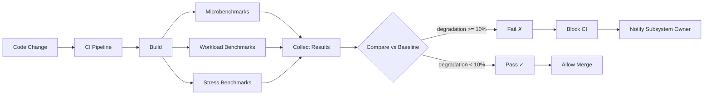

# Benchmarks

> Performance benchmark suite for AI Dev OS — methodology, targets, and results for every subsystem across multiple hardware configurations. This document is normative — implementations MUST satisfy every MUST clause below.

## Overview

The benchmark suite measures the performance of every AI Dev OS subsystem against defined targets. Benchmarks are run automatically in CI (per commit) and on-demand by operators. Results are published to a dashboard and compared against historical baselines to detect regressions.

Benchmarks are categorised into **microbenchmarks** (single-operation latency), **workload benchmarks** (end-to-end run scenarios), and **stress benchmarks** (resource limits and throughput ceilings).

## Goals

- Every subsystem has at least one benchmark that exercises its primary operation (e.g. SCE publish, memory query, Guardian check).
- Benchmarks are reproducible: the same hardware produces results within ±5% across runs.
- Regression detection is automated: a benchmark that degrades by >10% from its baseline blocks the CI pipeline.
- Results are published to a publicly accessible dashboard for community transparency.

## Non-Goals

- Model performance benchmarks — model latency depends on the provider, not AI Dev OS. Use external tools (Helicone, LangFuse) for that.
- Functional testing — covered by [Testing Strategy](./TESTING_STRATEGY.md) and [Eval Harness](./EVAL_HARNESS.md).
- Implementation code — this repo is documentation-only ([AI Coding Rules](./AI_CODING_RULES.md)).

## Benchmark Categories

### Subsystem Microbenchmarks

| Subsystem | Benchmark | Metric | Target (p99) |
|-----------|-----------|--------|-------------|
| **Kernel** | `kernel.intake` — parse a goal, create RunSpec | latency | < 5 ms |
| **Kernel** | `kernel.status` — query run status from SCE | latency | < 2 ms |
| **SCE** | `sce.publish` — publish 1 KB event | latency | < 5 ms |
| **SCE** | `sce.subscribe` — cold subscriber snapshot + tail of 100k events | latency | < 2 s |
| **SCE** | `sce.snapshot` — create topic snapshot with 10k events | latency | < 500 ms |
| **Memory** | `memory.write` — write 1 KB record | latency | < 5 ms |
| **Memory** | `memory.query` — ANN query over 10k vectors (cosine, k=10) | latency | < 100 ms |
| **Memory** | `memory.query` — full-text query over 10k records (BM25, k=10) | latency | < 50 ms |
| **Memory** | `memory.retention` — delete 1000 expired records | latency | < 200 ms |
| **Router** | `router.discovery` — full refresh across 3 providers (mock) | latency | < 500 ms |
| **Router** | `router.assign` — role-to-model assignment change | latency | < 10 ms |
| **Router** | `router.list` — list cached models (500 models, 7 groups) | latency | < 5 ms |
| **Guardian** | `guardian.check` — evaluate artifact against 14 rules (full set) | latency | < 500 ms |
| **Guardian** | `guardian.rule` — single rule evaluation | latency | < 50 ms |
| **Merge** | `merge.three_way` — clean merge, two 10 KB Markdown files | latency | < 200 ms |
| **Merge** | `merge.three_way` — conflict merge, two 10 KB Markdown files | latency | < 500 ms |
| **Queue** | `queue.enqueue` — enqueue 1 KB task | latency | < 100 µs |
| **Queue** | `queue.dequeue` — dequeue next task (priority queue, 1000 items) | latency | < 500 µs |
| **Graph** | `graph.neighbors` — one-hop neighbors of a document (1000-node graph) | latency | < 10 ms |
| **Graph** | `graph.path` — shortest path between two documents (1000-node graph) | latency | < 50 ms |
| **Auth** | `auth.login` — validate credentials and issue JWT | latency | < 20 ms |
| **Auth** | `authz.resolve` — resolve effective permissions for a user (10 roles) | latency | < 5 ms |

### End-to-End Workload Benchmarks

| Workload | Description | Metric | Target |
|----------|------------|--------|--------|
| **Hello World** | Single-task goal: `"say hello"` with Ollama | Total wall time (p99) | < 5 s |
| **Code Review** | Goal: `"review this PR"` with 3 parallel reviewer agents | Total wall time (p99) | < 30 s |
| **Web Research** | Goal: `"research TanStack Router docs"` with Research Engine | Total wall time (p99) | < 120 s |
| **Memory Load** | 100 concurrent memory queries while writing 10 records/sec | P95 query latency | < 500 ms |
| **SCE Throughput** | 10,000 events/s published to 5 topics with 3 subscribers each | P95 publish latency | < 20 ms |
| **Full Pipeline** | goal → intake → plan → route → execute → critique → merge → guard → deliver (mock, all local) | Total wall time (p99) | < 10 s |

### Stress Benchmarks

| Test | Description | Boundary | Expected behaviour |
|------|------------|----------|-------------------|
| **Memory capacity** | Insert records until out of space | 100,000 records in SQLite + 50,000 vectors | Graceful "out of space" error; no crash |
| **SCE topic depth** | Publish events without any subscriber | 1,000,000 events in a single topic | Compaction triggers; topic remains queryable |
| **Concurrent runs** | Submit 50 runs simultaneously | 50 concurrent Kernel runs | Priority queue disciplines; no run starves > 60s |
| **File descriptor limit** | Open connections until OS limit | 4096 FDs | Graceful connection refusal; no crash |
| **Memory leak detection** | Run "hello world" 10,000 times in a loop | 10,000 iterations | Memory usage stabilises; no monotonic growth |
| **Queue backpressure** | Enqueue 10,000 items with slow consumer (1 item/s) | 10,000:1 production:consumption ratio | Consumer applies backpressure; producer pauses within configurable limits |

## Methodology

### Hardware Specifications

Benchmarks are run on two reference configurations:

| Spec | Developer Laptop | CI Runner |
|------|-----------------|-----------|
| CPU | Apple M3 Pro (12 cores) | AMD EPYC 7763 (4 vCPU) |
| RAM | 36 GB | 16 GB |
| Storage | 1 TB SSD (3000 MB/s) | 256 GB SSD (500 MB/s) |
| OS | macOS 15 | Ubuntu 22.04 |
| Runtime | Node.js 22 LTS | Node.js 22 LTS |

### Measurement Protocol

1. Warm-up: run the benchmark 3 times before recording results.
2. Measurement: run 100 iterations (microbenchmarks) or 10 iterations (workloads).
3. Reporting: publish `{ p50, p90, p95, p99, mean, min, max, stddev }`.
4. Baseline: compare against the previous commit's results. Regressions >10% trigger CI failure.

## Results

Results are stored in `benchmarks/results/` as JSON files with the following schema:

```json
{
  "benchmark": "kernel.intake",
  "date": "2026-07-22T12:00:00Z",
  "hardware": "ci-runner",
  "runtime": "node-v22.0.0",
  "iterations": 100,
  "results": {
    "p50": 1.2,
    "p90": 2.1,
    "p95": 3.0,
    "p99": 4.5,
    "mean": 1.5,
    "min": 0.8,
    "max": 5.1,
    "stddev": 0.4
  },
  "baseline": {
    "commit": "abc123",
    "p99": 4.2
  },
  "regression": false
}
```

A regression dashboard (Grafana) visualises results over time.

## Implementation Notes

- Benchmarks MUST be self-contained: no network calls, no external dependencies. Mock model providers and in-memory store backends are used.
- Each benchmark SHALL be a standalone script or binary that writes its result JSON to stdout.
- The benchmark runner (`aidevos benchmark [name]`) discovers scripts in `benchmarks/`, executes them, collects results, and compares against baselines.
- The CI pipeline runs all microbenchmarks on every commit. Workload benchmarks run nightly. Stress benchmarks run weekly.

## Failure Modes

| Mode | Detection | Response |
|------|-----------|----------|
| Benchmark flakiness | >10% variance across runs | Mark benchmark as "unstable"; require manual review; investigate root cause |
| Baseline not found | No baseline for new benchmark | Log WARN; record results without comparison |
| Hardware mismatch | CPU model differs from reference | Tag results with actual hardware; do not compare against incompatible baselines |
| Benchmark timeout | >5 minutes without completion | Kill process; mark as FAILED; log full output |
| Regression detected | P99 degraded >10% | Block CI; notify subsystem owner; require fix or documented exception |

## Performance Targets (from [Performance](./PERFORMANCE.md))

| Target | Value | Benchmarked by |
|--------|-------|----------------|
| Kernel loop p99 (local, single-task) | < 5 s | `benchmarks/workload-hello-world` |
| SCE publish p99 (SQLite) | < 5 ms | `benchmarks/sce-publish` |
| Memory query p95 (10k records) | < 100 ms | `benchmarks/memory-query-ann` |
| Guardian check p95 (14 rules) | < 500 ms | `benchmarks/guardian-check` |
| Merge commit p95 (clean) | < 200 ms | `benchmarks/merge-three-way` |
| Model discovery refresh p99 (3 providers) | < 3 s | `benchmarks/router-discovery` |
| CLI startup p99 | < 100 ms | `benchmarks/cli-startup` |

## Acceptance Criteria

- Running `aidevos benchmark --all` executes all microbenchmarks and produces a JSON report within 5 minutes.
- The CI pipeline contains a benchmark check step that fails when a benchmark degrades >10% from the baseline.
- `aidevos benchmark --compare abc123` compares current results against the `abc123` baseline and highlights differences.
- A fresh checkout on the reference developer laptop produces results within 10% of the published baseline for every microbenchmark.
- The memory benchmark at 10k records and 50k vectors does not exceed 500 MB RSS.

## Benchmark Methodology Diagram



## Benchmark Runner Specification

The benchmark runner (`aidevos benchmark`) is a CLI tool that:

1. **Discovery**: Scans `benchmarks/` directory for benchmark scripts (`.js`, `.py`, `.rs`, or compiled binaries).
2. **Execution**: Runs each benchmark with resource monitoring (CPU, memory, RSS).
3. **Collection**: Captures stdout JSON results. Timeout after 5 minutes per benchmark.
4. **Comparison**: Loads baseline from `benchmarks/results/baseline.json` (or specified commit).
5. **Reporting**: Outputs a structured report with pass/fail status for each benchmark.
6. **Exit code**: 0 if all benchmarks pass; 1 if any regression detected.

```
aidevos benchmark --all                 # Run all microbenchmarks
aidevos benchmark sce.publish           # Run specific benchmark
aidevos benchmark --compare abc123      # Compare against commit abc123
aidevos benchmark --ci                  # CI mode (strict comparison, block on regression)
aidevos benchmark --list                # List available benchmarks
aidevos benchmark --update-baseline     # Update baseline with current results
```

## Result Interpretation Guide

Each benchmark result includes:

| Field | Meaning |
|-------|---------|
| `p50` | Median latency — typical performance |
| `p90` | 90th percentile — performance for most users |
| `p95` | 95th percentile — edge case performance |
| `p99` | 99th percentile — worst-case (target metric) |
| `mean` | Average (use with caution; skewed by outliers) |
| `stddev` | Standard deviation — consistency metric |
| `min` | Best-case latency |
| `max` | Worst-case latency (less reliable than p99) |

A benchmark is considered **regressed** if `p99` degrades >10% from baseline.

## Regression Detection Threshold

| Metric | Threshold | Action |
|--------|-----------|--------|
| p99 latency | >10% increase | Block CI; require investigation |
| p95 latency | >15% increase | Block CI; may be approved with justification |
| Mean latency | >20% increase | Warning; does not block CI |
| Error rate | >0% (was 0%) | Block CI; any new errors are unacceptable |
| Throughput | >10% decrease | Block CI; throughput regression |
| Memory (RSS) | >20% increase | Warning; flag for review |
| Stddev | >2x increase | Warning; investigate consistency |

## Environment Specification

Benchmarks MUST run on specified hardware to produce comparable results:

| Configuration | Developer Laptop | CI Runner | Production Reference |
|---------------|-----------------|-----------|---------------------|
| CPU | Apple M3 Pro (12C) | AMD EPYC 7763 (4 vCPU) | AMD EPYC 9654 (16 vCPU) |
| RAM | 36 GB LPDDR5 | 16 GB DDR4 | 64 GB DDR5 |
| Storage | 1 TB SSD (3000 MB/s) | 256 GB SSD (500 MB/s) | NVMe RAID (6000 MB/s) |
| OS | macOS 15 | Ubuntu 22.04 LTS | Ubuntu 24.04 LTS |
| Runtime | Node.js 22 LTS | Node.js 22 LTS | Node.js 22 LTS |

Benchmark results include the hardware fingerprint in the `environment` field. Results from mismatched hardware are not compared against baselines.

## CI Benchmark Gate

Every pull request MUST pass the CI benchmark gate:

1. All microbenchmarks run against the PR commit.
2. Results are compared against the baseline from the target branch's latest commit.
3. If any benchmark regresses >10%, CI fails with a link to the detailed report.
4. A subsystem owner can override the gate with a documented exception (filed as an issue).
5. Workload benchmarks run nightly; failures are reported but do not block PRs.

## Failure Modes (Expanded)

| Mode | Detection | Response |
|------|-----------|----------|
| Benchmark flakiness | >10% variance across runs | Mark benchmark as "unstable"; require manual review; investigate root cause |
| Baseline not found | No baseline for new benchmark | Log WARN; record results without comparison |
| Hardware mismatch | CPU model differs from reference | Tag results with actual hardware; do not compare against incompatible baselines |
| Benchmark timeout | >5 minutes without completion | Kill process; mark as FAILED; log full output |
| Regression detected | P99 degraded >10% | Block CI; notify subsystem owner; require fix or documented exception |
| Resource exhaustion | OOM during benchmark | Kill process; mark as FAILED; log peak memory usage |
| Benchmark script error | Non-zero exit code | Mark as FAILED; log stderr |
| Environment drift | Dependency version mismatch | Log warning; suggest re-creating environment |

## Acceptance Criteria (Expanded)

- Running `aidevos benchmark --all` executes all microbenchmarks and produces a JSON report within 5 minutes.
- The CI pipeline contains a benchmark check step that fails when a benchmark degrades >10% from the baseline.
- `aidevos benchmark --compare abc123` compares current results against the `abc123` baseline and highlights differences.
- A fresh checkout on the reference developer laptop produces results within 10% of the published baseline for every microbenchmark.
- The memory benchmark at 10k records and 50k vectors does not exceed 500 MB RSS.
- A benchmark result JSON includes the hardware fingerprint for accurate comparison.
- CI blocks a PR that introduces a >10% p99 regression in `sce.publish`.

## Related Documents

- [Performance](./PERFORMANCE.md) — performance targets per subsystem
- [Testing Strategy](./TESTING_STRATEGY.md) — how benchmarks integrate with test pipeline
- [Eval Harness](./EVAL_HARNESS.md) — functional and prompt evaluation (complementary to benchmarks)
- [Observability](./OBSERVABILITY.md) — runtime monitoring that uses benchmark targets as SLOs
- [System Overview](./SYSTEM_OVERVIEW.md)
