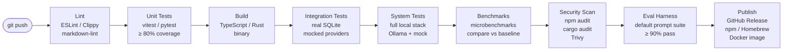

# CI/CD

> Automated build, test, benchmark, and release pipeline for AI Dev OS — every commit verified, every release repeatable. This document is normative — implementations MUST satisfy every MUST clause below.

## Overview

The CI/CD pipeline automates everything between a git push and a production release: lint, unit test, integration test, system test, benchmark, security scan, build, publish. It is the enforcement mechanism for every QA gate defined in [QA Plan](./QA_PLAN.md).

The pipeline runs on **GitHub Actions** (primary) and supports local execution for development via `aidevos ci` (runs the same checks without GitHub).

## Goals

- Every commit to any branch runs lint + unit tests in under 2 minutes.
- Every PR to `main` runs the full pipeline (lint + unit + integration + system + benchmarks + security) in under 30 minutes.
- Release artifacts are built once, verified in CI, and promoted through environments without recompilation.
- Pipeline configuration is version-controlled alongside the code — no manual CI configuration steps.
- All pipeline steps are runnable locally for fast developer iteration.

## Non-Goals

- Model training pipelines — AI Dev OS does not train models.
- Documentation publishing — handled by the docs build pipeline (separate).
- Implementation code — this repo is documentation-only ([AI Coding Rules](./AI_CODING_RULES.md)).

## Pipeline Stages



### Stage Details

| Stage | Runner | Trigger | Max duration | Artifacts |
|-------|--------|---------|-------------|-----------|
| **Lint** | `ubuntu-latest` | Every commit | 2 min | — |
| **Unit** | `ubuntu-latest` | Every commit | 5 min | Coverage report |
| **Build** | `ubuntu-latest`, `macos-latest`, `windows-latest` | Every commit to main | 10 min | Platform binaries |
| **Integration** | `ubuntu-latest` | PR to main | 10 min | Test report |
| **System** | `ubuntu-latest` | PR to main | 15 min | Test report + logs |
| **Benchmark** | `ubuntu-latest` (dedicated runner) | PR to main, nightly | 10 min | Benchmark JSON |
| **Security** | `ubuntu-latest` | PR to main, weekly full scan | 5 min | Vulnerability report |
| **Eval** | `ubuntu-latest` (GPU if available) | Release candidate | 20 min | Eval report |
| **Publish** | `ubuntu-latest` | Tag push (`v*`) | 5 min | Release assets |

## CI Configuration

The pipeline is defined in `.github/workflows/ci.yml` (GitHub Actions):

```yaml
name: AI Dev OS CI

on:
  push:
    branches: [main]
  pull_request:
    branches: [main]
  release:
    types: [published]

jobs:
  lint:
    runs-on: ubuntu-latest
    steps:
      - uses: actions/checkout@v4
      - run: npm ci
      - run: npm run lint

  unit:
    runs-on: ubuntu-latest
    steps:
      - uses: actions/checkout@v4
      - run: npm ci
      - run: npm run test:unit -- --coverage
      - uses: actions/upload-artifact@v4
        with:
          name: coverage
          path: coverage/

  # ... (remaining jobs follow the same pattern)
```

### Local CI Execution

```bash
# Run the same checks locally
aidevos ci lint                     # lint only
aidevos ci unit                     # unit tests
aidevos ci all                      # full pipeline (lint + unit + build + integration)
aidevos ci --diff origin/main       # only run checks relevant to changed files
```

## Build

AI Dev OS is compiled into a single self-contained binary for each target platform:

| Platform | Binary name | Build tool | Artifact |
|----------|-------------|------------|----------|
| macOS (ARM) | `aidevos-darwin-arm64` | `bun build --compile` or `cargo build` | `.tar.gz` |
| macOS (x64) | `aidevos-darwin-x64` | same | `.tar.gz` |
| Linux (x64) | `aidevos-linux-x64` | same | `.tar.gz` |
| Windows (x64) | `aidevos-win32-x64.exe` | same | `.zip` |

The build process:
1. Install dependencies (`npm ci` or `cargo fetch`).
2. Run type checks (`tsc --noEmit` or `cargo check`).
3. Compile binary.
4. Run binary self-test (`aidevos doctor`).
5. Sign binary (macOS: `codesign`, Windows: `signtool`).
6. Upload as CI artifact.

## Release Process

1. **Cut release branch**: `release/v0.1.0` from `main`.
2. **Run full pipeline**: all stages execute on the release branch.
3. **Tag**: `git tag v0.1.0 && git push origin v0.1.0`.
4. **Publish**: tag push triggers the Publish stage:
   - GitHub Release created with platform binaries.
   - Docker image published to `ghcr.io/aidevos/aidevos:{version,latest}`.
   - npm package published to `@aidevos/cli` (optional).
   - Homebrew formula updated in `aidevos/homebrew-tap`.
5. **Post-release**: merge release branch back to `main`, update changelog.

## Environment Variables

CI uses the following environment variables:

| Variable | Purpose | Set in |
|----------|---------|--------|
| `AIDEVOS_CI` | `true` when running in CI | Pipeline default |
| `AIDEVOS_LOG_LEVEL` | `warn` during tests | Pipeline default |
| `AIDEVOS_HOME` | Temporary home directory for test config | Pipeline per-job |
| `GITHUB_TOKEN` | API token for GitHub Release publishing | GitHub secrets |
| `DOCKER_USERNAME` / `DOCKER_PASSWORD` | Registry auth for Docker push | GitHub secrets |
| `NPM_TOKEN` | npm publish auth | GitHub secrets |

## Failure Modes

| Mode | Detection | Response |
|------|-----------|----------|
| CI runner unavailable | GitHub Actions queue > 10 min | Log WARN; retry on next commit; page infra team if > 1 hour |
| Flaky test identified | > 10% failure rate | Mark test as flaky in test config; suppress CI failure; create issue |
| Build timeout | > 15 min | Kill build; retry with `--no-cache`; investigate if persists |
| Docker registry unavailable | Push fails | Retry with backoff (3 attempts); fall back to binary-only release |
| Security vulnerability found | Critical CVE in dependency | Block release; fix or add exception before proceeding |
| Benchmark regression | > 10% degradation | Block PR; require improvement or documented exception |

## Acceptance Criteria

- Push to a feature branch triggers lint + unit tests within 10 seconds.
- A PR that breaks a unit test shows a red CI status within 5 minutes.
- Pushing tag `v0.1.0` produces a GitHub Release with 4 platform binaries within 15 minutes.
- The Docker image `ghcr.io/aidevos/aidevos:latest` is updated within 5 minutes of a main branch push.
- `aidevos ci --diff` detects that only documentation changed and skips build/benchmark stages (runs only lint + markdown check).
- The full pipeline from push to release artifact completes in under 30 minutes.

## Related Documents

- [QA Plan](./QA_PLAN.md) — test levels, release gates, quality metrics
- [Release Process](./RELEASE_PROCESS.md) — manual release procedures
- [Deployment](./DEPLOYMENT.md) — deployment topologies (consumes CI artifacts)
- [Docker](./DOCKER.md) — container build and deploy
- [Testing Strategy](./TESTING_STRATEGY.md) — detailed test approach
- [Benchmarks](./BENCHMARKS.md) — benchmark methodology integrated into CI
- [System Overview](./SYSTEM_OVERVIEW.md)
