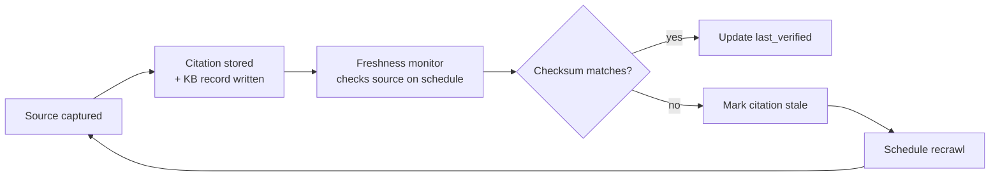
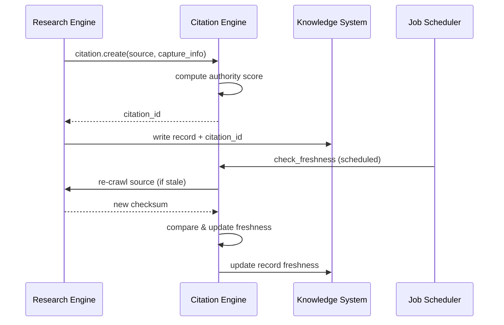

# Citation Engine

> Structured citation and provenance system for knowledge base records — tracking the source, authority, and verifiability of every piece of information ingested by AI Dev OS. This document is normative — implementations MUST satisfy every MUST clause below.

## Overview

The Citation Engine is the subsystem that records, stores, and retrieves source provenance for every piece of information that enters the [Knowledge System](./KNOWLEDGE_SYSTEM.md). Every [Research Engine](./RESEARCH_ENGINE.md) result, every web crawl, every documentation scrape, every manual KB entry is tagged with a citation that records where the information came from, when it was captured, how authoritative the source is, and whether the information has changed since it was captured.

Citations serve two purposes:
1. **Trust**: agents (and humans) can evaluate the reliability of information by examining its source.
2. **Freshness**: the Research Engine uses citation timestamps to decide which sources need recrawling.

## Goals

- Every KB record has a citation that links to its source document or URL.
- Citations are rendered alongside KB entries in the UI and CLI (`aidevos kb show --citations`).
- The citation data model includes source type, authority score, capture timestamp, and content checksum.
- The Research Engine uses citations to detect stale content (content checksum changed since last capture).

## Non-Goals

- Generating bibliographic citations in a specific style (APA, MLA, etc.) — citations are structured metadata, not formatted text.
- Replacing the original source document — citations link to sources, they do not mirror them.
- Legal citation management — that is the domain of [Compliance](./COMPLIANCE.md).
- Implementation code — this repo is documentation-only ([AI Coding Rules](./AI_CODING_RULES.md)).

## Citation Schema

```json
Citation {
  id:               ulid
  kb_record_id:     ulid              # the Knowledge System record this cites
  source: {
    type:           "url" | "document" | "github" | "arxiv" | "npm" | "api" | "conversation" | "manual"
    uri:            string             # URL, file path, DOI, or other identifier
    title:          string | null
    author:         string | null
    published_at:   rfc3339 | null     # source's publication date
  }
  capture: {
    ts:             rfc3339            # when we captured this content
    checksum:       sha256             # of the captured content (for staleness detection)
    content_size:   int                # bytes captured
    adapter:        string             # which Research Engine adapter captured it (e.g. "http", "github")
    status_code:    int | null         # HTTP status or equivalent
  }
  authority: {
    score:          0.0 – 1.0          # computed authority score
    factors:        AuthorityFactor[]  # breakdown of score components
  }
  freshness: {
    stale:          boolean            # true if checksum differs from current source
    last_verified:  rfc3339 | null     # when we last checked freshness
    next_check_at:  rfc3339 | null     # freshness SLA deadline
  }
}
```

## Authority Scoring

The authority score (0.0–1.0) is computed from these factors:

| Factor | Weight | Values | Example |
|--------|--------|--------|---------|
| Source type | 0.3 | Official docs (1.0), GitHub repo (0.7), Community blog (0.4), LLM-generated (0.2) | `docs.python.org` → 1.0 |
| Domain authority | 0.2 | Built-in domain list | `developer.mozilla.org` → 0.95 |
| Citation count | 0.15 | How many other KB entries cite this source | Referenced by 5+ specs → 0.8 |
| Age | 0.1 | Newer sources score higher (decay over 2 years) | Published today → 1.0; 2 years old → 0.5 |
| Verification status | 0.15 | Verified by human (1.0), verified by agent review (0.7), unverified (0.3) | Human-verified → 1.0 |
| Consistency | 0.1 | Cross-referenced with other sources | Matches 3 other sources → 1.0 |

The total score is the weighted sum of all factors. Scores ≥ 0.7 are considered "high authority", 0.4–0.7 "medium", < 0.4 "low".

## Freshness Pipeline



The freshness monitor is a background job scheduled by the [Job Scheduler](./JOB_SCHEDULER.md). Each source has a `freshness_sla` (how often it should be rechecked):

| Source Type | Default Freshness SLA |
|-------------|----------------------|
| Official documentation (URL) | 24 hours |
| GitHub repository (README/docs) | 7 days |
| npm package (README) | 30 days |
| arXiv paper | 90 days |
| Manual entry | 365 days |

## Interfaces

```
citation.create(source, capture_info) → Citation
citation.get(kb_record_id) → Citation[]
citation.check_freshness(citation_id) → { stale: bool, current_checksum }
citation.authority(source_uri) → float  # compute authority score for a URI
citation.verify(citation_id, verified_by) → Ack  # mark as human-verified
citation.history(source_uri) → Citation[]  # all citations from this source
```

## Architecture



## Failure Modes

| Mode | Detection | Response |
|------|-----------|----------|
| Source URL no longer accessible | HTTP 404 | Mark citation as `source_unavailable`; keep existing record; reschedule retry in 30 days |
| Source content changed completely | Checksum mismatch but content unrelated | Keep old citation; create new citation for new content; mark old as `superseded` |
| Authority score unavailable | No domain in authority list | Assign default score (0.3); flag for manual review |
| Freshness check overload | > 1000 checks in queue | Prioritise by authority score (highest first); defer low-authority sources |
| Captured content too large | > 10 MB | Truncate content for checksum; store citation metadata without full content |

## Acceptance Criteria

- Creating a KB record from an HTTP crawl produces a Citation with `source.type = "url"`, `capture.checksum`, and `authority.score > 0`.
- After the source URL's content changes, the next freshness check detects the mismatch and marks the citation as `stale`.
- `citation.get(kb_record_id)` returns the full citation chain for a given KB record.
- A citation from `docs.python.org` scores higher authority than one from a personal blog post.
- The freshness monitor skips a source whose `next_check_at` is in the future and checks one whose deadline has passed.

## Related Documents

- [Research Engine](./RESEARCH_ENGINE.md) — produces the content that the Citation Engine tracks
- [Knowledge System](./KNOWLEDGE_SYSTEM.md) — stores the records that citations reference
- [Source Ranking](./SOURCE_RANKING.md) — authority scores used for ranking search results
- [Data Retention](./DATA_RETENTION.md) — citation retention policies
- [System Overview](./SYSTEM_OVERVIEW.md)
