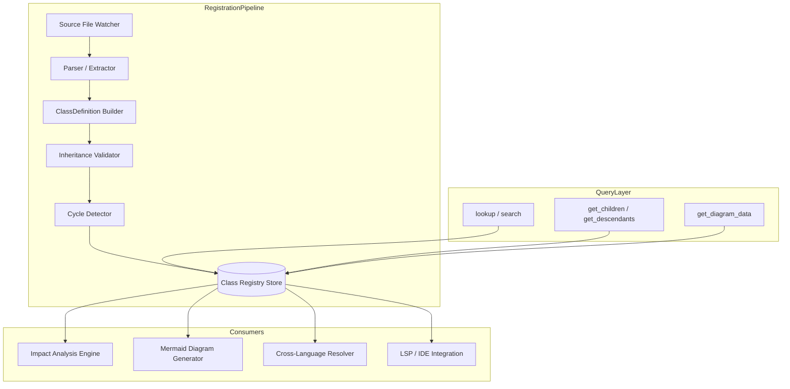

# Class Registry

**Component ID:** core.class-registry  
**Status:** Active  
**Version:** 1.0.0  
**Last Updated:** 2026-07-22

---

## Overview

The Class Registry maintains a structured catalog of all class and type definitions in the codebase. While the Symbol Registry indexes every symbol generically, the Class Registry adds class-specific semantics: inheritance hierarchies, interface implementations, generic type parameters, and relationship metadata.

This registry serves two primary consumers: the Impact Analysis engine (which uses class relationships to compute change propagation) and the MERMAID_DIAGRAMS.md pipeline (which consumes relationship data to auto-generate UML class diagrams).

---

## ClassDefinition Schema

```typescript
interface ClassDefinition {
  name: string;
  kind: "class" | "interface" | "abstract_class" | "enum" | "type_alias";
  file: string;
  line: number;
  type_parameters?: string[];
  extends?: string[];
  implements?: string[];
  uses?: Array<{ type: string; relation: "property" | "parameter" | "return_type" | "composition" }>;
  members: Array<{
    name: string;
    kind: "method" | "property" | "constructor";
    visibility: "public" | "protected" | "private";
    type: string;
    static: boolean;
    line: number;
  }>;
  exports: boolean;
  deprecated: boolean;
}
```

| Field             | Type                          | Description                              |
|-------------------|-------------------------------|------------------------------------------|
| `name`            | `string`                      | Fully qualified class/type name          |
| `kind`            | `ClassKind`                   | Class, interface, abstract, enum, alias  |
| `file`            | `string`                      | Declaring file path                      |
| `line`            | `number`                      | Declaration line number                  |
| `type_parameters` | `string[]`?                   | Generic type params (e.g. `T`, `K`, `V`) |
| `extends`         | `string[]`?                   | Parent classes                           |
| `implements`      | `string[]`?                   | Implemented interfaces                   |
| `uses`            | `Array<TypeUse>`?             | Usage relationships to other types       |
| `members`         | `Array<MemberDefinition>`     | Methods, properties, constructors        |
| `exports`         | `boolean`                     | Exported from module                     |
| `deprecated`      | `boolean`                     | Marked with deprecation annotation       |

---

## Relationship Types

| Relation       | Direction       | Semantics                                  |
|----------------|-----------------|--------------------------------------------|
| `extends`      | child → parent  | Inheritance (single or multi)              |
| `implements`   | impl → interface| Contract fulfillment                        |
| `property`     | owner → type    | Member variable of a given type            |
| `parameter`    | method → type   | Method/constructor parameter type          |
| `return_type`  | method → type   | Return type annotation                     |
| `composition`  | owner → type    | Owned instance (strong lifetime coupling)  |

Relationships form a directed graph. Cycles are permitted for `uses`-category edges only; inheritance cycles are rejected at registration time.

---

## Integration with MERMAID_DIAGRAMS.md

The Class Registry is the data provider for automatic class diagram generation. The engine calls `class_registry.get_diagram_data(package?, depth?)` which returns structured classes and relationships, then renders a Mermaid `classDiagram` block. The diagram regenerates on class registration events (file save, module import, type change).

```typescript
interface DiagramData {
  classes: Array<{
    name: string; kind: string;
    members: Array<{ name: string; kind: string; visibility: string; type: string }>;
  }>;
  relationships: Array<{
    from: string; to: string;
    type: "extends" | "implements" | "composition" | "dependency";
    label?: string;
  }>;
}
```

---

## Interfaces

### `registry.register(def: ClassDefinition): void`
Insert or update a class record. Validates that `extends` targets exist as registered classes (warning on missing, configurable strict mode).

### `registry.lookup(name: string): ClassDefinition | null`
Resolve a class by fully qualified name.

### `registry.get_children(name: string): Array<ClassDefinition>`
Return all classes that directly extend or implement the given class.

### `registry.get_descendants(name: string, depth?: number): Array<ClassDefinition>`
Return the transitive closure of children. Default depth is unlimited.

### `registry.get_diagram_data(package?: string, depth?: number): DiagramData`
Return structured data for Mermaid class diagram generation.

### `registry.search(query: string): Array<ClassDefinition>`
Free-text search across class names, member names, and docstrings.

---

## Architecture



---

## Interface Specifications

```typescript
interface ClassRegistry {
  register(def: ClassDefinition): RegistrationResult;
  registerBatch(defs: Array<ClassDefinition>): Array<RegistrationResult>;
  lookup(name: string): ClassDefinition | null;
  get_children(name: string): Array<ClassDefinition>;
  get_descendants(name: string, depth?: number): Array<ClassDefinition>;
  get_parents(name: string): Array<ClassDefinition>;
  get_ancestors(name: string): Array<ClassDefinition>;
  get_diagram_data(package?: string, depth?: number): DiagramData;
  get_inheritance_graph(): InheritanceGraph;
  search(query: string): Array<ClassDefinition>;
  find_implementations(interfaceName: string): Array<ClassDefinition>;
  resolve_cross_language(name: string, lang: string): ClassDefinition | null;
  compute_impact(changedClasses: Array<string>): ImpactReport;
}

interface RegistrationResult {
  success: boolean;
  warnings: Array<string>;
  errors: Array<string>;
}

interface InheritanceGraph {
  nodes: Array<{ name: string; kind: string; file: string }>;
  edges: Array<{
    from: string; to: string;
    type: "extends" | "implements" | "composition";
  }>;
}

interface ImpactReport {
  directly_affected: Array<string>;
  transitively_affected: Array<string>;
  total_files: number;
  propagation_paths: Array<Array<string>>;
}
```

### `register(def: ClassDefinition): RegistrationResult`

Validates extends/implements targets exist, runs cycle detection, then inserts or updates the class record.

### `registerBatch(defs: Array<ClassDefinition>): Array<RegistrationResult>`

Atomically registers multiple classes. All validations run after the full batch is loaded, enabling cross-references within the batch. Returns per-definition results.

### `get_parents(name: string): Array<ClassDefinition>`

Returns the direct parent classes (extends targets).

### `get_ancestors(name: string): Array<ClassDefinition>`

Returns the transitive closure of parents up the inheritance chain.

### `find_implementations(interfaceName: string): Array<ClassDefinition>`

Returns all classes that implement the given interface, directly or transitively.

### `resolve_cross_language(name: string, lang: string): ClassDefinition | null`

Resolves a class name across language boundaries using the symbol mapping table. For example, a TypeScript interface can be mapped to a Python protocol.

### `compute_impact(changedClasses: Array<string>): ImpactReport`

Returns the full impact propagation tree for one or more changed classes, including direct children and transitive descendants.

---

## Inheritance Graph Building Algorithm

```text
FUNCTION build_inheritance_graph(registry)
    graph ← new Graph(nodes = [], edges = [])

    FOR EACH def IN registry.list_all()
        graph.nodes.add({ name: def.name, kind: def.kind, file: def.file })

        FOR EACH parent IN def.extends
            graph.edges.add({ from: def.name, to: parent, type: "extends" })
        END FOR

        FOR EACH iface IN def.implements
            graph.edges.add({ from: def.name, to: iface, type: "implements" })
        END FOR

        FOR EACH use IN def.uses
            IF use.relation = "composition" THEN
                graph.edges.add({ from: def.name, to: use.type, type: "composition" })
            END IF
        END FOR
    END FOR

    RETURN graph
END FUNCTION
```

---

## Cycle Detection Algorithm

```text
FUNCTION detect_cycles(graph)
    WHITE ← 0   // unvisited
    GRAY  ← 1   // in progress
    BLACK ← 2   // finished

    color ← map(name → WHITE for node in graph.nodes)
    cycles ← []

    FUNCTION dfs(node_name, path)
        color[node_name] ← GRAY
        path.push(node_name)

        FOR EACH edge IN graph.edges WHERE edge.from = node_name
            IF edge.type IN ("extends", "implements") THEN
                IF color[edge.to] = GRAY THEN
                    // Found cycle: extract cycle from path
                    cycle_start ← path.indexOf(edge.to)
                    cycles.push(path[cycle_start..])
                ELSE IF color[edge.to] = WHITE THEN
                    dfs(edge.to, path)
                END IF
            END IF
        END FOR

        path.pop()
        color[node_name] ← BLACK
    END FUNCTION

    FOR EACH node IN graph.nodes
        IF color[node.name] = WHITE THEN
            dfs(node.name, [])
        END IF
    END FOR

    RETURN cycles  // empty if acyclic
END FUNCTION
```

Only `extends` and `implements` edges participate in cycle detection. `uses`-category edges (property, parameter, return_type) permit cycles.

---

## Impact Propagation Computation

```text
FUNCTION compute_impact(registry, changed_names, max_depth)
    impacted ← empty_set()
    queue ← new_queue(changed_names)
    visited ← empty_set()
    depth ← 0

    WHILE queue IS NOT empty AND depth < max_depth
        current ← queue.dequeue()
        IF current IN visited THEN CONTINUE
        visited.add(current)

        children ← registry.get_descendants(current)
        FOR EACH child IN children
            impacted.add(child.name)
            queue.enqueue(child.name)
        END FOR

        implementations ← registry.find_implementations(current)
        FOR EACH impl IN implementations
            impacted.add(impl.name)
            queue.enqueue(impl.name)
        END FOR

        depth ← depth + 1
    END WHILE

    RETURN impacted
END FUNCTION
```

The impact report includes both the affected class names and the propagation paths for traceability.

---

## Diagram Generation Algorithm

```text
FUNCTION generate_diagram_data(registry, package_filter, depth)
    classes ← []
    relationships ← []
    seen ← empty_set()

    candidates ← registry.list_all()
    IF package_filter IS NOT null THEN
        candidates ← filter(candidates, c → starts_with(c.name, package_filter))
    END IF

    FOR EACH def IN candidates
        IF def.name IN seen THEN CONTINUE
        seen.add(def.name)

        classes.add({
            name: def.name,
            kind: def.kind,
            members: [m for m in def.members WHERE m.visibility != "private"]
        })

        FOR EACH parent IN def.extends
            IF depth = 0 OR is_within_depth(def.name, parent, depth)
                relationships.add({ from: def.name, to: parent, type: "extends" })
            END IF
        END FOR

        FOR EACH iface IN def.implements
            IF depth = 0 OR is_within_depth(def.name, iface, depth)
                relationships.add({ from: def.name, to: iface, type: "implements" })
            END IF
        END FOR
    END FOR

    RETURN { classes, relationships }
END FUNCTION
```

---

## Batch Registration

Registering multiple interdependent classes in a single atomic operation:

```text
FUNCTION register_batch(registry, defs)
    warnings ← []
    errors ← []

    // Phase 1: Validate all definitions independently
    FOR EACH def IN defs
        result ← validate_schema(def)
        warnings.extend(result.warnings)
        errors.extend(result.errors)
    END FOR

    // Phase 2: Build tentative graph for cross-validation
    tentative_graph ← build_inheritance_graph(defs)

    // Phase 3: Cycle detection across batch
    cycles ← detect_cycles(tentative_graph)
    IF cycles IS NOT empty THEN
        errors.add("Cycle detected in batch: " + string(cycles))
        RETURN { success: false, warnings, errors }
    END IF

    // Phase 4: Insert all
    FOR EACH def IN defs
        registry.store(def)
    END FOR

    RETURN { success: true, warnings, errors }
END FUNCTION
```

---

## Cross-Language Symbol Resolution

| Source Language | Target Language | Mapping Strategy                                |
|-----------------|-----------------|-------------------------------------------------|
| TypeScript      | Python          | `interface` ↔ `Protocol`, `class` ↔ `class`    |
| TypeScript      | Rust            | `interface` ↔ `trait`, `class` ↔ `struct`      |
| Python          | Go              | `Protocol` ↔ `interface`, `dataclass` ↔ `struct`|
| Rust            | TypeScript      | `trait` ↔ `interface`, `struct` ↔ `class`      |

The cross-language resolver uses a name-based mapping table augmented with manual bridge annotations. When `resolve_cross_language(name, lang)` is called, the resolver checks the mapping table for a registered equivalent in the target language. If no explicit mapping exists, it falls back to a name-normalized lookup (stripping prefixes, suffixes, and language-specific conventions).

---

## Failure Modes

| Mode                  | Cause                                       | Effect                                      | Mitigation                                |
|-----------------------|---------------------------------------------|---------------------------------------------|-------------------------------------------|
| Inheritance cycle     | A extends B extends A                       | Registration rejected with CycleError       | Cycle detection pre-insertion             |
| Missing parent        | extends target not registered               | Warning (strict mode: error)                | Batch registration, dependency ordering   |
| Ambiguous lookup      | Two classes with same FQN                  | First match returned, warning logged        | Namespace enforcement, module qualifiers  |
| Stale diagram data    | Class changed after diagram generation      | Outdated visualization                      | Event-driven regeneration on register()   |
| Circular composition  | A composes B composes A                     | Allowed (composition permits cycles)        | Depth limit on graph traversal            |
| Cross-language gap    | No mapping exists between languages         | resolve_cross_language returns null         | Manual bridge annotation required         |
| Batch partial failure | Some defs valid, others invalid             | Entire batch rejected (atomic)              | Validate all before storing any           |
| Large hierarchy       | >10K classes in a single tree              | Slow queries, high memory                   | Paginated get_descendants, indexing       |

---

## Observability Metrics

| Metric Name                          | Type      | Labels                        | Description                                |
|--------------------------------------|-----------|-------------------------------|--------------------------------------------|
| `class_registry_total`               | gauge     | kind                          | Total registered classes by kind           |
| `class_registration_total`           | counter   | result (success/error)        | Class registration operations              |
| `class_lookup_total`                 | counter   | result (hit/miss)             | Lookup operations                          |
| `class_lookup_duration_seconds`      | histogram |                               | Lookup execution time                      |
| `class_impact_computation_total`     | counter   | result (complete/partial)     | Impact analysis runs                       |
| `class_impact_duration_seconds`      | histogram | depth                         | Time to compute impact per depth level     |
| `class_diagram_generation_total`     | counter   |                               | Diagram generation events                  |
| `class_inheritance_depth_max`        | gauge     |                               | Maximum inheritance chain depth            |
| `class_cycles_detected_total`        | counter   | severity (error/warning)      | Cycle detection events                     |

---

## Acceptance Criteria

| ID     | Criterion                                           | Verification Method       |
|--------|------------------------------------------------------|---------------------------|
| CR-01  | Registration rejects cycles in extends/implements    | Unit test                 |
| CR-02  | get_children returns direct descendants              | Unit test                 |
| CR-03  | get_descendants returns transitive closure           | Unit test                 |
| CR-04  | compute_impact covers all transitive dependents      | Integration test          |
| CR-05  | Batch registration rolls back on any validation error| Integration test          |
| CR-06  | Diagram generation respects depth parameter          | Unit test                 |
| CR-07  | Cross-language resolution maps correctly             | Integration test          |
| CR-08  | Missing parent emits warning (or error in strict)    | Unit test                 |
| CR-09  | Lookup returns null for unregistered class           | Unit test                 |
| CR-10  | Cycle detection handles diamond inheritance          | Unit test                 |
| CR-11  | Impact report includes propagation paths             | Integration test          |
| CR-12  | Metrics emitted for every registration and lookup    | Integration test          |

---

## Security Considerations

1. **Injection attacks** — Class names and file paths are sanitized before storage. Never evaluate or execute class names from untrusted input.
2. **Resource exhaustion** — Impact computation and diagram generation enforce depth limits (default 20 levels) to prevent stack overflow or memory exhaustion.
3. **Access control** — The registry is read-only for consumers; only the registration pipeline has write access. This prevents tampering from untrusted code.
4. **Denial of service** — Batch registration enforces a maximum batch size (10,000 definitions per call). Cycle detection runs in O(V+E) with a configurable timeout.
5. **Cross-language trust** — Cross-language mappings are manually curated. Automatic name-based resolution should never introduce security-relevant type confusion.
6. **Audit trail** — All registration, deletion, and modification events are logged with caller identity and timestamp for compliance.

---

## Related Documents

- SYMBOL_REGISTRY.md — General-purpose symbol tracking
- FUNCTION_REGISTRY.md — Function-specific registry layer
- VARIABLE_REGISTRY.md — Environment variable and config tracking
- MERMAID_DIAGRAMS.md — Auto-generated diagram pipeline
- ARCHITECTURE_GUARDIAN.md — System-wide architectural enforcement
