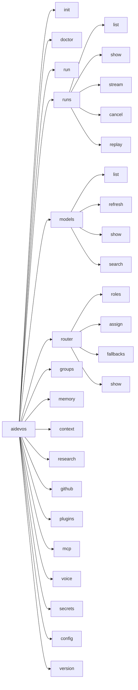

# CLI

> `aidevos` — one binary, subcommand tree, both a friendly TTY UI and a machine-readable `--json` mode. Every UI action is reachable from the CLI.

## Overview

The CLI is the primary local surface for AI Dev OS. It is a thin adapter over the [Main AI Kernel](./MAIN_AI_KERNEL.md) syscalls, so anything the desktop UI can do can be scripted. The CLI is also the offline-first fallback when the desktop app is unavailable.

## Goals

- One binary, discoverable subcommand tree.
- First-class `--json` mode for scripting; TTY-aware pretty output otherwise.
- Every UI action reachable from the CLI.
- Zero-config against a local backend (`~/.aidevos/config.toml`).
- Stable exit codes.

## Non-Goals

- Implementation code (this repo is documentation-only).
- Provider-specific commands — model provider configuration lives in the [Nine Router](./NINE_ROUTER.md) dashboard and API, not in this CLI.

## Requirements

- **MUST** read config from `~/.aidevos/config.toml` and env vars (`AIDEVOS_*`), with env taking precedence.
- **MUST** support `--json`, `--quiet`, `--verbose`, `--profile <name>`, `--no-color`.
- **MUST** exit non-zero with a documented code on any failure; codes stable across minor versions.
- **MUST** stream Kernel events to stdout when a subcommand blocks on a run.
- **SHOULD** ship shell completions for bash, zsh, fish.
- **MAY** expose a REPL (`aidevos shell`) that maintains a Kernel session across commands.

## Command Tree

```
aidevos
├── init                                # scaffold ~/.aidevos and connect to local backend
├── doctor                              # environment + provider health check
├── run <goal> [--group ID] [--budget]  # submit a goal to the Kernel
├── runs
│   ├── list [--state ...]
│   ├── show <run_id>
│   ├── stream <run_id>
│   ├── cancel <run_id>
│   └── replay <run_id> [--from EVENT]
├── models                              # Nine Router / Model Discovery
│   ├── list [--provider P] [--capability C] [--json]
│   ├── refresh [--provider P]
│   ├── show <model_id>
│   └── search <query>
├── router
│   ├── roles                           # list the nine roles + current assignment
│   ├── assign <role> <model_id> [--project P]
│   ├── fallbacks <role> <model_id> ...
│   └── show
├── groups
│   ├── list
│   ├── create <name> [--members ...]
│   └── show <group_id>
├── memory
│   ├── query <q> [--kb global|main|group|individual]
│   ├── write --kb <kb> --key <k> --value <v>
│   └── export <path>
├── context
│   ├── topics
│   ├── tail <topic>
│   └── snapshot <topic>
├── research <query> [--depth N]        # Research & Web Intelligence
├── github
│   ├── analyze <repo>
│   └── watch <repo>
├── plugins
│   ├── list
│   ├── install <ref>
│   └── enable|disable <name>
├── mcp
│   ├── servers
│   ├── connect <ref>
│   └── call <server> <tool> --args @file.json
├── voice
│   ├── listen                          # push-to-talk STT session
│   └── say <text>
├── secrets
│   ├── set <NAME>
│   └── list
├── config
│   ├── get <path>
│   └── set <path> <value>
└── version
```

## Interfaces

Every command supports `--json`; JSON output is a single object with `{ ok, data?, error? }` and never mixes with human text.

## Data Model

- Config: `~/.aidevos/config.toml`
  - `[backend]` `endpoint`, `token_file`
  - `[profiles.<name>]` overrides
  - `[router]` default role assignments
  - `[providers.<id>]` base URLs and secret refs
- Cache: `~/.cache/aidevos/` (models, prompts, MCP)
- State: `~/.local/state/aidevos/` (WAL, cursors)

## Exit codes

| Code | Meaning                              |
| ---- | ------------------------------------ |
| 0    | Success                              |
| 1    | Generic error                        |
| 2    | Usage error (bad flags/args)         |
| 3    | Config error                         |
| 4    | Auth error                           |
| 5    | Backend unreachable                  |
| 6    | Guardian veto (run refused)          |
| 7    | Budget exhausted                     |
| 8    | Cancelled                            |
| 9    | Timeout                              |

## Failure Modes

- Backend down → `aidevos doctor` explains next step; commands that don't need the backend still work (`models list --cache`).
- Provider outage → `aidevos models refresh` reports per-provider status and keeps last-known-good cache.

## Security

- Tokens are stored via the OS keychain when available; fall back to `chmod 600` file.
- `aidevos secrets set` never echoes; secrets never appear in `--json` output.
- All commands are audited into the [Audit Log](./AUDIT_LOG.md) with the correlation id.

## Observability

`aidevos --verbose` prints the correlation id for every command; every command emits a `cli.command` event on the Shared Context Engine.

## Acceptance Criteria

- `aidevos init && aidevos doctor` succeeds on a fresh machine with only Ollama installed.
- `aidevos models list --json | jq '.data | group_by(.provider)'` produces the same grouping as the UI.
- `aidevos router assign builder ollama/llama3.1:8b` immediately reflects in `aidevos router show`.

## CLI Command Tree Diagram



## Complete Command Reference

| Command | Description | Requires Backend | JSON Output |
|---------|-------------|:---:|:---:|
| `init` | Scaffold config and connect to backend | No | Yes |
| `doctor` | Environment and provider health check | Partial | Yes |
| `run <goal>` | Submit a goal to the Kernel | Yes | Yes |
| `runs list` | List runs with optional state filter | Yes | Yes |
| `runs show <id>` | Show run details | Yes | Yes |
| `runs stream <id>` | Stream run events in real-time | Yes | Yes |
| `runs cancel <id>` | Cancel a running task | Yes | Yes |
| `runs replay <id>` | Replay a run from stored snapshot | Yes | Yes |
| `models list` | List discovered models | No (cached) | Yes |
| `models refresh` | Force model discovery refresh | Yes | Yes |
| `models show <id>` | Show model details | No | Yes |
| `models search <q>` | Search models by name/capability | No | Yes |
| `router roles` | List the nine agent roles | No | Yes |
| `router assign <role> <model>` | Assign model to role | Yes | Yes |
| `router fallbacks <role>` | Set fallback chain | Yes | Yes |
| `router show` | Show current role assignments | No | Yes |
| `groups list` | List AI groups | Yes | Yes |
| `groups create <name>` | Create a new group | Yes | Yes |
| `groups show <id>` | Show group details | Yes | Yes |
| `memory query <q>` | Query knowledge bases | Yes | Yes |
| `memory write` | Write to a knowledge base | Yes | Yes |
| `memory export <path>` | Export memory to file | Yes | Yes |
| `context topics` | List SCE topics | Yes | Yes |
| `context tail <topic>` | Stream events from a topic | Yes | Yes |
| `context snapshot <topic>` | Take topic snapshot | Yes | Yes |
| `research <query>` | Run web research | Yes | Yes |
| `github analyze <repo>` | Analyze a GitHub repo | Yes | Yes |
| `plugins list` | List installed plugins | No | Yes |
| `plugins install <ref>` | Install a plugin | Yes | Yes |
| `mcp servers` | List MCP server connections | No | Yes |
| `mcp connect <ref>` | Connect an MCP server | Yes | Yes |
| `mcp call <server> <tool>` | Call an MCP tool | Yes | Yes |
| `voice listen` | Start speech-to-text session | Yes | Yes |
| `voice say <text>` | Text-to-speech output | Yes | Yes |
| `secrets set <name>` | Set a secret value | No | No |
| `secrets list` | List secret keys | No | Yes |
| `config get <path>` | Get a config value | No | Yes |
| `config set <path> <value>` | Set a config value | No | Yes |
| `version` | Print version info | No | Yes |

## Subcommand Details

### `aidevos run <goal> [--group ID] [--budget USD] [--interactive]`
Submits a goal to the Kernel. If `--interactive` is set, the Kernel pauses at each stage and waits for user input before proceeding. The `--budget` flag caps maximum spend in USD for the run.

### `aidevos doctor [--full] [--benchmark] [--repair] [--guardian]`
Runs health checks. Without flags, checks config, provider connectivity, and SCE status. `--full` includes database integrity, vector index health, and permissions. `--benchmark` runs quick performance benchmarks. `--repair` attempts automated fixes for common issues. `--guardian` shows active Guardian rule evaluations.

### `aidevos models list [--provider P] [--capability C] [--cache]`
Lists discovered models. `--cache` reads from the last-known-good cache instead of querying providers. Supports filtering by provider name and capability (e.g., `--capability tool_use`).

## Config File Discovery Order

```mermaid
flowchart LR
    CMD[Command starts] --> C1[CLI flags]
    C1 --> C2[Env vars AIDEVOS_*]
    C2 --> C3[./.aidevos.toml]
    C3 --> C4[~/.aidevos/config.toml]
    C4 --> C5[/etc/aidevos/config.toml]
    C5 --> C6[Embedded defaults]
```

Each source overrides the previous. CLI flags take highest precedence; embedded defaults are lowest.

## Autocomplete Setup

```bash
# Bash
source <(aidevos completion bash)

# Zsh
source <(aidevos completion zsh)

# Fish
aidevos completion fish | source

# PowerShell
aidevos completion powershell | Out-String | Invoke-Expression
```

Completions include subcommands, flags, and dynamic values (run IDs, model names, plugin names).

## Failure Modes (Expanded)

| Mode | Detection | Response |
|------|-----------|----------|
| Backend down | Connection refused | `aidevos doctor` explains next step; read-only commands work (`models list --cache`) |
| Provider outage | Model calls fail | `aidevos models refresh` reports per-provider status; keeps last-known-good cache |
| Config parse error | TOML parse failure | Fall back to defaults; print error with line number |
| Invalid flags | Usage validation | Exit code 2; print usage hint |
| Run timeout | Wall clock exceeds budget | Exit code 9; deliver partial result with warning |
| Guardian veto | Veto during run | Exit code 6; explain which rule was violated |
| Auth failure | Token expired/missing | Exit code 4; prompt to re-authenticate |
| Plugin panic | Plugin crashes | Catch, log, disable plugin; continue without it |

## Observability / Metrics

| Metric | Type | Description |
|--------|------|-------------|
| `cli_commands_total` | Counter | Commands executed, by subcommand |
| `cli_command_duration_seconds` | Histogram | Command execution duration |
| `cli_exit_codes_total` | Counter | Exit codes by value |
| `cli_backend_errors_total` | Counter | Backend communication errors |

Every command emits a `cli.command` event on the Shared Context Engine with the command name, args, duration, and exit code.

## Acceptance Criteria (Expanded)

- `aidevos init && aidevos doctor` succeeds on a fresh machine with only Ollama installed.
- `aidevos models list --json \| jq '.data \| group_by(.provider)'` produces the same grouping as the UI.
- `aidevos router assign builder ollama/llama3.1:8b` immediately reflects in `aidevos router show`.
- Every command listed in the reference table produces either valid JSON output (with `--json`) or a non-zero exit code on failure.
- `aidevos --help` renders the full command tree and exits 0.
- Shell completions are loadable and produce relevant suggestions.

## Related Documents

- [Backend](./BACKEND.md) · [API Spec](./API_SPEC.md) · [Getting Started](./GETTING_STARTED.md) · [Nine Router](./NINE_ROUTER.md) · [Model Discovery](./MODEL_DISCOVERY.md) · [MCP](./MCP.md) · [Secrets Management](./SECRETS_MANAGEMENT.md) · [Main AI Kernel](./MAIN_AI_KERNEL.md)
