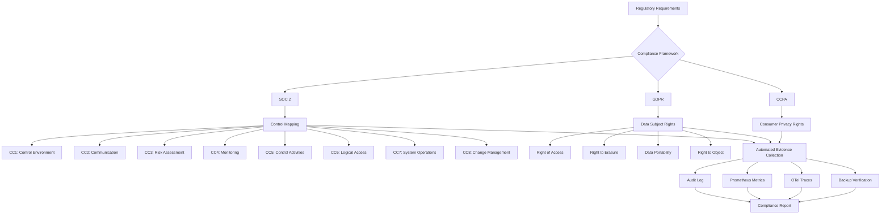

# Compliance

> Regulatory compliance framework for AI Dev OS — controls mapping, evidence collection, audit readiness for SOC 2, GDPR, and CCPA. This document is normative — implementations MUST satisfy every MUST clause below.

## Overview

Compliance defines the controls, processes, and evidence artifacts that demonstrate AI Dev OS meets regulatory and security standards. The system is designed with a **compliance-by-default** approach: the architectural invariants (no hidden state, append-only audit log, least-privilege tools, signed envelopes) naturally satisfy many control requirements without bolt-on processes.

This document covers three frameworks. Other frameworks (HIPAA, FedRAMP, PCI-DSS) are out of scope for v1.0 but the control framework is extensible.

## Goals

- Every compliance control maps to one or more architectural invariants or documented processes.
- Evidence is collected automatically by the Audit Log, Metrics, and Observability subsystems — no manual evidence gathering for standard controls.
- The compliance posture is continuously measurable, not point-in-time.
- All user data handling complies with GDPR and CCPA by default (opt-in telemetry, right to deletion, data portability).

## Non-Goals

- Legal advice — this document describes technical controls, not legal compliance guarantees.
- Certification — AI Dev OS has not been certified against any framework. This document describes the path to certification.
- Implementation code — this repo is documentation-only ([AI Coding Rules](./AI_CODING_RULES.md)).

## SOC 2 Controls Mapping

### Security (Common Criteria)

| Control | AI Dev OS Coverage | Evidence Source |
|---------|-------------------|-----------------|
| **CC1: Control Environment** | [AI Coding Rules](./AI_CODING_RULES.md) define agent behaviour; [Architecture Guardian](./ARCHITECTURE_GUARDIAN.md) enforces rules | git history, Guardian audit log |
| **CC2: Communication** | [Agent Communication](./AGENT_COMMUNICATION.md) defines signed envelopes; all inter-agent communication flows through SCE | SCE event log |
| **CC3: Risk Assessment** | [Impact Analysis](./IMPACT_ANALYSIS.md) computes blast radius; [Security Model](./SECURITY_MODEL.md) documents threat model | Impact Analysis records |
| **CC4: Monitoring** | [Observability](./OBSERVABILITY.md) provides metrics, traces, logs; [Metrics](./METRICS.md) define alerting rules | Prometheus metrics, alert history |
| **CC5: Control Activities** | [Main AI Kernel](./MAIN_AI_KERNEL.md) enforces budget caps; [Architecture Guardian](./ARCHITECTURE_GUARDIAN.md) enforces 14 built-in rules | Guardian verdict log |
| **CC6: Logical & Physical Access** | [Auth System](./AUTH_SYSTEM.md) controls API access; [Security Model](./SECURITY_MODEL.md) defines trust boundaries; [IPC](./IPC.md) enforces local-only transport | Auth audit log |
| **CC7: System Operations** | [Deployment](./DEPLOYMENT.md) defines operational procedures; [Backup Strategy](./BACKUP_STRATEGY.md) defines RPO/RTO | Deployment audit trail |
| **CC8: Change Management** | [Release Process](./RELEASE_PROCESS.md), [Prompt Governance](./PROMPT_GOVERNANCE.md), [Versioning](./VERSIONING.md) control changes | git history, prompt registry |

### Availability

| Control | AI Dev OS Coverage | Evidence Source |
|---------|-------------------|-----------------|
| **A1: Processing Integrity** | [Reliability](./RELIABILITY.md) defines uptime targets; [Queueing](./QUEUEING.md) ensures at-least-once delivery | Uptime metrics, queue depth metrics |
| **A2: Availability** | [Disaster Recovery](./DISASTER_RECOVERY.md) defines recovery procedures; [Backup Strategy](./BACKUP_STRATEGY.md) defines RTO | DR test records |

### Confidentiality

| Control | AI Dev OS Coverage | Evidence Source |
|---------|-------------------|-----------------|
| **C1: Confidentiality** | [Encryption](./ENCRYPTION.md) defines at-rest and in-transit encryption; [Secrets Management](./SECRETS_MANAGEMENT.md) protects credentials | Encryption config audit |
| **C2: Data Minimisation** | [Telemetry](./TELEMETRY.md) collects only anonymised, aggregated data; no PII in logs | Telemetry schema audit |

### Privacy

| Control | AI Dev OS Coverage | Evidence Source |
|---------|-------------------|-----------------|
| **P1: Notice** | [Privacy](./PRIVACY.md) policy is documented; first-run telemetry opt-in prompt | Privacy doc version |
| **P2: Choice & Consent** | Telemetry is opt-in only; [Telemetry](./TELEMETRY.md) documents opt-in flow | Config audit |
| **P3: Collection** | [Data Retention](./DATA_RETENTION.md) defines what is collected and for how long | Retention job audit |
| **P4: Use** | Telemetry data is used only for product improvement; no third-party sharing | Data flow diagram |
| **P5: Retention** | Retention policies in [Data Retention](./DATA_RETENTION.md); automated enforcement by retention job | Retention job metrics |
| **P6: Disclosure** | No personal information is shared with third parties; [Telemetry](./TELEMETRY.md) documents collector | — |
| **P7: Quality** | Data accuracy is maintained through append-only event model and checksummed records | Database integrity checks |
| **P8: Access & Correction** | Users can delete all local data; telemetry data cannot be corrected (aggregated) | — |

## GDPR Compliance

### Rights Mapping

| GDPR Right | Technical Implementation |
|------------|------------------------|
| **Right to be Informed** | [Privacy](./PRIVACY.md) document; first-run telemetry prompt |
| **Right of Access** | `aidevos telemetry status --verbose` shows all queued telemetry events |
| **Right to Rectification** | User can edit local config; telemetry data is aggregated and cannot be rectified after send |
| **Right to Erasure** | Users can delete `~/.aidevos/` to remove all local data; telemetry collector purges raw data after 90 days |
| **Right to Restrict Processing** | Disabling telemetry stops all data transmission immediately |
| **Right to Data Portability** | All local data is in standard formats (SQLite, JSON, YAML); user can copy freely |
| **Right to Object** | Disabling telemetry is an irrevocable opt-out with no functionality loss |
| **Rights Related to Automated Decision-Making** | All agent decisions are documented in the Audit Log and SCE; no fully automated decisions without human oversight |

### Data Processing Register

| Processing Activity | Data Categories | Purpose | Lawful Basis | Retention |
|-------------------|----------------|---------|--------------|-----------|
| Telemetry collection | Anonymised usage events (see [Telemetry](./TELEMETRY.md)) | Product improvement | Legitimate interest + opt-in consent | 90 days raw, 24 months aggregated |
| Audit logging | Agent actions, run events, system changes | Security, compliance | Legitimate interest | 7 years |
| Knowledge base storage | Code references, documentation excerpts | Agent context | Legitimate interest | Per KB tier policy |
| User configuration | Model keys, provider credentials | System operation | Contractual necessity | Until deleted by user |

## CCPA Compliance

| CCPA Right | Technical Implementation |
|------------|------------------------|
| **Right to Know** | Telemetry data fields are documented in [Telemetry](TELEMETRY.md) |
| **Right to Delete** | Delete `~/.aidevos/` to remove all local personal information |
| **Right to Opt-Out** | `aidevos telemetry disable` — no data sold or shared with third parties |
| **Right to Non-Discrimination** | No functionality difference between telemetry-enabled and disabled |

## Evidence Collection

The following subsystems automatically generate compliance evidence:

| Evidence | Source | Frequency |
|----------|--------|-----------|
| Access logs | [Audit Log](./AUDIT_LOG.md) | Continuous |
| Change history | git log + [Changelog](./CHANGELOG.md) | Per commit |
| Configuration snapshots | [Configuration](./CONFIGURATION.md) backups | Per change |
| Incident records | [Error Handling](./ERROR_HANDLING.md) events | Per incident |
| Metric history | Prometheus tsdb | Rolling 90 days |
| Trace spans | [Tracing](./TRACING.md) OTLP export | Configurable retention |
| Backup verification | [Backup Strategy](./BACKUP_STRATEGY.md) restore test | Monthly |
| DR test results | [Disaster Recovery](./DISASTER_RECOVERY.md) runbook | Quarterly |

## Compliance Configuration

```toml
[AIDEVOS_COMPLIANCE]
framework = "soc2"                          # primary framework
data_retention_days = 2555                  # 7 years for audit log
evidence_export_path = "~/.aidevos/compliance/"
audit_contact = "security@aidevos.dev"
```

## Failure Modes

| Mode | Detection | Response |
|------|-----------|----------|
| Audit log integrity check fails | Checksum mismatch | Freeze system; page security team; initiate incident response |
| Retention policy not enforced | Records exceed retention period | Log WARN; trigger manual cleanup; audit non-compliance window |
| Evidence gap detected | Missing metric/event for required control | Log WARN; report in compliance dashboard; initiate remediation |

## Acceptance Criteria

- An auditor can reconstruct every SOC2 control mapping from the documentation and automated evidence sources without manual interviews.
- Deleting `~/.aidevos/` and re-installing produces a fresh installation with zero telemetry data and zero audit events from the previous installation.
- The Audit Log supports a `compliance-check` tool that maps each SOC2 control to the corresponding audit entries for a given time range.
- Telemetry data never contains code content, file names, or model inputs/outputs (verified by integration test).

## Compliance Framework Diagram



## Compliance Automation

The compliance posture is continuously measured, not point-in-time:

| Automation | Mechanism | Frequency |
|------------|-----------|-----------|
| Control mapping verification | Automated test checks each SOC2 control against evidence sources | Per commit |
| Evidence gap analysis | Script scans evidence sources and reports missing coverage | Daily |
| Retention policy enforcement | Cron job deletes expired records per `data_retention_days` | Hourly |
| Telemetry schema audit | Validates telemetry events against allowed schema | Per event |
| Access log review | Audit Log scanner checks for anomalous patterns | Continuous |
| Backup encryption verification | Attempts decryption of latest backup with stored key | Daily |

## Reporting Schedule

| Report | Audience | Frequency | Contents |
|--------|----------|-----------|----------|
| Compliance dashboard | Engineering leads | Continuous (real-time) | Control status, evidence coverage, gaps |
| Monthly compliance summary | Security team | Monthly | Control status changes, new evidence, incidents |
| Quarterly audit package | Auditors | Quarterly | Full evidence export, DR test results, control mappings |
| Annual SOC 2 report | External auditors | Annually | Complete SOC 2 Type II report package |

## Failure Modes (Expanded)

| Mode | Detection | Response |
|------|-----------|----------|
| Audit log integrity check fails | Checksum mismatch | Freeze system; page security team; initiate incident response |
| Retention policy not enforced | Records exceed retention period | Log WARN; trigger manual cleanup; audit non-compliance window |
| Evidence gap detected | Missing metric/event for required control | Log WARN; report in compliance dashboard; initiate remediation |
| Control mapping drift | Code change removes evidence source | Block PR; require updated mapping |
| Telemetry schema violation | Disallowed field in telemetry event | Drop event; alert operator; update schema |
| Backup decryption failure | Decryption test fails | Rotate encryption key; re-encrypt backups; alert |

## Acceptance Criteria (Expanded)

- An auditor can reconstruct every SOC2 control mapping from the documentation and automated evidence sources without manual interviews.
- Deleting `~/.aidevos/` and re-installing produces a fresh installation with zero telemetry data and zero audit events from the previous installation.
- The Audit Log supports a `compliance-check` tool that maps each SOC2 control to the corresponding audit entries for a given time range.
- Telemetry data never contains code content, file names, or model inputs/outputs (verified by integration test).
- The automated evidence gap analysis runs daily and reports results to the compliance dashboard within 5 minutes.
- A retention policy test verifies that records exceeding `data_retention_days` are deleted within 1 hour.

## Related Documents

- [Privacy](./PRIVACY.md) — privacy policy
- [Security Model](./SECURITY_MODEL.md) — trust boundaries and security controls
- [Audit Log](./AUDIT_LOG.md) — append-only audit trail
- [Data Retention](./DATA_RETENTION.md) — retention policies per data type
- [Encryption](./ENCRYPTION.md) — data protection
- [Telemetry](./TELEMETRY.md) — product telemetry (opt-in)
- [System Overview](./SYSTEM_OVERVIEW.md)
