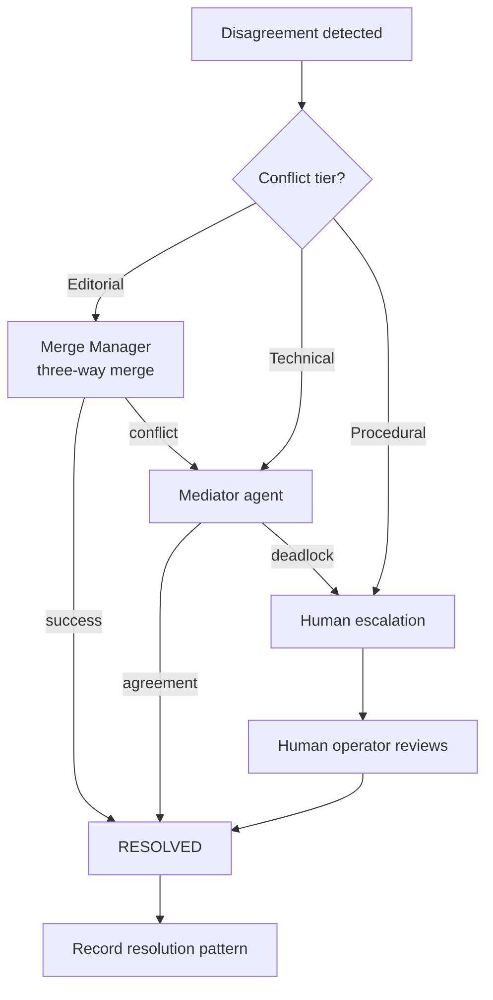

# Conflict Resolution

> Protocol and escalation path for resolving disagreements between agents that consensus cannot settle — involving structured mediation, human escalation, and learned resolution patterns. This document is normative — implementations MUST satisfy every MUST clause below.

## Overview

Conflict Resolution is the escalation layer below [Consensus](./CONSENSUS.md). When consensus protocols fail (timeout, stalemate, unanimous block) or when the disagreement involves mutually exclusive actions (two agents cannot both edit the same file in conflicting ways), the Conflict Resolution subsystem provides structured mediation.

Conflicts are categorised into three tiers — **editorial** (content disagreements), **technical** (architecture or implementation approach disagreements), and **procedural** (process or policy disagreements) — each with its own escalation path.

## Goals

- Editorial conflicts are resolved automatically by the [Merge Manager](./MERGE_MANAGER.md) three-way merge where possible.
- Technical conflicts escalate to a mediator agent with relevant expertise.
- Procedural conflicts escalate to human operators.
- All conflicts are recorded with their resolution for future pattern matching.
- Repeated conflicts of the same type produce a "resolution pattern" that automates resolution in future runs.

## Non-Goals

- Replacing the Merge Manager's three-way merge for concurrent edits.
- Judging correctness — the Conflict Resolver resolves disagreements, not factual errors (those belong to the Critic).
- Implementation code — this repo is documentation-only ([AI Coding Rules](./AI_CODING_RULES.md)).

## Conflict Tiers

| Tier | Definition | Examples | Auto-resolvable? |
|------|-----------|----------|-----------------|
| **Editorial** | Content format, ordering, naming, style | Tab width, import order, variable naming | Yes (Merge Manager) |
| **Technical** | Architecture, design pattern, library choice | Use React vs Vue, REST vs GraphQL | No → Mediator agent |
| **Procedural** | Process, policy, compliance | Whether to run security scan, whether to require 2 reviewers | No → Human operator |

## Resolution Path



### Resolution Workflow

```
1. Conflict detected → Conflict Resolution subsystem creates ConflictRecord
2. Categorise: editorial / technical / procedural
3. If editorial: send to Merge Manager; if merge succeeds, mark resolved
4. If technical or editorial merge failed:
   a. Select mediator agent (most expert in the topic)
   b. Mediator reviews both positions and proposes a resolution
   c. Both parties accept → resolve; if either rejects → escalate
5. If procedural: immediately escalate to human
6. Human reviews conflict record, makes binding decision
7. Decision recorded in ConflictRecord with reasoning
8. Resolution pattern learned: if same conflict appears again with similar context, propose the previous resolution
```

## Conflict Record Schema

```json
ConflictRecord {
  id:              ulid
  run_id:          ulid
  tier:            "editorial" | "technical" | "procedural"
  topic:           string
  parties:         { agent_id, position, reasoning, artifact_snapshot }[]
  consensus_round_id: ulid | null     # if escalated from consensus
  resolution: {
    resolved_by:   "merge_manager" | "mediator" | "human"
    outcome:       string
    reasoning:     string
    ts:            rfc3339
  }
  pattern_id:      ulid | null        # linked resolution pattern
  ts:              rfc3339
}
```

## Interfaces

```
conflict.create(tier, topic, parties) → ConflictRecord
conflict.resolve(conflict_id, resolution) → Ack
conflict.escalate(conflict_id, reason) → Ack
conflict.status(conflict_id) → ConflictRecord
conflict.history(run_id?) → ConflictRecord[]
conflict.patterns() → ResolutionPattern[]  # learned patterns
```

## Failure Modes

| Mode | Detection | Response |
|------|-----------|----------|
| Mediator deadlock | Mediator cannot decide | Escalate directly to human; bypass further mediation |
| Human escalation timeout | No human response within 1 hour | Freeze affected tasks; continue non-conflicting tasks; re-notify every 30 min |
| Pattern mismatch | Learned pattern causes incorrect resolution | Mark pattern as `deprecated`; revert to manual resolution; log ERROR |
| Conflict storm | > 10 conflicts within 1 minute | Batch into single escalation; alert operator of "high-conflict run" |

## Acceptance Criteria

- Two agents disagreeing on import order produce an editorial conflict that is resolved by the Merge Manager without human involvement.
- Two agents disagreeing on database choice produce a technical conflict that escalates to a mediator agent, which proposes a resolution.
- A procedural conflict (e.g. "should we skip security scan for this change?") escalates directly to the configured human operator.
- A ConflictRecord created for a merge conflict is queryable by `run_id` and contains both parties' positions with artifact snapshots.
- A resolution pattern from one run is proposed (not auto-applied) when a similar conflict arises in a later run.

## Mediation Agent Protocol

When a technical conflict escalates to a mediator, the following protocol is followed:

```
1. Mediator Selection:
   a. Conflict Resolution queries the Nine Router for an agent with domain expertise matching `conflict.topic`
   b. If no domain-specific agent exists, select the agent with the highest general reasoning score
   c. The selected mediator receives the full ConflictRecord (both parties' positions, reasoning, artifacts)

2. Mediation Process:
   a. Mediator reviews both positions independently
   b. Mediator may request additional context from either party via the SCE
   c. Mediator proposes a resolution with rationale
   d. Both parties vote: accept or reject
   e. If unanimous accept → resolution recorded
   f. If either rejects → mediator revises or escalates

3. Time Bounds:
   a. Editorial mediation: 30 seconds max
   b. Technical mediation: 5 minutes max
   c. If no resolution within time bound → auto-escalate to human
```

## Conflict Detection Algorithm

The system detects conflicts through multiple mechanisms:

```python
def detect_conflicts(run_id: str) -> List[ConflictRecord]:
    conflicts = []

    # 1. Merge Manager conflicts: concurrent edits to same resource
    merge_conflicts = merge_manager.pending_conflicts(run_id)
    for mc in merge_conflicts:
        conflicts.append(ConflictRecord(
            tier="editorial",
            topic=f"Merge conflict on {mc.resource_id}",
            parties=mc.parties,
            ts=now()
        ))

    # 2. Consensus timeouts: consensus protocol failed to converge
    consensus_failures = consensus.timeouts(run_id)
    for cf in consensus_failures:
        conflicts.append(ConflictRecord(
            tier="technical" if cf.is_technical else "editorial",
            topic=cf.topic,
            parties=cf.parties,
            consensus_round_id=cf.round_id,
            ts=now()
        ))

    # 3. Unanimous blocks: all agents agree to block (procedural)
    unanimous_blocks = consensus.unanimous_blocks(run_id)
    for ub in unanimous_blocks:
        conflicts.append(ConflictRecord(
            tier="procedural",
            topic=ub.topic,
            parties=ub.parties,
            ts=now()
        ))

    # 4. Mutually exclusive actions detected by the Kernel
    mutex_violations = kernel.detect_mutex_violations(run_id)
    for mv in mutex_violations:
        conflicts.append(ConflictRecord(
            tier="technical",
            topic=f"Mutually exclusive: {mv.action_a} vs {mv.action_b}",
            parties=mv.parties,
            ts=now()
        ))

    return conflicts
```

## Resolution Strategies Catalog

| Strategy | Tier | Algorithm | Description |
|----------|------|-----------|-------------|
| **Three-way merge** | Editorial | Line-based diff3 | Merge Manager automatically merges concurrent edits; conflicts flagged for mediation |
| **Last-writer-wins** | Editorial | Timestamp comparison | When merge is impossible, accept the most recent change; record the overwritten version |
| **Mediator proposal** | Technical | Expert agent review | Domain-expert agent reviews both positions and proposes a compromise |
| **Weighted voting** | Technical | Authority-weighted vote | Each agent votes; votes are weighted by domain authority score; highest-weighted position wins |
| **Human override** | Procedural | Manual review | Human operator reviews the conflict record and issues a binding decision |
| **Pattern replay** | All | Similarity match | If a resolution pattern matches the current conflict with confidence > 0.8, auto-apply the previous resolution |
| **Defer and retry** | Technical | Timer + backoff | Postpone resolution; agents continue non-conflicting work; retry mediation after configurable delay |

## Pattern Learning System

Resolution patterns are learned and applied to prevent repeat conflicts:

```python
class ResolutionPattern:
    id: ulid
    conflict_topic: str           # normalized topic string
    conflict_tier: str            # editorial | technical | procedural
    context_hash: sha256          # hash of the conflict context (domain, parties, artifact types)
    resolution_strategy: str      # which strategy was used
    resolution_outcome: str       # the resolution text
    apply_count: int              # how many times this pattern has been applied
    success_rate: float           # 0.0-1.0 — how often the pattern produced a stable resolution
    created_at: rfc3339
    last_applied: rfc3339

def learn_pattern(conflict: ConflictRecord) -> ResolutionPattern:
    # Extract topic, tier, and context from the resolved conflict
    pattern = ResolutionPattern(
        conflict_topic=normalize_topic(conflict.topic),
        conflict_tier=conflict.tier,
        context_hash=hash_context(conflict),
        resolution_strategy=conflict.resolution.resolved_by,
        resolution_outcome=conflict.resolution.outcome,
        apply_count=0,
        success_rate=1.0,
        created_at=now()
    )
    # Store in Persistent Memory for future conflict matching
    store_pattern(pattern)
    return pattern

def match_pattern(conflict: ConflictRecord) -> ResolutionPattern | None:
    # Search for patterns matching the new conflict's topic and context
    candidates = search_patterns(
        topic=normalize_topic(conflict.topic),
        min_success_rate=0.7
    )
    if candidates:
        best = max(candidates, key=lambda p: p.success_rate * p.apply_count)
        if best.success_rate >= 0.8 and best.apply_count >= 3:
            return best
    return None
```

## Observability

| Metric | Labels | Description |
|--------|--------|-------------|
| `conflict_total` | `tier` | Total conflicts created by tier |
| `conflict_resolved_total` | `tier`, `resolved_by` | Conflicts resolved by resolution method |
| `conflict_resolution_seconds` | `tier`, `strategy` | Time to resolve a conflict |
| `conflict_escalation_total` | `tier` | Conflicts escalated to human |
| `conflict_pattern_match_total` | `match` | Pattern match attempts (hit/miss) |
| `conflict_storm_total` | — | Times a conflict storm (>10/min) was detected |

## Related Documents

- [Consensus](./CONSENSUS.md) — first-line agreement protocol
- [Merge Manager](./MERGE_MANAGER.md) — editorial conflict handling
- [Multi-Agent Orchestration](./MULTI_AGENT_ORCHESTRATION.md) — parent coordination
- [System Overview](./SYSTEM_OVERVIEW.md)
