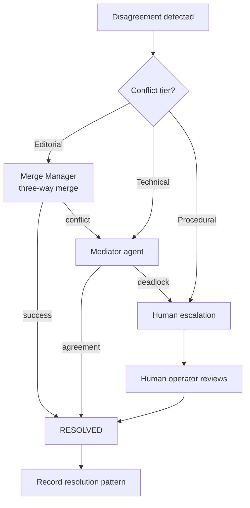

# Conflict Resolution

> Protocol and escalation path for resolving disagreements between agents that consensus cannot settle — involving structured mediation, human escalation, and learned resolution patterns. This document is normative — implementations MUST satisfy every MUST clause below.

## Overview

Conflict Resolution is the escalation layer below [Consensus](./CONSENSUS.md). When consensus protocols fail (timeout, stalemate, unanimous block) or when the disagreement involves mutually exclusive actions (two agents cannot both edit the same file in conflicting ways), the Conflict Resolution subsystem provides structured mediation.

Conflicts are categorised into three tiers — **editorial** (content disagreements), **technical** (architecture or implementation approach disagreements), and **procedural** (process or policy disagreements) — each with its own escalation path.

## Goals

- Editorial conflicts are resolved automatically by the [Merge Manager](./MERGE_MANAGER.md) three-way merge where possible.
- Technical conflicts escalate to a mediator agent with relevant expertise.
- Procedural conflicts escalate to human operators.
- All conflicts are recorded with their resolution for future pattern matching.
- Repeated conflicts of the same type produce a "resolution pattern" that automates resolution in future runs.

## Non-Goals

- Replacing the Merge Manager's three-way merge for concurrent edits.
- Judging correctness — the Conflict Resolver resolves disagreements, not factual errors (those belong to the Critic).
- Implementation code — this repo is documentation-only ([AI Coding Rules](./AI_CODING_RULES.md)).

## Conflict Tiers

| Tier | Definition | Examples | Auto-resolvable? |
|------|-----------|----------|-----------------|
| **Editorial** | Content format, ordering, naming, style | Tab width, import order, variable naming | Yes (Merge Manager) |
| **Technical** | Architecture, design pattern, library choice | Use React vs Vue, REST vs GraphQL | No → Mediator agent |
| **Procedural** | Process, policy, compliance | Whether to run security scan, whether to require 2 reviewers | No → Human operator |

## Resolution Path



### Resolution Workflow

```
1. Conflict detected → Conflict Resolution subsystem creates ConflictRecord
2. Categorise: editorial / technical / procedural
3. If editorial: send to Merge Manager; if merge succeeds, mark resolved
4. If technical or editorial merge failed:
   a. Select mediator agent (most expert in the topic)
   b. Mediator reviews both positions and proposes a resolution
   c. Both parties accept → resolve; if either rejects → escalate
5. If procedural: immediately escalate to human
6. Human reviews conflict record, makes binding decision
7. Decision recorded in ConflictRecord with reasoning
8. Resolution pattern learned: if same conflict appears again with similar context, propose the previous resolution
```

## Conflict Record Schema

```json
ConflictRecord {
  id:              ulid
  run_id:          ulid
  tier:            "editorial" | "technical" | "procedural"
  topic:           string
  parties:         { agent_id, position, reasoning, artifact_snapshot }[]
  consensus_round_id: ulid | null     # if escalated from consensus
  resolution: {
    resolved_by:   "merge_manager" | "mediator" | "human"
    outcome:       string
    reasoning:     string
    ts:            rfc3339
  }
  pattern_id:      ulid | null        # linked resolution pattern
  ts:              rfc3339
}
```

## Interfaces

```
conflict.create(tier, topic, parties) → ConflictRecord
conflict.resolve(conflict_id, resolution) → Ack
conflict.escalate(conflict_id, reason) → Ack
conflict.status(conflict_id) → ConflictRecord
conflict.history(run_id?) → ConflictRecord[]
conflict.patterns() → ResolutionPattern[]  # learned patterns
```

## Failure Modes

| Mode | Detection | Response |
|------|-----------|----------|
| Mediator deadlock | Mediator cannot decide | Escalate directly to human; bypass further mediation |
| Human escalation timeout | No human response within 1 hour | Freeze affected tasks; continue non-conflicting tasks; re-notify every 30 min |
| Pattern mismatch | Learned pattern causes incorrect resolution | Mark pattern as `deprecated`; revert to manual resolution; log ERROR |
| Conflict storm | > 10 conflicts within 1 minute | Batch into single escalation; alert operator of "high-conflict run" |

## Acceptance Criteria

- Two agents disagreeing on import order produce an editorial conflict that is resolved by the Merge Manager without human involvement.
- Two agents disagreeing on database choice produce a technical conflict that escalates to a mediator agent, which proposes a resolution.
- A procedural conflict (e.g. "should we skip security scan for this change?") escalates directly to the configured human operator.
- A ConflictRecord created for a merge conflict is queryable by `run_id` and contains both parties' positions with artifact snapshots.
- A resolution pattern from one run is proposed (not auto-applied) when a similar conflict arises in a later run.

## Related Documents

- [Consensus](./CONSENSUS.md) — first-line agreement protocol
- [Merge Manager](./MERGE_MANAGER.md) — editorial conflict handling
- [Multi-Agent Orchestration](./MULTI_AGENT_ORCHESTRATION.md) — parent coordination
- [System Overview](./SYSTEM_OVERVIEW.md)
