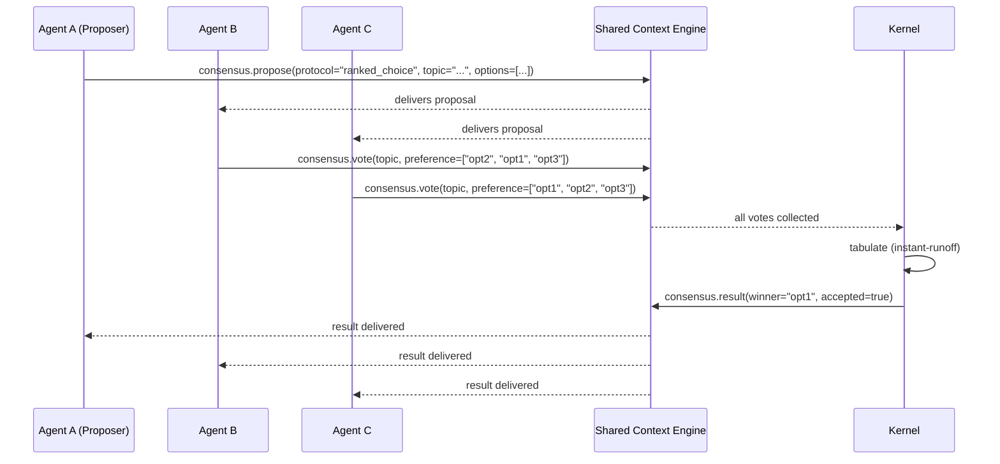

# Consensus

> Multi-agent consensus protocol — how AI agents agree on shared decisions, resolve disagreements, and coordinate on joint tasks without central arbitration. This document is normative — implementations MUST satisfy every MUST clause below.

## Overview

Consensus is the mechanism by which multiple AI agents in the same group or across groups reach agreement on shared decisions: which approach to take, which artifact to deliver, which model to use for a sub-task. Unlike the [Architecture Guardian](./ARCHITECTURE_GUARDIAN.md), which enforces hard invariants, consensus addresses **discretionary decisions** where multiple valid answers exist and the agents must converge on one.

Consensus is a sub-protocol of [Multi-Agent Orchestration](./MULTI_AGENT_ORCHESTRATION.md). It is invoked when the Planner or Kernel detects that a decision point has no single authoritative answer (e.g. "which test framework should we use?" or "which of these two code generation approaches is better?").

## Goals

- Agents can reach agreement on shared decisions without human intervention in common cases.
- Consensus is bounded: a decision must be reached within N rounds or a timeout (configurable per decision type).
- Minority opinions are recorded — they are not overridden but stored alongside the decision.
- All consensus rounds are recorded in the SCE for auditability and replay.

## Non-Goals

- Enforcing architectural invariants — belongs to [Architecture Guardian](./ARCHITECTURE_GUARDIAN.md).
- Voting on factual correctness — the [Critic](../prompts/CRITIC_PROMPT.md) evaluates output quality.
- Implementation code — this repo is documentation-only ([AI Coding Rules](./AI_CODING_RULES.md)).

## Consensus Protocols

### 1. Simple Majority

Used for low-stakes decisions where any reasonable answer is acceptable (e.g. which colour to use for a log level badge, which order to list items).

```
1. Proposer agent emits `consensus.propose` event with { topic, options[], reasoning }
2. Each voting agent emits `consensus.vote` with { topic, preference } within VOTE_TIMEOUT
3. Kernel tabulates votes
4. If a single option has > 50% of votes → ACCEPTED
5. If no option has > 50% → second round with top 2 options
6. If still no majority after 2 rounds → Kernel picks based on cost heuristic
```

| Parameter | Default | Description |
|-----------|---------|-------------|
| `VOTE_TIMEOUT` | 10 s | Max time to wait for all votes |
| `MAX_ROUNDS` | 2 | Max voting rounds before Kernel tiebreak |
| `QUORUM` | 60% of eligible voters | Minimum participation for valid vote |

### 2. Ranked Choice

Used for medium-stakes decisions where preferences may not be binary (e.g. which of 3 architecture patterns to adopt).

```
1. Proposer emits `consensus.ranked_propose` with { topic, options[] }
2. Each agent submits a ranked list: [first, second, third, ...]
3. Kernel applies instant-runoff voting:
   a. Count first-choice votes
   b. If no option has > 50% → eliminate last-place option
   c. Redistribute eliminated votes to next preference
   d. Repeat until one option has > 50%
4. Result: ACCEPTED with winner
```

| Parameter | Default |
|-----------|---------|
| `VOTE_TIMEOUT` | 30 s |
| `MAX_OPTIONS` | 6 |

### 3. Expert Delegation

Used for high-stakes decisions where agents have asymmetric expertise (e.g. which deployment strategy to use — the DevOps group agent has more relevant knowledge than the Builder agent).

```
1. Any agent emits `consensus.delegate_request` with { topic, suggested_expert }
2. Other agents may accept or challenge within CHALLENGE_TIMEOUT
3. If no challenge → suggested_expert becomes decision-maker
4. If challenge → escalate to ranked-choice vote among experts only
```

| Parameter | Default |
|-----------|---------|
| `CHALLENGE_TIMEOUT` | 15 s |
| `EXPERT_ROLE` | Declared in GroupSpec |

### 4. Unanimous (for safety-critical decisions)

Used for decisions that affect safety, security, or compliance (e.g. "should we apply this auto-fix?"). Every agent must explicitly consent.

```
1. Proposer emits `consensus.unanimous_propose` with { topic, proposal }
2. Each agent must emit `consensus.approve` or `consensus.reject` within TIMEOUT
3. If any agent rejects → decision is BLOCKED, reason recorded
4. If all approve → decision is ACCEPTED
5. Blocked decisions are escalated to the Kernel for human review
```

| Parameter | Default |
|-----------|---------|
| `VOTE_TIMEOUT` | 30 s |

## Consensus Event Schema

```json
ConsensusRound {
  id:              ulid
  run_id:          ulid
  protocol:        "simple_majority" | "ranked_choice" | "expert_delegation" | "unanimous"
  topic:           string
  options:         { id: string, description: string, proposer: agent_id }
  participants:    agent_id[]
  votes:           { agent_id: agent_id, preference: string, rank?: int }
  result:          "accepted" | "blocked" | "escalated"
  winner:          string | null
  minority_report: { option_id, voters[], reasoning }
  ts:              rfc3339
}
```

## Architecture



## Interfaces

```
consensus.propose(protocol, topic, options, context?)
consensus.vote(round_id, preference)
consensus.status(round_id) → ConsensusRound
consensus.delegate_request(topic, suggested_expert)
consensus.history(run_id, topic?) → ConsensusRound[]
```

## Failure Modes

| Mode | Detection | Response |
|------|-----------|----------|
| Vote timeout (not all agents voted) | Timer fires before all votes received | Accept current votes as valid if quorum met; log WARN |
| Quorum not met | < 60% of voters participated | Escalate to Kernel; Kernel makes decision with reason |
| Stalemate (repeated ties after MAX_ROUNDS) | No majority after max rounds | Kernel tiebreak based on cost/risk heuristic |
| Agent votes inconsistently | Same agent votes for multiple options in same round | Discard all votes from that agent; mark as unreliable |
| Topic duplication | Two overlapping consensus rounds active | Cancel later round; merge into earlier round's result |
| Unanimous block | Any agent rejects safety-critical decision | Escalate to human with full context; freeze in-progress work |

## Observability

| Metric | Labels | Description |
|--------|--------|-------------|
| `consensus_round_total` | `protocol`, `result` | Consensus rounds by protocol and result |
| `consensus_vote_total` | `protocol` | Votes cast across all rounds |
| `consensus_round_duration_seconds` | `protocol` | Wall-clock duration per round |
| `consensus_participation_ratio` | `protocol` | Fraction of eligible agents that voted |
| `consensus_stalemate_total` | `protocol` | Rounds that reached MAX_ROUNDS without majority |
| `consensus_escalation_total` | `reason` | Rounds escalated to Kernel or human |
| `consensus_vote_discard_total` | `reason` | Votes discarded (inconsistent, duplicate, late) |

Traces: one span per consensus round, with child spans for propose, each vote receipt, tabulation, and result broadcast.

Events: `consensus.round_completed { round_id, protocol, result, winner, duration_ms }` published on SCE.

## Performance Budget

| Operation | p99 Target |
|-----------|------------|
| Propose (emit + deliver to 5 agents) | < 100 ms |
| Vote collection (5 agents) | < 50 ms |
| Tabulation (ranked choice, 5 options, 5 voters) | < 10 ms |
| Full round (propose → vote → result) | < VOTE_TIMEOUT + 200 ms |

## Security Considerations

- Only agents in the same run or group can participate in consensus rounds.
- The Kernel signs every `consensus.result` event to prevent replay.
- Unanimous protocol decisions are final and cannot be overridden by a single agent.
- Vote manipulation (duplicate votes, forged votes) is prevented by SCE envelope signing.

## Acceptance Criteria

- Three agents with different preferences run ranked-choice consensus on 3 options and converge on a winner within 2 rounds.
- Two agents running unanimous consensus on a safety decision both approve → decision is ACCEPTED.
- One agent rejects a unanimous decision → decision is BLOCKED and escalated to Kernel.
- A consensus round where only 50% of agents vote within the timeout uses the available votes (quorum of 60% not met) and escalates to Kernel.
- All consensus events for a run are queryable via `consensus.history(run_id)`.

## Related Documents

- [Multi-Agent Orchestration](./MULTI_AGENT_ORCHESTRATION.md) — the parent coordination protocol
- [Agent Communication](./AGENT_COMMUNICATION.md) — envelope format for consensus events
- [Shared Context Engine](./SHARED_CONTEXT_ENGINE.md) — consensus event transport
- [Conflict Resolution](./CONFLICT_RESOLUTION.md) — resolving disagreements that consensus cannot settle
- [System Overview](./SYSTEM_OVERVIEW.md)
