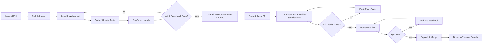

# Contributing to AI Dev OS

Thank you for considering contributing to AI Dev OS. This document describes the processes and standards for all types of contributions.

## How to Contribute

- **Documentation**: Improve or expand guides, API references, tutorials, and code comments
- **Code**: Fix bugs, add features, optimize performance, or improve test coverage
- **Prompts**: Contribute system prompts, few-shot examples, and agent definitions that improve model output quality
- **Bug reports**: File detailed, reproducible bug reports with logs and reproduction steps
- **Feature requests**: Propose well-scoped enhancements that align with the project roadmap
- **Community support**: Answer questions on Discord and Stack Overflow, triage issues, and review documentation

## Development Setup

### Prerequisites
- Python 3.10+ or Node.js 18+ (depending on the component)
- Rust toolchain (for native extensions and performance-critical modules)
- Docker (required for running sandbox integration tests)
- Git LFS (for large test fixtures)

### Local Setup
```bash
git clone https://github.com/ai-dev-os/ai-dev-os.git
cd ai-dev-os
make install-dev       # Install all dependencies in development mode
make build             # Build all components
make test              # Run the full test suite to verify your setup
```

### Running Tests
```bash
make test              # Run all test suites
make test-unit         # Run unit tests only (fast, for quick iteration)
make test-integration  # Run integration tests (requires Docker)
make test-e2e          # Run end-to-end tests (requires Docker and a model)
make test-coverage     # Run tests and generate coverage reports
```

## Pull Request Process

1. Fork the repository and create a feature branch from `main`
2. Make your changes following the coding and documentation standards below
3. Write or update tests to cover your changes — new code without tests will not be merged
4. Run the full test suite and ensure it passes
5. Commit using the required commit message format
6. Push your branch and open a pull request against `main`. Fill out the PR template completely
7. Address reviewer feedback. Keep the branch updated with `main`
8. A maintainer will merge once all CI checks pass and at least one approval is received

## Coding Standards

- **Python**: Follow PEP 8. Type hints are required for all public APIs and recommended for internal ones. Run `ruff check .` before committing
- **TypeScript/JavaScript**: Follow the project's ESLint and Prettier configuration. Prefer typed interfaces over `any`
- **Rust**: Follow `rustfmt` conventions. Run `cargo clippy` before committing. Document all public items
- **Shell scripts**: Use shellcheck. Prefer POSIX sh for maximum portability
- All new code must include tests — unit tests for logic, integration tests for workflows
- Keep functions focused on a single responsibility. Modules should have clear boundaries
- Use descriptive variable names. Avoid abbreviations unless they are universally understood

## Documentation Standards

- All public APIs must include docstrings (Google style for Python, JSDoc for TypeScript, rustdoc for Rust)
- Every user-facing feature must include CLI help text and a documentation page in `docs/`
- Documentation is written in Markdown with a maximum line length of 100 characters
- Code examples must be runnable. Add them to the test suite if feasible
- Include screenshots or terminal recordings for UI or CLI changes
- Cross-reference related documentation pages using relative Markdown links

## Commit Message Format

We follow [Conventional Commits](https://www.conventionalcommits.org/):

```
<type>(<scope>): <description>

[optional body]
[optional footer]
```

Types: `feat`, `fix`, `docs`, `style`, `refactor`, `perf`, `test`, `chore`, `ci`, `revert`

Scope is the component or module being changed (e.g., `agent`, `cli`, `orchestrator`, `docs`).

Examples:
- `feat(agent): add retry logic for tool execution failures`
- `fix(cli): handle SIGTERM during long-running tasks`
- `docs: update installation instructions for Windows ARM64`

The description must be lowercase, imperative, and 72 characters or fewer.

## Review Process

- All PRs require at least one approval from a core maintainer
- Maintainers review within 48 hours on average during business days
- PRs introducing breaking changes must include a `BREAKING CHANGE` footer in the commit and a migration guide
- Large changes should be preceded by a GitHub Discussion or RFC
- Automated checks (lint, test, build, security scan) must pass before human review begins

## Development Workflow



## Detailed Environment Setup with Troubleshooting

### Prerequisites

| Dependency | Minimum Version | Check Command | Common Issues |
|---|---|---|---|
| Python | 3.10+ | `python --version` | Use `py -3.10` on Windows if multiple versions installed |
| Node.js | 18+ | `node --version` | Install via nvm (`nvm install 18`) or official installer |
| Rust | 1.70+ | `rustc --version` | Install via rustup (`rustup update`) |
| Docker | 24+ | `docker --version` | Ensure Docker Desktop is running; check WSL2 on Windows |
| Git LFS | 3+ | `git lfs version` | Run `git lfs install` after installing |
| Make | 4+ | `make --version` | Windows: install via Chocolatey (`choco install make`) or use `mingw32-make` |

### Environment Setup Steps

```bash
# Step 1: Clone the repository
git clone https://github.com/ai-dev-os/ai-dev-os.git
cd ai-dev-os

# Step 2: Install Git LFS hooks
git lfs install
git lfs pull

# Step 3: Install development dependencies
make install-dev

# Step 4: Verify setup
make build
make test
```

### Troubleshooting

| Problem | Likely Cause | Solution |
|---|---|---|
| `make install-dev` fails with Python package conflict | Virtual environment not activated or pip version too old | `python -m venv .venv && source .venv/bin/activate && pip install --upgrade pip` |
| `make build` fails on Rust native extensions | Rust toolchain target missing | `rustup target add x86_64-pc-windows-msvc` (Windows) or `rustup target add x86_64-unknown-linux-gnu` (Linux) |
| Docker integration tests hang | Docker not running or resource constrained | `docker info` to verify; increase Docker memory to 4 GB |
| `npm install` fails with permission errors | Global install without `--prefix` | Use `npm config set prefix ~/.npm-global` or run as user (not root) |
| Git LFS files show as pointers | `git lfs install` not run | `git lfs install && git lfs pull` |
| Tests flaky on Windows | Line ending differences | `git config core.autocrlf input`; ensure `.gitattributes` is correct |
| `make test-e2e` requires a model | No model configured | Set `AI_DEV_OS_TEST_MODEL` env var or create a `.env.test` file |

## Code Review Checklist

- [ ] Does the code follow the project's coding standards (PEP 8, ESLint, rustfmt)?
- [ ] Are type hints provided for all public APIs?
- [ ] Are tests included for new code? Do existing tests still pass?
- [ ] Is there documentation (docstrings, CLI help, docs page) for the change?
- [ ] Are there no hardcoded secrets, tokens, or endpoints?
- [ ] Is error handling comprehensive? Are errors user-friendly?
- [ ] Does the change introduce any new dependencies? Are they necessary?
- [ ] Is the commit message a valid Conventional Commit?
- [ ] Are breaking changes called out with a `BREAKING CHANGE` footer?
- [ ] Does the PR have a clear description linking to the original issue?
- [ ] Have performance implications been considered (especially for hot paths)?
- [ ] Are new features gated behind feature flags if they are incomplete?

## PR Template Contents

Every PR description must include:

```markdown
## Description
<!-- Brief description of the change and what it addresses -->

## Related Issue
<!-- Link to the GitHub issue (e.g., Closes #123) -->

## Type of Change
- [ ] Bug fix
- [ ] New feature
- [ ] Performance improvement
- [ ] Documentation update
- [ ] Refactoring (no functional change)
- [ ] CI / Build system change

## Testing
- [ ] Unit tests added / updated
- [ ] Integration tests added / updated
- [ ] Manual testing performed

## Checklist
- [ ] Code follows project coding standards
- [ ] Commit messages follow Conventional Commits
- [ ] Documentation updated where applicable
- [ ] No new secrets or credentials committed
- [ ] All CI checks pass

## Breaking Changes
<!-- If yes, describe the migration path -->

## Screenshots / Recordings
<!-- For UI or CLI changes -->
```

## Doc Change Workflow

1. Identify the affected docs page(s) in `docs/`
2. Make changes following the Documentation Standards below
3. If the change is user-facing, update CLI help text in the same PR
4. Run `make docs-preview` to render and review locally
5. Add the `docs` scope to the commit message: `docs(cli): update telemetry flag description`
6. PRs with only doc changes skip the full test suite but still require `markdownlint`

## ADR Creation Workflow

Architecture Decision Records are stored in `docs/adr/NNNN-title.md`.

1. Copy template: `cp docs/adr/TEMPLATE.md docs/adr/XXXX-title.md`
2. Obtain the next ADR number from `docs/adr/README.md`
3. Fill in: Title, Status, Context, Decision, Consequences, Compliance
4. Run `make docs-adr-validate` to check formatting
5. Submit as a regular PR with the `adr` scope
6. ADRs are approved by the architecture team (not by general maintainers)

## Test Contribution Guide (Adding Evals)

Evals test the model-level behaviour of agents. To add a new eval:

1. Create a file in `tests/evals/<category>/test_<name>.py`
2. Define the eval class inheriting from `EvalTestCase`:

```python
class TestMyEval(EvalTestCase):
    agent = "my-agent"
    prompt = "Summarise the key differences between Python and Rust"
    assertions = [
        "output.contains('memory safety')",
        "output.contains('GIL')",
        "output.contains('compile time')",
    ]
    expected_min_score = 0.7
    timeout = 60
```

3. Run the eval: `make test-eval -- --filter test_my_eval`
4. If the eval requires specific model provider, add `@requires_model("gpt-4")` decorator
5. Commit with type `test`: `test(evals): add eval for cross-language comparison`

### Eval Categories

| Directory | Purpose |
|---|---|
| `tests/evals/code/` | Code generation and analysis evals |
| `tests/evals/reasoning/` | Chain-of-thought and reasoning evals |
| `tests/evals/safety/` | Content safety and refusal evals |
| `tests/evals/tool_use/` | Tool-calling correctness evals |

## Documentation Contribution Guidelines

- All documentation is written in Markdown (.md) with a maximum line length of 100 characters
- Use relative links for cross-references: `[See Config](CONFIG.md)` not `[See Config](./CONFIG.md)` or full URLs
- Code blocks must specify the language: ` ```python `, ` ```bash `, ` ```toml `
- Front matter (YAML between `---`) is required for pages under `docs/guides/`
- Spell-check with `make docs-spellcheck` before committing
- Screenshots: use PNG format, placed in `docs/screenshots/`, max 800 px width
- Terminal recordings: use `asciicast` format, placed in `docs/demos/`
- API documentation is generated from docstrings; do not edit `docs/api/` directly
- Keep one sentence per line for cleaner diffs

## Release Branch Model

```
main  ─── feature-a ─── feature-b ─── feature-c ─── ...
          \                          \
           v1.0.0-rc.1               v1.1.0-rc.1
            \                         \
             v1.0.x (patch)            v1.1.x (patch)
              \                         \
               v1.0.1                    v1.1.1
```

| Branch | Purpose | Merges From | Merges To |
|---|---|---|---|
| `main` | Active development; all PRs target this | Feature branches | Release branches |
| `v<major>.<minor>.x` | Patch releases for a released version | Cherry-picks from `main` | None (release) |
| `v<major>.<minor>.0-rc.<N>` | Release candidate | Pre-release testing | `main` (if fixes needed) |

Breaking changes are held for the next major version (x+1.y.z). Feature flags may be used to land breaking changes in `main` before the release branch cut.

## Security Vulnerability Reporting Procedure

If you discover a security vulnerability, **do not** open a public issue. Instead:

1. Email `security@aidevos.dev` with:
   - Description of the vulnerability
   - Steps to reproduce
   - Affected versions
   - Potential impact
2. You will receive an acknowledgement within 48 hours
3. The security team will assess and respond with a fix timeline
4. A security advisory will be published via GitHub once the fix is released
5. We follow coordinated disclosure: public disclosure happens 30 days after the fix is available

Vulnerabilities are tracked in `docs/advisories/` with CVE numbers when assigned.

## Commit Signing Requirement

All commits must be signed with a GPG or SSH key:

```bash
git config --global user.signingkey <key-id>
git config --global commit.gpgsign true
```

To verify: `git log --show-signature -1`

PRs with unsigned commits will be blocked by CI. See [GitHub's signing guide](https://docs.github.com/en/authentication/managing-commit-signature-verification) for setup instructions.

## DCO Process

This project requires a Developer Certificate of Origin (DCO). Every commit must include a `Signed-off-by` trailer:

```
feat(agent): add retry logic for tool execution failures

Signed-off-by: Alice Developer <alice@example.com>
```

By adding this trailer, you certify that you have the right to submit the contribution under the project's license.

- Automatic: `git commit -s` adds the trailer
- Manual: add `Signed-off-by: Your Name <email>` to the commit body
- CI enforces DCO on every push

## CI Pipeline Explanation

| Stage | Tools | Duration | Trigger |
|---|---|---|---|
| Lint | `ruff`, `eslint`, `clippy`, `shellcheck`, `markdownlint` | ~3 min | Every push |
| Typecheck | `mypy`, `tsc`, `cargo check` | ~5 min | Every push |
| Unit tests | `pytest`, `jest`, `cargo test` | ~8 min | Every push |
| Integration tests | `pytest` + Docker | ~15 min | PR opened or updated |
| E2E tests | `pytest` + Docker + model | ~20 min | PR labeled `e2e-approved` |
| Build | `make build` | ~5 min | Every push |
| Security scan | `bandit`, `trivy`, `npm audit` | ~4 min | Every push |
| DCO check | `git log` check | ~30 s | Every push |
| Docs preview | `mkdocs build` | ~2 min | Docs-only PRs |
| Coverage | `coverage`, `codecov` | ~10 min | Every push |

CI status is reported as a GitHub check. Required checks must pass before merge.

## Local Testing Commands Reference

```bash
make test                 # Run all tests
make test-unit            # Unit tests only
make test-integration     # Integration tests (requires Docker)
make test-e2e             # End-to-end tests (requires Docker + model)
make test-eval            # Eval harness tests
make test-eval -- --filter my_eval   # Run specific eval
make test-coverage        # Generate coverage report
make lint                 # Run all linters
make lint-python          # ruff check
make lint-ts              # eslint
make lint-rust            # clippy
make lint-docs            # markdownlint
make typecheck            # Run all type checkers
make build                # Full build
make docs-preview         # Preview documentation site locally
make docs-spellcheck      # Spell-check documentation
```

## Failure Modes for Common Contribution Issues

| Issue | Likely Cause | Solution |
|---|---|---|
| CI fails on lint but local lint passes | Local lint config out of date | `make install-dev` to get latest hooks; check `.ruff.toml` / `.eslintrc` |
| Tests pass locally but fail in CI | Environment difference (OS, Python version, installed packages) | Run CI image locally with Docker (`make test-docker`); check `requirements.txt` for pinned versions |
| PR merge blocked by unsigned commits | GPG key not configured | `git config commit.gpgsign true`; amend unsigned commits: `git rebase --exec 'git commit --amend --no-edit -s'` |
| DCO check fails | Missing `Signed-off-by` trailer | `git commit --amend -s` on the latest commit; for older commits, `git rebase --exec 'git commit --amend --no-edit -s'` |
| Merge conflict on `main` | Branch out of date | `git fetch origin && git rebase origin/main` |
| Permission denied on Rust crate | Private crate or missing token | Add `CARGO_REGISTRIES_CRATES_IO_PROTOCOL=sparse` to env; ensure `.cargo/config.toml` has no private registries |
| `make docs-preview` fails with port in use | Another instance running | `lsof -ti:8000 | xargs kill` (Linux/macOS) or `netstat -ano | findstr :8000` (Windows) |
| Eval fails with timeout | Model provider slow or out of quota | Check API key; increase timeout in eval config (`timeout = 120`); reduce the number of test cases
