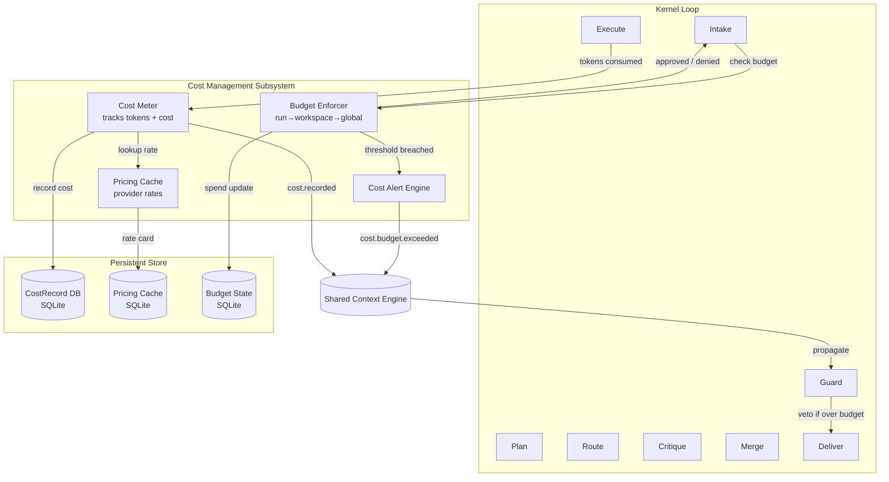

# Cost Management

> Specification for the Cost Management subsystem of the AI Development Operating System. This document is normative — implementations MUST satisfy every MUST clause below.

## Overview

Cost Management is a first-class subsystem of the AI Development Operating System (AI Dev OS). It participates in the Kernel's intake → plan → route → execute → critique → merge → guard → deliver loop and communicates exclusively through the [Shared Context Engine](./SHARED_CONTEXT_ENGINE.md). This document defines its purpose, contracts, invariants, and failure modes so that AI agents can reason about it without inspecting any implementation.

Cost Management tracks token usage across all [Model Providers](./MODEL_PROVIDERS.md), enforces budget constraints at run, workspace, and global tiers, caches pricing data for offline operation, and emits cost-accounted events to the Shared Context Engine for observability and audit.

## Goals

- Provide an authoritative, unambiguous specification for this subsystem.
- Define contracts, invariants, and acceptance criteria consumed by AI agents.
- Stay small enough to review, large enough to remove ambiguity.
- Track real-time cost accrual with sub-second granularity.
- Enforce budget limits before a run exceeds its allocation.
- Enable cost-aware routing decisions by the Kernel.

## Non-Goals

- Implementation code — this repository is documentation-only (see [AI Coding Rules](./AI_CODING_RULES.md)).
- Vendor-specific tuning beyond what [Model Providers](./MODEL_PROVIDERS.md) allows.
- Duplicating contracts that belong to another subsystem; link instead.
- Real-time billing or invoicing — cost records are inputs to external billing systems.
- Predicting future cost; only historical accrual and current-budget enforcement are in scope.

## Requirements

- **MUST** be consumable by both humans and AI agents.
- **MUST** publish every state change to the [Shared Context Engine](./SHARED_CONTEXT_ENGINE.md).
- **MUST** pass every rule enforced by the [Architecture Guardian](./ARCHITECTURE_GUARDIAN.md).
- **MUST** be observable through the metrics defined in [Observability](./OBSERVABILITY.md).
- **SHOULD** degrade gracefully rather than fail hard.
- **MAY** be extended via the [Plugin SDK](./PLUGIN_SDK.md) when the extension point is declared here.
- **MUST** record every token-consuming operation as a `CostRecord` within 1 second of completion.
- **MUST** enforce budget caps before dispatching a run — the check MUST be synchronous.
- **MUST** cache provider pricing data locally; a cache MISS MUST fall back to a default per-provider rate rather than blocking.
- **SHOULD** emit a `cost.budget.exceeded` SCE event at the moment enforcement triggers.
- **MUST** support per-model cost tables that override provider-level defaults.
- **MAY** expose a budget dry-run mode that logs hypothetical overruns without aborting.
- **MUST** reject any run whose estimated cost exceeds the remaining budget by more than 10%.
- **SHOULD** allow operators to set budget cascades via `config.toml` without restarting the Kernel.

## Architecture



The subsystem is stateless at the process boundary; all durable state lives in the [Persistent Memory](./PERSISTENT_MEMORY.md) tier and is projected on demand. The Cost Meter runs inline with the Execute phase; the Budget Enforcer runs synchronously at Intake. The Architecture Guardian receives cost events from the SCE and MAY veto delivery if final cost exceeds the allocated budget.

## Interfaces

### CostManager

```typescript
interface CostManager {
  /** Record a completed token-consuming operation. Returns the cumulative spend for the run. */
  recordCost(runId: string, record: CostRecord): Promise<CumulativeSpend>;

  /** Check whether a run can proceed given its estimated cost. Synchronous, non-blocking. */
  checkBudget(runId: string, estimatedCost: number): BudgetDecision;

  /** Return the current spend for a scope (run, workspace, or global). */
  getSpend(scope: CostScope): Promise<CumulativeSpend>;

  /** Refresh the pricing cache from provider APIs. Idempotent. */
  refreshPricing(): Promise<void>;

  /** Register a budget override that takes effect immediately. */
  setBudgetOverride(scope: CostScope, cap: number): void;

  /** Reset all counters for a given scope (used on run completion). */
  resetScope(scope: CostScope): Promise<void>;
}

type CostScope = { tier: 'run'; runId: string }
               | { tier: 'workspace'; workspaceId: string }
               | { tier: 'global' };

interface CostRecord {
  runId: string;
  provider: string;
  model: string;
  tokensIn: number;
  tokensOut: number;
  cachedTokensIn?: number;
  estimatedCost: number;          // in micro-USD (µ$)
  currency: string;               // "USD"
  recordedAt: string;             // ISO-8601
  correlationId: string;
}

interface CumulativeSpend {
  scope: CostScope;
  totalCost: number;              // µ$
  totalTokensIn: number;
  totalTokensOut: number;
  budgetCap: number;              // µ$, 0 = unlimited
  budgetRemaining: number;        // µ$
  isExceeded: boolean;
}

interface BudgetDecision {
  allowed: boolean;
  reason?: string;                // "budget_exceeded" | "ok"
  remainingBudget: number;        // µ$
  estimatedCost: number;          // µ$
}
```

### CostRecord Schema

| Column | Type | Description |
|---|---|---|
| `id` | TEXT (UUIDv7) | Primary key, time-sortable |
| `run_id` | TEXT (UUIDv7) | Foreign key to run |
| `workspace_id` | TEXT (UUIDv7) | Denormalized for scope queries |
| `provider` | TEXT | e.g. `"openai"`, `"anthropic"` |
| `model` | TEXT | e.g. `"gpt-4o"`, `"claude-4"` |
| `tokens_in` | INTEGER | Prompt tokens consumed |
| `tokens_out` | INTEGER | Completion tokens consumed |
| `cached_tokens_in` | INTEGER | Prompt tokens served from cache (provider-side) |
| `estimated_cost` | INTEGER | Cost in micro-USD (µ$) |
| `currency` | TEXT | ISO-4217 currency code |
| `recorded_at` | TEXT | ISO-8601 timestamp |
| `correlation_id` | TEXT | Propagated from Kernel |
| `budget_tier` | TEXT | Tier that was active at recording time |

Index: `(run_id, recorded_at)`, `(workspace_id, recorded_at)`, `(recorded_at)` for global rollup.

## Pricing Cache

Pricing data is cached locally to avoid blocking on provider API calls during cost accounting. The cache is refreshed on startup and every 5 minutes thereafter. Each entry represents a per-model rate card.

| Column | Type | Description |
|---|---|---|
| `provider` | TEXT | Provider identifier |
| `model` | TEXT | Model identifier |
| `input_rate` | INTEGER | µ$ per 1K input tokens |
| `output_rate` | INTEGER | µ$ per 1K output tokens |
| `cached_input_rate` | INTEGER | µ$ per 1K cached input tokens (if discounted) |
| `effective_at` | TEXT | ISO-8601 when this rate becomes active |
| `source` | TEXT | `"api"` | `"config"` | `"default"` |

The pricing cache uses the `sqlite` backend with TTL = 300 s and max_entries = 200. On MISS, the system applies the default rate from `config.toml` `[cost.default_rates.<provider>]`.

### Per-Provider Pricing Tables

Default rates (µ$ per 1K tokens) used when the pricing cache has not been refreshed:

| Provider | Model | Input Rate | Output Rate | Cached Input Rate |
|---|---|---|---|---|
| OpenAI | gpt-4o | 2,500 | 10,000 | 1,250 |
| OpenAI | gpt-4o-mini | 150 | 600 | 75 |
| OpenAI | gpt-4.1 | 2,000 | 8,000 | 1,000 |
| OpenAI | gpt-4.1-mini | 400 | 1,600 | 200 |
| OpenAI | gpt-4.1-nano | 100 | 400 | 50 |
| OpenAI | o3 | 10,000 | 40,000 | 5,000 |
| OpenAI | o4-mini | 1,100 | 4,400 | 550 |
| Anthropic | claude-4 | 3,000 | 15,000 | 300 |
| Anthropic | claude-4-sonnet | 3,000 | 15,000 | 300 |
| Anthropic | claude-3.5-sonnet | 3,000 | 15,000 | 300 |
| Anthropic | claude-3.5-haiku | 800 | 4,000 | 80 |
| Google | gemini-2.5-pro | 1,250 | 10,000 | 63 |
| Google | gemini-2.5-flash | 75 | 300 | 4 |
| Mistral | mistral-large-2 | 2,000 | 6,000 | 1,000 |
| Mistral | mistral-small-2 | 200 | 600 | 100 |
| Ollama | (any local) | 0 | 0 | 0 |

Rates are expressed as integer micro-USD (µ$) per 1,000 tokens. A rate of 0 indicates a free (local) model. These defaults SHALL be overridden by any value returned by the provider's pricing API when the cache is fresh.

## Budget Enforcement

### Budget Cascade

Budgets are evaluated hierarchically. The effective cap at any point is the minimum of all applicable tiers:

```
effective_cap = min(
    global_cap,
    workspace_cap[workspace_id],
    run_cap[run_id]
)
```

A run is rejected at intake if its estimated cost exceeds `effective_cap - current_spend`.

| Tier | Scope | Configuration Key | Default |
|---|---|---|---|
| Global | All runs across all workspaces | `[cost.budgets.global].monthly_cap_usd` | 10,000 USD |
| Workspace | All runs in a workspace | `[cost.budgets.workspaces.<id>].monthly_cap_usd` | 1,000 USD |
| Run | Single run execution | `[cost.budgets.run].max_cost_usd` | 5 USD |

### Budget Enforcement Algorithm

```
Algorithm: ENFORCE_BUDGET
Input: runId, estimatedCost (µ$)
Output: BudgetDecision

1.  spend_run   ← LOAD_SPEND(tier="run",   id=runId)
2.  spend_ws    ← LOAD_SPEND(tier="workspace", id=runs[runId].workspace_id)
3.  spend_global ← LOAD_SPEND(tier="global")

4.  cap_run     ← CONFIG["cost.budgets.run.max_cost_usd"] * 1_000_000
5.  cap_ws      ← CONFIG["cost.budgets.workspaces.<id>].monthly_cap_usd"] * 1_000_000
6.  cap_global  ← CONFIG["cost.budgets.global.monthly_cap_usd"] * 1_000_000

7.  remaining_run    ← cap_run    - spend_run.totalCost
8.  remaining_ws     ← cap_ws     - spend_ws.totalCost
9.  remaining_global ← cap_global - spend_global.totalCost

10. effective_remaining ← MIN(remaining_run, remaining_ws, remaining_global)

11. if estimatedCost > effective_remaining * 1.1:
12.     EMIT SCE event "cost.budget.exceeded"
13.     return { allowed: false, reason: "budget_exceeded",
14.              remainingBudget: effective_remaining,
15.              estimatedCost: estimatedCost }
16. else:
17.     RESERVE estimatedCost in pending_reservations[runId]
18.     return { allowed: true, remainingBudget: effective_remaining,
19.              estimatedCost: estimatedCost }

20. On run completion:
21.     actual ← SUM(cost_records WHERE run_id = runId)
22.     reserved ← pending_reservations[runId]
23.     CREDIT_BACK MAX(0, reserved - actual) to each tier
```

Line 12 reserves the estimated cost to prevent concurrent runs in the same workspace from over-spending. On completion, unused reservation is credited back. The 1.1 multiplier (line 11) provides a 10% overage tolerance before rejecting.

### Budget Reset Policy

- **Monthly**: Global and workspace budgets reset at midnight UTC on the 1st of each month.
- **Per-run**: Run budgets reset when the run completes or is aborted.
- **Manual**: An operator MAY reset any scope via the Admin API; this MUST be logged to the [Audit Log](./AUDIT_LOG.md).

## Failure Modes

| Failure | Cause | Effect | Mitigation | SCE Event |
|---|---|---|---|---|
| Budget exceeded | Run cost > remaining cap | Run rejected at intake or delivery vetoed | Alert operator; reduce estimated cost or increase cap | `cost.budget.exceeded` |
| Pricing cache miss | Rate not in cache and provider API unavailable | Falls through to default config rate | Maintain accurate defaults in `config.toml` | `cost.pricing.cache_miss` |
| Cost meter drift | Lost SCE event or process crash during recording | Cumulative spend under-reported | Reconcile from CostRecord DB on startup; replay missed events | `cost.meter.drift_detected` |
| Concurrent spend race | Two runs in same workspace check budget simultaneously | Combined spend exceeds cap by up to one run's cost | Use optimistic reservation (line 17 of algorithm) with workspace-level mutex | `cost.budget.race_detected` |
| Pricing API rate-limited | Provider pricing endpoint throttles caller | Pricing cache not refreshed; stale rates used | Exponential backoff; reduce refresh frequency | `cost.pricing.refresh_failed` |
| Integer overflow | Cumulative spend exceeds 2^53 µ$ (~9,007 M USD) | Spend calculation wraps or saturates | Use BigInt for cumulative counters; saturate at MAX_SAFE_SPEND | `cost.meter.overflow` |
| Budget config invalid | Malformed TOML or negative cap value | Budget enforcement uses defaults | Validate on config load; reject malformed values | `cost.budget.config_invalid` |

Every failure emits a structured event on the Shared Context Engine and is recorded in the [Audit Log](./AUDIT_LOG.md). Degradation is preferred over hard failure whenever safety permits.

## Security Considerations

- **Trust boundary**: Cost records cross between subsystems only through signed envelopes (see [Security Model](./SECURITY_MODEL.md)). Any agent or plugin writing to the CostRecord table MUST authenticate via a subsystem-scoped token.
- **Budget tampering**: Direct mutation of the budget state database MUST require operator-level credentials. Run-scoped agents MUST NOT be able to increase their own budget cap.
- **Pricing cache poisoning**: The pricing cache is populated from two sources: provider APIs (authenticated via TLS) and local config (owned by the operator). The cache MUST validate that `input_rate`, `output_rate`, and `cached_input_rate` are non-negative integers. Any value exceeding a configurable ceiling (`[cost.pricing].max_rate_micro_usd`, default 1,000,000) MUST be rejected and logged.
- **Side-channel via cost timing**: The synchronous `checkBudget()` call runs in constant time (O(1)) to prevent timing side-channels that could leak remaining budget.
- **Audit trail**: Every budget override, reset, or config change is recorded in the [Audit Log](./AUDIT_LOG.md) with `actor`, `action`, `old_value`, and `new_value`.
- **Secrets**: Provider API keys for pricing endpoints are read from [Secrets Management](./SECRETS_MANAGEMENT.md); never inlined in config.
- All external calls go through [Model Providers](./MODEL_PROVIDERS.md) or the [Plugin SDK](./PLUGIN_SDK.md) — no ad-hoc network access.

## Observability

All metrics, traces, and logs conform to [Observability](./OBSERVABILITY.md), [Tracing](./TRACING.md), and [Logging](./LOGGING.md). Every run carries a `correlation_id` propagated from the Kernel.

### Metrics

| Metric Name | Type | Labels | Description |
|---|---|---|---|
| `cost.spend.total` | Counter | `provider`, `model`, `tier` | Cumulative spend in µ$ |
| `cost.spend.per_run` | Gauge | `run_id`, `workspace_id` | Current spend of active run |
| `cost.budget.remaining` | Gauge | `tier`, `scope_id` | Remaining budget in µ$ |
| `cost.budget.exceeded_total` | Counter | `tier`, `workspace_id` | Count of enforcement rejections |
| `cost.records.total` | Counter | `provider`, `model` | Count of cost records written |
| `cost.pricing.cache_hit_ratio` | Histogram | `provider` | Pricing cache hit rate (0–1) |
| `cost.pricing.refresh_duration_ms` | Histogram | `provider` | Time to refresh pricing cache |
| `cost.meter.lag_seconds` | Gauge | — | Max delay between token consumption and record creation |
| `cost.reservation.pending` | Gauge | `workspace_id` | Sum of pending reservations |
| `cost.records_batch_size` | Histogram | — | Number of records written per flush |

## Acceptance Criteria

1. **CostRecord accuracy**: For every token-consuming operation, a corresponding `CostRecord` appears in the database within 1 second (measured via `cost.meter.lag_seconds`).
2. **Budget enforcement**: A run whose estimated cost exceeds the effective cap by more than 10% MUST receive `{ allowed: false }`.
3. **Budget cascade**: Setting `global_cap = 100`, `workspace_cap = 50`, `run_cap = 10` results in effective cap = min(100, 50, 10) = 10 for that run.
4. **Pricing cache fallback**: When the pricing API is unreachable, the system uses default rates from config and emits a `cost.pricing.cache_miss` event.
5. **Concurrent budget safety**: Two runs starting simultaneously in the same workspace MUST NOT both be allowed if their combined estimated cost exceeds the workspace cap.
6. **Idempotent recording**: Replaying the same cost record (same `id`) MUST NOT double-count the spend.
7. **Budget reset**: Monthly budgets reset to their full value at midnight UTC on the 1st. Per-run budgets reset on run completion.
8. **Pricing ceiling**: A pricing API response with `input_rate > max_rate_micro_usd` is rejected and logged; the subsystem falls back to the cached or default rate.
9. **Security**: A run-scoped agent attempting to write to the budget state table receives a permission-denied error.

All acceptance criteria are testable via the [Eval Harness](./EVAL_HARNESS.md). A change to this document requires a matching update to any dependent doc listed in *Related Documents*.

## Open Questions

- _Track open questions as ADRs under [templates/ADR](../templates/ADR.md)._

## Related Documents

- [System Overview](./SYSTEM_OVERVIEW.md)
- [Main AI Kernel](./MAIN_AI_KERNEL.md)
- [Caching Strategy](./CACHING_STRATEGY.md) — pricing cache backend details
- [Rate Limiting](./RATE_LIMITING.md) — cost-aware rate limiting
- [Model Providers](./MODEL_PROVIDERS.md) — provider-specific rate cards
- [Data Retention](./DATA_RETENTION.md) — cost record retention policy
- [Encryption](./ENCRYPTION.md) — cost record encryption at rest
- [Prd](./PRD.md)
- [Trd](./TRD.md)
- [Architecture Guardian](./ARCHITECTURE_GUARDIAN.md)
