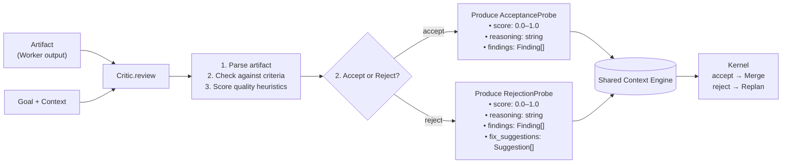

# Critic

> Stage 5 of the Kernel loop — reviews all artifact output from Dynamic Workers and issues an **accept** or **reject** verdict. This document is normative — implementations MUST satisfy every MUST clause below.

## Overview

The Critic is the quality gate of the AI Dev OS Kernel loop. After workers produce artifacts (code, prose, configurations, or other structured output), the Critic evaluates them against the task's acceptance criteria, the project's AI Coding Rules, and a set of quality heuristics. The Critic does not produce artifacts — it produces **verdicts** that the Kernel uses to decide whether to proceed to Merge or to loop back to Planning for correction.

The Critic is distinct from the [Architecture Guardian](./ARCHITECTURE_GUARDIAN.md): the Guardian enforces structural invariants (must not delete critical files, must not bypass the SCE), while the Critic evaluates functional quality (does the artifact address the goal? is it coherent? are there obvious bugs?).

## Goals

- Single-method surface: `Critic.review(artifact, goal, context)` → `Verdict`.
- Accept/reject verdict with structured reasons and severity for each finding.
- Every verdict is auditable: all review input and output is published to the SCE and Audit Log.
- Verdicts are actionable: the Planner can use the Critic's findings to correct specific issues.
- Configurable strictness per run, per group, or per artifact kind (code vs. prose vs. config).

## Non-Goals

- Implementing the review logic — this is the domain of the model assigned to the Critic role via the [Nine Router](./NINE_ROUTER.md).
- Enforcing structural code invariants — this belongs to the [Architecture Guardian](./ARCHITECTURE_GUARDIAN.md).
- Producing or editing artifacts — the Critic is read-only; it returns verdicts only.
- Implementation code — this repository is documentation-only (see [AI Coding Rules](./AI_CODING_RULES.md)).

## Architecture



## Verdict Schema

```typescript
interface Verdict {
  verdict: "accept" | "reject";
  confidence: number;      // 0.0–1.0; how certain the Critic is
  reasoning: string;       // natural-language summary
  findings: Finding[];
  fix_suggestions?: Suggestion[];  // present only on reject
  metadata: {
    model: string;         // which model produced this verdict
    tokens_used: number;
    latency_ms: number;
    correlation_id: string;
  };
}

interface Finding {
  severity: "critical" | "major" | "minor" | "info";
  category: "correctness" | "completeness" | "style" | "safety" | "security";
  description: string;
  location?: {             // optional — points to artifact line/range
    file?: string;
    line_start?: number;
    line_end?: number;
  };
}

interface Suggestion {
  description: string;     // what to change
  rationale: string;       // why the change improves the artifact
  priority: "high" | "medium" | "low";
}
```

## Review Protocol

The Kernel invokes the Critic after Dynamic Workers complete their tasks:

```
1. Kernel: critic.review(artifact, goal, context) → Promise<Verdict>
2. Critic publishes "critic.review.started" event on SCE topic `critic.<run_id>`
3. Critic assigns the model (via Nine Router) and invokes the review
4. Critic publishes "critic.review.completed" event with full Verdict on SCE
5. If verdict is "reject" with confidence > 0.8: Kernel replans
6. If verdict is "reject" with confidence ≤ 0.8: Kernel MAY request re-review with a different model
7. If verdict is "accept": Kernel proceeds to Merge
```

## Re-review Policy

| Condition | Action |
|-----------|--------|
| Reject with confidence > 0.9 | Immediate replan — high-confidence rejection |
| Reject with confidence 0.7–0.9 | Auto re-review with alternate model assigned |
| Reject with confidence < 0.7 | Pass to human-in-the-loop if available; otherwise accept with degraded confidence |
| Two consecutive rejects on same artifact | Escalate to human; emit `critic.escalation_needed` event |

## Quality Heuristics

The Critic SHOULD evaluate artifacts against these heuristics (non-exhaustive):

| Heuristic | Applies to | Typical severity if violated |
|-----------|-----------|------------------------------|
| Addresses the stated goal | All artifacts | critical |
| No logical contradictions | All artifacts | major |
| Follows project AI Coding Rules | Code | critical |
| Handles error cases gracefully | Code, Config | major |
| No hardcoded secrets or credentials | Code, Config | critical |
| All referenced files/paths exist | Code | major |
| Consistent naming conventions | Code | minor |
| Appropriate test coverage | Code | major |
| Documentation matches implementation | Code | minor |
| No obvious security vulnerabilities | Code, Config | critical |

## Requirements

- **MUST** implement the `Critic.review(artifact, goal, context)` → `Verdict` interface.
- **MUST** publish `critic.review.started` and `critic.review.completed` events on the SCE.
- **MUST** record every verdict in the [Audit Log](./AUDIT_LOG.md).
- **MUST** propagate the Kernel run's `correlation_id` through every event and verdict.
- **MUST** reject artifacts that violate [AI Coding Rules](./AI_CODING_RULES.md) at severity "critical".
- **MUST** include `fix_suggestions` on any `reject` verdict with confidence ≥ 0.7.
- **SHOULD** assign a model via the [Nine Router](./NINE_ROUTER.md) for each review, using the `critic` role.
- **SHOULD** respect the `strictness` configuration parameter (default: `normal`).
- **MAY** delegate review of different artifact sections to different models.
- **MAY** request re-review from a different model on low-confidence rejections.

## Failure Modes

| Mode | Detection | Response |
|------|-----------|----------|
| Critic model unavailable | Nine Router returns no binding for `critic` role | Skip review (accept); emit `critic.model_unavailable` warning |
| Review timeout (> 120 s) | Wall-clock timeout | Return accept with degraded confidence; emit `critic.timeout` |
| Incoherent verdict | Verdict with confidence < 0.3 | Re-review; if still low, escalate to human |
| Verdict exceeds tokens | Response exceeds max tokens | Truncate findings; preserve verdict and reasoning |
| Infinite review loop | Same artifact rejected > 3 times | Break loop; escalate to human; emit `critic.loop_detected` |

## Observability

| Metric | Labels | Description |
|--------|--------|-------------|
| `critic_review_total` | `verdict`, `model` | Reviews by verdict and model |
| `critic_review_seconds` | `model` | Review latency per model |
| `critic_finding_total` | `severity`, `category` | Findings by severity and category |
| `critic_loop_break_total` | — | Times the infinite-review-loop breaker activated |
| `critic_skip_total` | `reason` | Reviews skipped (model unavailable, timeout) |

Traces: one span per `critic.review` call, with child spans for model invocation and finding extraction.

## Examples

### Example 1: Correct Code Generation — Accepted

**Artifact:** A Rust function implementing merge sort with proper error handling, tests, and documentation.

**Goal:** "Implement merge_sort for Vec<T: Ord> with O(n log n) complexity."

**Verdict:**
```json
{
  "verdict": "accept",
  "confidence": 0.94,
  "reasoning": "Artifact fully addresses the goal. Merge sort correctly implemented with O(n log n). Edge cases (empty, single-element) handled. Tests cover all branches. Doc comments are clear.",
  "findings": [
    { "severity": "info", "category": "style", "description": "Function body exceeds 50 lines; consider splitting the merge helper." }
  ],
  "metadata": { "model": "claude-sonnet-4", "tokens_used": 1240, "latency_ms": 3400 }
}
```

**Outcome:** Accepted. Passed to Merge Manager with info-level style hint.

### Example 2: Security Vulnerability — Rejected

**Artifact:** A Python API handler that concatenates user input directly into a SQL query.

**Goal:** "Create a GET /users endpoint that returns user data by ID."

**Verdict:**
```json
{
  "verdict": "reject",
  "confidence": 0.98,
  "reasoning": "Critical SQL injection vulnerability: user-supplied ID interpolated directly into SQL. Violates AI Coding Rule P3 (security). Must use parameterized queries.",
  "findings": [
    { "severity": "critical", "category": "security", "description": "SQL injection in get_user_by_id(): f\"SELECT * FROM users WHERE id = {user_id}\"" }
  ],
  "fix_suggestions": [
    { "description": "Replace f-string with parameterized query: cursor.execute('SELECT * FROM users WHERE id = ?', (user_id,))", "rationale": "Parameterized queries prevent SQL injection by separating query structure from data.", "priority": "high" }
  ],
  "metadata": { "model": "claude-sonnet-4", "tokens_used": 980, "latency_ms": 2800 }
}
```

**Outcome:** Rejected. Kernel replanned. Builder resubmitted with parameterized query; second review passed.

### Example 3: Incomplete Implementation — Rejected

**Artifact:** A TypeScript token-bucket rate limiter class — missing refill logic.

**Goal:** "Implement a token bucket rate limiter with configurable refill rate and capacity."

**Verdict:**
```json
{
  "verdict": "reject",
  "confidence": 0.87,
  "reasoning": "Artifact is incomplete: token bucket has no refill mechanism. consume() decrements tokens but tokens are never replenished, causing all requests to fail after capacity exhausted. Violates goal of 'configurable refill rate'.",
  "findings": [
    { "severity": "major", "category": "completeness", "description": "Missing refill() method or scheduled refill logic. Token count monotonically decreases." },
    { "severity": "minor", "category": "correctness", "description": "No handling for negative tokens in consume() when tokens are 0." }
  ],
  "fix_suggestions": [
    { "description": "Add a refill() method that increases tokens by rate on a timer or per consume() call based on elapsed time.", "rationale": "Without replenishment the rate limiter stops working after the first burst.", "priority": "high" }
  ],
  "metadata": { "model": "gpt-4o", "tokens_used": 1450, "latency_ms": 4100 }
}
```

**Outcome:** Rejected. Builder added refill logic and resubmitted. Second review passed.

## Acceptance Criteria

- Calling `critic.review(malformed_artifact, goal, context)` with a known-bad artifact returns `{ verdict: "reject", findings: [...], fix_suggestions: [...] }`.
- Calling `critic.review(clean_artifact, goal, context)` with a correct artifact returns `{ verdict: "accept", confidence: ≥ 0.8 }`.
- After every `critic.review` call, a `critic.review.completed` event appears on the SCE topic `critic.<run_id>`.
- An artifact that violates an AI Coding Rule at severity "critical" is always rejected.
- The same artifact reviewed by two different Critic models produces the same terminal verdict (accept/reject) for outcomes where confidence ≥ 0.8 in both models.

- Calling `critic.review(malformed_artifact, goal, context)` with a known-bad artifact returns `{ verdict: "reject", findings: [...], fix_suggestions: [...] }`.
- Calling `critic.review(clean_artifact, goal, context)` with a correct artifact returns `{ verdict: "accept", confidence: ≥ 0.8 }`.
- After every `critic.review` call, a `critic.review.completed` event appears on the SCE topic `critic.<run_id>`.
- An artifact that violates an AI Coding Rule at severity "critical" is always rejected.
- The same artifact reviewed by two different Critic models produces the same terminal verdict (accept/reject) for outcomes where confidence ≥ 0.8 in both models.

## Related Documents

- [Main AI Kernel](./MAIN_AI_KERNEL.md) — Kernel loop that invokes the Critic
- [Architecture Guardian](./ARCHITECTURE_GUARDIAN.md) — structural invariant enforcement
- [Dynamic Workers](./DYNAMIC_WORKERS.md) — artifact producers
- [Merge Manager](./MERGE_MANAGER.md) — consumer of accepted artifacts
- [Shared Context Engine](./SHARED_CONTEXT_ENGINE.md) — event bus for review events
- [Nine Router](./NINE_ROUTER.md) — model assignment for the Critic role
- [AI Coding Rules](./AI_CODING_RULES.md) — rules enforced during review
- [Audit Log](./AUDIT_LOG.md) — verdict persistence
- [System Overview](./SYSTEM_OVERVIEW.md)
