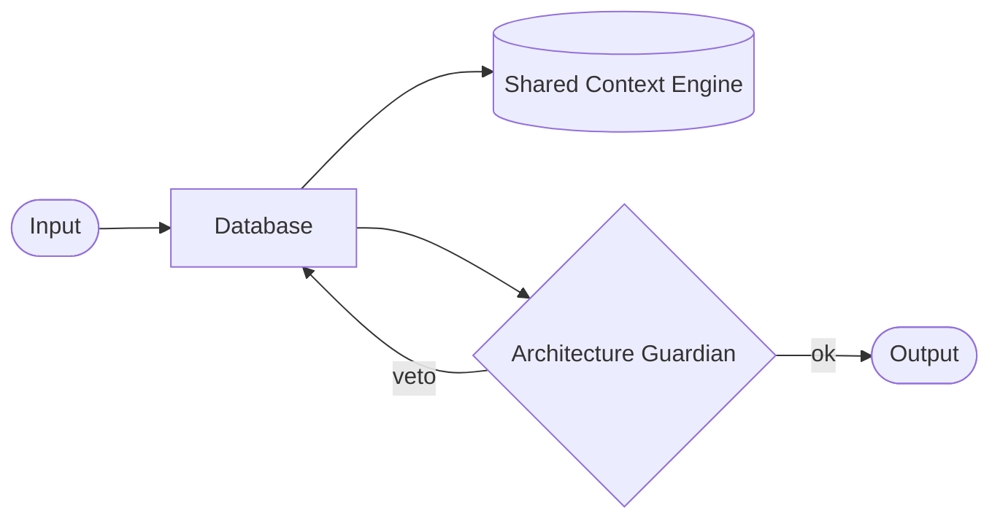

# Database

> Specification for the persistence layer for context, memory, and audit. This document is normative — implementations MUST satisfy every MUST clause below.

## Overview

Database is a first-class subsystem of the AI Development Operating System (AI Dev OS). It participates in the Kernel's intake → plan → route → execute → critique → merge → guard → deliver loop and communicates exclusively through the [Shared Context Engine](./SHARED_CONTEXT_ENGINE.md). This document defines its purpose, contracts, invariants, and failure modes so that AI agents can reason about it without inspecting any implementation.

## Goals

- SQLite for local, Postgres for remote, same schema.
- Every table has a retention policy.
- Migrations are forward-only and reviewed.

## Non-Goals

- Implementation code — this repository is documentation-only (see [AI Coding Rules](./AI_CODING_RULES.md)).
- Vendor-specific tuning beyond what [Model Providers](./MODEL_PROVIDERS.md) allows.
- Duplicating contracts that belong to another subsystem; link instead.

## Requirements

- **MUST** be consumable by both humans and AI agents.
- **MUST** publish every state change to the [Shared Context Engine](./SHARED_CONTEXT_ENGINE.md).
- **MUST** pass every rule enforced by the [Architecture Guardian](./ARCHITECTURE_GUARDIAN.md).
- **MUST** be observable through the metrics defined in [Observability](./OBSERVABILITY.md).
- **SHOULD** degrade gracefully rather than fail hard.
- **MAY** be extended via the [Plugin SDK](./PLUGIN_SDK.md) when the extension point is declared here.

## Architecture

The subsystem is stateless at the process boundary; all durable state lives in the [Persistent Memory](./PERSISTENT_MEMORY.md) tier and is projected on demand.

## Interfaces

- SQL migrations under `migrations/` in the implementation repo.

All interfaces follow the envelope defined in [Agent Communication](./AGENT_COMMUNICATION.md) and the error contract defined in [API Spec](./API_SPEC.md).

## Data Model

- Core tables: `runs`, `tasks`, `events`, `memory`, `models`, `assignments`, `audit`.

Retention and encryption rules are inherited from [Data Retention](./DATA_RETENTION.md) and [Encryption](./ENCRYPTION.md).

## Failure Modes

- Migration failure → rollback, alert, block deploys.

Every failure emits a structured event on the Shared Context Engine and is recorded in the [Audit Log](./AUDIT_LOG.md).

## Security Considerations

- Trust boundary: crosses only through signed envelopes (see [Security Model](./SECURITY_MODEL.md)).
- Secrets are read from [Secrets Management](./SECRETS_MANAGEMENT.md); never inlined.
- All external calls go through [Model Providers](./MODEL_PROVIDERS.md) or the [Plugin SDK](./PLUGIN_SDK.md) — no ad-hoc network access.

## Observability

- Metrics, traces, and logs conform to [Observability](./OBSERVABILITY.md), [Tracing](./TRACING.md), and [Logging](./LOGGING.md).
- Every run carries a `correlation_id` propagated from the Kernel.

## Acceptance Criteria

- The contracts above are testable via the [Eval Harness](./EVAL_HARNESS.md).
- A change to this document requires a matching update to any dependent doc listed in *Related Documents*.

## Open Questions

- _Track open questions as ADRs under [templates/ADR](../templates/ADR.md)._

## Related Documents

- [Persistent Memory](./PERSISTENT_MEMORY.md)
- [Audit Log](./AUDIT_LOG.md)
- [Backup Strategy](./BACKUP_STRATEGY.md)
- [Migration Guide](./MIGRATION_GUIDE.md)
- [System Overview](./SYSTEM_OVERVIEW.md)
- [Main Ai Kernel](./MAIN_AI_KERNEL.md)
- [Architecture Guardian](./ARCHITECTURE_GUARDIAN.md)
