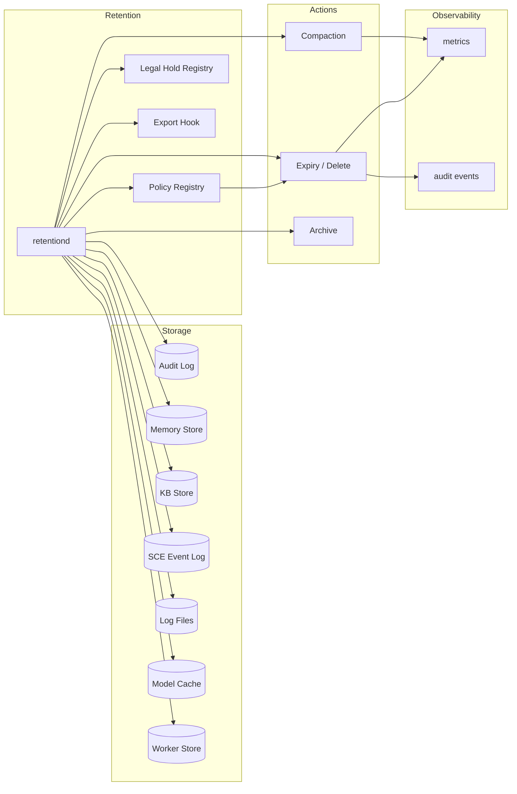

# Data Retention Subsystem

**Component ID:** `infra.retention` **Version:** 1.0.0 **Updated:** 2026-07-22

---

## 1. Overview

AI Dev OS manages data lifecycle through a unified retention subsystem. Every data kind — audit events, memory records, knowledge-base entries, agent checkpoints, SCE events, log files, and cached models — passes through a common pipeline that enforces configurable TTLs, compaction strategies, export hooks, and legal-hold gates.

A background daemon (`retentiond`) runs a daily reconciliation loop. It scans storage backends, applies policy filters, and executes expiry, compaction, archival, or hard-delete actions. This scanning approach keeps the write path fast and decouples application logic from retention concerns.

---

## 2. Goals

| Goal | Mechanism |
|------|-----------|
| Configurable retention per data kind | Policy registry keyed by `DataKind` with TTL, action, and export flag |
| Automated expiry | `RetentionJob` every 24h; filter-expire-clean per kind |
| Compaction of event logs | SCE topics use LWW compaction; KV stores merge old versions |
| Export before delete | Optional pre-delete hook serialises records to cold storage |
| Compliance-ready | Legal hold API, audit trail on every deletion, dry-run preview |
| Operational safety | Failure modes isolated per kind; metrics alert on drift |

---

## 3. Architecture



The loop runs four phases per kind: **Filter** records where `created_at < (now - ttl)` and not under hold → **Export** if configured → **Act** (delete/compact/prune) → **Audit**.

---

## 4. Data Classification & Retention Policies

| Data Kind | TTL | Action | Export | Rationale |
|-----------|-----|--------|--------|-----------|
| `audit.events` | Forever | — | — | Immutable compliance record |
| `security.events` | Forever | — | — | Regulatory requirement |
| `kb.global` | Forever | — | — | Authoritative knowledge base |
| `kb.main` | Forever | — | — | Core reference material |
| `kb.group` | 90d | Delete | Yes | Group context has bounded relevance |
| `kb.individual` | 7d | Delete | Yes | Per-user sessions short-lived |
| `sce.run.*` | 90d → Compact | LWW | — | Run traces summarised |
| `sce.other` | 30d | Delete | No | Transient event types |
| `memory.facts` | Forever | — | — | Permanent agent memory |
| `memory.decisions` | Forever | — | — | Agent reasoning audit trail |
| `memory.checkpoints` | 7d | Delete | Yes | Stale agent snapshots |
| `memory.error_traces` | 30d | Delete | No | Diagnostic value degrades |
| `worker.checkpoints` | 7d | Delete | No | Ephemeral progress state |
| `postmortem` | 90d | Delete | Yes | Incident analysis window |
| `research.artifacts` | 30d | Delete | Yes | Cached web research |
| `log.files` | 14d | Rotate | No | Daily rotation, 14 copies |
| `model.cache` | 10m | Evict | — | LRU eviction under memory pressure also active |

Policies are defined in `etc/retention/policies.yaml` and hot-reloaded on SIGHUP:

```yaml
kinds:
  kb.group:
    ttl: 90d; action: delete; export_before_delete: true
    export_path: /mnt/cold-storage/exports/kb-group/
  model.cache:
    ttl: 10m; action: evict; evict_strategy: lru
```

---

## 5. RetentionJob — Daily Expiry Cycle

Runs at 02:00 UTC daily with a 3600s timeout. Idempotent — stragglers are caught next cycle.

```
for each kind in PolicyRegistry:
    if kind.ttl is "forever" → skip

    candidates = query(kind, filter: created_at < now - kind.ttl,
                       not_on_legal_hold: true, limit: 10_000)

    if kind.export_before_delete:
        export(candidates, kind.export_path)
        emit audit: retention.exported{kind, count}

    delete(candidates)
    emit audit: retention.deleted{kind, count, duration_ms}
    emit metric: retention.expired_records{kind} += count
```

Kinds are processed in dependency order (children before parents) defined in `etc/retention/ordering.conf`.

---

## 6. Compaction

**SCE topics (`sce.run.*`)** use last-writer-wins compaction. Each event carries a `run_id` and monotonic `sequence`. The pass groups by `run_id`, retains only the max-`sequence` event per group, and rewrites the partition. Runs weekly (Sunday 03:00 UTC).

**KV stores (`memory.*`)** merge multiple versions of the same key into one record with the latest value and merged `updated_at`. Tombstones are purged after 7d.

---

## 7. Export Before Delete

Records are serialised as newline-delimited JSON to `{export_path}/{date}/batch-N.ndjson` before deletion. A `MANIFEST.json` in each date directory records count, byte size, time range, and SHA-256 checksum. Exports are append-only and immutable.

---

## 8. Legal Hold

Holds prevent deletion of records matching a filter, even past TTL. Defined in `LegalHoldRegistry`:

```json
{"id": "lh-001", "kind": "memory.facts",
 "filter": {"tags": {"$contains": "project-x"}},
 "created_by": "operator@example.com", "active": true}
```

A record matching any active hold is excluded from expiry. Holds can be deactivated but never deleted — deactivation is audited. An empty filter means "hold all records of this kind."

---

## 9. Interfaces

```python
def retention_policy(kind: DataKind) -> RetentionPolicy
    # Active policy for *kind*; raises KeyError if unregistered.

def retention_set_policy(kind: DataKind, policy: RetentionPolicy) -> None
    # Update policy at runtime. Persisted; takes effect next cycle.

def retention_legal_hold_add(kind, filter, description, created_by) -> LegalHoldID
    # Register a legal hold. Requires operator role.

def retention_legal_hold_remove(hold_id: LegalHoldID) -> None
    # Deactivate hold. Record preserved; active→false.

def retention_legal_hold_list(active_only=True) -> list[LegalHold]

def retention_dry_run(kind: DataKind) -> ExpiryPreview
    # Preview next-cycle deletions: count, oldest, newest, total_bytes, sample_ids.
    # Does not modify data.
```

---

## 10. Failure Modes

| Scenario | Effect | Mitigation |
|----------|--------|------------|
| Storage unreachable | Job fails for that kind only | Per-kind timeout; 3 retries with backoff |
| Export path full | Deletion **skipped** | Disk-pressure check; alert at 90% |
| Policy file malformed | Daemon fails to start | Validate on startup; fall back to last good config |
| Legal hold registry corrupt | All holds inactive | Logged CRITICAL; restore from backup |
| Compaction on active topic | Data loss on concurrent write | Run on read-replica; swap after success |
| Batch exceeds memory | OOM on large kind | Cursor pagination at 10K records/batch |
| TTL = 0 | Immediate deletion of all records | Validation rejects ttl < 1m for delete actions |

---

## 11. Security

**Retention bypass audit** — Any manual deletion outside `retentiond` emits `audit.retention_bypass` to the SIEM pipeline: `{kind, record_ids, actor, reason, timestamp}`.

**Legal hold authorization** — Add/remove requires **operator** role. Viewing requires **observer**. The hold audit trail is immutable.

**Policy modification** — `retention_set_policy` requires **admin** role. `policies.yaml` is writeable only by `root` and `ops` accounts.

---

## 12. Observability

**Metrics** (exposed on `:9100/metrics`):

| Metric | Type | Labels | Description |
|--------|------|--------|-------------|
| `retention_expired_records_total` | Counter | `kind` | Cumulative deletions |
| `retention_exported_bytes_total` | Counter | `kind` | Cumulative bytes exported |
| `retention_job_duration_seconds` | Histogram | `kind` | Per-kind job duration |
| `retention_compaction_duration_seconds` | Histogram | `topic` | Compaction pass duration |
| `retention_holds_active` | Gauge | — | Active legal holds |
| `retention_policy_drift` | Gauge | `kind` | Drift between oldest undeleted record and `now - ttl` |
| `retention_disk_pressure` | Gauge | `path` | Export path usage ratio |

**Alerts:** `RetentionJobFailed` (warning), `RetentionPolicyDriftHigh > 3600s` (critical), `RetentionDiskPressure > 0.9` (critical), `RetentionLegalHoldCorrupt` (critical).

---

## 13. Acceptance Criteria

1. A record inserted at `T` is deleted after `T + policy.ttl` passes.
2. After SCE compaction, only the last event per `run_id` remains.
3. `MANIFEST.json` checksum matches the corresponding `.ndjson` batch.
4. A record under legal hold is **not** deleted, even 30+ days past TTL.
5. `retention_dry_run("kb.group")` returns the exact count and IDs the next cycle would delete.
6. Manual deletion emits `audit.retention_bypass`.
7. SIGHUP applies policy changes within 60s without restart.
8. SCE store failure does not prevent `kb.group` expiry from completing.

---

## 14. Related Documents

| Document | Description |
|----------|-------------|
| `docs/PERSISTENT_MEMORY.md` | Memory store schema, upsert semantics, versioning |
| `docs/AUDIT_LOG.md` | Audit event schema, query patterns, SIEM integration |
| `docs/SHARED_CONTEXT_ENGINE.md` | SCE topics, partitioning, LWW compaction |
| `docs/KNOWLEDGE_SYSTEM.md` | KB hierarchy and ingestion |
| `docs/ARCHITECTURE_GUARDIAN.md` | Cross-cutting architectural rules and invariants |
| `docs/NINE_ROUTER.md` | Request routing, tenant isolation, rate limiting |
| `etc/retention/policies.yaml` | Active policy definitions |
| `etc/retention/ordering.conf` | Kind processing order |
