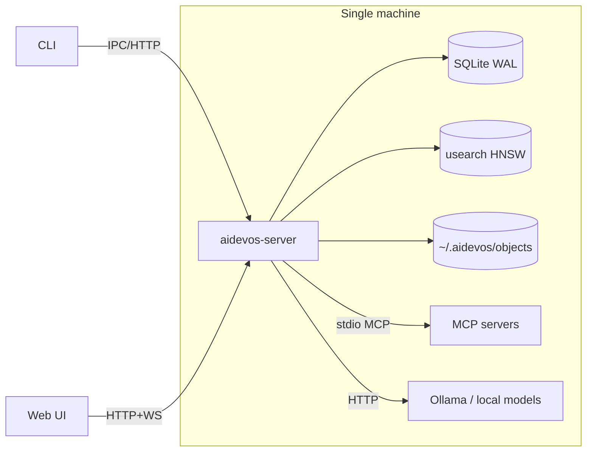
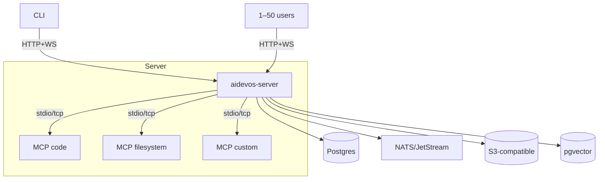
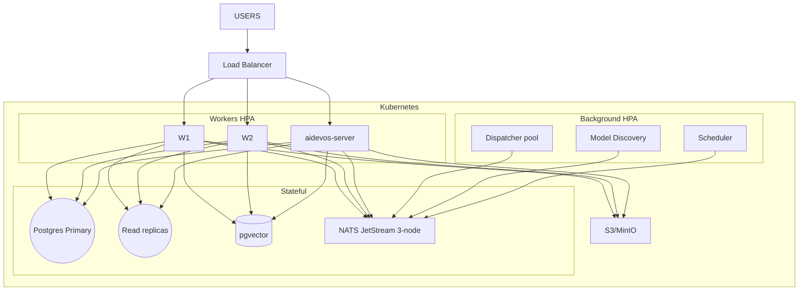

# Deployment

> Deployment topology, infrastructure, and operational procedures for the AI Dev OS runtime. This document is normative — implementations MUST satisfy every MUST clause below.

## Overview

AI Dev OS is designed **local-first**: a single-machine installation runs the entire stack with SQLite and zero cloud dependencies. Two optional modes layer on Postgres, NATS, S3, and Kubernetes for teams that need shared state, multi-tenancy, or elastic compute.

| Mode | Users | Data store | SCE backend | Vector | Objects | Orchestration |
|------|-------|-----------|-------------|--------|---------|---------------|
| Local | 1 | SQLite | SQLite WAL | usearch | Local FS | None |
| Single-server | 1–50 | Postgres | Postgres + NATS | pgvector | S3 | Systemd / Docker |
| Multi-server | 50+ | Postgres cluster | NATS JetStream | pgvector cluster | S3 | Kubernetes |

## Local Mode

A single `aidevos-server` binary starts every subsystem in-process.



Data directory: `~/.aidevos/` with `config.toml`, `db.sqlite` (WAL mode), `objects/`, `plugins/`. SQLite uses `PRAGMA synchronous = NORMAL`; usearch runs in-process with configurable HNSW parameters.

## Single-Server Mode

One machine runs `aidevos-server` with Postgres replacing SQLite. NATS provides the SCE event bus for real-time subscriptions. MCP servers run as sidecar processes.



Migration from SQLite: `aidevos-server doctor --pre-migration-check` → `aidevos-server migrate export --format=pg_dump` → `aidevos-server migrate up`. Vector data is rebuilt from stored embeddings.

## Multi-Server Mode

Multiple `aidevos-server` instances behind a load balancer with NATS JetStream as the SCE backbone and Kubernetes for orchestration.



## Container Images

```dockerfile
FROM node:22-slim AS builder
WORKDIR /app
COPY package.json package-lock.json ./
RUN npm ci && npm run build && npm prune --production

FROM gcr.io/distroless/nodejs22-debian12:nonroot
WORKDIR /app
COPY --from=builder /app/dist ./dist
COPY --from=builder /app/node_modules ./node_modules
EXPOSE 7700
HEALTHCHECK CMD ["node", "dist/bin/healthcheck.js"]
CMD ["dist/bin/server.js"]
```

Alternative bases: `node:22-slim` (~250 MB, dev) or distroless (~120 MB, production). Rust builds use `gcr.io/distroless/cc-debian12:nonroot` (~25 MB).

## Kubernetes Manifests

```yaml
apiVersion: apps/v1
kind: Deployment
metadata:
  name: aidevos-server
spec:
  replicas: 3
  strategy:
    type: RollingUpdate
    rollingUpdate:
      maxUnavailable: 1
      maxSurge: 1
  template:
    spec:
      containers:
      - name: server
        image: aidevos/server:latest
        ports:
        - containerPort: 7700
          name: http
        - containerPort: 7701
          name: metrics
        envFrom:
        - secretRef:
            name: aidevos-secrets
        - configMapRef:
            name: aidevos-config
        resources:
          requests:
            cpu: 500m
            memory: 512Mi
          limits:
            cpu: 2000m
            memory: 2Gi
        volumeMounts:
        - mountPath: /data
          name: data
      volumes:
      - name: data
        persistentVolumeClaim:
          claimName: aidevos-data
```

```yaml
apiVersion: v1
kind: ConfigMap
metadata:
  name: aidevos-config
data:
  AIDEVOS_LISTEN: "0.0.0.0:7700"
  AIDEVOS_DB_TYPE: "postgres"
  AIDEVOS_SCE_BACKEND: "nats"
  AIDEVOS_VECTOR_BACKEND: "pgvector"
  AIDEVOS_OBJECT_BACKEND: "s3"
  AIDEVOS_LOG_LEVEL: "info"
```

PVC (10 GiB, ReadWriteOnce) and HPA (2–20 replicas, scaling on `queue_depth` metric) complete the manifest set (see full HPA spec in [Scalability](./SCALABILITY.md)).

## Environment Configuration

Precedence (highest wins): CLI flags → `AIDEVOS_*` env vars → `config.toml` → defaults. Env var naming: uppercase, underscore-separated, matching TOML path.

```toml
[server]  listen → AIDEVOS_LISTEN, tls → AIDEVOS_TLS
[database] type → AIDEVOS_DB_TYPE, url → AIDEVOS_DB_URL
[sce]      backend → AIDEVOS_SCE_BACKEND, nats_url → AIDEVOS_SCE_NATS_URL
[vector]   backend → AIDEVOS_VECTOR_BACKEND, dimensions → AIDEVOS_VECTOR_DIMENSIONS
[objects]  backend → AIDEVOS_OBJECT_BACKEND, bucket → AIDEVOS_OBJECT_BUCKET
[models]   discovery_ttl_minutes → AIDEVOS_DISCOVERY_TTL_MINUTES
```

Secrets MUST use `AIDEVOS_SECRET_*` variables or the secrets management subsystem — never `config.toml`.

## Health Checks

```
GET /healthz → { status: "ok", version: "2.1.0", uptime_s: 84321 }
GET /readyz  → { status: "ok", services: { database, sce, vector, objects, models } }
```

Liveness probe: `GET /healthz` (10 s delay, 15 s period). Readiness probe: `GET /readyz` (5 s delay, 10 s period, 3 failures threshold). `/readyz` returns 503 until every service reports connected. A single degraded service returns `status: "degraded"` with the degraded service listed — this MUST NOT fail readiness.

## Startup Sequence

1. Parse and validate config
2. Open database (SQLite or Postgres); run migrations
3. Connect SCE broker (SQLite WAL or NATS JetStream)
4. Connect vector index (usearch or pgvector)
5. Connect object store (local FS or S3)
6. Run model discovery
7. Load plugin manifests
8. Start Job Scheduler
9. Start HTTP + WebSocket server
10. Emit `server.started` on SCE
11. Signal readiness

Each step MUST complete within `startup_timeout_ms` (default 60 s). Optional service failures (vector, objects, models) enter degraded mode; required service failures (database, SCE) exit with code 1.

## Shutdown Sequence

On `SIGTERM`:

1. Mark `/readyz` unhealthy; stop accepting new connections
2. Emit `server.stopping` on SCE (reason: `shutdown`)
3. Drain in-flight HTTP requests (`drain_timeout_ms`, default 30 s)
4. Cancel active Kernel runs
5. Wait for worker checkpointing (`shutdown_grace_ms`, default 10 s)
6. Flush SCE buffer; WAL checkpoint
7. Close database, object store, vector index
8. Exit 0

If `drain_timeout_ms` is exceeded, force-close remaining connections and exit 1.

## Migration

Minor/patch upgrades: replace binary, send `SIGUSR2`, migrations run in-place.

Major upgrades use blue/green: deploy green stack alongside blue → green runs backward-compatible migrations → smoke tests → switch load balancer → monitor 15 min → tear down blue.

Schema changes MUST be backward-compatible for one release: new columns have defaults, removed columns are deprecated but not dropped until next release, renamed columns use a view + trigger wrapper.

## Failure Modes

| Mode | Detection | Response |
|------|-----------|----------|
| Database unreachable | Connection pool timeout | Retry with backoff; exit 1 (local) or failover to replica (multi) |
| NATS cluster split | SCE events not replicating | Fall back to SQLite SCE buffer; re-sync on heal |
| S3 unavailable | PUT/GET failures | Buffer locally; replay when S3 returns |
| Disk full | Write error | Emergency flush WAL; alert; scale PVC |
| Vector rebuild | /readyz degraded | Serve FTS fallback; emit `vector.degraded` |
| OOMKilled | Container restart | Increase limits; tune `max_concurrent_runs` |
| Config parse error | Startup validation | Log error; fall back to defaults for optional keys |
| TLS cert expiry | /healthz includes `tls_expiry` | Alert 30 days before expiry; cert-manager auto-renew |
| Migration failure | Version mismatch | Roll back; manual intervention required |
| Model discovery timeout | Exceeds TTL | Serve cached model list; retry next interval |

## Security

TLS: `server.tls.enabled = true` with cert_file, key_file, `min_version = "1.3"`. Inter-service mTLS via sidecar proxy (Linkerd/Istio).

Network policies restrict ingress (ingress-nginx only, port 7700) and egress (Postgres port 5432, NATS port 4222).

Secrets are mounted as files into `/etc/aidevos/secrets/` from Kubernetes Secrets. `AIDEVOS_SECRET_*` env vars are read at startup and override file-based secrets.

## Related Documents

- [Localhost Architecture](./LOCALHOST_ARCHITECTURE.md) — local-only topology
- [Backend](./BACKEND.md) — process architecture, config, startup/shutdown
- [Database](./DATABASE.md) — schema, migrations
- [Scalability](./SCALABILITY.md) — horizontal scaling, autoscaling
- [Reliability](./RELIABILITY.md) — SLOs, failure modes, DR
- [Security Model](./SECURITY_MODEL.md) — trust boundaries
- [Secrets Management](./SECRETS_MANAGEMENT.md)
- [Observability](./OBSERVABILITY.md)
- [Architecture Guardian](./ARCHITECTURE_GUARDIAN.md)
- [System Overview](./SYSTEM_OVERVIEW.md)
