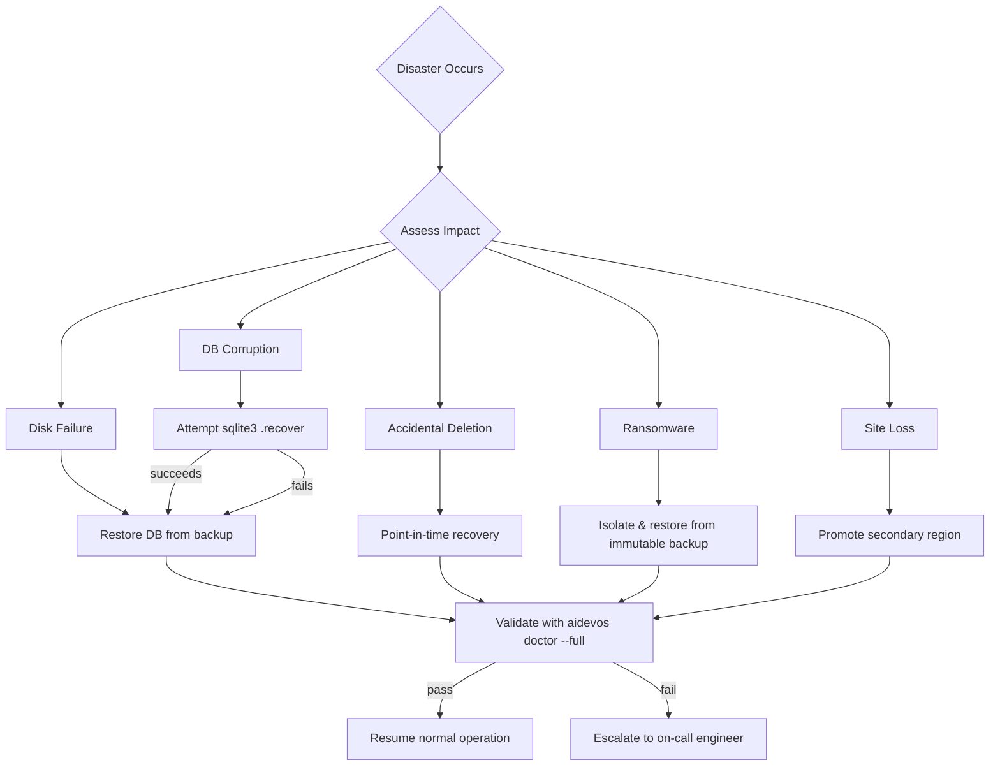

# Disaster Recovery

> Disaster recovery plan for AI Dev OS. This document is normative — implementations MUST satisfy every MUST clause below.

## Overview

The disaster recovery plan defines how AI Dev OS recovers from partial or total loss of service, data, or infrastructure. It covers four categories of disaster — disk failure, data corruption, accidental deletion, and site loss — with specific RPO/RTO targets, recovery procedures, and verification steps for each.

The plan is tested quarterly. All recovery procedures are automated as `aidevos dr` subcommands where possible, with manual fallbacks documented.

## RPO/RTO Targets

| Data category | RPO | RTO | Priority |
|---------------|-----|-----|----------|
| Agent workspaces (memory, context, SCE events) | 5 min | 10 min | P0 |
| Configuration and settings | 24 hr | 5 min | P1 |
| Secrets (API keys, credentials) | 24 hr | 5 min | P0 |
| Custom rules and prompt templates | 24 hr | 15 min | P2 |
| Vector index (embeddings) | 24 hr | 30 min | P2 |
| Audit log | 5 min | 30 min | P1 |
| Event log (SCE raw events) | 1 hr | 2 hr | P3 |
| Runtime artifacts (logs, traces, cache) | None | N/A (rebuildable) | P3 |

RPO = Recovery Point Objective (maximum acceptable data loss). RTO = Recovery Time Objective (maximum acceptable downtime).

## Disaster Scenarios

| Scenario | Impact | Likelihood | RPO breach risk | RTO breach risk |
|----------|--------|------------|-----------------|-----------------|
| Primary disk failure | Database and config inaccessible | Medium | High (if WAL not on separate disk) | High |
| Database file corruption | All agent workspaces unavailable | Low | High | High |
| Accidental workspace deletion | Single or few workspaces | Medium | Medium | Low |
| Secrets directory loss | API providers unreachable | Low | Medium | Low |
| Ransomware encryption of data directory | All data encrypted | Low | High | High |
| Cloud region/AZ outage | Full site loss (server mode) | Low | Low (cross-region) | High |
| Human error (e.g. `DROP TABLE`) | Logical data loss | Medium | Medium | Medium |

## Recovery Procedures

### Disk failure

```
1. Replace failed disk / mount replacement volume.
2. Restore from latest backup:
   aidevos dr restore-db --from /mnt/backup/latest/aidevos.db
3. Restore config and secrets:
   aidevos dr restore-config --from /mnt/backup/latest/config/
   aidevos dr restore-secrets --from /mnt/backup/latest/secrets/
4. Validate with: aidevos doctor --full
5. Resume normal operation.
```

If the disk failure is on the WAL volume only, the database is still consistent up to the last checkpoint. Run `PRAGMA wal_checkpoint(TRUNCATE)` and continue.

### Database corruption

Detected by: `PRAGMA integrity_check` failures, crash on startup, or SQLITE_CORRUPT errors at runtime.

```
1. Stop aidevos-server.
2. Attempt recovery: sqlite3 aidevos.db ".recover" > recovered.sql
3. If recovery succeeds, rebuild database:
   sqlite3 aidevos_recovered.db < recovered.sql
4. If recovery fails, restore from latest clean backup:
   aidevos dr restore-db --from /mnt/backup/latest/aidevos.db
5. Apply WAL archives for PITR (see Backup Strategy).
6. Run integrity check on restored database.
7. Start server and run validation.
```

Post-corruption, identify root cause: check for disk errors, filesystem issues, or hardware faults.

### Accidental deletion

```
1. Identify the deleted data scope (workspace, memory record, config file).
2. For workspace deletion:
   aidevos dr restore-workspace --workspace-id <id> \
     --from /mnt/backup/latest/aidevos.db
3. For config file deletion:
   aidevos dr restore-config --paths ~/.aidevos/config.toml \
     --from /mnt/backup/latest/config/
4. Verify restored data with: aidevos doctor --quick
```

Point-in-time recovery (PITR) should be used if the deletion occurred before the last backup.

### Ransomware

```
1. Isolate affected systems immediately (network disconnect).
2. Do NOT pay ransom. Do NOT reboot affected machines.
3. Preserve forensic evidence: snapshot volumes, collect logs.
4. Restore from clean backup on a different machine or volume:
   aidevos dr full-restore --from /mnt/backup/pre-ransomware/
5. Rotate all secrets and API keys.
6. Run full security scan before reconnecting to network.
7. Perform root cause analysis (entry vector, lateral movement).
8. Report to incident response team.
```

Ransomware recovery assumes backups are stored on air-gapped or immutable storage (e.g., S3 Object Lock, Write-Once media).

### Site loss (cloud region/AZ outage)

```
1. Activate secondary region / AZ.
   - Database: Promote cross-region read replica to primary.
   - SCE: NATS JetStream leader election (auto).
   - Object store: S3 CRR (auto) or switch to cross-region bucket.
2. Update DNS / load balancer to point to secondary region.
3. Start aidevos-server in secondary region with correct config.
4. Run: aidevos doctor --full
5. Once primary region is restored, fail back during maintenance window.
```

For self-hosted deployments, site loss recovery is equivalent to a full restore on new hardware.

## Verification Steps After Recovery

| Step | Command | Expected result |
|------|---------|-----------------|
| Database integrity | `aidevos db check` | `integrity_check: ok` |
| Config loaded | `aidevos config list` | All expected keys present |
| Secrets accessible | `aidevos secrets list` | All secret keys resolvable |
| SCE connectivity | `aidevos sce status` | `connected` and `subscribed` |
| Provider connectivity | `aidevos providers ping` | Each provider returns `pong` |
| Workspace data | `aidevos workspace list` | All workspaces restored |
| Memory queries | `aidevos memory search "test"` | Results returned without errors |
| Vector index | `aidevos db reindex --status` | Index health: ready |
| Agent run | `aidevos run "list my files"` | Goal delivered without errors |
| Audit log | `tail -100 audit.log` | Recovery events logged |

If any verification step fails, the recovery is incomplete. Refer to the specific failure mode in [Troubleshooting](./TROUBLESHOOTING.md).

## DR Testing Schedule

| Test | Frequency | Scope | Success criteria |
|------|-----------|-------|------------------|
| Database restore drill | Monthly | Restore latest backup to staging DB | Integrity check passes; all workspaces present |
| Config + secrets restore | Monthly | Restore config to staging directory | All keys present; secrets decrypt successfully |
| Workspace PITR drill | Quarterly | Pick random workspace and timestamp | Exact state at timestamp restored |
| Full system rebuild | Quarterly | Bare-metal restore on clean OS | All subsystems operational; doctor --full passes |
| Region failover (server mode) | Quarterly | Promote secondary region, run for 4 hr | No data loss; all SLOs met during failover |
| Ransomware scenario | Semi-annual | Simulated encryption; restore from immutable backup | Restore complete within RTO; no latent infection |
| Failover chaos test | Semi-annual | Kill primary; measure RTO | RTO measured; documented improvement actions |

Each test produces a structured report published to the [Audit Log](./AUDIT_LOG.md). Findings that affect RPO/RTO MUST be remediated within 30 days.

## DR Workflow Diagram



## Backup Types

| Type | Scope | Frequency | Storage | RPO Contribution |
|------|-------|-----------|---------|------------------|
| **Full** | Complete database + config + secrets | Daily | Compressed archive | 24 hours |
| **Incremental** | Changes since last full backup | Hourly | WAL archive | 1 hour |
| **Differential** | Changes since last full backup | Every 6 hours | SQL diff | 6 hours |
| **WAL archive** | SQLite WAL files as they fill | Continuous (<10 MB) | WAL sequence | 5 minutes |
| **Snapshot** | Filesystem-level volume snapshot | Configurable | Cloud snapshot | Configurable |

Incremental backups require the last full backup to be restorable. Differential backups only require the last full backup (not the previous differential).

## Recovery Runbook by Scenario

### Disk Failure

```
1. Replace failed disk
2. Mount replacement volume
3. Restore from latest full backup
4. Apply latest incremental/WAL archive
5. Run integrity check
6. Validate with aidevos doctor --full
7. Resume normal operation
```

### Database Corruption

```
1. Stop aidevos-server
2. Run: sqlite3 aidevos.db "PRAGMA integrity_check"
3. If failed, attempt: sqlite3 aidevos.db ".recover" > recovered.sql
4. If recovery succeeds, rebuild from SQL dump
5. If recovery fails, restore from backup
6. Apply WAL archives for PITR
7. Verify with PRAGMA integrity_check
8. Start server; validate
```

### Accidental Deletion

```
1. Identify scope (workspace, record, config)
2. Select restore method (PITR or direct restore)
3. Restore from backup at timestamp before deletion
4. Extract only the deleted data if possible
5. Verify restored data
```

### Ransomware

```
1. Immediately disconnect from network
2. Do NOT pay ransom; do NOT reboot
3. Snapshot volumes for forensics
4. Restore from air-gapped/immutable backup
5. Rotate ALL secrets and API keys
6. Run full security scan
7. Root cause analysis and report
```

### Site Loss

```
1. Activate secondary region
2. Promote read replica to primary
3. Update DNS/load balancer
4. Start aidevos-server in secondary region
5. Run full validation
6. Fail back during maintenance window after primary restored
```

## Backup Encryption

| Backup Component | Encryption Method | Key Management |
|-----------------|-------------------|----------------|
| Database backup | AES-256-GCM via age | Age key file + passphrase |
| WAL archive | AES-256-GCM via age | Same age key |
| Config backup | Age encryption | Same age key |
| Secrets backup | Age encryption + separate passphrase | Age key + passphrase |
| Vector index | Not encrypted (rebuildable) | N/A |

Backup encryption keys MUST be stored separately from the backup media (e.g., in a password manager or HSM).

## Cross-Region Strategy

| Deployment | Strategy | RTO | RPO |
|------------|----------|-----|-----|
| SQLite (local) | Backup to cloud object store in primary region; cross-region replication | 30 min | 5 min |
| Postgres (server) | Cross-region read replica with WAL streaming | 5 min | < 1 min |
| SCE (NATS) | NATS JetStream cross-region mirroring | 1 min | < 1 s |

## Failure Modes

| Mode | Detection | Response |
|------|-----------|----------|
| Backup set incomplete | Missing expected backup file | Alert operator; attempt restore from next oldest; document gap |
| Restored DB fails integrity check | PRAGMA integrity_check fails | Attempt recovery from backup-1; escalate if consistent failure |
| PITR target outside WAL window | Requested timestamp before oldest WAL | Restore to oldest available point; document data loss window |
| Cross-region replication lag | Replica lag > RPO target | Throttle primary writes; alert operator |
| Secrets backup unreadable after restore | Decryption fails | Restore from previous secrets backup; rotate keys |

## Acceptance Criteria

- A full restore from backup to a clean machine completes within RTO targets for each data category.
- Point-in-time recovery restores a random timestamp with exact state match.
- All DR tests (monthly/quarterly/semi-annual) produce structured results in the Audit Log.
- Backup encryption keys are stored separately from backup media.
- Cross-region failover completes within 5 minutes with zero data loss.
- Every recovery procedure documented in this file is automated as a `aidevos dr` subcommand.

## Related Documents

- [Backup Strategy](./BACKUP_STRATEGY.md) — backup methods, schedule, retention, restore procedures
- [Data Retention](./DATA_RETENTION.md) — retention periods, archival tiers, compliance requirements
- [Deployment](./DEPLOYMENT.md) — multi-region topology, health checks, failover configuration
- [Reliability](./RELIABILITY.md) — SLO targets, error budgets, circuit breakers, degradation modes
- [Security Model](./SECURITY_MODEL.md) — ransomware prevention, immutable backups, incident response
- [Secrets Management](./SECRETS_MANAGEMENT.md) — key rotation after recovery, encrypted backups
- [Audit Log](./AUDIT_LOG.md) — DR event recording, compliance evidence
