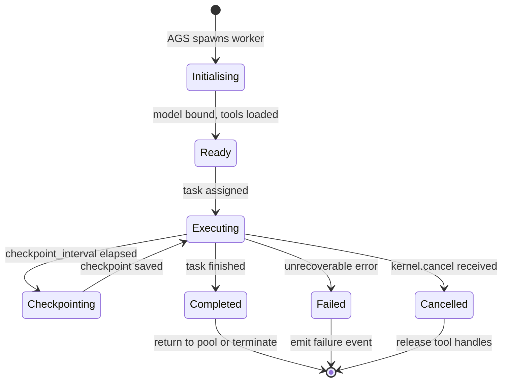
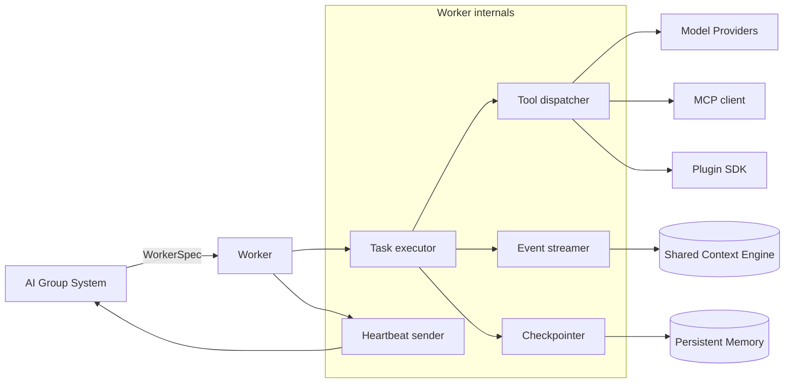

# Dynamic Workers

> The ephemeral, role-bound execution units that perform every task in the Kernel loop. This document is normative — implementations MUST satisfy every MUST clause below.

## Overview

Dynamic Workers are the leaf-level executors of AI Dev OS. A Worker is a short-lived process (or coroutine, depending on the runtime target) that holds exactly one `ModelBinding`, executes exactly one `Task` at a time, and publishes all results through the [Shared Context Engine](./SHARED_CONTEXT_ENGINE.md). Workers are created on demand by the [AI Group System](./AI_GROUP_SYSTEM.md) and are destroyed (or returned to a warm pool) when their task completes.

Workers are deliberately thin: they contain no business logic, no routing decisions, and no persistent state. They are pure executors — they receive a `WorkerSpec`, call the assigned model, invoke permitted tools, stream output events, and checkpoint progress at defined intervals. All orchestration is above them (Kernel, Groups, AGS); all model I/O is proxied through [Model Providers](./MODEL_PROVIDERS.md).

## Goals

- Thin executors: no routing, no policy, no hidden state.
- Every tool call is validated against the Group's capability list before execution.
- Checkpointing at regular intervals enables preemption and replay.
- Workers are observable end-to-end: every token, tool call, and error is an event on the SCE.
- Local-first: workers MUST be able to run against local models with zero network egress.

## Non-Goals

- Scheduling workers — belongs to the [AI Group System](./AI_GROUP_SYSTEM.md).
- Routing model choices — belongs to the [Nine Router](./NINE_ROUTER.md).
- Merging concurrent outputs — belongs to the [Merge Manager](./MERGE_MANAGER.md).
- Critiquing output quality — belongs to the Critic role (see [Nine Router](./NINE_ROUTER.md)).
- Implementation code — this repository is documentation-only (see [AI Coding Rules](./AI_CODING_RULES.md)).

## Worker Lifecycle



Full lifecycle event schema is specified in [Agent Lifecycle](./AGENT_LIFECYCLE.md).

## Architecture



## WorkerSpec

The AGS creates a Worker by passing it a `WorkerSpec`:

```
WorkerSpec {
  id:              ulid              # worker identity token
  run_id:          ulid              # parent Kernel run
  group_id:        string
  task_id:         ulid
  role:            NineRole
  binding:         ModelBinding      # resolved by Nine Router
  tools:           ToolCapability[]  # from GroupSpec.tools[]
  kb_scope:        KBScope[]
  budget: {
    tokens_max:    number
    wall_ms_max:   number
    usd_max:       number?
  }
  checkpoint_interval_ms: number     # default 30_000
  heartbeat_interval_ms:  number     # default 5_000
  correlation_id:  uuid
}
```

## Task Execution

A Worker's execution loop:

```
receive WorkerSpec ws
bind model = ws.binding.primary

loop:
  receive task = next_task(ws.task_id)
  emit task.started

  context = load_context(task, ws.kb_scope)
  budget  = BudgetTracker(ws.budget)

  async for chunk in model.stream(task, context, tools=ws.tools):
    if chunk.type == "token":
      emit token_event(chunk)
      budget.record(chunk.tokens)
    elif chunk.type == "tool_call":
      result = dispatch_tool(chunk.name, chunk.args, ws.tools)
      emit tool_event(chunk.name, result)
    elif chunk.type == "done":
      artifact = Artifact(chunk.content)
      emit task.completed(artifact)
      break

    if budget.exceeded():
      emit task.budget_exhausted
      cancel()
      break

    if checkpoint_due():
      save_checkpoint(task, context, budget)
      emit task.checkpointed

  heartbeat()
```

Tool dispatch validates the tool name against `ws.tools` before calling the provider. If the tool is not in the capability list, the worker emits `tool.denied` and continues (tools are advisory-reject, not hard-crash, unless `strict_tools: true` is set in the WorkerSpec).

## Checkpointing

Workers MUST checkpoint at every `checkpoint_interval_ms` and on graceful shutdown. A checkpoint captures:

```
Checkpoint {
  worker_id:     ulid
  task_id:       ulid
  run_id:        ulid
  ts:            rfc3339
  context_hash:  sha256      # hash of current context window state
  budget_spent:  { tokens, wall_ms, usd }
  tool_history:  ToolCall[]  # all tool calls so far
  partial_artifact: string?  # partial output text
  model_state:   object?     # provider-specific continuation state
}
```

The Kernel can replay from any checkpoint by loading it from [Persistent Memory](./PERSISTENT_MEMORY.md) and passing it back to a fresh worker with `replay_from: checkpoint_id`.

## Tool Dispatching

Workers support three tool backends, all behind the same `ToolCall` interface:

| Backend | Description | Declared in |
|---------|-------------|-------------|
| Native tools | Built-in tools (file I/O, shell, web search) shipped with AI Dev OS | [Tool Calling](./TOOL_CALLING.md) |
| MCP tools | Tools exposed by connected MCP servers | [MCP](./MCP.md) |
| Plugin tools | Tools from installed plugins | [Plugin SDK](./PLUGIN_SDK.md) |

Dispatch order: Native → MCP → Plugin. If the same tool name appears in multiple backends, the first match wins. Ambiguity SHOULD be surfaced as a warning at GroupSpec parse time.

```
ToolCall {
  id:       ulid
  name:     string
  args:     object          # JSON-Schema validated against tool manifest
  result:   ToolResult?
  error:    ToolError?
  duration_ms: number
  ts:       rfc3339
}
```

## Streaming Events

Workers emit a structured event stream on the `run.<run_id>` SCE topic. Every event carries `correlation_id`, `worker_id`, `task_id`, and `ts`.

| Event type | Payload |
|-----------|---------|
| `worker.started` | `{ worker_id, role, model_id, task_id }` |
| `worker.token` | `{ text, finish_reason? }` |
| `worker.tool_call` | `{ name, args, result?, error? }` |
| `worker.tool_denied` | `{ name, reason }` |
| `worker.checkpointed` | `{ checkpoint_id, budget_spent }` |
| `worker.completed` | `{ artifact_id, budget_spent }` |
| `worker.failed` | `{ error_code, message, budget_spent }` |
| `worker.cancelled` | `{ reason, budget_spent }` |
| `worker.budget_exhausted` | `{ budget_type, spent, limit }` |

## Requirements

- **MUST** never store credentials; pull from [Secrets Management](./SECRETS_MANAGEMENT.md) at init time via the Kernel-proxied client.
- **MUST** validate every tool call against `ws.tools` before dispatch.
- **MUST** emit `worker.checkpointed` at every checkpoint boundary.
- **MUST** honour `kernel.cancel(run_id)` within one scheduler tick by cancelling the current model call and emitting `worker.cancelled`.
- **MUST** propagate `correlation_id` into every provider call so it appears in the [Audit Log](./AUDIT_LOG.md).
- **MUST** report budget spent in every terminal event (`completed`, `failed`, `cancelled`).
- **SHOULD** attempt model fallback (next in `binding.fallbacks`) on a transient provider error before emitting `worker.failed`.
- **SHOULD** reuse warm workers across sibling tasks in the same GroupRun to reduce cold-start latency.
- **MAY** stream partial output to the UI via the SCE `worker.token` events before the task completes.

## Failure Modes

| Mode | Detection | Response |
|------|-----------|----------|
| Provider error (transient) | HTTP 5xx / timeout | Retry with next fallback model; emit `worker.fallback` |
| Provider error (permanent) | Auth failure / model not found | Emit `worker.failed`; do not retry |
| Budget exceeded | `budget.exceeded()` returns true | Cancel model call; emit `worker.budget_exhausted`; deliver partial artifact |
| Tool call denied | Tool not in `ws.tools` | Emit `worker.tool_denied`; continue execution |
| Tool call timeout | Tool exceeds `tool_timeout_ms` | Abort call; emit `worker.tool_error`; worker continues |
| Checkpoint failure | SCE write NAK | Buffer to local WAL; retry; emit warning after N retries |
| Worker crash | Unhandled exception | AGS heartbeat miss triggers reassignment |
| Context window overflow | Token count > model limit | Summarise context via compression; emit `worker.context_compressed` |

Every failure is recorded in the [Audit Log](./AUDIT_LOG.md).

## Security Considerations

- Workers are ephemeral: their identity token (`ws.id`) expires when the GroupRun terminates; reuse of an expired token is rejected.
- Tool capability enforcement is done at the Worker level (pre-dispatch) AND at the tool provider level (post-dispatch) for defence in depth.
- Workers MUST NOT open outbound network connections except through Kernel-proxied provider calls and MCP client sessions already registered in the [Audit Log](./AUDIT_LOG.md).
- Plugin tools run in a capability-restricted sandbox; the Worker is the sandbox boundary (see [Plugin SDK](./PLUGIN_SDK.md)).
- See [Security Model](./SECURITY_MODEL.md).

## Observability

| Metric | Labels | Description |
|--------|--------|-------------|
| `worker_task_total` | `group_id`, `role`, `state` | Completed task count by outcome |
| `worker_token_total` | `group_id`, `role`, `model_id` | Tokens consumed |
| `worker_tool_call_total` | `group_id`, `tool`, `ok` | Tool call count |
| `worker_tool_denied_total` | `group_id`, `tool` | Denied tool calls |
| `worker_checkpoint_total` | `group_id` | Checkpoint events |
| `worker_task_seconds` | `group_id`, `role` | Task duration histogram |
| `worker_context_compression_total` | `group_id` | Context compression events |

Traces: one span per `worker.started`→`worker.completed`, with child spans for each tool call. See [Tracing](./TRACING.md).

## Acceptance Criteria

- A worker executing a Builder task that calls `file_write` on a tool not in its `tools[]` list emits `worker.tool_denied` and continues executing without crashing.
- Sending `kernel.cancel(run_id)` while a worker holds a long-running `web_search` tool call cancels the tool call and emits `worker.cancelled` within one scheduler tick.
- A worker that hits its token budget emits `worker.budget_exhausted` and delivers a partial artifact with a clear `partial: true` flag.
- Replaying a run from a checkpoint produces the same subsequent events as the original run for the same model (non-determinism is recorded in the checkpoint).
- A worker that encounters three consecutive provider 503 errors slides down the fallback chain and succeeds on the third model if one is healthy.

## Open Questions

- Whether the warm-pool strategy should prefer recency (LRU) or task-type affinity (reuse workers that executed similar tasks) — tracked in [templates/ADR](../templates/ADR.md).
- Optimal `checkpoint_interval_ms` for short tasks (< 5 s) where checkpointing is overhead.

## Related Documents

- [AI Group System](./AI_GROUP_SYSTEM.md) — spawns and supervises workers
- [Agent Lifecycle](./AGENT_LIFECYCLE.md) — full state machine and event schema
- [Tool Calling](./TOOL_CALLING.md) — native tool manifest
- [MCP](./MCP.md) — MCP tool backend
- [Plugin SDK](./PLUGIN_SDK.md) — plugin tool backend
- [Persistent Memory](./PERSISTENT_MEMORY.md) — checkpoint storage
- [Model Providers](./MODEL_PROVIDERS.md) — provider I/O proxying
- [Nine Router](./NINE_ROUTER.md) — `ModelBinding` source
- [Main AI Kernel](./MAIN_AI_KERNEL.md)
- [Architecture Guardian](./ARCHITECTURE_GUARDIAN.md)
- [diagrams/AGENT_LIFECYCLE](../diagrams/AGENT_LIFECYCLE.md)
