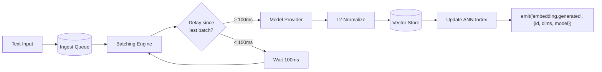

# Embeddings

> **Domain:** Embedding Model Selection, Batching, and Pipeline
> **Applies to:** Model Provider Proxy, Persistent Memory, Vector Store
> **Last updated:** 2026-07-22

## Overview

AI Dev OS generates vector embeddings for all text that enters the knowledge system — documents, agent memory entries, code snippets, and queries. The embedding pipeline is asynchronous, batched, and model-agnostic. Embeddings power semantic search in the Vector Store, clustering in the Obsidian Graph Engine, and similarity scoring in the RAG pipeline.

```
Text ──► Queue ──► Batch ──► Model Call ──► Normalize ──► Store ──► Index ──► Event
```

## Supported Embedding Models

| Model | Provider | Dimensions | Max Tokens | Cost Tier | Notes |
|-------|----------|------------|------------|-----------|-------|
| `nomic-embed-text` | Nomic (local via Ollama) | 768 | 8192 | Free | Default local model, no API key needed. |
| `text-embedding-3-small` | OpenAI | 512 / 1536* | 8191 | Low | Best quality-per-token for small contexts. |
| `text-embedding-3-large` | OpenAI | 1024 / 3072* | 8191 | Medium | Highest OpenAI quality, 2x cost of small. |
| `text-embedding-004` | Google Vertex AI | 768 | 2048 | Medium | Good for multilingual content. |
| `mistral-embed` | Mistral | 1024 | 8192 | Low | Open-weight model via API, competitive quality. |

*Variable dimensions via `dimensions` parameter. Shorter dimensions trade fidelity for speed and storage.

## Embedding Pipeline



**Pipeline stages:**

1. **Queue:** Incoming text is enqueued with a priority tag (`interactive`, `background`, `backfill`).
2. **Batch:** The batching engine collects items until either 64 items are queued or 100ms have elapsed since the last batch.
3. **Model call:** The batch is sent to the configured model provider. Results are returned as a `float[][]`.
4. **Normalize:** Each vector is L2-normalized in place (required for cosine similarity).
5. **Store:** Vectors are written to the Vector Store (usearch index + SQLite relational store).
6. **Event:** An `embedding.generated` event is emitted on the SCE bus for downstream consumers (Obsidian Graph Engine, RAG indexer).

## Configuration

```toml
[embeddings]
# Model selection per tier
model_default = "nomic-embed-text"
model_interactive = "text-embedding-3-small"
model_background = "nomic-embed-text"
model_backfill = "nomic-embed-text"

# Batching
max_batch_size = 64
batch_window_ms = 100

# Storage
dimensions = 768  # Must match the selected model
normalize = true

# Cache
cache_ttl_sec = 3600
cache_max_entries = 5000
```

Each tier (`interactive`, `background`, `backfill`) can use a different model to balance cost vs. latency. Interactive queries use the highest-quality model; background indexing uses the cheapest.

## Batching Strategy

- **Maximum batch size:** 64 items. Larger batches increase throughput but raise the risk of partial failures.
- **Async backfill:** Low-priority backfill jobs are batched separately from interactive requests to prevent latency spikes.
- **Timeout:** A single batch must complete within 30 seconds. Partial results (some items failed) are retried individually.
- **Concurrency:** One active batch per model provider. Additional batches queue behind it.

## Embedding Dimensions

| Model | Default Dims | Available Dims | Storage per Vector (float32) |
|-------|-------------|----------------|------------------------------|
| nomic-embed-text | 768 | 768 | 3,072 bytes |
| text-embedding-3-small | 1536 | 256, 512, 1024, 1536 | 2,048–6,144 bytes |
| text-embedding-3-large | 3072 | 256, 512, 1024, 2048, 3072 | 4,096–12,288 bytes |
| text-embedding-004 | 768 | 768 | 3,072 bytes |
| mistral-embed | 1024 | 1024 | 4,096 bytes |

## Normalization

All vectors are L2-normalized before storage:

```
v_norm = v / ||v||₂
```

Normalization ensures that cosine similarity is equivalent to the dot product:

```
cosine_sim(a, b) = a · b   (when both are L2-normalized)
```

This allows the usearch HNSW index to use the fast dot-product distance metric while behaving as cosine similarity.

## Cache

An embedding cache avoids redundant model calls:

- **Key:** SHA-256 of the input text + model name + dimensions.
- **TTL:** Configurable (default 1 hour). Bumped on every hit.
- **Eviction:** LRU when `cache_max_entries` is exceeded.
- **Skip:** Texts longer than 512 tokens bypass the cache (low probability of repeat).

## Interfaces

| Interface | Description |
|-----------|-------------|
| `embed.generate(texts, opts?)` | Generate embeddings. Returns `float[][]` in the same order as input. `opts` can override model, dimensions, priority. |
| `embed.backlog()` | Returns the number of items waiting in the queue. |
| `embed.backfill(limit)` | Process up to `limit` queued backfill items. Returns count processed. |
| `embed.stats()` | Returns cache hit rate, average batch latency, queue depth. |
| `embed.clear_cache()` | Clears the embedding cache. |

## Failure Modes

| Failure | Symptom | Recovery |
|---------|---------|----------|
| **Model unavailable** | Timeout or HTTP 503 from model provider. | Retry with exponential backoff (3 attempts). Fall back to the default model for the tier. |
| **Dimension mismatch** | Model returns vector with wrong dimension count. | Reject the batch, log error, alert operator. The batch is re-queued with dimension override. |
| **Rate limit** | HTTP 429 from model provider. | Back off for `Retry-After` duration (or 5 seconds default). Reduce batch size to 16. |
| **Oversized text** | Text exceeds model's `max_tokens`. | Truncate to `max_tokens` (smart truncation at sentence boundary). |

## Observability Metrics

| Metric | Type | Labels |
|--------|------|--------|
| `embedding_generated_total` | Counter | model, status (success/failure) |
| `embedding_latency_seconds` | Histogram | model, batch_size |
| `embedding_queue_depth` | Gauge | priority |
| `embedding_cache_hit_ratio` | Gauge | model |
| `embedding_batch_size` | Histogram | model |

## Cross-Provider Normalization

Embeddings from different providers may use different dimension spaces. To enable cross-provider comparison:

1. **Dimension padding**: Shorter vectors are zero-padded to the maximum dimension in the system (3072 for text-embedding-3-large).
2. **L2 normalization**: All vectors are L2-normalized after padding.
3. **Similarity threshold adjustment**: Cross-provider cosine similarity scores are adjusted by a calibration factor stored per provider pair.

This enables querying with a model from one provider and searching vectors generated by another provider, though intra-provider searches are recommended for best fidelity.

## Failure Modes (Expanded)

| Failure | Symptom | Recovery |
|---------|---------|----------|
| **Model unavailable** | Timeout or HTTP 503 from model provider | Retry with exponential backoff (3 attempts). Fall back to the default model for the tier. |
| **Dimension mismatch** | Model returns vector with wrong dimension count | Reject the batch, log error, alert operator. The batch is re-queued with dimension override. |
| **Rate limit** | HTTP 429 from model provider | Back off for `Retry-After` duration (or 5 seconds default). Reduce batch size to 16. |
| **Oversized text** | Text exceeds model's `max_tokens` | Truncate to `max_tokens` (smart truncation at sentence boundary). |
| **Batch partial failure** | Some items in batch succeed, others fail | Retry failed items individually; successful items are stored. |
| **Cache stampede** | Many concurrent requests for same embedding | First request computes; subsequent requests wait on shared future. |
| **Provider auth failure** | HTTP 401 from provider | Disable provider; fall back to next available; alert. |

## Observability / Metrics (Expanded)

| Metric | Type | Labels | Description |
|--------|------|--------|-------------|
| `embedding_generated_total` | Counter | model, status (success/failure) | Total embeddings generated |
| `embedding_latency_seconds` | Histogram | model, batch_size | Model call latency |
| `embedding_queue_depth` | Gauge | priority (interactive/background/backfill) | Queue depth per priority |
| `embedding_cache_hit_ratio` | Gauge | model | Cache hit ratio |
| `embedding_batch_size` | Histogram | model | Batch sizes used |
| `embedding_batch_partial_failures_total` | Counter | model | Partial batch failures |
| `embedding_throughput_items_per_sec` | Gauge | model | Items processed per second |

## Acceptance Criteria

- Sending 10 texts to `embed.generate()` returns a `float[10][]` with correct dimensions.
- A cache hit returns the same vector as a fresh generation for the same input text.
- When the provider returns a 429, the system backs off and retries successfully within 30 seconds.
- Text exceeding `max_tokens` is truncated to the limit without error.
- The batch processor collects 64 items or waits 100 ms before sending the batch.
- Backfill priority items batch separately from interactive items.

## Related Documents

| Document | Description |
|----------|-------------|
| [Vector Store](VECTOR_STORE.md) | Vector index specification and management |
| [RAG Pipeline](RAG_PIPELINE.md) | Retrieval-augmented generation combining BM25 + ANN + graph |
| [Persistent Memory](PERSISTENT_MEMORY.md) | Long-term storage using embeddings for similarity search |
| [Knowledge System](KNOWLEDGE_SYSTEM.md) | Main KB and Global KB architecture |
