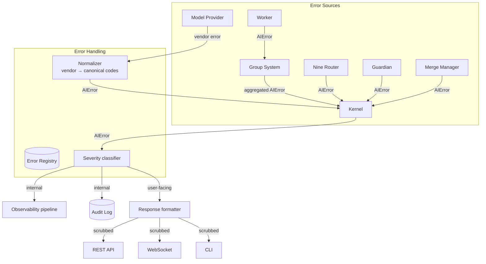
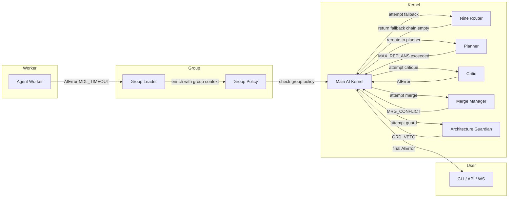

# Error Handling

> The structured error taxonomy, envelope schema, propagation model, retry policy, and observability contracts for every failure mode in AI Dev OS. This document is normative — implementations MUST satisfy every MUST clause below.

## Overview

Error Handling is a cross-cutting subsystem of AI Dev OS. Every component — the [Main AI Kernel](./MAIN_AI_KERNEL.md), [Dynamic Workers](./DYNAMIC_WORKERS.md), [AI Groups](./AI_GROUP_SYSTEM.md), [Nine Router](./NINE_ROUTER.md), [Model Providers](./MODEL_PROVIDERS.md), [Architecture Guardian](./ARCHITECTURE_GUARDIAN.md), [Merge Manager](./MERGE_MANAGER.md) — produces and consumes errors through a single, typed envelope (`AIError`). There is no ad-hoc error object, bare string, or undocumented exception that escapes the Kernel boundary.

Errors are classified into three **tiers** (recoverable, transient, permanent), carry a **standard error code** from a canonical registry, include a **correlation_id** that ties the failure back to the originating run, and flow through a fixed **propagation chain**: Worker → Group System → Kernel → User.

User-facing errors are scrubbed of internal detail (stack traces, file paths, secrets) and rendered through a unified response format (REST, WebSocket, CLI). Internal errors are rich — they carry full context, retry metadata, and severity — and are consumed by the Kernel, the [Observability](./OBSERVABILITY.md) pipeline, and the [Audit Log](./AUDIT_LOG.md).

## Goals

- **Structured error schema:** Every error is an `AIError` as defined below. No subsystem may throw or return a value that is not an `AIError` across a component boundary.
- **Three error tiers:** `recoverable` (a fallback model or retry can succeed), `transient` (the operation may succeed if retried after a delay), `permanent` (the operation will never succeed without a change in inputs or state).
- **Correlation-id propagation:** Every `AIError` MUST carry the `correlation_id` of the run in which it occurred. Downstream consumers (metrics, logging, support) use this to reconstruct the failure's causal chain.
- **Actionable error messages:** `message` MUST describe what went wrong and what action the caller can take. A message like "Something went wrong" is forbidden; "Model `gpt-4o` returned 429: rate limited. Retry after `retry_after_ms`." is the minimum standard.
- **Standard error code registry:** 150+ codes organized by subsystem prefix, registered here, and never re-purposed.

## Non-Goals

- Implementation code — this repository is documentation-only (see [AI Coding Rules](./AI_CODING_RULES.md)).
- Fault-tolerant algorithm design — that belongs in [Reliability](./RELIABILITY.md) and each subsystem's own doc.
- Vendor-specific error mapping beyond what [Model Providers](./MODEL_PROVIDERS.md) documents.
- Replacing the [Audit Log](./AUDIT_LOG.md); errors are *recorded* in the Audit Log but the enforcement of recording belongs there.

## Architecture



The Error Handling subsystem is not a standalone service — it is a set of contracts and normalization rules enforced at every component boundary. Every subsystem SHALL import and emit the `AIError` type.

## Error Taxonomy

### Recoverable

A recoverable error means a different code path — typically a fallback model, provider, or tool — can produce the expected result. The Kernel MUST NOT propagate a recoverable error to the user without first attempting all available fallbacks.

| Code prefix | Example | Fallback strategy |
|-------------|---------|-------------------|
| `MDL_TIMEOUT` | Model inference exceeded deadline | Try next model in fallback chain |
| `TOL_TIMEOUT` | Tool call did not respond within deadline | Retry once, then skip tool |
| `TOL_UNAVAILABLE` | Tool dependency crashed | Skip tool, continue without it |
| `PRV_DEGRADED` | Provider returned degraded performance hint | Route to another provider for same capability |
| `MDL_CONTEXT_OVERFLOW` | Input exceeds model context window | Truncate or summarize input; retry |
| `WRK_CRASH` | Worker process exited unexpectedly | Reassign task to new worker |

### Transient

A transient error means the same operation will likely succeed if retried after an appropriate delay. Errors in this tier MUST include a meaningful `retry_after_ms` value.

| Code prefix | Example | Recommended retry_after |
|-------------|---------|-------------------------|
| `RTL_RATE_LIMITED` | Provider returned 429 | Use `Retry-After` header; default 5000 ms |
| `PRV_UNAVAILABLE` | Provider returned 503 | 10000 ms |
| `NET_TIMEOUT` | Socket/connection timed out | 3000 ms |
| `NET_DNS` | DNS resolution failed | 5000 ms |
| `NET_RESET` | Connection reset by peer | 3000 ms |
| `CTX_WRITE_NAK` | Shared Context Engine write rejected | 1000 ms |
| `STO_CONTENTION` | Storage write conflict / lock | 2000 ms |
| `KRN_SCHEDULER_BACKPRESSURE` | Too many concurrent runs | 15000 ms |

### Permanent

A permanent error is terminal for the current operation. No retry or fallback will succeed without a change in inputs, credentials, configuration, or system state.

| Code prefix | Example | User action |
|-------------|---------|-------------|
| `INP_INVALID` | Goal contains malformed JSON | Fix input and resubmit |
| `AUTH_FAILED` | API key rejected by provider | Update credentials in [Secrets Management](./SECRETS_MANAGEMENT.md) |
| `AUTHZ_DENIED` | Agent not authorized for this action | Request access from operator |
| `BGT_EXHAUSTED` | Run budget (tokens / wall-time / cost) consumed | Increase budget or wait for reset |
| `GRD_VETO` | Architecture Guardian rejected the artifact | Address violation (see [Architecture Guardian](./ARCHITECTURE_GUARDIAN.md)) |
| `CFG_INVALID` | Configuration value is invalid | Fix config and restart |
| `PLG_LOAD_FAILED` | Plugin failed to load or was denied | Remove or fix plugin |
| `KRN_LOOP_LIMIT` | Planner exceeded MAX_REPLANS (5) | Simplify goal or escalate to human |
| `MDL_NOT_FOUND` | Assigned model is no longer available | Re-assign role via [Nine Router](./NINE_ROUTER.md) |
| `GEN_INTERNAL` | Unhandled invariant violation | File a bug report |

## Error Envelope Schema

Every error that crosses a component boundary MUST conform to this schema:

```
AIError {
  code:           string        # canonical error code, e.g. "RATE_LIMITED"
  message:        string        # human-readable, actionable description
  details?:       object        # structured context (see per-code spec)
  source:         string        # originating subsystem name
  severity:       "debug"
                | "info"
                | "warning"
                | "error"
                | "critical"
  correlation_id: uuid          # ties to originating run
  timestamp:      rfc3339       # when the error was first observed
  stack?:         string        # stack trace (dev mode only; MUST be absent in production)
  retryable:      boolean       # true for recoverable + transient
  retry_after_ms?: number       # required when retryable == true
}
```

### Field rules

- `code` MUST be a registered code from the Standard Error Codes table below. Unregistered codes SHALL be rejected by the [Architecture Guardian](./ARCHITECTURE_GUARDIAN.md) rule `registered-error-code`.
- `message` MUST NOT contain secrets, absolute file paths, internal hostnames, or credentials.
- `details` MAY contain structured data such as `{ attempted_models: ["gpt-4o", "claude-3-opus"], fallback_index: 1 }`. It MUST NOT contain secrets.
- `source` MUST match the subsystem name as declared in the subsystem's own document.
- `severity` SHALL be classified as follows:
  - `debug`: logged but not counted in error metrics; used for speculative paths.
  - `info`: logged and counted; not surfaced to user unless verbose mode.
  - `warning`: counted and surfaced as a warning; operation completed.
  - `error`: counted and surfaced; operation failed for this path.
  - `critical`: counted, surfaced, and triggers an on-call alert.
- `correlation_id` is propagated from the originating `Run` and MUST be present on every `AIError`. If the kernel process itself cannot determine the run context, the error SHALL carry `correlation_id = "00000000-0000-0000-0000-000000000000"` to indicate the orchestrator itself failed.
- `stack` MUST be populated in development builds (`AI_DEV_OS_ENV=development`). Production builds (`AI_DEV_OS_ENV=production`) MUST omit the `stack` field entirely.
- `retryable` MUST be `true` for all recoverable and transient errors. It SHALL be `false` for permanent errors.
- `retry_after_ms` MUST be present when `retryable == true`. The value SHOULD NOT exceed 300000 (5 min) for transient errors.

## Standard Error Codes

Each code belongs to a subsystem prefix. The full registry is maintained in this table. Adding a new code requires a documentation change and an [Architecture Guardian](./ARCHITECTURE_GUARDIAN.md) rule update.

### General (GEN)

| Code | Tier | Description | retryable |
|------|------|-------------|-----------|
| `GEN_UNKNOWN` | permanent | Unclassified error; treat as internal bug | false |
| `GEN_INTERNAL` | permanent | Invariant violation or unexpected state | false |
| `GEN_NOT_IMPLEMENTED` | permanent | Called a feature that is not yet implemented | false |
| `GEN_TIMEOUT` | transient | Operation exceeded wall-clock deadline | true |
| `GEN_CANCELLED` | permanent | Operation was cancelled by caller | false |
| `GEN_SHUTTING_DOWN` | transient | System is in graceful shutdown | false |
| `GEN_CAPACITY` | transient | System at maximum concurrent capacity | true |

### Kernel / Orchestration (KRN)

| Code | Tier | Description | retryable |
|------|------|-------------|-----------|
| `KRN_LOOP_LIMIT` | permanent | Planner exceeded MAX_REPLANS (5) | false |
| `KRN_STORM` | permanent | Guardian veto storm detected; non-critical routes frozen | false |
| `KRN_BUDGET_EXCEEDED` | permanent | Run exhausted its allocated budget before completion | false |
| `KRN_NO_ROLE_ASSIGNMENT` | permanent | A role has no assigned model | false |
| `KRN_SCHEDULER_FULL` | transient | Scheduler queue at capacity | true |
| `KRN_SCHEDULER_BACKPRESSURE` | transient | Too many concurrent runs; new run queued or rejected | true |
| `KRN_SNAPSHOT_FAILED` | transient | Could not capture run snapshot for replay | true |
| `KRN_REPLAY_FAILED` | permanent | Snapshot data is inconsistent or missing | false |

### Provider (PRV)

| Code | Tier | Description | retryable |
|------|------|-------------|-----------|
| `PRV_UNAVAILABLE` | transient | Provider returned HTTP 503 or equivalent | true |
| `PRV_DEGRADED` | recoverable | Provider returned degraded-performance hint | true |
| `PRV_TIMEOUT` | transient | Provider did not respond within request timeout | true |
| `PRV_OVERLOADED` | transient | Provider returned 429 without specific rate-limit scope | true |
| `PRV_MAINTENANCE` | transient | Provider returned 503 with maintenance headers | true |
| `PRV_DEPRECATED` | permanent | Provider no longer supports the requested API version | false |
| `PRV_DISCOVERY_FAILED` | recoverable | Model discovery failed for a single provider | true |
| `PRV_QUOTA_EXCEEDED` | transient | Provider account-level usage cap hit | true |

### Model (MDL)

| Code | Tier | Description | retryable |
|------|------|-------------|-----------|
| `MDL_NOT_FOUND` | permanent | Model ID does not exist on the provider | false |
| `MDL_DEPRECATED` | permanent | Model has been deprecated by provider | false |
| `MDL_TIMEOUT` | recoverable | Model inference did not complete in time | true |
| `MDL_CONTEXT_OVERFLOW` | recoverable | Input tokens exceed model's context window | true |
| `MDL_CONTEXT_UNDERFLOW` | warning | Input too small; model may produce low-quality output | false |
| `MDL_BAD_OUTPUT` | recoverable | Output failed JSON schema validation or is malformed | true |
| `MDL_REFUSAL` | permanent | Model refused to generate output (safety filter) | false |
| `MDL_CAPACITY` | transient | Model currently at capacity per provider | true |
| `MDL_MODALITY_UNSUPPORTED` | permanent | Requested modality not supported by this model | false |
| `MDL_STREAM_INTERRUPTED` | recoverable | Streaming connection dropped mid-response | true |

### Authentication & Authorization (AUTH)

| Code | Tier | Description | retryable |
|------|------|-------------|-----------|
| `AUTH_FAILED` | permanent | API key or credential rejected | false |
| `AUTH_EXPIRED` | permanent | Credential has expired | false |
| `AUTH_REVOKED` | permanent | Credential was revoked mid-session | false |
| `AUTH_MISSING` | permanent | No credential configured for the requested provider | false |
| `AUTH_MISMATCH` | permanent | Credential does not grant access to the requested resource | false |
| `AUTHZ_DENIED` | permanent | Principal is not authorized for the requested action | false |
| `AUTHZ_SCOPE` | permanent | Token lacks the required scope | false |
| `AUTHZ_RBAC_RULE` | permanent | RBAC policy blocked the action | false |

### Budget & Cost (BGT)

| Code | Tier | Description | retryable |
|------|------|-------------|-----------|
| `BGT_EXHAUSTED` | permanent | Run token / wall-time / cost budget consumed | false |
| `BGT_DAILY_CAP` | permanent | Daily cost cap for the tenant reached | false |
| `BGT_MONTHLY_CAP` | permanent | Monthly cost cap for the tenant reached | false |
| `BGT_NO_BUDGET` | permanent | No budget configured for the requesting principal | false |
| `BGT_ESTIMATE_OVERFLOW` | warning | Estimated cost would exceed remaining budget | false |
| `BGT_PROJECTION_FAILED` | warning | Cost projection could not be computed | false |

### Rate Limiting (RTL)

| Code | Tier | Description | retryable |
|------|------|-------------|-----------|
| `RTL_RATE_LIMITED` | transient | Global or per-provider rate limit hit | true |
| `RTL_BURST_EXCEEDED` | transient | Burst rate limit exceeded | true |
| `RTL_CONCURRENCY_LIMIT` | transient | Max concurrent requests to a provider reached | true |
| `RTL_TOKEN_BUCKET_EMPTY` | transient | Token-bucket or leaky-bucket exhausted | true |
| `RTL_GROUP_QUOTA` | transient | Group-level request quota consumed | true |
| `RTL_TENANT_QUOTA` | transient | Tenant-level request quota consumed | true |
| `RTL_GLOBAL_THROTTLE` | transient | Global system throttle engaged (load shedding) | true |

### Tool (TOL)

| Code | Tier | Description | retryable |
|------|------|-------------|-----------|
| `TOL_TIMEOUT` | recoverable | Tool call exceeded timeout | true |
| `TOL_UNAVAILABLE` | recoverable | Tool dependency is not reachable | true |
| `TOL_EXECUTION_ERROR` | recoverable | Tool returned a non-zero exit or error | true |
| `TOL_PERMISSION_DENIED` | permanent | Worker lacks permission for this tool | false |
| `TOL_INVALID_RESULT` | recoverable | Tool output failed schema validation | true |
| `TOL_NOT_FOUND` | permanent | Tool with the given name does not exist | false |
| `TOL_DISABLED` | permanent | Tool is disabled for the current run | false |
| `TOL_MAX_RETRIES` | permanent | Tool exceeded maximum retry count | false |

### Worker (WRK)

| Code | Tier | Description | retryable |
|------|------|-------------|-----------|
| `WRK_CRASH` | recoverable | Worker process exited unexpectedly | true |
| `WRK_OOM` | permanent | Worker ran out of memory | false |
| `WRK_STARTUP_FAILED` | transient | Worker failed to initialize | true |
| `WRK_HEARTBEAT_MISS` | transient | Worker heartbeat not received in window | true |
| `WRK_ORPHANED` | recoverable | Worker was abandoned after crash; task reassigned | true |
| `WRK_UNHEALTHY` | recoverable | Worker reported unhealthy status | true |
| `WRK_SANDBOX_VIOLATION` | permanent | Worker attempted an operation outside its sandbox | false |
| `WRK_LIFECYCLE_VIOLATION` | permanent | Worker violated lifecycle state machine contract | false |

### Group System (GRP)

| Code | Tier | Description | retryable |
|------|------|-------------|-----------|
| `GRP_NOT_FOUND` | permanent | Group ID does not exist | false |
| `GRP_AT_CAPACITY` | transient | Group has reached its max concurrent worker limit | true |
| `GRP_SPAWN_FAILED` | transient | Could not spawn a new worker in the group | true |
| `GRP_DISSOLVED` | permanent | Group was dissolved mid-run | false |
| `GRP_POLICY_VIOLATION` | permanent | Group policy blocked the operation | false |
| `GRP_INVALID_COMPOSITION` | permanent | Group composition does not meet requirements | false |

### Router (RTR)

| Code | Tier | Description | retryable |
|------|------|-------------|-----------|
| `RTR_EMPTY_CATALOG` | permanent | No models discovered for any provider | false |
| `RTR_ROLE_UNASSIGNED` | permanent | No model assigned to a required role | false |
| `RTR_FALLBACK_EXHAUSTED` | permanent | All models in the fallback chain failed | false |
| `RTR_DISCOVERY_FAILED` | recoverable | Model discovery errored for one or more providers | true |
| `RTR_INVALID_BINDING` | permanent | Stored ModelBinding references a non-existent model | false |
| `RTR_ADAPTER_ERROR` | transient | Provider adapter returned an unparseable response | true |

### Guardian (GRD)

| Code | Tier | Description | retryable |
|------|------|-------------|-----------|
| `GRD_VETO` | permanent | Architecture Guardian rejected the artifact | false |
| `GRD_CRITICAL_VETO` | permanent | Critical-severity rule violation; delivery blocked | false |
| `GRD_ENGINE_CRASH` | permanent | Guardian rule evaluator crashed for a critical rule | false |
| `GRD_RULE_PARSE_ERROR` | warning | Custom rule file contains a syntax error | false |
| `GRD_IMPACT_TIMEOUT` | warning | Impact Analysis did not complete in time | false |
| `GRD_STORM` | permanent | ≥3 vetoes in 10 s; non-critical routes frozen | false |

### Merge Manager (MRG)

| Code | Tier | Description | retryable |
|------|------|-------------|-----------|
| `MRG_CONFLICT` | recoverable | Merge conflict between concurrent artifacts | true |
| `MRG_FAILED` | permanent | Merge operation failed unrecoverably | false |
| `MRG_INVALID_INPUT` | permanent | Merge received an artifact with an unexpected shape | false |
| `MRG_ORDERING_VIOLATION` | permanent | Artifacts merged in wrong chronological order | false |
| `MRG_SCHEMA_VIOLATION` | permanent | Merged result violates the output schema | false |

### Context / SCE (CTX)

| Code | Tier | Description | retryable |
|------|------|-------------|-----------|
| `CTX_WRITE_NAK` | transient | SCE write was not acknowledged | true |
| `CTX_READ_FAILED` | transient | SCE read returned an error | true |
| `CTX_SUBSCRIBE_FAILED` | transient | Could not subscribe to SCE topic | true |
| `CTX_EVENT_TOO_LARGE` | permanent | Event payload exceeds SCE size limit | false |
| `CTX_TOPIC_NOT_FOUND` | permanent | Referenced SCE topic does not exist | false |
| `CTX_SNAPSHOT_CORRUPT` | permanent | Context snapshot hash does not match stored state | false |
| `CTX_CORRELATION_MISMATCH` | warning | Event correlation_id does not match its topic | false |

### Storage / Persistence (STO)

| Code | Tier | Description | retryable |
|------|------|-------------|-----------|
| `STO_WRITE_FAILED` | transient | Database or file write failed | true |
| `STO_READ_FAILED` | transient | Database or file read failed | true |
| `STO_CONTENTION` | transient | Write conflict / optimistic lock failure | true |
| `STO_CONNECTION_LOST` | transient | Storage connection dropped | true |
| `STO_CONNECTION_TIMEOUT` | transient | Storage connection timed out | true |
| `STO_MIGRATION_PENDING` | permanent | Storage schema migration has not been applied | false |
| `STO_QUOTA_EXCEEDED` | permanent | Storage capacity quota exceeded | false |
| `STO_INTEGRITY_ERROR` | permanent | Checksum or integrity check failed | false |

### Network (NET)

| Code | Tier | Description | retryable |
|------|------|-------------|-----------|
| `NET_TIMEOUT` | transient | Connection / request timed out | true |
| `NET_DNS` | transient | DNS resolution failed | true |
| `NET_RESET` | transient | TCP connection reset by peer | true |
| `NET_REFUSED` | transient | Connection refused | true |
| `NET_TLS` | permanent | TLS handshake failed or certificate error | false |
| `NET_PROXY` | transient | Proxy negotiation failed | true |
| `NET_DISCONNECTED` | transient | Network interface is down | true |

### Plugin (PLG)

| Code | Tier | Description | retryable |
|------|------|-------------|-----------|
| `PLG_LOAD_FAILED` | permanent | Plugin failed to load or initialize | false |
| `PLG_DENIED` | permanent | Plugin was denied by security policy | false |
| `PLG_CRASHED` | transient | Plugin process exited unexpectedly | true |
| `PLG_TIMEOUT` | transient | Plugin did not respond within deadline | true |
| `PLG_INVALID_MANIFEST` | permanent | Plugin manifest is malformed or missing | false |
| `PLG_SANDBOX_VIOLATION` | permanent | Plugin attempted restricted operation | false |
| `PLG_VERSION_MISMATCH` | permanent | Plugin requires a different SDK version | false |

### Configuration (CFG)

| Code | Tier | Description | retryable |
|------|------|-------------|-----------|
| `CFG_INVALID` | permanent | Configuration value failed validation | false |
| `CFG_MISSING` | permanent | Required configuration key is absent | false |
| `CFG_TYPE_ERROR` | permanent | Configuration value has wrong type | false |
| `CFG_PARSE_ERROR` | permanent | Configuration file failed to parse | false |
| `CFG_SCHEMA_VIOLATION` | permanent | Configuration violates the declared schema | false |
| `CFG_RELOAD_FAILED` | transient | Hot-reload of configuration failed | true |
| `CFG_VERSION_MISMATCH` | permanent | Configuration version is incompatible | false |

### Input / Validation (INP)

| Code | Tier | Description | retryable |
|------|------|-------------|-----------|
| `INP_INVALID` | permanent | Input failed validation | false |
| `INP_MISSING` | permanent | Required field is missing | false |
| `INP_TYPE_ERROR` | permanent | Field has the wrong type | false |
| `INP_OUT_OF_RANGE` | permanent | Numeric value outside allowed range | false |
| `INP_TOO_LARGE` | permanent | Input exceeds maximum size or length | false |
| `INP_SCHEMA_VIOLATION` | permanent | Input does not match declared JSON Schema | false |
| `INP_DUPLICATE` | warning | Duplicate entity detected | false |

### Internal (INT)

| Code | Tier | Description | retryable |
|------|------|-------------|-----------|
| `INT_ASSERTION` | permanent | Internal assertion failed | false |
| `INT_PANIC` | critical | Unrecoverable internal state; process may terminate | false |
| `INT_DEADLOCK` | permanent | Detected a deadlock condition | false |
| `INT_LEAK` | permanent | Resource leak detected (handle, file descriptor) | false |
| `INT_RACE` | warning | Data race detected (development builds only) | false |
| `INT_CORRUPTION` | critical | In-memory data structure corruption detected | false |

### Webhook (WHK)

| Code | Tier | Description | retryable |
|------|------|-------------|-----------|
| `WHK_DELIVERY_FAILED` | transient | Webhook payload could not be delivered | true |
| `WHK_TIMEOUT` | transient | Webhook endpoint did not respond | true |
| `WHK_INVALID_PAYLOAD` | warning | Webhook payload failed schema validation | false |
| `WHK_RATE_LIMITED` | transient | Webhook endpoint returned 429 | true |

### Self-Reflection (SEL)

| Code | Tier | Description | retryable |
|------|------|-------------|-----------|
| `SEL_EVAL_FAILED` | recoverable | Self-reflection evaluation errored | true |
| `SEL_SCORE_OUT_OF_RANGE` | warning | Self-reflection score outside valid range | false |
| `SEL_NO_BASELINE` | warning | No baseline available for comparison | false |

### Voice (VCE)

| Code | Tier | Description | retryable |
|------|------|-------------|-----------|
| `VCE_STT_FAILED` | recoverable | Speech-to-text transcription failed | true |
| `VCE_TTS_FAILED` | recoverable | Text-to-speech synthesis failed | true |
| `VCE_NO_MICROPHONE` | permanent | No microphone device detected | false |
| `VCE_AUDIO_TOO_LARGE` | permanent | Audio input exceeds maximum duration | false |
| `VCE_LANGUAGE_UNSUPPORTED` | permanent | Language not supported by the voice model | false |

## Error Propagation

Errors flow through a strict chain from the innermost subsystem outward to the user. Each hop MAY enrich the error with additional context but MUST preserve the original `correlation_id` and SHOULD preserve the original `code`.



### Propagation rules

1. **Worker → Group:** A worker that encounters an error SHALL emit the `AIError` to its group leader via the [Shared Context Engine](./SHARED_CONTEXT_ENGINE.md). The group leader MAY attempt a retry within the group (spawning a new worker) before propagating upward.
2. **Group → Kernel:** If all retry attempts within the group fail, the group leader SHALL propagate the error (or an aggregated error with `details.attempted_workers`) to the Kernel.
3. **Kernel internal routing:** The Kernel SHALL attempt fallback resolution via the [Nine Router](./NINE_ROUTER.md). If fallbacks are exhausted, the Kernel SHALL attempt a replan via the [Planning Engine](./PLANNING_ENGINE.md) (up to `MAX_REPLANS = 5`).
4. **Kernel → User:** Once all internal retry, fallback, and replan paths are exhausted, the Kernel SHALL produce a final `AIError`. This error MUST pass through the response formatter (see below) before reaching the user.

### Error aggregation

When the same error code is raised by multiple workers in a group, the group leader MAY publish a single aggregated error:

```
AIError {
  code:    "MDL_TIMEOUT"
  message: "3 of 5 workers timed out against model 'gpt-4o'. Fallback to 'claude-3-opus' succeeded for 2."
  details: {
    total_workers: 5,
    failed_workers: 3,
    failed_worker_ids: ["w1", "w2", "w3"],
    fallback_successes: 2,
    fallback_model: "claude-3-opus"
  }
  ...
}
```

## Error Response Format

Every error that reaches an API boundary SHALL be rendered through the unified response formatter. The formatter removes the `stack` field, scrubs any secret-like patterns, and serializes the remaining fields into the transport-appropriate format.

### REST API

```json
HTTP/1.1 429 Too Many Requests
Content-Type: application/json

{
  "error": {
    "code": "RTL_RATE_LIMITED",
    "message": "Rate limit exceeded for provider 'OpenAI'. Retry after 5000 ms.",
    "details": {
      "provider": "openai",
      "limit": 10000,
      "window_ms": 60000,
      "reset_at": "2026-07-22T14:30:00Z"
    },
    "correlation_id": "a1b2c3d4-e5f6-7890-abcd-ef1234567890",
    "retryable": true,
    "retry_after_ms": 5000
  }
}
```

HTTP status codes map to error categories:

| Error tier | HTTP status |
|------------|-------------|
| Permanent (input) | 400 Bad Request |
| Permanent (auth) | 401 Unauthorized / 403 Forbidden |
| Permanent (not found) | 404 Not Found |
| Permanent (budget) | 402 Payment Required |
| Permanent (guardian) | 422 Unprocessable Entity |
| Transient (rate limit) | 429 Too Many Requests |
| Transient (provider) | 502 Bad Gateway |
| Transient (timeout) | 504 Gateway Timeout |
| Recoverable (fallback) | 200 OK with `warning` field |
| Internal error | 500 Internal Server Error |

### WebSocket

WebSocket errors are delivered as a typed event frame:

```json
{
  "type": "error",
  "payload": {
    "code": "PRV_UNAVAILABLE",
    "message": "All providers for role 'builder' are unavailable.",
    "correlation_id": "a1b2c3d4-e5f6-7890-abcd-ef1234567890",
    "retryable": true,
    "retry_after_ms": 10000
  },
  "ts": "2026-07-22T14:29:55.123Z"
}
```

### CLI

CLI errors are rendered to stderr with a consistent prefix and optional `--json` flag:

```
$ aidevos run submit "refactor auth module"
Error [RTL_RATE_LIMITED]: Rate limit exceeded for provider 'OpenAI'. Retry after 5000 ms.
  correlation_id: a1b2c3d4-e5f6-7890-abcd-ef1234567890
  retryable: yes  retry_after_ms: 5000

$ aidevos run submit "refactor auth module" --json
{ "error": { "code": "RTL_RATE_LIMITED", ... } }
```

## Retry Policy

Every retryable error SHALL be retried according to the policy below. The Kernel's retry middleware is the single implementation; individual subsystems MUST NOT implement their own retry logic.

### Exponential backoff with jitter

```
base_delay_ms = max(100, retry_after_ms)   # never retry faster than 100 ms
delay = base_delay_ms * (2 ^ attempt)       # exponential: 100, 200, 400, 800, ...
jitter = random_uniform(0, delay * 0.25)    # 0–25% jitter
sleep(delay + jitter)
```

Maximum delay is capped at 300000 ms (5 min).

### Max retries per error code

| Code prefix | Max retries | Notes |
|-------------|-------------|-------|
| `RTL_*` | 3 | Retry-After header takes precedence over backoff |
| `PRV_UNAVAILABLE` | 3 | — |
| `PRV_*` | 2 | Provider degradation and overload |
| `MDL_TIMEOUT` | 2 | First retry with same model; second triggers fallback |
| `MDL_CONTEXT_OVERFLOW` | 1 | With truncation before retry |
| `MDL_BAD_OUTPUT` | 2 | With increased temperature before retry |
| `TOL_*` | 2 | Tool timeout and execution errors |
| `WRK_CRASH` | 2 | Task reassigned to new worker each retry |
| `NET_*` | 3 | Network-level errors |
| `CTX_WRITE_NAK` | 5 | SCE write retries aggressively |
| `STO_*` | 3 | Storage contention and connection errors |
| All other retryable | 2 | Default |

### Retry budget

A single run SHALL have a global retry budget of 30 retry attempts across all errors. Once exhausted, any further retryable error SHALL be treated as permanent and the run SHALL fail. This prevents runaway retry loops.

## Failure Modes

| Mode | Detection | Response |
|------|-----------|----------|
| **Retry loop exhausts run retry budget** | `retry_attempts > 30` | Treat error as permanent; fail the run |
| **Error with missing `correlation_id`** | Validation in error normalizer | Assign `correlation_id = "00000000-..."`; emit `CTX_CORRELATION_MISMATCH` warning |
| **Unregistered error code** | Guardian rule `registered-error-code` | Reject the error at the boundary; replace with `GEN_INTERNAL` |
| **Secret leaked in error message** | Pattern matching in response formatter | Replace matching segments with `[REDACTED]`; emit security alert |
| **Stack trace present in production** | Response formatter detects `stack` field | Strip field; emit `error.stack_leak` metric counter |
| **Error emitted after delivery** | Deliver stage completed | Log as `GEN_INTERNAL`; cannot be surfaced to user |
| **Error normalizer itself fails** | Exception in normalizer | Propagate `GEN_INTERNAL` with original vendor error text; alert |
| **Retry budget storms across runs** | >100 retryable errors/min system-wide | Engage global circuit breaker; new runs queued; existing runs continue |
| **Conflicting retry policies** | Worker retries + Kernel retries for same error | Worker MUST NOT retry; only the Kernel retry middleware is authoritative |

Every failure above is recorded in the [Audit Log](./AUDIT_LOG.md) with the original `correlation_id` when available.

## Security

- Error messages MUST NOT contain secrets, API keys, tokens, passwords, internal hostnames, absolute file paths, or any information that could aid an attacker.
- The `stack` field MUST be present in development builds only. Production builds SHALL set `"stack": undefined` (the field is omitted entirely).
- The response formatter SHALL apply a regex-based scrubber to `message` and `details` before serialization. Patterns include:
  - `sk-[a-zA-Z0-9]{48,}` (OpenAI keys)
  - `AKIA[0-9A-Z]{16}` (AWS access keys)
  - `ghp_[a-zA-Z0-9]{36,}` (GitHub tokens)
  - `-----BEGIN.*PRIVATE KEY-----` (private key material)
  - `\\([A-Z]:\\\\[^)]+\\)` (Windows absolute paths)
  - `(/[a-zA-Z0-9._-]+){3,}` (Unix absolute paths of depth ≥3)
- The error normalizer SHALL reject any `AIError` from a subsystem whose `source` field does not match an approved subsystem name (guard against source spoofing).
- All errors crossing the Kernel boundary to an external API SHALL be signed by the Kernel's identity key (see [Security Model](./SECURITY_MODEL.md)).
- See [Secrets Management](./SECRETS_MANAGEMENT.md) and [Encryption](./ENCRYPTION.md).

## Observability

| Metric | Labels | Description |
|--------|--------|-------------|
| `error_total` | `code`, `severity`, `source` | Counter of every AIError emitted |
| `error_retried_total` | `code` | Counter of retry attempts |
| `error_retry_budget_exhausted_total` | `run_id` | Counter of runs that exhausted retry budget |
| `error_fallback_total` | `code`, `from_model`, `to_model` | Fallback attempts triggered by model errors |
| `error_fallback_exhausted_total` | `role` | All models exhausted for a role |
| `error_stack_leak_total` | `source` | Stack traces accidentally present in production |
| `error_scrub_total` | `pattern` | Number of secret patterns redacted from error messages |

| Trace | Description |
|-------|-------------|
| `error.handle` | One span per error normalization and propagation hop |
| `error.retry` | One span per retry attempt with `attempt`, `delay_ms` attributes |
| `error.fallback` | One span per fallback chain evaluation |

All metrics conform to [Metrics](./METRICS.md). Traces follow [Tracing](./TRACING.md). Logs follow [Logging](./LOGGING.md). Every `error_total` increment SHALL also write a structured log line.

## Acceptance Criteria

- A worker that raises `MDL_TIMEOUT` against the primary model causes the Kernel to attempt the fallback chain within 1000 ms.
- A provider that returns HTTP 429 with a `Retry-After: 5` header produces an `AIError` with `code: "RTL_RATE_LIMITED"` and `retry_after_ms: 5000`.
- An unregistered error code produced by a plugin is rejected by the Guardian rule `registered-error-code` and replaced with `GEN_INTERNAL`.
- A stack trace present in a production-build error is stripped by the response formatter and increments the `error_stack_leak_total` counter.
- An error message containing `"sk-proj-AbCdEf..."` has the key redacted to `[REDACTED]` in the API response.
- Issuing 31 retryable errors in a single run causes the 31st error to be treated as permanent (retry budget exhausted).
- `error_total{code="RTL_RATE_LIMITED", severity="error"}` increments exactly once per rate-limit event, not per retry attempt.
- The CLI renders `Error [PRV_UNAVAILABLE]: ...` to stderr with a non-zero exit code.

## Related Documents

- [Main AI Kernel](./MAIN_AI_KERNEL.md) — Kernel loop and error propagation context
- [Architecture Guardian](./ARCHITECTURE_GUARDIAN.md) — `GRD_VETO` errors and the `registered-error-code` rule
- [Nine Router](./NINE_ROUTER.md) — fallback chain resolution
- [Observability](./OBSERVABILITY.md) — metric and trace standards
- [Metrics](./METRICS.md) — counter and histogram definitions
- [Audit Log](./AUDIT_LOG.md) — permanent error record
- [Reliability](./RELIABILITY.md) — fault tolerance and degradation
- [Rate Limiting](./RATE_LIMITING.md) — rate-limit policy
- [Cost Management](./COST_MANAGEMENT.md) — budget exhaustion semantics
- [Model Providers](./MODEL_PROVIDERS.md) — vendor error mapping
- [Agent Communication](./AGENT_COMMUNICATION.md) — inter-component envelope
- [API Spec](./API_SPEC.md) — HTTP error response contract
- [Security Model](./SECURITY_MODEL.md) — signing and trust boundaries
- [Plugin SDK](./PLUGIN_SDK.md) — plugin-produced errors
- [System Overview](./SYSTEM_OVERVIEW.md)
