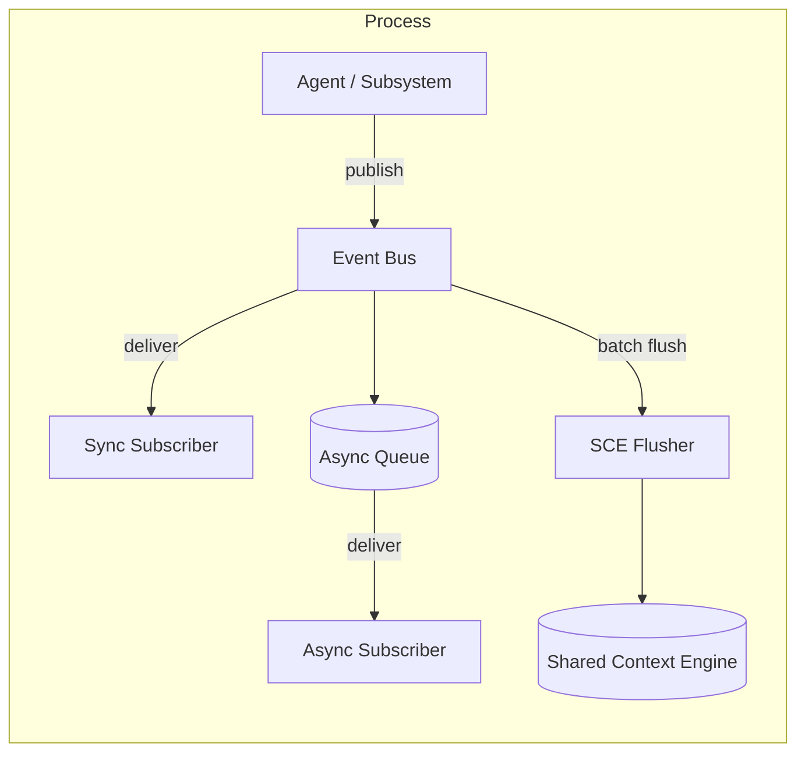

# Event Bus — In-Memory Event Distribution

> The lightweight pub/sub layer that routes events between subsystems within a single process before flushing them to the Shared Context Engine for cross-process visibility. This document is normative — implementations MUST satisfy every MUST clause below.

## Overview

The Event Bus is an in-memory publish-subscribe channel that lets subsystems emit and consume events without coupling to each other. It complements the [Shared Context Engine](./SHARED_CONTEXT_ENGINE.md) which is the durable, cross-process event log. The Event Bus is the **fast path** — events are delivered synchronously or asynchronously to local subscribers in the same process, then flushed to SCE in batches for persistence and external consumption.

| Aspect | Event Bus | SCE |
|--------|-----------|-----|
| Scope | Single process | Cross-process / cross-host |
| Durability | None (memory only) | Durable (journal + snapshot) |
| Latency | Sub-millisecond | Milliseconds |
| Ordering | Per-emitter FIFO | Global offset |
| Backpressure | Pushback to producer | Append-only log |

## Goals

- Intra-process pub/sub with zero external dependencies.
- Support both synchronous (blocking) and asynchronous (queued) subscribers.
- Automatic flush of in-memory events to SCE on configurable cadence.
- Sub-second failover: lost events on process crash are acceptable (SCE is the source of truth for cross-process state).

## Non-Goals

- Cross-process communication — use SCE.
- Durable storage — events in-flight are ephemeral.
- At-least-once delivery inside the process — subscribers that miss an event before subscribing will find it in SCE.

## Architecture



## EventChannel Schema

Every event on the bus is a structured envelope:

```
EventEnvelope {
  id:          string          # UUID v7, unique within process lifetime
  type:        string          # "run.completed", "guardian.veto", ...
  source:      string          # subsystem identifier, e.g. "guardian"
  timestamp:   i64             # nanosecond monotonic clock
  correlation_id: string       # propagated from Kernel
  payload:     object          # type-specific data
  priority:    "low" | "normal" | "high"
  ttl_ms:      u32             # discard if not delivered in time
}
```

Events MUST have a unique `id` and MUST carry a `correlation_id` from the Kernel. The `type` field follows the same naming convention as SCE event types.

## Subscription Model

### Sync vs. Async

| Mode | Delivery | Use Case |
|------|----------|----------|
| Sync | Blocking, same thread | The Guardian must veto before the plan proceeds |
| Async | Dispatched to a work queue | Metrics collectors, loggers, side-effects |

### Once vs. Continuous

- **`once`**: subscriber is removed after the first matching event. Used for one-shot waits like `bus.once("run.completed")`.
- **`continuous`**: subscriber receives every matching event until explicitly unsubscribed.

### Filtering

Subscribers MAY filter events by type string (exact or glob pattern), source, or priority. Filtering happens at dispatch time — a subscriber that registered for `run.*` will receive `run.completed`, `run.failed`, etc.

## Backpressure Handling

The Event Bus uses a bounded channel per async queue. When the queue is full:

1. **High-priority** events push out low-priority events (the low-priority event is dropped and counted in `bus_dropped_total`).
2. **Normal-priority** events block the publisher with a configurable timeout (default 100 ms) then fail with `BUS_BACKPRESSURE`.
3. **Sync** subscribers always block the publisher — the subscriber contract is expected to complete quickly (< 1 ms). Slow sync subscribers are a bug.

The flusher to SCE has its own backpressure: if SCE is unreachable, events accumulate in an in-memory buffer (max 10,000 events). When the buffer overflows, the oldest events are dropped and counted.

## Interfaces

```
bus.publish(event: EventEnvelope)          → Ack | BusBackpressureError
bus.subscribe(pattern: string, opts?: {
  mode: "sync" | "async",
  filter?: { sources?: string[], min_priority?: string }
})                                        → SubscriptionHandle
bus.unsubscribe(handle: SubscriptionHandle) → void
bus.once(pattern: string, timeout_ms?: number) → Promise<EventEnvelope | TimeoutError>
bus.flush()                                → Promise<{ flushed: number, dropped: number }>
bus.stats()                                → BusStats
```

```
BusStats {
  total_published:    u64
  total_delivered:    u64
  total_dropped:      u64
  active_subscribers: u32
  async_queue_depth:  u32
  sce_buffer_count:   u32
}
```

- `bus.publish` is non-blocking for async subscribers and blocking for sync subscribers.
- `bus.subscribe` returns a handle that MUST be used to unsubscribe. Leaked subscriptions are a memory leak — the Kernel SHOULD use WeakRef patterns or lifecycle-scoped subscriptions.
- `bus.once` resolves with the first event matching `pattern` or rejects with `TimeoutError` after `timeout_ms` (default 30 s).
- `bus.flush` forces an immediate flush of buffered events to SCE. This is called automatically every 100 ms or every 100 events (whichever comes first).

## Integration with SCE

The Event Bus and SCE are complementary:

1. **Publish flow**: agent calls `bus.publish(e)` → Event Bus delivers to in-process subscribers synchronously → event is enqueued in the flush buffer.
2. **Flush flow**: a background flusher drains the buffer every 100 ms / 100 events → each event is written to SCE as `{ ...envelope, meta: { source_bus: true } }` → SCE assigns a global offset.
3. **Replay flow**: new agents or cross-process subscribers read from SCE via `context.tail()`. They do NOT receive past Event Bus events — they catch up via SCE.

Duplicate prevention: the `id` field is the same for Event Bus and SCE representation. SCE deduplicates by `id`. Consumers on the SCE side MUST deduplicate by `id` because the flusher MAY retry after a transient failure.

## Failure Modes

| Mode | Detection | Response |
|------|-----------|----------|
| Async queue full | Channel send timeout | Return `BUS_BACKPRESSURE` to publisher; increment `bus_dropped_total` |
| SCE unreachable | SCE write timeout | Buffer up to 10k events; after overflow drop oldest; increment `bus_sce_backpressure_total` |
| Subscriber panic | Panic recovery | Catch, log, remove subscriber; increment `bus_subscriber_panics_total` |
| Subscription leak | Handle count > threshold | Warn at `bus_active_subscribers > 1000`; Kernel MAY force-unsubscribe agent-scoped handles on agent exit |
| Stale event (TTL exceeded) | Compare `ttl_ms` at dispatch | Drop silently; increment `bus_ttl_dropped_total` |

## Security Considerations

- The Event Bus is entirely in-process — no network exposure.
- Events MAY contain sensitive payloads (agent reasoning, tool results). The bus does not encrypt in-memory events; memory isolation is the responsibility of the process runtime.
- The `bus.flush` call writes to SCE which MAY persist the event. The same encryption and retention rules apply as for SCE.
- See [Security Model](./SECURITY_MODEL.md) and [Encryption](./ENCRYPTION.md).

## Observability

| Metric | Type | Description |
|--------|------|-------------|
| `bus_published_total{type}` | Counter | Events published by type |
| `bus_delivered_total{type,mode}` | Counter | Events delivered to subscribers |
| `bus_dropped_total{reason}` | Counter | Events dropped (backpressure, TTL) |
| `bus_subscriber_panics_total` | Counter | Subscriber panics caught |
| `bus_active_subscribers` | Gauge | Current subscriber count |
| `bus_async_queue_depth` | Gauge | Events waiting in async queues |
| `bus_sce_flush_seconds` | Histogram | Time to flush to SCE |
| `bus_sce_buffer_count` | Gauge | Events in the flush buffer |

Traces: each `bus.publish` creates a trace span; each subscriber delivery is a child span. See [Tracing](./TRACING.md).

## Acceptance Criteria

- A sync subscriber blocks the publisher until the subscriber returns.
- An async subscriber processes events on a separate goroutine/task and does not block the publisher.
- After `bus.flush()` resolves, all prior events are readable from SCE.
- When the async queue limit is reached, `bus.publish` returns `BUS_BACKPRESSURE` for normal priority events.
- `bus.once("run.completed", 1000)` resolves within 1 ms of a matching event being published, or rejects after 1 second.

## Related Documents

- [Shared Context Engine](./SHARED_CONTEXT_ENGINE.md)
- [IPC](./IPC.md)
- [Agent Communication](./AGENT_COMMUNICATION.md)
- [Observability](./OBSERVABILITY.md)
- [Main AI Kernel](./MAIN_AI_KERNEL.md)
- [System Overview](./SYSTEM_OVERVIEW.md)
