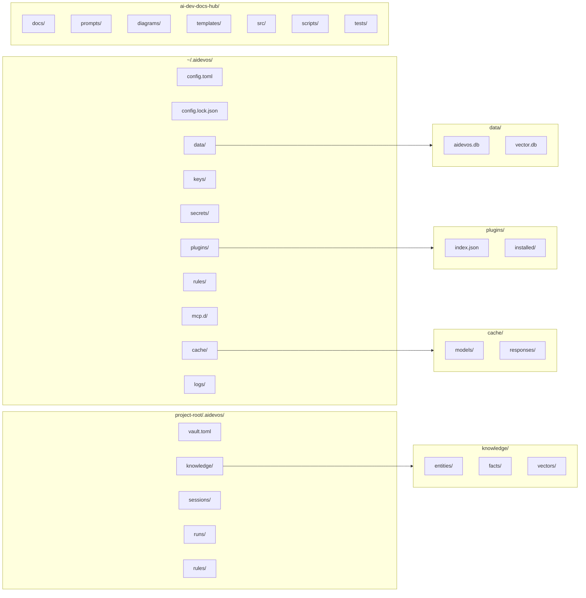

# Folder Structures

> Reference for the directory layouts used by AI Dev OS — the home config vault, workspace vaults, and the project repository itself.

## Overview

AI Dev OS maintains three distinct directory trees: the **user config directory** (`~/.aidevos/`), **workspace vaults** (project-level knowledge stores), and the **repository itself**. Understanding these layouts helps with configuration, debugging, and contributing.

## The `~/.aidevos/` Directory

Created by `aidevos init`. This is the user-level home for all persistent state.

```
~/.aidevos/
├── config.toml           # User configuration (TOML)
├── config.lock.json      # Merged + resolved config (auto-generated)
├── data/
│   ├── aidevos.db        # SQLite database (runs, memory, sessions)
│   └── vector.db         # Vector store (embeddings index)
├── keys/
│   └── ed25519.pem       # Local signing key (auto-generated)
├── secrets/
│   └── (encrypted provider keys, managed by CLI)
├── plugins/
│   ├── index.json        # Installed plugin manifest
│   └── installed/        # Plugin installations (one subdirectory each)
├── rules/
│   └── (user-defined AI coding rules, loaded at startup)
├── mcp.d/
│   └── (MCP server configurations, one file per server)
├── cache/
│   ├── models/           # Cached model metadata
│   └── responses/        # Cached run outputs (TTL-based)
└── logs/
    ├── aidevos.log       # Rotating application log
    └── access.log        # API access log (server mode)
```

### Directory Purposes

| Directory | Purpose |
|-----------|---------|
| `config.toml` | User-level configuration merged with project and system configs. See [Configuration](./CONFIGURATION.md). |
| `config.lock.json` | The resolved, validated config after merging all sources. Read by subsystems. Do not edit manually. |
| `data/` | Persistent storage. `aidevos.db` holds runs, sessions, agent groups, and the fact/entity knowledge graph. `vector.db` holds embedding vectors for semantic search. |
| `keys/` | Auto-generated Ed25519 key pair for signing local requests and envelopes. Regenerated on loss (old signatures become unverifiable). |
| `secrets/` | Encrypted provider API keys and secrets. Managed exclusively through CLI commands; never edit manually. |
| `plugins/` | Plugin registry and installations. `index.json` tracks installed plugins and their versions. See [Plugin SDK](./PLUGIN_SDK.md). |
| `rules/` | User-authored AI coding rules loaded into the Kernel context. Rules are merged with project-level rules at runtime. |
| `mcp.d/` | MCP (Model Context Protocol) server configurations. Each file declares one MCP server endpoint. |
| `cache/` | Ephemeral caches with TTL-based eviction. Safe to delete; re-populated on demand. |
| `logs/` | Application logs. Rotated automatically. Log level and format controlled by `[logging]` config. |

## The Workspace Vault Structure

Each project or workspace gets a vault directory — either `.aidevos/` inside the project root or a dedicated vault path set in config.

```
project-root/
└── .aidevos/                  # Workspace vault (hidden, in project root)
    ├── vault.toml             # Vault metadata (name, description)
    ├── knowledge/
    │   ├── entities/          # Entity definitions (YAML)
    │   ├── facts/             # Fact assertions (YAML)
    │   └── vectors/           # Local vector index
    ├── sessions/
    │   └── (session snapshots, one per active session)
    ├── runs/
    │   └── (recent run logs, synced to global DB)
    └── rules/
        └── (project-specific AI coding rules)
```

Workspace vaults are optional. When present, they layer on top of the global `~/.aidevos/` — data is merged, with the workspace taking precedence for entity/fact resolution.

## The `ai-dev-docs-hub` Repository Structure

This repository — the one containing this document — follows this layout:

```
ai-dev-docs-hub/
├── docs/                      # All documentation (this directory)
│   ├── README.md              # Root index
│   ├── GETTING_STARTED.md     # Getting started guide
│   ├── INSTALLATION.md        # Installation guide
│   ├── CLI.md                 # CLI reference
│   ├── CONFIGURATION.md       # Configuration reference
│   ├── ... (100+ subsystem docs)
│   └── knowledge-bases/       # Knowledge base markdown
├── prompts/                   # Prompt templates and governance
│   ├── templates/             # Reusable prompt fragments
│   ├── system/                # System-level prompts
│   └── governance/            # Prompt policy definitions
├── diagrams/                  # Mermaid and other diagram sources
├── templates/                 # Templates (ADRs, issue templates, etc.)
│   ├── ADR.md                 # Architecture Decision Record template
│   └── issue-template.md      # GitHub issue template
├── src/                       # Source code reference (spec stubs, validation schemas)
│   ├── schemas/               # JSON Schema files for config validation
│   └── examples/              # Example config files and outputs
├── scripts/                   # Utility scripts (lint, validate links, cross-ref)
├── tests/                     # Documentation tests (link checks, schema validation)
├── .github/                   # GitHub workflows, issue templates
├── AGENTS.md                  # Guidance for AI agents editing this repo
└── README.md                  # Repository root README
```

## Directory Tree Visualization



## Structural Conventions

| Convention | Rule | Exception |
|---|---|---|
| One directory per concern | No mixed-content directories | `data/` contains both SQLite DB and vector store |
| Max 3 levels of nesting | Prefer flat over deep | Workspace → project → artifacts is 3; deeper discouraged |
| No empty directories | Always include `.gitkeep` if needed | `cache/` may be empty initially |
| Symlinks for sharing | Never copy; always link | For cross-project artifact access |
| Dot-prefix for internal | `.aidevos/` is hidden | Workspace vaults follow this rule |

## Naming Conventions

| Element | Convention | Examples |
|---|---|---|
| Directory names | `snake_case` | `knowledge/`, `vector_index/`, `persistent_memory/` |
| Config files | `snake_case.toml` | `config.toml`, `vault.toml` |
| Data files | `snake_case.ext` | `aidevos.db`, `vector.usearch` |
| Plugin directories | `kebab-case` | `github-mcp-server/`, `code-reviewer/` |
| Cache entries | `<type>_<key_hash>.<ext>` | `response_abc123.json`, `model_gpt4.json` |
| Log files | `snake_case.log` | `aidevos.log`, `access.log` |

## File Organization Principles

1. **One file per config concern.** Split `mcp.d/` into one file-per-server rather than one monolithic config.
2. **Config before data.** List configuration files (TOML, JSON) before data files (DB, index) in directory listings.
3. **Generated files are marked.** Auto-generated files like `config.lock.json` include a header comment: `# DO NOT EDIT - Auto-generated`.
4. **All paths relative to root.** Internal references use root-relative paths. Never use `..` in data directory references.
5. **Cache is ephemeral.** No file in `cache/` is critical. All cache entries have a TTL and are safe to delete.

## Module Boundary Definitions

| Module | Directory | Boundary | Shared State |
|---|---|---|---|
| Kernel | Binary (embedded) | Process boundary | IPC via SCE event bus |
| Persistent Memory | `data/` | File-level locking | SQLite WAL |
| Vector Index | `vector.db` | File-level locking | In-memory cache + file sync |
| Secrets Vault | `secrets/` | Encrypted files | In-memory only (decrypted) |
| Plugins | `plugins/installed/` | Process sandbox | MCP protocol |
| Rules | `rules/` | Read-only at runtime | Merged into kernel config |

## Test Placement Conventions

| Test Type | Location | Pattern | Runner |
|---|---|---|---|
| Unit tests | Alongside source | `*_test.rs`, `*_test.py` | `cargo test`, `pytest` |
| Integration tests | `tests/` at repo root | `tests/test_*.rs` | `cargo test --test *` |
| Doc tests | Inside doc comments | `/// ``` ... ``` ` | `cargo test --doc` |
| End-to-end tests | `tests/e2e/` | `e2e/test_*.{rs,py}` | Custom runner |
| Property-based tests | Alongside source or `tests/proptest/` | `*_proptest.rs` | `cargo test` with `proptest` |

## Config File Placement Rules

| Config Scope | Location | Priority (higher wins) |
|---|---|---|
| System defaults | Compiled into binary | 0 (lowest) |
| User-level | `~/.aidevos/config.toml` | 1 |
| Workspace-level | `~/.aidevos/data/<ws>/config.toml` | 2 |
| Project-level | `.aidevos/config.toml` | 3 |
| CLI flags / env vars | Runtime | 4 (highest) |

Config merge is additive: scoped overrides only need to specify the keys they differ on.

## Assets Organization

| Asset Type | Location | Format | Versioning |
|---|---|---|---|
| Embedded templates | `templates/` in repo | Markdown, TOML | Git-tracked |
| Default prompts | `prompts/defaults/` | `.prompt` files | Hash-verified on install |
| Documentation images | `docs/images/` | SVG preferred, PNG fallback | Git LFS |
| Release artifacts | GitHub Releases | `.tar.gz`, `.deb`, `.rpm` | Semver tag |
| Test fixtures | `tests/fixtures/` | JSON, TOML, SQL | Git-tracked |

## Build Output Conventions

| Output | Directory | Format | Retention |
|---|---|---|---|
| Compiled binary | `target/release/aidevos` (Rust) | ELF/Mach-O/PE | Rebuild on each release |
| WASM plugins | `target/wasm32-wasi/release/*.wasm` | WASM | Per release |
| Documentation site | `site/` | HTML | Deployed to GitHub Pages |
| Code coverage | `coverage/` | HTML, lcov | CI artifact (30 days) |
| Benchmark results | `benchmark/` | JSON, HTML | Per commit (compared) |

## Monorepo vs Polyrepo Guidance

| Scenario | Recommended Approach | Rationale |
|---|---|---|
| Core + CLIs + plugins | **Monorepo** | Shared types, coordinated releases |
| Independent plugins by separate teams | **Polyrepo** | Independent versioning, access control |
| Docs + schemas + examples | **Monorepo with docs/ subtree** | Single source of truth |
| Client SDKs in multiple languages | **Polyrepo** | Language-specific build tooling |
| Infrastructure configs | **Monorepo** | Atomic changes across infra components |

## Common Anti-Patterns

| Anti-Pattern | Description | Correct Approach |
|---|---|---|
| **Config dump** | All config in one monolithic file | Split into `mcp.d/*.toml`, `rules/*.toml` per concern |
| **Deep nesting** | > 4 levels of subdirectories | Flatten; use tags or indexes instead of nesting |
| **Orphan artifacts** | Build outputs committed to git | Use `.gitignore`; publish artifacts to releases |
| **Cross-tree symlinks** | Symlinks between unrelated workspaces | Use Global KB bridge instead |
| **Mixed case names** | `MyConfig.toml` alongside `data.db` | Enforce `snake_case` everywhere |
| **Cache in git** | `cache/` committed to version control | Add `cache/` to `.gitignore` |

## Failure Modes

| Failure Mode | Description | Indicators | Mitigation | Recovery |
|---|---|---|---|---|
| **Missing directory** | Required directory not created during init | FileNotFound; `doctor` reports missing paths | Validate all dirs on init; create on demand | Run `aidevos init --repair` |
| **Permission escalation** | Plugin writes outside its directory | Unexpected files in `secrets/` or `keys/` | Process sandboxing; read-only mounts | Restore from backup; revoke plugin |
| **Cache stampede** | All cache entries expire simultaneously | High latency; CPU spike | Staggered TTLs; stale-while-revalidate | Cache warms automatically |
| **Config merge conflict** | Conflicting keys across config scopes | Unexpected runtime behavior | Validation on merge; warn on override | Set explicit priority in config |
| **Symlink escape** | Malicious symlink reads outside vault | Unauthorized file access | Disallow symlinks in vault; audit | Seal workspace; investigate |
| **Disk full** | No space for writes | IO errors; `doctor` reports disk | Monitor disk usage; set quotas | Free space or expand storage |
| **Vector index corruption** | `vector.db` index corrupted | Search returns garbage; rebuild needed | Regular backups; journaling | Delete `vector.db`; re-index |

## Folder Structures Observability Metrics

| Metric | Source | Alert Threshold | Description |
|---|---|---|---|
| `fs.dir.missing_count` | Init validator | > 0 | Required directories not found |
| `fs.disk.usage_pct` | Filesystem stat | > 85% | Disk usage percentage |
| `fs.permission_errors` | Access log | > 0 in 24h | Unauthorized file access attempts |
| `fs.cache.hit_ratio` | Cache layer | < 50% | Cache effectiveness |
| `fs.orphan.file_count` | GC scanner | > 100 | Unreferenced files in data directories |
| `fs.symlink.count` | Symlink scanner | > 50 | Total symlinks in vault (increases risk) |

## Folder Structures Acceptance Criteria

- [ ] All required directories created on `aidevos init`
- [ ] Naming conventions enforced by CI lint check
- [ ] No mixed-case directory or file names in critical paths
- [ ] Config files follow one-per-concern principle
- [ ] Cache directories are safe to delete without data loss
- [ ] Build outputs excluded from version control via `.gitignore`
- [ ] Symlinks not permitted in vault directories (security)
- [ ] Permission model prevents cross-workspace file access
- [ ] All `mcp.d/` files validated as valid TOML on load
- [ ] Directory depth ≤ 3 for all non-artifact paths
- [ ] Orphan detection script runs on weekly schedule
- [ ] Monorepo/polyrepo decision documented per component

---

## Related Documents

- [Configuration](./CONFIGURATION.md) — config file format and key reference
- [CLI](./CLI.md) — command reference including vault management
- [Local Dev](./LOCAL_DEV.md) — setting up a development environment
- [Database](./DATABASE.md) — SQLite schema reference
- [Plugin SDK](./PLUGIN_SDK.md) — plugin directory structure and manifest format
- [Secrets Management](./SECRETS_MANAGEMENT.md) — secrets storage encryption
