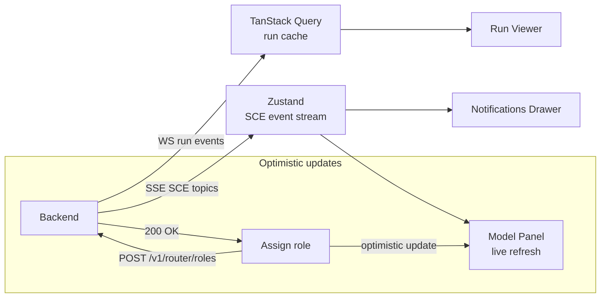

# Frontend

> The web and desktop shell that surfaces every Kernel capability through a responsive, accessible UI — model panel, run viewer, memory explorer, graph visualiser, and voice controls. This document is normative — implementations MUST satisfy every MUST clause below.

## Overview

The Frontend is the primary visual interface for AI Dev OS. It comes in two flavours that share the same codebase:

- **Desktop shell** (Electron / Tauri wrapper): local access, OS integrations (system tray, OS keychain, native file picker).
- **Web shell** (SPA served by the [Backend](./BACKEND.md)): accessible from any browser; used for remote and multi-user deployments.

Both flavours connect to the Backend via HTTP and WebSocket, display a live stream of Kernel run events, and provide first-class UI for every subsystem documented in this repository. Feature parity between desktop and web is a hard requirement.

## Goals

- Feature parity between desktop and web shells.
- First-class UI for all nine subsystems: Kernel runs, Nine Router/model panel, AI Groups, Memory explorer, Knowledge graph, Research Engine, Merge conflicts, Guardian verdicts, Plugin manager.
- Real-time: every SCE event the user cares about surfaces immediately via WebSocket/SSE without a manual refresh.
- Local-first: the web shell works when served from `localhost`; no CDN required.
- Accessible: WCAG 2.1 AA compliance for all interactive surfaces.
- Offline-capable: cached model catalog and last-known run state are available when the Backend is unreachable.

## Non-Goals

- Backend logic — belongs in [Backend](./BACKEND.md).
- Implementation code — this repository is documentation-only (see [AI Coding Rules](./AI_CODING_RULES.md)).
- Mobile-native apps — the web shell is responsive and works on mobile browsers; native apps are post-v1.0.

## Technology Stack

| Concern | Choice |
|---------|--------|
| Framework | React 19 + TanStack Router + TanStack Query |
| Styling | Tailwind CSS v4 + shadcn/ui |
| State | TanStack Query (server state) + Zustand (UI state) |
| Real-time | WebSocket (run events) + SSE (SCE topic tails) |
| Build | Vite + Bun |
| Desktop wrapper | Tauri (Rust) |
| Testing | Playwright (e2e) + Vitest (unit) |
| Diagrams | react-flow (knowledge graph) + recharts (metrics) |
| Icons | Lucide React |
| Accessibility | Radix UI primitives via shadcn/ui |

Stack decisions are tracked as ADRs in [templates/ADR](../templates/ADR.md).

## Application Layout

```
AppShell
├── Sidebar
│   ├── RunsNav (active + recent runs)
│   ├── ModelsNav (Nine Router quick-access)
│   ├── GroupsNav
│   └── MemoryNav
├── CommandBar (global ⌘K / Ctrl+K)
├── NotificationsDrawer (SCE events, Guardian verdicts, conflicts)
└── MainContent (routed panels — see below)
```

## Pages and Panels

### Dashboard (`/`)

- Active runs widget: count + state distribution.
- Recent runs list with status badge, goal summary, and elapsed time.
- Model panel summary: nine roles + current model per role.
- Freshness indicators: KB staleness, last Research Engine run.
- System health: SCE, Memory, Router, Guardian status chips.

### Run Viewer (`/runs/:id`)

- Real-time event stream from SCE `run.<id>` topic.
- Task graph visualisation: DAG of tasks with per-node state badges.
- Per-task artifact panel: streaming text output with token counter.
- Tool call log: expandable table of tool calls and results.
- Budget gauge: tokens / wall time / cost used vs. budget.
- Guardian verdict panel: ok/veto badges, violation list with fix hints.
- Merge conflict panel (when applicable): side-by-side diff with resolve actions.
- Cancel / Replay / Share buttons.

### Model Panel (`/models`)

The Nine Router UI. Divided into two halves:

**Left: Model catalog**
- Provider accordion (Local → OpenAI → Anthropic → Google → Mistral → MCP → User-registered).
- Per-provider: model count, freshness timestamp, error badge + Retry if degraded.
- Model list: searchable, filterable by capability/context/status.
- Model card: id, display name, context window, capabilities chips, pricing, deprecation status.
- **Refresh All** button + per-provider Refresh.

**Right: Role assignment panel**
- Nine-role table: role name, current model, fallback chain list.
- Drag-and-drop model → role assignment.
- Fallback chain editor: reorder, add, remove.
- Scope selector: Workspace / Project / Group override.
- **"Pick for me"** smart-assign button per role.

### AI Groups (`/groups`)

- Group list: id, name, mission, active worker count, status.
- Group detail: GroupSpec display (roles, tools, KB scope, playbooks).
- Group health panel: circuit breaker state, crash count, queue depth.
- Spawn group manually (for debugging).

### Memory Explorer (`/memory`)

- Search bar: text query (semantic + FTS hybrid).
- Filters: kind, workspace, project, group, tags, retention, date range.
- Result list: record card with kind badge, text preview, tags, source.
- Record detail: full text, embedding dimensions, refs, provenance.
- Write record form (for manual KB entries).
- Export button (JSON / Markdown).

### Knowledge Graph (`/graph`)

- Interactive force-directed graph (react-flow) of all vault nodes.
- Node types: doc, prompt, diagram, template, KB entry, playbook.
- Edge types: wikilink, backlink, tag, semantic (dashed, weight-weighted).
- Controls: zoom, filter by node kind, filter by edge kind, depth slider.
- Node detail panel: title, tags, word count, backlink count, semantic neighbours.
- Path query: enter two node IDs, visualise shortest path.
- Refresh / Rebuild graph button.

### Research Engine (`/research`)

- Job list: source, cadence, state, last run, next run.
- Schedule job form: source type picker, URL, cadence, KB target.
- Job detail: artifact list with changed/unchanged badges, diff summary expandable.
- Freshness heatmap: KB tiers with staleness colour coding.

### Merge Conflicts (`/conflicts`)

- Active conflicts list: path, run ID, worker IDs, age.
- Conflict detail: side-by-side diff (HEAD_A vs HEAD_B on BASE).
- Resolution actions: Accept A / Accept B / Edit manually / Abort.
- Conflict history: resolved conflicts with resolution method and actor.

### Guardian Verdicts (`/guardian`)

- Verdict list: run ID, artifact, ok/veto, top violation.
- Verdict detail: full violation list with rule ID, severity, message, fix hint.
- Rule list: active rules, severity, scope, version.
- Add/edit custom rule form (YAML DSL with live lint).

### Plugin Manager (`/plugins`)

- Installed plugins: name, version, state, capabilities.
- Install from registry / local path.
- Enable / Disable / Uninstall.
- Consent manager: per-plugin capability grant/revoke.
- Plugin tool tester: call any plugin tool with JSON args.

### Voice (`/voice`)

- Session status: idle / listening / processing / speaking.
- Wake-word status and sensitivity slider.
- STT backend selector (Nine Router Voice role).
- TTS voice selector and preview.
- Transcript history for current session.
- Push-to-talk button (for non-wake-word mode).

### Settings (`/settings`)

- Configuration editor: grouped by `[server]`, `[database]`, `[models]`, `[sce]`, `[vector]`.
- Secrets panel: list keys, add/delete (values never shown).
- Theme: light / dark / system.
- Shortcuts reference.

## Real-Time Data Flow



All server state is managed by TanStack Query with:
- **Stale-while-revalidate** for model catalog and group list.
- **Real-time invalidation** on SCE events: a `router.assignments` event invalidates the `/v1/router/roles` query.
- **Optimistic updates** for role assignment, memory writes, and plugin enable/disable.

## Requirements

- **MUST** achieve feature parity between desktop and web shells for all v1.0 capabilities.
- **MUST** connect to the Backend's WebSocket endpoint and stream run events to the Run Viewer in real time.
- **MUST** implement the Nine Router model panel with provider accordion, search, filter, and role assignment.
- **MUST** surface Guardian vetoes and Merge conflicts in the Notifications Drawer within 500 ms of the SCE event.
- **MUST** be accessible at WCAG 2.1 AA level for all interactive elements.
- **MUST** work in offline mode (Backend unreachable): render last-cached model catalog and run list with a clear "offline" banner.
- **MUST** never expose secrets in the UI; the Secrets panel shows key names only.
- **SHOULD** support keyboard navigation for all panels and ⌘K / Ctrl+K command palette.
- **SHOULD** support dark mode via a system preference toggle.
- **MAY** support custom themes via CSS variables.
- **MAY** embed a code editor (Monaco) in the Run Viewer for artifact viewing with syntax highlighting.

## Failure Modes

| Mode | Detection | Response |
|------|-----------|----------|
| Backend unreachable | WebSocket/HTTP connection failure | Show offline banner; serve cached data; retry with exponential backoff |
| SCE stream disconnected | WebSocket close event | Reconnect with exponential backoff; show "reconnecting" status |
| Model catalog empty | Empty response from `/v1/models` | Show empty state with "Run `aidevos models refresh`" hint |
| Run event stream dropped | WebSocket close during run | Fetch missed events via REST on reconnect; resume stream |
| Guardian verdict critical | `verdict.ok == false` | Show full-screen alert with violation details; block "Deliver" action |

## Observability

- Frontend errors are reported to the Backend via `POST /v1/frontend/errors` with stack traces and browser/version info.
- Web Vitals (LCP, FID, CLS) are tracked and reported as metrics.
- WebSocket reconnection events are logged.

## Acceptance Criteria

- The Model Panel renders all discovered models grouped by provider within 1 s of loading, on a machine with Ollama and OpenAI configured.
- Assigning a model to the Builder role via drag-and-drop reflects in `GET /v1/router/roles` within 200 ms.
- A Guardian veto on an active run appears in the Notifications Drawer within 500 ms.
- The app renders without errors in Chrome, Firefox, and Safari on macOS; in Chrome and Edge on Windows.
- `axe` automated accessibility audit reports 0 violations at AA level on the Dashboard, Run Viewer, and Model Panel.

## Open Questions

- Desktop wrapper: Electron (larger binary, mature ecosystem) vs. Tauri (smaller binary, Rust backend) — tracked in [templates/ADR](../templates/ADR.md).
- Whether the Knowledge Graph should use a Canvas renderer (WebGL, better performance at scale) or SVG (react-flow, simpler).

## Related Documents

- [Backend](./BACKEND.md)
- [API Spec](./API_SPEC.md)
- [Nine Router](./NINE_ROUTER.md)
- [UI/UX](./UI_UX.md)
- [Voice System](./VOICE_SYSTEM.md)
- [Obsidian Graph Engine](./OBSIDIAN_GRAPH_ENGINE.md)
- [System Overview](./SYSTEM_OVERVIEW.md)
- [Main AI Kernel](./MAIN_AI_KERNEL.md)
- [Architecture Guardian](./ARCHITECTURE_GUARDIAN.md)
