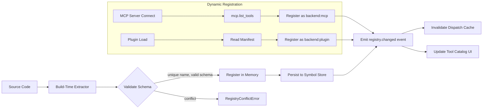
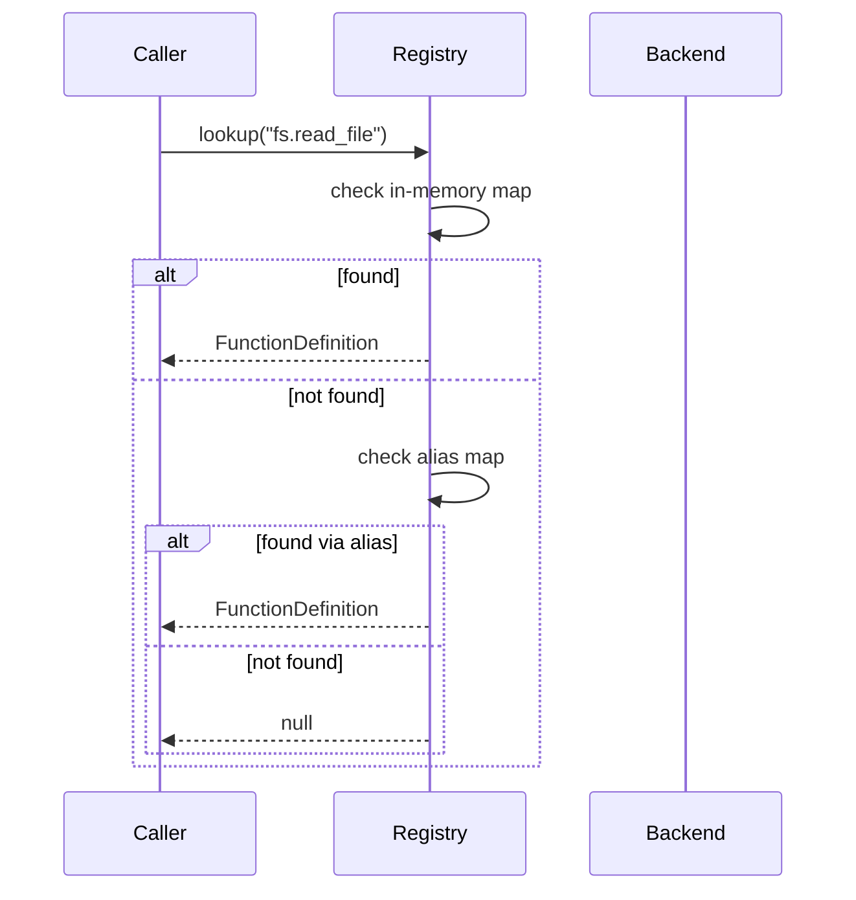

# Function Registry

**Component ID:** core.function-registry  
**Status:** Active  
**Version:** 1.1.0  
**Last Updated:** 2026-07-22

---

## Overview

The Function Registry is a specialized catalog of every callable function available to the system — including built-in kernel functions, MCP tool invocations, plugin hooks, and agent-defined callables. Unlike the general-purpose Symbol Registry, the Function Registry enriches each entry with execution metadata: input/output schemas, cost estimates, backend routing hints, and observability labels.

This registry is the single source of truth for tool-calling dispatch, function discovery (both for human developers and LLM agents), and cost-aware scheduling. Every function that can be invoked — whether by a user, an agent, or another function — must be registered here before it becomes available at runtime.

---

## FunctionDefinition Schema

Each registered function conforms to `FunctionDefinition`:

| Field          | Type               | Description                                                 |
|----------------|--------------------|-------------------------------------------------------------|
| `name`         | `string`           | Unique dot-separated name (e.g. `fs.read_file`)             |
| `description`  | `string`           | Human-readable purpose statement                            |
| `input_schema` | `JSONSchema`       | JSON Schema v2020-12 describing valid arguments             |
| `output_schema`| `JSONSchema`       | JSON Schema describing the return value                     |
| `backend`      | `"local" \| "remote" \| "mcp" \| "plugin"` | Execution environment |
| `cost`         | `CostTier`         | Enum: `free`, `cheap`, `moderate`, `expensive`              |
| `timeout_ms`   | `number`           | Maximum allowed execution time                              |
| `idempotent`   | `boolean`          | Safe to re-call without side effects                        |
| `tags`         | `Array<string>`    | Classification tags (e.g. `filesystem`, `network`, `dangerous`) |

```typescript
type CostTier = "free" | "cheap" | "moderate" | "expensive";

interface FunctionDefinition {
  name: string;
  description: string;
  input_schema: Record<string, unknown>;
  output_schema: Record<string, unknown>;
  backend: "local" | "remote" | "mcp" | "plugin";
  cost: CostTier;
  timeout_ms: number;
  idempotent: boolean;
  tags: string[];
}
```

---

## Built-in Functions

The following functions are registered at startup:

| Name                      | Backend   | Cost       | Idempotent | Description                           |
|---------------------------|-----------|------------|------------|---------------------------------------|
| `fs.read_file`            | local     | free       | true       | Read file contents                    |
| `fs.write_file`           | local     | cheap      | true       | Write content to file                 |
| `fs.list_directory`       | local     | free       | true       | List directory entries                |
| `code.search`             | local     | cheap      | true       | Grep/glob across codebase             |
| `code.edit`               | local     | moderate   | false      | Apply structured edit to a file       |
| `code.run_tests`          | local     | expensive  | false      | Execute test suite                    |
| `llm.chat`                | remote    | expensive  | false      | Send prompt to LLM                    |
| `llm.embed`               | remote    | moderate   | true       | Generate text embeddings              |
| `mcp.list_tools`          | mcp       | free       | true       | Enumerate MCP tools                   |
| `mcp.call_tool`           | mcp       | cheap      | false      | Invoke an MCP server tool             |
| `network.http_get`        | remote    | cheap      | true       | Fetch URL via GET                     |
| `network.http_post`       | remote    | cheap      | false      | POST to URL                           |
| `secrets.get`             | local     | free       | true       | Retrieve a secret by key              |
| `plugin.invoke`           | plugin    | moderate   | false      | Call a registered plugin hook         |

---

## Registration Flow

1. **Declaration** — A function is defined in source code with an explicit or inferred schema.
2. **Extraction** — A build-time or runtime extractor parses the definition and constructs a `FunctionDefinition`.
3. **Validation** — The registry validates uniqueness of `name`, well-formedness of schemas, and enum values for `backend` and `cost`.
4. **Registration** — The definition is inserted into the in-memory registry and persisted to the symbol store.
5. **Publishing** — A registry change event is emitted, triggering cache invalidation and UI updates.

Registration is idempotent: re-registering the same `name` with identical schemas is a no-op. Conflicts (same name, different schema) raise `RegistryConflictError`.

---

## Discovery for MCP / Plugin Functions

MCP server tools and plugin functions are discovered dynamically rather than declared at build time. The flow differs:

- **MCP:** On MCP server connection, the registry calls `mcp.list_tools` and registers each returned `Tool` as a `FunctionDefinition` with `backend: "mcp"`. If an MCP server disconnects, its tools are removed.
- **Plugin:** Plugin manifests declare exported hooks. The registry reads each manifest at plugin load time, validates schemas, and registers them with `backend: "plugin"`. Plugin functions are unregistered on plugin unload.

Dynamic registrations are tagged with a `source` metadata field to enable rollback on disconnection.

---

## Interfaces

### `registry.register(fn: FunctionDefinition): void`
Insert or update a function. Throws on schema conflict.

### `registry.lookup(name: string): FunctionDefinition | null`
Resolve a function by name.

### `registry.find_by_tag(tag: string): Array<FunctionDefinition>`
List all functions matching a given tag.

### `registry.filter(criteria: Partial<FunctionDefinition>): Array<FunctionDefinition>`
General-purpose query by any field.

### `registry.list_by_backend(backend: string): Array<FunctionDefinition>`
Return all functions for a specific execution backend.

---

## Integration with Tool Calling

The Tool Calling subsystem queries the registry before dispatch:

1. Receives a function name and arguments.
2. Calls `registry.lookup(name)` to retrieve the definition.
3. Validates arguments against `input_schema`.
4. Routes to the correct backend using the `backend` field.
5. Respects `timeout_ms` as the deadline.
6. Records execution cost from the `cost` field in the observability pipeline.

---

## Observability

Every function call is traced with:

- `function.name` — the registered name
- `function.cost` — cost tier
- `function.backend` — execution backend
- `duration_ms` — wall-clock execution time
- `success` — boolean outcome
- `error` — error message on failure

Aggregated metrics (call count, p50/p95/p99 latency, error rate, total cost) are exposed via Prometheus at `:9090/metrics`.

---

## Registration Flow Diagram



## Full Interface Specifications

```
interface FunctionRegistry {
  register(fn: FunctionDefinition): void
  lookup(name: string): FunctionDefinition | null
  find_by_tag(tag: string): FunctionDefinition[]
  filter(criteria: Partial<FunctionDefinition>): FunctionDefinition[]
  list_by_backend(backend: string): FunctionDefinition[]
  list(): FunctionDefinition[]
  count(): number
  clear(): void
  on(event: "registered" | "unregistered" | "changed", handler): void
}
```

### `register(fn)` — Detailed workflow:

1. Validates `name` uniqueness — case-sensitive, dot-separated path.
2. Validates `input_schema` and `output_schema` against JSON Schema v2020-12 meta-schema.
3. Validates `backend` ∈ {`local`, `remote`, `mcp`, `plugin`}.
4. Validates `cost` ∈ {`free`, `cheap`, `moderate`, `expensive`}.
5. If `name` already exists and schema differs → throw `RegistryConflictError`.
6. If `name` already exists and schema matches → no-op (idempotent).
7. Inserts into in-memory `Map<name, FunctionDefinition>`.
8. Persists to symbol store (async, non-blocking).
9. Emits `registered` event.

### `lookup(name)` — Resolution strategy:



## Function Signature Schema

```typescript
interface FunctionDefinition {
  name: string;             // e.g. "fs.read_file"
  description: string;      // human-readable purpose
  input_schema: {           // JSON Schema v2020-12
    type: "object",
    properties: Record<string, SchemaProperty>,
    required: string[],
    additionalProperties: boolean
  };
  output_schema: {          // JSON Schema v2020-12
    type: "object" | "string" | "array" | "null",
    properties?: Record<string, SchemaProperty>
  };
  backend: "local" | "remote" | "mcp" | "plugin";
  cost: CostTier;           // "free" | "cheap" | "moderate" | "expensive"
  timeout_ms: number;       // max execution time
  idempotent: boolean;      // safe to retry without side effects
  tags: string[];           // classification tags
  source?: string;          // origin identifier for dynamic registrations
  version?: string;         // function version for conflict resolution
}
```

## Overload Resolution

When multiple functions share the same `name` but differ in `input_schema`:

1. The registry stores the most recently registered version.
2. A `name@version` syntax allows explicit version targeting.
3. The tool caller performs best-effort schema matching at dispatch:
   - If arguments match exactly one schema → use that function.
   - If arguments match multiple → use the highest version.
   - If arguments match none → raise `NoMatchingOverloadError`.

Overloads are discouraged. Prefer unique names over shared names with different schemas.

## Discovery API

```
GET /v1/functions
  Query: ?tag=dangerous&backend=mcp&cost=free
  Response: FunctionDefinition[]

GET /v1/functions/{name}
  Response: FunctionDefinition | { error: "not_found" }

POST /v1/functions/search
  Body: { query: string, filter?: Partial<FunctionDefinition> }
  Response: FunctionDefinition[]
```

## Failure Modes

| Mode | Detection | Response |
|------|-----------|----------|
| Schema validation failure | JSON Schema validation error | Reject registration; return validation errors |
| Name conflict | Duplicate name with different schema | Raise `RegistryConflictError`; caller must rename |
| MCP tool discovery failure | `mcp.list_tools` fails/timeouts | Log warning; retry on next connect; use cached tools |
| Plugin manifest parse error | Invalid YAML/JSON in manifest | Log error; skip plugin; continue loading others |
| Backend routing failure | Target backend unavailable | Fall back to default backend if possible; log error |
| Memory pressure | Registry exceeds memory threshold | Trigger compaction of stale entries; warn |

## Observability / Metrics

| Metric | Type | Labels | Description |
|--------|------|--------|-------------|
| `func_registry_total` | Gauge | — | Total registered functions |
| `func_registry_registrations_total` | Counter | backend, status | Registration attempts |
| `func_registry_lookups_total` | Counter | status (hit/miss) | Lookup attempts |
| `func_registry_lookup_duration_ms` | Histogram | — | Lookup latency |
| `func_registry_conflicts_total` | Counter | — | Registration conflicts |
| `func_registry_dynamic_added_total` | Counter | source (mcp/plugin) | Dynamic registrations |
| `func_registry_dynamic_removed_total` | Counter | source | Dynamic unregistrations |

## Acceptance Criteria

- Registering a valid `FunctionDefinition` makes it immediately available via `lookup()`.
- Re-registering the same name with the same schema is a no-op (idempotent).
- Re-registering the same name with a different schema raises `RegistryConflictError`.
- Dynamic registration via MCP tool discovery adds functions visible in `list_by_backend("mcp")`.
- Removing a plugin unregisters all associated functions.
- The registry survives process restart via the symbol store persistence layer.

## Related Documents

- SYMBOL_REGISTRY.md — General-purpose symbol tracking
- CLASS_REGISTRY.md — Class/type definition catalog
- VARIABLE_REGISTRY.md — Environment variable and config tracking
- ARCHITECTURE_GUARDIAN.md — System-wide architectural enforcement
