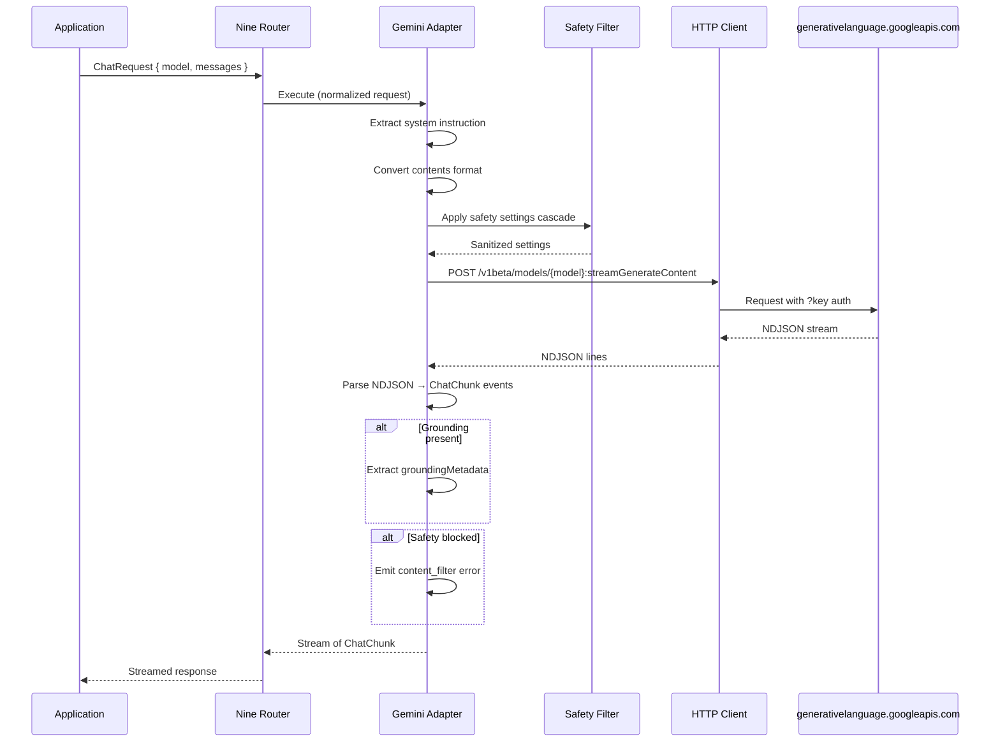

# Google Integration

> Google/Gemini provider configuration for Nine Router. All model access flows through Nine Router at `http://localhost:20128/v1`. See [Nine Router Integration](./NINE_ROUTER_INTEGRATION.md).

## Overview

This document describes how to register and configure Google Gemini as a provider within the [Nine Router](./NINE_ROUTER.md) provider registry. Once configured, AI Dev OS accesses Gemini models through Nine Router — never directly. Nine Router handles format translation.

The Google adapter inside Nine Router connects to Gemini models via `generativelanguage.googleapis.com`. Google uses a resource-oriented REST API with query-parameter authentication and NDJSON streaming. The adapter normalizes these to the standard `ChatRequest` / `ChatChunk` interface.

## Endpoint Configuration

```
base_url: https://generativelanguage.googleapis.com/v1beta
auth:     ?key=${GOOGLE_API_KEY}   # Managed in Nine Router Secrets
```

API keys **MUST** be provisioned from [Google AI Studio](https://aistudio.google.com/app/apikey) and read from [Secrets Management](./SECRETS_MANAGEMENT.md).

```yaml
providers:
  google:
    api_key: ${GOOGLE_API_KEY}
    base_url: https://generativelanguage.googleapis.com/v1beta
```

## Models

| Model ID | Context | Max output | Pricing (input / output per MTok) | Capabilities |
|----------|---------|-----------|-----------------------------------|--------------|
| `gemini-2.5-pro-exp-03-25` | 1,048,576 | 65,536 | $1.25–$10.00 / $5.00–$40.00 | Text, vision, audio, code exec, grounding, function calling |
| `gemini-2.5-flash-preview-04-17` | 1,048,576 | 65,536 | $0.15–$0.60 / $0.60–$2.40 | Text, vision, audio, grounding, function calling |
| `gemini-2.0-flash-lite-preview-02-05` | 1,048,576 | 8,192 | $0.075–$0.30 / $0.30–$1.20 | Text, vision, function calling |

Pricing tiers: requests up to 200K tokens use the lower price; exceeding 200K uses the higher price.

## API Format

### Request

```
POST /v1beta/models/{model}:streamGenerateContent?key={key}
{
  "contents": [{ "role": "user", "parts": [{ "text": "Hello" }] }],
  "systemInstruction": { "parts": [{ "text": "You are a helpful assistant." }] },
  "generationConfig": { "temperature": 0.7, "maxOutputTokens": 4096 },
  "safetySettings": [
    { "category": "HARM_CATEGORY_HARASSMENT", "threshold": "BLOCK_MEDIUM_AND_ABOVE" },
    { "category": "HARM_CATEGORY_HATE_SPEECH", "threshold": "BLOCK_MEDIUM_AND_ABOVE" },
    { "category": "HARM_CATEGORY_SEXUALLY_EXPLICIT", "threshold": "BLOCK_MEDIUM_AND_ABOVE" },
    { "category": "HARM_CATEGORY_DANGEROUS_CONTENT", "threshold": "BLOCK_MEDIUM_AND_ABOVE" }
  ]
}
```

### Streaming

Response is NDJSON (one JSON object per line). The adapter **MUST**:

1. Parse each line as independent JSON.
2. Extract `candidates[0].content.parts[0].text` as token delta.
3. Track `candidates[0].finishReason` for completion.
4. Emit `ChatChunk { type: "token", delta }` per non-empty text part.
5. On finish, emit `ChatChunk { type: "finish", finish_reason, usage }` from `usageMetadata`.

## System Instruction

Google uses a top-level `systemInstruction` field. The adapter **MUST** extract the first `system`-role message and place it there. Omit if no system message exists.

## Grounding with Google Search

```json
{
  "tools": [{ "googleSearchGrounding": {} }]
}
```

Response includes `groundingMetadata` with source URLs and confidence scores. The adapter **MUST** propagate this as structured metadata on the final `ChatChunk`. Grounding is available on Gemini 2.5 and 2.0 Flash models at higher pricing tiers.

## Safety Settings

| Threshold | Behavior |
|-----------|----------|
| `BLOCK_ONLY_HIGH` | Block only on HIGH probability |
| `BLOCK_MEDIUM_AND_ABOVE` | Block on MEDIUM or HIGH (default) |
| `BLOCK_LOW_AND_ABOVE` | Block on LOW+, MEDIUM+, or HIGH |
| `BLOCK_NONE` | Always show |

Categories: `HARM_CATEGORY_HARASSMENT`, `HARM_CATEGORY_HATE_SPEECH`, `HARM_CATEGORY_SEXUALLY_EXPLICIT`, `HARM_CATEGORY_DANGEROUS_CONTENT`, `HARM_CATEGORY_CIVIC_INTEGRITY`.

When blocked, `finishReason` is `SAFETY`. The adapter surfaces `ChatChunk { type: "error", finish_reason: "content_filter" }`.

## Rate Limits

| Tier | Requests/min | Tokens/min |
|------|-------------|------------|
| Free | 60 | 1,000,000 |
| Pay-as-you-go | 2,000 | 4,000,000 |

The adapter **MUST** track `x-ratelimit-remaining` and `x-ratelimit-reset` headers. Google does not use `Retry-After` — wait for the duration in `x-ratelimit-reset`.

## Error Codes

| HTTP | Status | Adapter action |
|------|--------|----------------|
| 400 | `INVALID_ARGUMENT` | Surface validation error |
| 401 | `UNAUTHENTICATED` | Mark `auth_error` |
| 403 | `PERMISSION_DENIED` | Mark `auth_error`; check key scope |
| 404 | `NOT_FOUND` | Trigger re-discovery |
| 429 | `RESOURCE_EXHAUSTED` | Backoff; mark `rate_limited` |
| 429 | `QUOTA_EXCEEDED` | Mark `quota_exceeded`; billing alert |
| 500+ | Internal | Retry × 3 exponential backoff; mark `degraded` |

## Adapter Flow



## System Instruction Extraction Algorithm

Google uses a top-level `systemInstruction` field separate from `contents`. The adapter MUST extract the first `system`-role message:

```
function extractSystemInstruction(messages):
    if messages[0].role == "system":
        si = messages.shift()
        return { parts: [{ text: si.content }] }
    // Also handle: look for any system message in the array
    for i, msg in enumerate(messages):
        if msg.role == "system":
            messages.splice(i, 1)
            return { parts: [{ text: msg.content }] }
    return null  // no system instruction
```

If no system message exists, omit the `systemInstruction` field entirely. The adapter MUST verify that after extraction, no system-role messages remain in `contents`.

## Safety Setting Cascade

Safety thresholds are applied in a cascading order based on the application's safety profile:

```
safetyProfiles = {
    default: {
        harassment: BLOCK_MEDIUM_AND_ABOVE,
        hate_speech: BLOCK_MEDIUM_AND_ABOVE,
        sexually_explicit: BLOCK_MEDIUM_AND_ABOVE,
        dangerous_content: BLOCK_MEDIUM_AND_ABOVE,
        civic_integrity: BLOCK_MEDIUM_AND_ABOVE
    },
    strict: {
        harassment: BLOCK_LOW_AND_ABOVE,
        hate_speech: BLOCK_LOW_AND_ABOVE,
        sexually_explicit: BLOCK_LOW_AND_ABOVE,
        dangerous_content: BLOCK_LOW_AND_ABOVE,
        civic_integrity: BLOCK_LOW_AND_ABOVE
    },
    relaxed: {
        harassment: BLOCK_ONLY_HIGH,
        hate_speech: BLOCK_ONLY_HIGH,
        sexually_explicit: BLOCK_ONLY_HIGH,
        dangerous_content: BLOCK_ONLY_HIGH,
        civic_integrity: BLOCK_NONE
    }
}

function resolveSafetySettings(config):
    base = safetyProfiles[config.safetyProfile ?? "default"]
    // Merge user overrides
    for override in config.safetyOverrides:
        base[override.category] = override.threshold
    return toGeminiFormat(base)
```

## Grounding Metadata Processing

When Google Search Grounding is enabled, the response includes grounding metadata:

```
type GroundingMetadata = {
    groundingChunks: Array<{
        web: { uri: string, title: string }
        retrievedContext: { text: string }
    }>
    groundingSupports: Array<{
        segment: { text: string, startIndex: number, endIndex: number }
        groundingChunkIndices: number[]
        confidenceScores: number[]
    }>
    webSearchQueries: string[]
}

function processGrounding(metadata):
    return {
        sources: metadata.groundingChunks.map(c => ({
            uri: c.web.uri,
            title: c.web.title
        })),
        supports: metadata.groundingSupports.map(s => ({
            text: s.segment.text,
            sourceIndices: s.groundingChunkIndices,
            confidence: average(s.confidenceScores)
        })),
        queries: metadata.webSearchQueries
    }
```

The processed metadata is attached to the final `ChatChunk` and surfaced to the caller for citation rendering.

## NDJSON Stream Parsing Algorithm

```
async function parseGeminiStream(response):
    // NDJSON: one JSON object per line (not SSE)
    let buffer = ""
    let fullText = ""
    let usage = null
    let finishReason = null
    for await chunk of response.body:
        buffer += chunk.toString()
        let lines = buffer.split("\n")
        buffer = lines.pop()  // keep incomplete line
        for line of lines:
            if line.trim() == "": continue
            let obj = JSON.parse(line)
            let candidate = obj.candidates?.[0]
            if candidate?.content?.parts?.[0]?.text:
                let text = candidate.content.parts[0].text
                emit({ type: "token", delta: text })
                fullText += text
            if candidate?.finishReason:
                finishReason = candidate.finishReason
            if obj.usageMetadata:
                usage = obj.usageMetadata
            if candidate?.groundingMetadata:
                emit({ type: "grounding", metadata: candidate.groundingMetadata })
            if candidate?.safetyRatings:
                if candidate.finishReason == "SAFETY":
                    emit({ type: "error", finish_reason: "content_filter" })
    // Final emission
    if finishReason:
        emit({ type: "finish", finish_reason: finishReason, usage })
```

## Context Caching Strategy

For large contexts (> 50 K tokens), the adapter uses Google's context caching API to reduce costs:

```
function shouldUseCache(messages):
    totalTokens = countTokens(messages)
    return totalTokens > 50_000

async function cachedRequest(messages, config):
    if not shouldUseCache(messages):
        return directRequest(messages, config)
    cacheKey = hash(messages.slice(0, -1))  // exclude last user message
    cached = await cacheStore.get(cacheKey)
    if cached and not expired(cached, config.cacheTTL ?? 300):
        return directRequest(messages.slice(-1), { ...config, cachedContent: cached.name })
    // Create new cache
    cachedContent = await apiClient.post(
        "/v1beta/cachedContents",
        { model: config.model, contents: messages.slice(0, -1), ttl: "300s" }
    )
    await cacheStore.set(cacheKey, { name: cachedContent.name, expires: cachedContent.expireTime })
    return directRequest(messages.slice(-1), { ...config, cachedContent: cachedContent.name })
```

Cache TTL defaults to 5 minutes. Cache is automatically invalidated if the underlying model version changes.

## Function Calling Format Differences

While Google supports function calling, the format differs from OpenAI's schema:

| Aspect | OpenAI / Mistral | Google Gemini |
|--------|-----------------|---------------|
| Tool definition | `tools[].function` | `tools[].functionDeclarations` |
| Parameters | JSON Schema object | JSON Schema (same format, different key) |
| Tool choice | `tool_choice: "auto"` | `toolConfig: { functionCallingConfig: { mode: "AUTO" } }` |
| Tool call in response | `delta.tool_calls[].function` | `candidates[].content.parts[].functionCall` |
| Tool result | `role: "tool", tool_call_id` | `role: "function", parts[{ functionResponse }]` |
| Parallel calls | Multiple in single chunk | Multiple functionCall parts in one part array |

The adapter normalizes these differences internally so the Nine Router sees a unified interface.

## Error Classification with Recovery

| Category | HTTP/Error Code | Detection | Recovery Action |
|----------|----------------|-----------|-----------------|
| Safety block | `SAFETY` finishReason | Response stream | Surface as `content_filter`; do not retry |
| Model overload | 429 / `RESOURCE_EXHAUSTED` | Response status | Backoff and retry × 3; fallback if persistent |
| Grounding unavailable | 400 / grounding not supported | Response body | Retry without grounding; alert operator |
| Auth failure | 401 / `UNAUTHENTICATED` | Response status | Mark `auth_error`; trigger key re-resolution |
| Permission denied | 403 / `PERMISSION_DENIED` | Response status | Mark `auth_error`; check key scope |
| Model not found | 404 / `NOT_FOUND` | Response status | Trigger Model Discovery re-scan; fallback |
| Context too large | 400 / context exceeds limit | Response body | Fall back to context caching; truncate if still too large |
| Server error | 500+ | Response status | Retry × 3 with exponential backoff; mark `degraded` |
| Stream corruption | NDJSON parse failure | Parse error | Reconnect stream; resume from last known good offset |

## Failure Modes

| Mode | Detection | Response |
|------|-----------|----------|
| Safety block | `finishReason: "SAFETY"` in stream | Surface `content_filter` error; do not retry; log prompt for review |
| Model overload | HTTP 429 + `RESOURCE_EXHAUSTED` | Backoff with `x-ratelimit-reset`; fallback to alternative model |
| Grounding unavailable | 400 error when grounding enabled | Retry without grounding parameter; alert operator |
| Context window exceeded | 400 "context too large" | Activate context caching; if still too large, truncate oldest messages |
| Auth key expired | 401 after previously working | Trigger key rotation via Secrets Management; alert |
| Streaming broken mid-response | Unexpected end of NDJSON stream | Reconnect from last buffered token; fail if cannot resume |
| Rate limit exceeded | 429 responses > 50 % of requests in 5 min | Circuit-break for 60 s; alert via Observability |

## Observability Metrics

| Metric | Type | Labels | Description |
|--------|------|--------|-------------|
| `gemini_call_total` | Counter | `{endpoint, model, ok}` | Total API calls |
| `gemini_call_seconds` | Histogram | `{endpoint, model}` | Request duration |
| `gemini_stream_duration_seconds` | Histogram | `{model}` | End-to-end NDJSON stream duration |
| `gemini_tokens_total` | Counter | `{model, direction}` | Input/output token count |
| `gemini_safety_blocks_total` | Counter | `{category}` | Safety block events by category |
| `gemini_grounding_requests_total` | Counter | `{model}` | Requests with grounding enabled |
| `gemini_rate_limit_remaining` | Gauge | `{tier}` | Remaining requests per window |
| `gemini_errors_total` | Counter | `{category}` | Errors by category |
| `gemini_cache_hits_total` | Counter | `{model}` | Context cache hits |
| `gemini_cache_creations_total` | Counter | `{model}` | Context cache entries created |
| `gemini_cost_usd_total` | Counter | `{model}` | Accumulated cost |

## Acceptance Criteria

- A chat completion returns NDJSON lines parsed into token chunks ending with a `finish` chunk.
- A system message is correctly extracted from messages and placed in `systemInstruction`.
- Safety settings cascade is applied: strict profile blocks more content than default.
- Grounding metadata (when grounding is enabled) is parsed and included in the final chunk.
- A safety-blocked response surfaces as `content_filter` error without retry.
- A 429 response with `x-ratelimit-reset` delays the retry by the reset duration.
- Context caching is activated for requests exceeding 50 K tokens.
- Function calls from Gemini are normalized to the unified `tool_call` format.
- All calls produce metrics counters and histogram observations.

## Related Documents

- [Model Providers](./MODEL_PROVIDERS.md)
- [Nine Router](./NINE_ROUTER.md)
- [Cost Management](./COST_MANAGEMENT.md)
- [Model Discovery](./MODEL_DISCOVERY.md)
- [Secrets Management](./SECRETS_MANAGEMENT.md)
- [Streaming Responses](./STREAMING_RESPONSES.md)
- [Tool Calling](./TOOL_CALLING.md)
