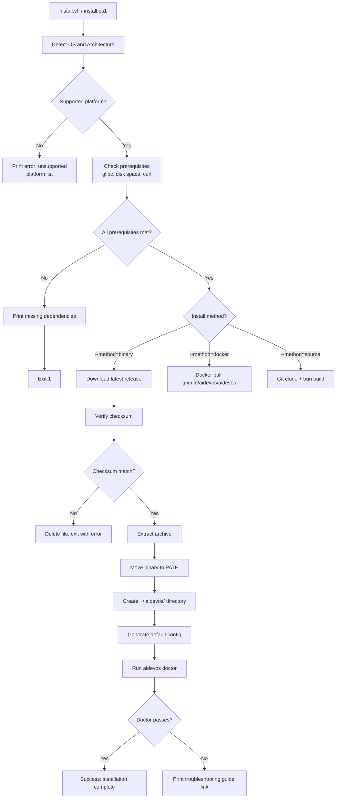

# Installation

> Detailed installation guide for AI Dev OS across all supported platforms.

## Overview

AI Dev OS is a local-first system. It requires **Ollama** (for local model inference) and **Nine Router** (the model gateway at localhost:20128). The `aidevos` binary itself ships as a single self-contained tool. Choose the method that best fits your workflow — npm, pre-built binary, Homebrew, Docker, or building from source.

### Deployment Topology

```mermaid
flowchart TB
    subgraph "Development Environment"
        DEV[Developer Machine]
        OLLAMA[Ollama Server]
        NINE[Nine Router\nlocalhost:20128]
        DEV_BIN[aidevos CLI]
        DEV_CFG[Config: ~/.aidevos/]

        DEV --> OLLAMA
        DEV --> NINE
        DEV --> DEV_BIN
        DEV --> DEV_CFG
        DEV_BIN -->|model requests| NINE
        NINE -->|local inference| OLLAMA
    end

    subgraph "CI/CD Pipeline"
        CI[GitHub Actions / GitLab CI]
        CI_BIN[Binary Download]
        CI_DOCKER[Docker Build & Push]
        CI_PERF[Performance Gate]
        CI --> CI_BIN
        CI --> CI_DOCKER
        CI_BIN --> CI_PERF
    end

    subgraph "Production Deployment"
        LB[Load Balancer]
        PROD1[App Server 1<br/>aidevos + Nine Router]
        PROD2[App Server 2<br/>aidevos + Nine Router]
        PRODN[App Server N<br/>aidevos + Nine Router]
        OLLAMA_PROD[Ollama Server]
        REDIS[Redis Cache (optional)]
        PG[(PostgreSQL) (optional)]
        PROM[Prometheus / Grafana]

        LB --> PROD1
        LB --> PROD2
        LB --> PRODN
        PROD1 --> OLLAMA_PROD
        PROD2 --> OLLAMA_PROD
        PRODN --> OLLAMA_PROD
        PROD1 --> REDIS
        PROD2 --> REDIS
        PRODN --> REDIS
        PROD1 --> PG
        PROD2 --> PG
        PRODN --> PG
        PROD1 --> PROM
        PROD2 --> PROM
        PRODN --> PROM
    end

    subgraph "Containerized Deployment"
        K8S[Kubernetes / Docker Compose]
        K8S_POD[aidevos + Nine Router]
        K8S --> K8S_POD
    end

    DEV_BIN -.->|push artifact| CI
    CI_DOCKER -.->|push image| K8S
    CI_BIN -.->|deploy binary| PROD1
```

> **Note:** PostgreSQL, Redis, and other cloud-dependent services are optional. The default local-first stack uses SQLite + Chroma for all storage.

## System Requirements

| Resource | Minimum | Recommended | Notes |
|---|---|---|---|---|
| **OS** | macOS 13+, Windows 10 (WSL2), Linux kernel 5.4+ | Same | Windows requires WSL2 for full compatibility |
| **CPU** | 2 cores, x86_64 or aarch64 | 4+ cores | ARM64 builds available for Apple Silicon and Graviton |
| **RAM** | 2 GB (no local models) | 8 GB+ (with local models) | Add 4 GB per concurrent worker with local LLM |
| **Disk** | 150 MB (binary + minimal config) | 10 GB+ (with model cache) | Models range 1–40 GB each |
| **GPU** | None required | CUDA 12.x / MPS for local inference | See [Local Models](./LOCAL_MODELS.md) |
| **Ollama** | Required | v0.5+ | Local model inference |
| **Nine Router** | Required | Latest | Model gateway at localhost:20128 |

## Software Dependencies Matrix

| Dependency | Binary | Homebrew | npm | Docker | Source Build |
|---|---|---|---|---|---|---|
| glibc 2.28+ (Linux) | ✅ Bundled | ✅ System | ✅ Bundled | ✅ Container | ✅ System |
| libcurl (Linux) | ⚠️ Optional (remote providers) | ⚠️ Optional | ⚠️ Optional | ✅ Container | ⚠️ Optional |
| Bun 1.2+ | ❌ | ❌ | ❌ | ❌ | ✅ Required |
| Node.js 20+ | ❌ | ❌ | ❌ | ❌ | ✅ Required |
| TypeScript 5.5+ | ❌ | ❌ | ❌ | ❌ | ✅ Required |
| Git | ❌ | ❌ | ❌ | ❌ | ✅ Required |
| Docker | ❌ | ❌ | ❌ | ✅ Required | ❌ |
| Ollama | ✅ Separate install | ✅ Separate install | ✅ Separate install | ✅ Separate container | ✅ Separate install |
| Nine Router | ✅ Separate install | ✅ Separate install | ✅ Separate install | ✅ Separate container | ✅ Separate install |

## Installing Nine Router

Nine Router is the model gateway that all AI Dev OS model requests route through. It runs at `localhost:20128` and handles provider selection, fallback chains, and cloud provider key management.

```bash
# Install Nine Router (see Nine Router documentation for full instructions)
# npm
npm install -g nine-router
nine-router start

# Docker
docker run -d -p 20128:20128 ghcr.io/nine-router/nine-router:latest

# Verify
curl http://localhost:20128/v1/models
```

Once running, configure local providers (Ollama, llama.cpp) and optional cloud providers inside Nine Router's dashboard at `http://localhost:20128`.

## Installation Methods

| Method | Command | Best for | Upgrade Method |
|---|---|---|---|---|
| **npm (recommended)** | `npm install -g aidevos` | All platforms | `npm update -g aidevos` |
| **Binary download** | Download from GitHub releases | CI/CD, offline | Re-download latest |
| **Homebrew** | `brew install aidevos/tap/aidevos` | macOS & Linux | `brew upgrade aidevos/tap/aidevos` |
| **Docker** | `docker pull ghcr.io/aidevos/aidevos` | Containerized environments | `docker pull ghcr.io/aidevos/aidevos:latest` |
| **Build from source** | `git clone` + `bun run build` | Contributors | `git pull && bun run build:binary` |

### Binary Download

```bash
curl -LO https://github.com/aidevos/aidevos/releases/latest/download/aidevos_darwin_arm64.tar.gz
tar -xzf aidevos_darwin_arm64.tar.gz
sudo mv aidevos /usr/local/bin/
```

Available platform archives:

| Archive | Platform |
|---|---|
| `aidevos_darwin_arm64.tar.gz` | macOS Apple Silicon |
| `aidevos_darwin_amd64.tar.gz` | macOS Intel |
| `aidevos_linux_arm64.tar.gz` | Linux ARM64 |
| `aidevos_linux_amd64.tar.gz` | Linux x86_64 |
| `aidevos_windows_amd64.zip` | Windows (WSL2) |

### Homebrew

```bash
brew install aidevos/tap/aidevos
```

Upgrade with: `brew upgrade aidevos/tap/aidevos`

### npm (Recommended)

```bash
npm install -g aidevos
```

The npm package installs the `aidevos` CLI. Ensure Ollama and Nine Router are installed and running separately.

### Docker

Docker is one deployment option, best suited for containerized or server environments. For local development, the npm install is recommended.

```bash
docker pull ghcr.io/aidevos/aidevos:latest
docker run --rm -v ~/.aidevos:/root/.aidevos ghcr.io/aidevos/aidevos run "hello world"
docker run -d -p 8374:8374 -v ~/.aidevos:/root/.aidevos ghcr.io/aidevos/aidevos server start
```

See [Docker](./DOCKER.md) for Docker Compose and production container setup.

### Build from Source

Prerequisites: Bun 1.2+, Node.js 20+, TypeScript 5.5+

```bash
git clone https://github.com/aidevos/aidevos.git
cd aidevos
bun install
bun run build:binary
```

The compiled binary is written to `dist/aidevos`. See [Local Dev](./LOCAL_DEV.md) for details.

## CI/CD Integration

### GitHub Actions — Automated Installation and Test

```yaml
# .github/workflows/install-verify.yml
name: Install and Verify AI Dev OS

on:
  push:
    branches: [main]
  pull_request:
    branches: [main]

jobs:
  install:
    strategy:
      matrix:
        os: [ubuntu-22.04, ubuntu-24.04, macos-13, macos-14]
    runs-on: ${{ matrix.os }}

    steps:
      - uses: actions/checkout@v4

      - name: Install AI Dev OS (binary)
        run: |
          ARCH=$(uname -m)
          OS=$(uname -s | tr '[:upper:]' '[:lower:]')
          if [ "$OS" = "darwin" ]; then OS="darwin"; fi
          curl -LO "https://github.com/aidevos/aidevos/releases/latest/download/aidevos_${OS}_${ARCH}.tar.gz"
          tar -xzf "aidevos_${OS}_${ARCH}.tar.gz"
          sudo mv aidevos /usr/local/bin/

      - name: Verify binary
        run: aidevos --version

      - name: Run doctor
        run: aidevos doctor --verbose

      - name: Performance gate
        run: aidevos doctor --profile --duration 60
```

### Automated Installation Script Flow



## Port Allocation Table

| Port | Service | Protocol | Configurable | Required |
|---|---|---|---|---|---|
| 20128 | Nine Router (model gateway) | TCP | `router.endpoint` | Yes (always) |
| 8374 | AI Dev OS API server | TCP | `server.port` | Yes (server mode) |
| 11434 | Ollama (local models) | TCP | `providers.ollama.base_url` | Yes (local models) |
| 8080 | llama.cpp / MLX server | TCP | `providers.llamacpp.base_url` | Conditional (if used) |
| 4318 | OpenTelemetry OTLP HTTP | TCP | `otel.exporter.otlp.endpoint` | Conditional (observability) |
| 9090 | Prometheus metrics | TCP | `metrics.port` | Default enabled |
| 6379 | Redis cache (optional) | TCP | `cache.redis.addr` | Conditional (if Redis used) |
| 5432 | PostgreSQL (optional) | TCP | `store.postgres.port` | Conditional (if PG used) |

Ensure no port conflicts with existing services. AI Dev OS checks port availability on startup and emits a warning on conflict.

## Firewall Configuration

| Source | Destination | Port | Protocol | Purpose |
|---|---|---|---|---|---|
| Client machines | AI Dev OS server | 8374 | TCP | API server access |
| AI Dev OS server | Nine Router | 20128 | TCP | Model gateway |
| AI Dev OS server | Ollama | 11434 | TCP | Local model inference |
| AI Dev OS server | llama.cpp/MLX | 8080 | TCP | Local model inference |
| AI Dev OS server | Remote model API (via Nine Router) | 443 | TCP | Cloud model inference (optional) |
| AI Dev OS server | Prometheus | 9090 | TCP | Metrics scraping |
| AI Dev OS server | OpenTelemetry collector | 4318 | TCP | Trace/metric export |
| AI Dev OS server | Redis | 6379 | TCP | Cache (if used) |
| AI Dev OS server | PostgreSQL | 5432 | TCP | Persistent store (if used) |

For production, restrict port 8374 to trusted networks only. The API server supports TLS via `server.tls.cert` and `server.tls.key`.

## SELinux / AppArmor Profiles

### SELinux (RHEL / Fedora / CentOS)

```bash
# Install SELinux policy module for AI Dev OS
sudo semodule -i aidevos.pp

# Manual labeling if policy module not available
sudo restorecon -v /usr/local/bin/aidevos
sudo chcon -t bin_t /usr/local/bin/aidevos
```

SELinux boolean: `aidevos_enable_network` — set to `on` if AI Dev OS needs outbound network access.

### AppArmor (Ubuntu / Debian)

```bash
# Install AppArmor profile
sudo cp aidevos-apparmor /etc/apparmor.d/usr.local.bin.aidevos
sudo apparmor_parser -r /etc/apparmor.d/usr.local.bin.aidevos
```

```apparmor
# Profile: /usr/local/bin/aidevos
#include <tunables/global>

/usr/local/bin/aidevos {
  #include <abstractions/base>
  #include <abstractions/openssl>

  /proc/** r,
  /sys/** r,
  /etc/aidevos/** r,
  /home/*/.aidevos/** rw,
  /tmp/aidevos-* rw,

  network tcp,
  network udp,

  /usr/local/bin/aidevos mr,
  /usr/lib/** mr,

  deny /etc/shadow w,
  deny /etc/sudoers* w,
}
```

## Platform-Specific Notes

**macOS Apple Silicon**: Binary compiled for `arm64`. If code signing warnings appear, run `xattr -d com.apple.quarantine /usr/local/bin/aidevos`.

**macOS Intel**: Binary compiled for `amd64`. Homebrew installs to `/usr/local/bin` by default.

**Windows (WSL2)**: Install [WSL2](https://learn.microsoft.com/en-us/windows/wsl/install) with an Ubuntu distribution, then follow the Linux instructions. WSL2 is recommended over native Windows for full model provider compatibility.

**Linux**: Pre-built binaries for `x86_64` and `aarch64`. glibc 2.28+ required (Ubuntu 20.04+, Debian 11+, Fedora 36+). System-wide: `sudo mv aidevos /usr/local/bin/`. Per-user: `mv aidevos ~/.local/bin/`.

## Platform-Specific Troubleshooting Matrix

| Platform | Issue | Symptom | Solution |
|---|---|---|---|
| macOS Apple Silicon | Code signing block | `"aidevos" cannot be opened` | `xattr -d com.apple.quarantine /usr/local/bin/aidevos` |
| macOS Apple Silicon | Rosetta not installed | `bad CPU type in executable` | `softwareupdate --install-rosetta` |
| Linux (Ubuntu 20.04) | glibc too old | `version 'GLIBC_2.32' not found` | Upgrade to Ubuntu 22.04+ or use Docker |
| Linux (Alpine) | musl libc incompatibility | `Error loading shared library` | Use Docker image, not binary |
| Linux (ARM64) | Missing ARM64 binary | Binary not found | Ensure correct arch download; build from source as fallback |
| Windows WSL2 | WSL not installed | `wsl: command not found` | Install WSL2: `wsl --install -d Ubuntu` |
| Windows WSL2 | Docker not accessible | `docker: command not found` | Install Docker Desktop with WSL2 backend |
| Windows WSL2 | GPU not accessible | `CUDA error: no device` | Install NVIDIA CUDA on WSL2 driver for Windows |
| Any | Permission denied | `Permission denied` when running binary | `chmod +x /usr/local/bin/aidevos` |
| Any | Port conflict | `listen tcp :8374: bind: address already in use` | Change `server.port` in config or kill conflicting process |

## Environment Setup Automation

The automated installation script (`install.sh` / `install.ps1`) handles the full setup flow:

```bash
# Quick install (auto-detects platform)
curl -fsSL https://aidevos.dev/install.sh | sh

# With options
curl -fsSL https://aidevos.dev/install.sh | sh -s -- \
  --method=binary \
  --version=1.0.0 \
  --install-dir=/opt/aidevos \
  --config-dir=/etc/aidevos \
  --generate-config \
  --skip-doctor

# PowerShell (Windows WSL2)
iwr -Uri https://aidevos.dev/install.ps1 -OutFile install.ps1
.\install.ps1 -Method binary -Version 1.0.0
```

The script:
1. Detects OS, architecture, and distribution.
2. Checks prerequisites (disk space, glibc, curl, sudo).
3. Downloads the correct archive from GitHub releases.
4. Verifies the SHA-256 checksum.
5. Extracts and installs to the target directory.
6. Creates `~/.aidevos/` with default config.
7. Optionally runs `aidevos doctor` to verify.

### Docker Compose Production Configuration

```yaml
# docker-compose.yml
version: "3.8"

services:
  aidevos:
    image: ghcr.io/aidevos/aidevos:latest
    ports:
      - "8374:8374"
      - "9090:9090"
    volumes:
      - aidevos_data:/root/.aidevos
      - ./config.toml:/root/.aidevos/config.toml:ro
    environment:
      - RUST_LOG=info
      - OTEL_EXPORTER_OTLP_ENDPOINT=http://otel-collector:4318
    depends_on:
      - redis
      - otel-collector
    restart: unless-stopped
    healthcheck:
      test: ["CMD", "aidevos", "doctor"]
      interval: 30s
      timeout: 10s
      retries: 3
      start_period: 15s
    deploy:
      resources:
        limits:
          memory: 1G
          cpus: "2.0"

  redis:
    image: redis:7-alpine
    ports:
      - "6379:6379"
    volumes:
      - redis_data:/data
    restart: unless-stopped

  otel-collector:
    image: otel/opentelemetry-collector-contrib:latest
    ports:
      - "4318:4318"
    volumes:
      - ./otel-collector-config.yaml:/etc/otelcol-contrib/config.yaml

volumes:
  aidevos_data:
  redis_data:
```

## Configuration Initialization Sequence

On first run, AI Dev OS initializes configuration in the following order:

1. **Default config**: Built-in defaults are applied for all settings.
2. **Config file**: `~/.aidevos/config.toml` (or `$AIDEVOS_CONFIG`) is loaded; values override defaults.
3. **Environment variables**: Variables prefixed with `AIDEVOS_` override config file values (e.g., `AIDEVOS_SERVER_PORT=9090`).
4. **CLI flags**: Command-line flags take highest priority.
5. **Auto-detection**: Hardware and provider detection runs; detected values supplement config.
6. **Validation**: Config is validated against schema; errors are reported with exact location.
7. **Persistence**: Auto-detected values may be written back to `~/.aidevos/config.toml` if `config.auto_write: true`.

```bash
# Run auto-detection and generate config
aidevos config init --auto-detect

# Validate config without running
aidevos config validate

# Show effective config (all sources merged)
aidevos config show --effective
```

## Verifying Installation

```bash
aidevos doctor
```

A passing output:

```
✔ Binary version: 1.0.0 (commit abc1234)
✔ Config: ~/.aidevos/config.toml (valid)
✔ Nine Router: http://localhost:20128 (reachable)
✔ Ollama endpoint: http://localhost:11434 (reachable)
✔ Ollama model: llama3.2:3b (available)
✔ Disk space: 42 GB free
```

For verbose output: `aidevos doctor --verbose`

### Verification Checklist

After installation, verify each item in order:

| # | Check | Command | Expected |
|---|---|---|---|---|
| 1 | Binary version | `aidevos --version` | `aidevos X.Y.Z (commit ...)` |
| 2 | Config valid | `aidevos config validate` | `✔ Config valid` |
| 3 | Nine Router reachable | `curl http://localhost:20128/v1/models` | JSON model list |
| 4 | Doctor health | `aidevos doctor` | All checks pass (✔) |
| 5 | Help output | `aidevos --help` | Command list displayed |
| 6 | Server start | `aidevos server start --daemon` | `Server started on :8374` |
| 7 | API health | `curl http://localhost:8374/health` | `{"status":"ok"}` |
| 8 | Metrics endpoint | `curl http://localhost:9090/metrics` | Prometheus metrics output |
| 9 | Profile run (optional) | `aidevos doctor --profile` | Profile summary printed |

## Upgrade Paths

| From | To | Method | Notes |
|---|---|---|---|
| 1.0.x | 1.1.x | Binary: re-download | Config compatible, no migration |
| 1.0.x | 1.1.x | Homebrew: `brew upgrade` | Automatic migration |
| 1.0.x | 1.1.x | npm: `npm update -g` | Automatic migration |
| 1.0.x | 1.1.x | Docker: `docker pull` | Recreate container with new image |
| 1.1.x | 2.0.x | See migration guide | Breaking changes; config may need update |

### Rollback Procedure

If an upgrade causes issues, roll back to the previous version:

```bash
# Binary: reinstall previous version
curl -LO https://github.com/aidevos/aidevos/releases/download/v1.0.0/aidevos_darwin_arm64.tar.gz
tar -xzf aidevos_darwin_arm64.tar.gz
sudo mv aidevos /usr/local/bin/

# Homebrew: pin and downgrade
brew extract aidevos/tap/aidevos
brew install aidevos@1.0.0

# Docker: use previous tag
docker pull ghcr.io/aidevos/aidevos:1.0.0

# Restore previous config backup
cp ~/.aidevos/config.toml.bak ~/.aidevos/config.toml
```

Config backups are automatically created at `~/.aidevos/config.toml.bak` before any upgrade operation. To manually create a backup: `cp ~/.aidevos/config.toml ~/.aidevos/config.toml.bak`.

## Installation Log Interpretation Guide

Installation logs are written to `~/.aidevos/install.log`. Key log patterns and their meanings:

| Log Pattern | Severity | Meaning | Action |
|---|---|---|---|
| `[INSTALL] Binary extracted to /usr/local/bin/aidevos` | INFO | Binary installed successfully | None |
| `[INSTALL] Checksum verified: sha256:abc123...` | INFO | File integrity check passed | None |
| `[INSTALL] Config not found, generating default` | WARN | First-time install, no existing config | Normal for fresh install |
| `[INSTALL] Failed to write config: permission denied` | ERROR | Cannot write to config directory | Run with sudo or fix permissions |
| `[INSTALL] curl failed with exit code 6` | ERROR | Network error during download | Check internet connection, proxy settings |
| `[INSTALL] curl failed with exit code 22` | ERROR | HTTP 404 on download URL | Check version exists in releases |
| `[INSTALL] tar failed: not a gzip file` | ERROR | Corrupt download | Re-download, check disk space |
| `[INSTALL] Disk space insufficient: 50 MB required, 10 MB available` | ERROR | Not enough disk space | Free disk space and retry |
| `[INSTALL] Unsupported platform: linux/riscv64` | ERROR | Platform not supported | Use Docker or build from source |
| `[WARN] GPU auto-detection skipped: no NVIDIA driver found` | WARN | GPU not available | Continue with CPU-only mode |
| `[WARN] Port 8374 already in use, trying 8375` | WARN | Port conflict | Use custom port in config |

## Failure Modes

| Failure Mode | Symptoms | Detection | Recovery |
|---|---|---|---|
| Binary download corrupted | Install fails checksum | SHA-256 mismatch in logs | Re-download; check network stability |
| Unsatisfied glibc version | Binary fails to execute | `GLIBC_X.XX not found` error | Use Docker image or build from source with static linking |
| Incomplete installation | Missing config or directories | `aidevos doctor` fails on config step | Run `aidevos config init --auto-detect` |
| Permission denied (config) | Cannot write to ~/.aidevos/ | Config init fails with EACCES | Fix directory ownership: `chown -R $USER ~/.aidevos/` |
| Port conflict | Server fails to bind | `address already in use` in logs | Change `server.port` or stop conflicting service |
| Docker mount permission | Config not readable inside container | `permission denied` on config file | Use `:ro` mount and check file permissions |
| GPU driver missing after install | Local models fail to load | CUDA error in engine logs | Install NVIDIA drivers; run `aidevos models auto-detect` |
| Config schema migration fail | Config parse error after upgrade | `validation error` on startup | `cp config.toml.bak config.toml` and re-run upgrade |

## Observability / Metrics

| Metric Name | Type | Labels | Description |
|---|---|---|---|
| `install.attempts_total` | Counter | `method`, `platform` | Installation attempts by method and platform |
| `install.success_total` | Counter | `method`, `platform` | Successful installations |
| `install.failure_total` | Counter | `method`, `platform`, `error_code` | Failed installations by error |
| `install.duration_ms` | Histogram | `method` | End-to-end installation duration |
| `install.checksum_verify_total` | Counter | `status` | Checksum verification count (pass/fail) |
| `doctor.checks_total` | Counter | `check_name` | Doctor check invocations |
| `doctor.failures_total` | Counter | `check_name` | Doctor check failures |
| `doctor.duration_ms` | Histogram | `check_name` | Per-check duration |
| `config.validation_errors_total` | Counter | `config_version` | Config validation failures |
| `server.up` | Gauge | `version` | 1 if server is running, 0 otherwise |

## Security Considerations

| Concern | Risk | Mitigation |
|---|---|---|
| Binary tampering (supply chain) | Malicious binary could compromise the host | Verify SHA-256 checksum from GitHub releases; use GitHub attestations |
| Config file secrets exposure | API keys in config.toml readable by other users | Set `chmod 600 ~/.aidevos/config.toml`; use env vars for secrets |
| Unauthorized API access | Open port 8374 exposes API to network | Bind to `127.0.0.1` or use firewall rules; TLS for remote access |
| Root execution | Running as root increases blast radius | Run as unprivileged user; Docker container runs as `aidevos` (UID 1000) |
| WSL2 cross-filesystem issues | Modifying Linux files from Windows causes corruption | Access files only from WSL2 ; use `\\wsl.localhost\` paths read-only |
| Insecure Docker defaults | Published ports expose services | Use `127.0.0.1:` prefix on mapped ports; use internal networks |
| Upgrade without verification | Automatic upgrade could install tampered binary | Pin to known-good version in CI/CD; use checksum verification |

## Acceptance Criteria

| ID | Criterion | Verification Method |
|---|---|---|
| INST-AC-1 | All five installation methods produce a functioning binary | Run `aidevos --version` and `aidevos doctor` for each method |
| INST-AC-2 | Binary install works offline (no network after binary is downloaded) | Disconnect network, run `aidevos doctor` |
| INST-AC-3 | Docker Compose production config starts all services and health check passes | `docker compose up -d`; wait for healthy status |
| INST-AC-4 | Automated install script detects platform and installs correctly | Run `install.sh` on each supported platform |
| INST-AC-5 | Rollback procedure restores previous functional version | Upgrade to new version, run rollback, verify `--version` |
| INST-AC-6 | Config initialization sequence produces a valid config | `aidevos config init --auto-detect && aidevos config validate` |
| INST-AC-7 | Firewall and SELinux/AppArmor configurations allow normal operation | Apply config, run `aidevos doctor --verbose` |
| INST-AC-8 | Port conflict is detected and reported with actionable error | Start service on port 8374, attempt installation |
| INST-AC-9 | Verification checklist all items pass on a standard installation | Run checklist sequentially |
| INST-AC-10 | Uninstallation removes all artifacts (binary, config, data) | Run uninstall, verify binary not found, verify `~/.aidevos/` removed |
| INST-AC-11 | Installation log contains actionable messages for every failure mode | Induce each failure mode, verify log message clarity |
| INST-AC-12 | Upgrade preserves existing config and creates backup | Run upgrade, verify `config.toml.bak` exists and `config.toml` intact |

## Data Model / Interfaces

```typescript
interface InstallConfig {
  method: 'binary' | 'homebrew' | 'npm' | 'docker' | 'source'
  version: string                    // semver version to install
  installDir: string                 // target directory for binary
  configDir: string                  // config directory (~/.aidevos)
  generateConfig: boolean            // create default config after install
  skipDoctor: boolean                // skip doctor verification
  autoDetect: boolean                // run hardware auto-detection
  verifyChecksum: boolean            // verify sha256 before install
  backupConfig: boolean              // backup existing config before upgrade
}

interface InstallationResult {
  method: string
  version: string
  platform: string
  architecture: string
  success: boolean
  binaryPath: string
  configPath: string
  durationMs: number
  checks: DoctorCheck[]
  error?: InstallError
}

interface DoctorCheck {
  name: string
  status: 'pass' | 'fail' | 'warn'
  message: string
  durationMs: number
}

interface InstallError {
  code: string               // e.g. "CHECKSUM_MISMATCH", "DISK_FULL"
  message: string
  details: string
  recovery: string           // suggested recovery action
}
```

## Uninstallation

```bash
# Homebrew
brew uninstall aidevos/tap/aidevos

# Manual binary
rm /usr/local/bin/aidevos

# npm
npm uninstall -g @aidevos/cli

# Docker
docker rmi ghcr.io/aidevos/aidevos

# Remove all user data (back up first)
rm -rf ~/.aidevos
```

## Related Documents

- [Getting Started](./GETTING_STARTED.md) — first-run walkthrough
- [Local Dev](./LOCAL_DEV.md) — contributing to AI Dev OS
- [Deployment](./DEPLOYMENT.md) — production/server deployment
- [Configuration](./CONFIGURATION.md) — config reference
- [CLI](./CLI.md) — command reference
- [FAQ](./FAQ.md) — frequently asked questions
