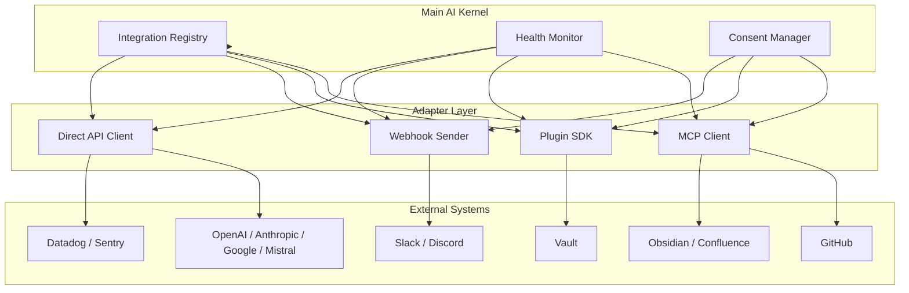

# Integrations — External System Catalog

> The master catalog and integration guide for every external system AI Dev OS connects to. **Model provider integrations are configured within Nine Router** (`http://localhost:20128/dashboard`), not in AI Dev OS. This document covers non-model integrations. This document is normative — implementations MUST satisfy every MUST clause below.

## Overview

AI Dev OS connects to external systems through integration patterns. Every integration is registered in the Integration Registry so the Kernel can discover, authenticate, and monitor it.

**Critical architecture distinction:**
- **Model providers** (OpenAI, Anthropic, Google, Mistral, Ollama, etc.) — Configured within [Nine Router](./NINE_ROUTER.md) at `http://localhost:20128/dashboard`. AI Dev OS accesses all models through Nine Router's API at `http://localhost:20128/v1`. See [Nine Router Integration](./NINE_ROUTER_INTEGRATION.md).
- **Non-model integrations** (MCP servers, Plugin SDK extensions, webhooks, version control, etc.) — Configured directly in AI Dev OS. These are the subject of this document.

Integration lifecycle: `discovered → registered → authenticated → active → (degraded) → deactivated`.

## Integration Categories

| Category | Description | Example Integrations |
|----------|-------------|---------------------|
| **Model Providers** | LLM inference (via Nine Router gateway) | Nine Router (`:20128/v1`); configure providers in Nine Router dashboard |
| **Version Control** | Git hosting and code review platforms | GitHub, GitLab |
| **Communication** | Messaging and collaboration tools | Slack, Discord |
| **Issue Tracking** | Bug and task trackers | GitHub Issues, Linear, Jira |
| **CI/CD** | Continuous integration and deployment | GitHub Actions, Jenkins |
| **Monitoring** | Observability and alerting platforms | Datadog, Sentry, Grafana |
| **Secret Stores** | Secrets management systems | Vault, AWS Secrets Manager, 1Password |
| **Knowledge Bases** | Document stores and wikis | Obsidian, Confluence, Notion |
| **Search** | Web and code search engines | SearXNG, Brave Search |

## Catalog

### Model Providers

| Integration | Type | Auth | Capabilities | Config Doc |
|-------------|------|------|-------------|------------|
| OpenAI | Direct API | API key | Chat, embeddings, vision, STT | [OpenAI](./OPENAI_INTEGRATION.md) |
| Anthropic | Direct API | API key | Chat, extended thinking, tool use | [Anthropic](./ANTHROPIC_INTEGRATION.md) |
| Google | Direct API | API key / OAuth | Gemini chat, embeddings | [Google](./GOOGLE_INTEGRATION.md) |
| Mistral | Direct API | API key | Chat, embeddings | [Mistral](./MISTRAL_INTEGRATION.md) |
| Ollama | MCP / Direct API | None (localhost) | Local models, custom models | [Ollama](./OLLAMA_INTEGRATION.md) |

### Version Control & Issue Tracking

| Integration | Type | Auth | Capabilities | Config Doc |
|-------------|------|------|-------------|------------|
| GitHub | MCP + Webhook | OAuth / PAT | PR review, issue management, search, webhook events | [GitHub](./GITHUB_ANALYSIS.md) |

### Communication & Monitoring

| Integration | Type | Auth | Capabilities |
|-------------|------|------|-------------|
| Slack | Webhook | Webhook URL | Send notifications to channels |
| Discord | Webhook | Webhook URL | Send notifications to channels |
| Datadog | Direct API | API + App keys | Push metrics, traces, logs |
| Sentry | Direct API | DSN / Auth token | Capture errors, performance |

### Secret Stores

| Integration | Type | Capabilities |
|-------------|------|-------------|
| Vault | Plugin SDK | Dynamic secrets, leasing, rotation |
| AWS Secrets Manager | Direct API | Static secret retrieval, rotation |
| 1Password | Plugin SDK | Secret reference resolution |

## Supported Integration Patterns

### MCP Server

The primary pattern. External tools expose their capabilities as MCP tools and resources. AI Dev OS connects as an MCP client. See [MCP](./MCP.md).

**Use when**: the external system has a rich API surface and needs two-way interaction (read + write). Examples: GitHub (PR review, issue creation), filesystem (read + write files).

### Plugin SDK

For custom or complex integrations that run as subprocesses. The Plugin SDK provides a JSON-RPC bridge with capability-based security. See [Plugin SDK](./PLUGIN_SDK.md).

**Use when**: the integration needs local binary execution, hardware access, or custom business logic. Examples: Vault secret leasing, image processing.

### Webhook

Outgoing event notifications. The external system receives POST requests when events occur. See [Webhooks](./WEBHOOKS.md).

**Use when**: the external system only needs to be notified (fire-and-forget with retry). Examples: Slack notifications, Discord alerts.

### Direct API

Stateless HTTP client calls to external REST or GraphQL APIs. Managed through the [Model Providers](./MODEL_PROVIDERS.md) and [Third-Party APIs](./THIRD_PARTY_APIS.md) layers.

**Use when**: simple request-response without persistent connection. Examples: OpenAI inference, SearXNG search.

## How to Add a New Integration

1. **Choose a pattern**: MCP, Plugin SDK, Webhook, or Direct API. Base the choice on the interaction model and security requirements.
2. **Register in the Integration Registry**: a new entry in the integrations config with `{ name, pattern, auth, endpoints }`.
3. **Add auth**: store credentials via [Secrets Management](./SECRETS_MANAGEMENT.md). NEVER inline secrets in config.
4. **Define event bindings**: if the integration emits or consumes events, register them in the [Event Bus](./EVENT_BUS.md).
5. **Add observability**: each integration MUST export metrics (call count, latency, error rate) and log every call.
6. **Write a config doc**: a markdown file in `docs/` following the pattern of existing integration docs (e.g., [GitHub](./GITHUB_ANALYSIS.md), [OpenAI](./OPENAI_INTEGRATION.md)).
7. **Pass the Guardian**: every integration MUST pass [Architecture Guardian](./ARCHITECTURE_GUARDIAN.md) validation before activation.

## Integration Topology



## Full Integration Catalog

### Model Providers (expanded)

| Integration | Type | Auth | Capabilities | Config Doc |
|-------------|------|------|-------------|------------|
| OpenAI | Direct API | API key | Chat, embeddings, vision, STT, TTS | [OpenAI](./OPENAI_INTEGRATION.md) |
| Anthropic | Direct API | API key | Chat, extended thinking, tool use, computer use | [Anthropic](./ANTHROPIC_INTEGRATION.md) |
| Google | Direct API | API key / OAuth | Gemini chat, embeddings, grounding, code exec | [Google](./GOOGLE_INTEGRATION.md) |
| Mistral | Direct API | API key | Chat, embeddings, code gen, FIM | [Mistral](./MISTRAL_INTEGRATION.md) |
| Ollama | MCP / Direct API | None (localhost) | Local models, custom models | [Ollama](./OLLAMA_INTEGRATION.md) |
| DeepSeek | Direct API | API key | Chat, code gen | — |
| xAI (Grok) | Direct API | API key | Chat | — |

### Version Control & Issue Tracking (expanded)

| Integration | Type | Auth | Capabilities | Config Doc |
|-------------|------|------|-------------|------------|
| GitHub | MCP + Webhook | OAuth / PAT | PR review, issue management, search, webhook events, Actions | [GitHub](./GITHUB_ANALYSIS.md) |
| GitLab | MCP + Webhook | OAuth / PAT | MR review, issue management, CI events | — |
| Jira | Direct API | OAuth / PAT | Issue tracking, sprint management, search | — |
| Linear | Direct API | API key | Issue tracking, team management | — |

### Communication & Monitoring (expanded)

| Integration | Type | Auth | Capabilities |
|-------------|------|------|-------------|
| Slack | Webhook + API | Webhook URL / OAuth | Send notifications, read messages, search |
| Discord | Webhook | Webhook URL | Send notifications to channels |
| Datadog | Direct API | API + App keys | Push metrics, traces, logs; query monitors |
| Sentry | Direct API | DSN / Auth token | Capture errors, performance, releases |
| Grafana | Direct API | API key | Query dashboards, create alerts |
| PagerDuty | Webhook | API key | Incident management, on-call schedules |

### Secret Stores (expanded)

| Integration | Type | Capabilities |
|-------------|------|-------------|
| Vault | Plugin SDK | Dynamic secrets, leasing, rotation, policies |
| AWS Secrets Manager | Direct API | Static secret retrieval, rotation |
| 1Password | Plugin SDK | Secret reference resolution, Connect sync |
| Azure Key Vault | Direct API | Secret retrieval, certificate management |

### Knowledge Bases (expanded)

| Integration | Type | Capabilities |
|-------------|------|-------------|
| Obsidian | MCP | Graph queries, note read/write, search |
| Confluence | Direct API | Page read, space search, attachment download |
| Notion | Direct API | Database query, page read/write, search |

### Search Engines

| Integration | Type | Capabilities |
|-------------|------|-------------|
| SearXNG | Direct API | Federated web search, image search |
| Brave Search | Direct API | Web search, news, image, video |
| ArXiv | Direct API | Paper search, abstract retrieval |

## Adapter Architecture

Each integration pattern is implemented as a pluggable adapter:

```
interface IntegrationAdapter {
    id: string
    pattern: "mcp" | "plugin-sdk" | "webhook" | "direct-api"
    health(): Promise<HealthStatus>
    capabilities(): Promise<Capability[]>
    execute(context: ExecutionContext): Promise<ExecutionResult>
}
```

```
class McpAdapter implements IntegrationAdapter {
    pattern = "mcp"
    client: McpClient
    serverRef: McpServerRef

    async health(): check MCPServerHealth
    async capabilities(): tools/list + resources/list
    async execute(ctx): mcp.call(session, ctx.tool, ctx.args)
}

class DirectApiAdapter implements IntegrationAdapter {
    pattern = "direct-api"
    httpClient: HttpClient
    middleware: Middleware[]

    async health(): GET /health endpoint
    async capabilities(): return static capability list
    async execute(ctx): run through middleware stack
}
```

## Registration API

```
POST /api/v1/integrations/register
{
    "name": "github",
    "pattern": "mcp",
    "config": {
        "server": { "transport": "stdio", "command": "npx", "args": ["@modelcontextprotocol/server-github"] },
        "auth": { "method": "bearer", "secretRef": "GITHUB_TOKEN" }
    }
}

Response:
{
    "id": "int_abc123",
    "status": "registered",
    "capabilities": ["tools", "resources", "events"],
    "health": "unknown"
}
```

The Integration Registry exposes CRUD operations: `register`, `update`, `unregister`, `get`, `list`. All mutations are recorded in the Audit Log.

## Capability Discovery

When an integration is registered, the system discovers its capabilities:

```
async function discoverCapabilities(integration):
    adapter = adapterFactory(integration.pattern, integration.config)
    capabilities = await adapter.capabilities()
    // Classify capabilities
    for cap in capabilities:
        cap.type = classifyCapabilityType(cap)  // tool, resource, event, action
        cap.dangerous = assessRisk(cap)          // write operations are dangerous
        cap.dependencies = resolveDependencies(cap)
    integration.capabilities = capabilities
    integration.status = "discovered"
    return capabilities
```

Capabilities are cached and re-discovered every 5 minutes or on demand via `POST /api/v1/integrations/{id}/rediscover`.

## Health Monitoring Pattern

```
function createHealthMonitor(integration):
    return setInterval(async () => {
        probeStart = Date.now()
        status = await integration.adapter.health()
        duration = Date.now() - probeStart
        integration.lastHealthCheck = {
            status: status.ok ? "healthy" : "unhealthy",
            duration,
            timestamp: new Date().toISOString(),
            detail: status.detail
        }
        updateMetric("integration_health", { integration: integration.id }, status.ok ? 1 : 0)
        updateMetric("integration_health_duration", { integration: integration.id }, duration)
        if not status.ok:
            integration.status = "degraded"
            alert("Integration ${integration.id} health check failed")
    }, 30_000)  // every 30 s
```

Health check intervals vary by pattern: MCP = 30 s, Direct API = 60 s, Webhook = 120 s (outbound webhook endpoints are probed with a lightweight GET).

## Integration Testing Strategy

| Test Type | Scope | Frequency | Tooling |
|-----------|-------|-----------|---------|
| Unit | Adapter logic, normalization functions | Every PR | Vitest + nock |
| Integration | End-to-end with mock server | Every PR | Test containers / WireMock |
| Contract | API response shape validation | Daily | Pact / OpenAPI diff |
| Smoke | Live endpoint reachability | Hourly | Custom health probe |
| Chaos | Network failure, latency injection | Weekly | Toxiproxy |
| Regression | Full capability matrix | Per release | Automated suite |

Each integration MUST pass all unit and integration tests before registration is accepted.

## Webhook Schema

Outgoing webhooks follow a standardized envelope:

```
WebhookPayload {
    id:         string       // unique event ID (UUIDv7)
    event:      string       // e.g., "notification.send", "alert.critical"
    source:     string       // integration ID that triggered the webhook
    timestamp:  rfc3339
    data:       any          // event-specific payload
    retry: {
        count:  number       // current retry attempt
        max:    number       // max retries before dead-letter
    }
    signature:  string       // HMAC-SHA256 of body using webhook secret
}
```

See [Webhooks](./WEBHOOKS.md) for delivery guarantees and retry mechanics.

## Integration Lifecycle

The full lifecycle of an integration is defined as:

```
discovered → configured → registered → enabled → active → (degraded) → (deprecated) → deactivated
```

| Phase | Description | Entry Criteria | Exit Criteria |
|-------|-------------|---------------|--------------|
| **Discovered** | Found via MCP discovery, config scan, or manual add | Server reachable | Capabilities enumerated |
| **Configured** | Auth credentials resolved, endpoints set | Config file present | Secrets resolved, connectivity verified |
| **Registered** | Integration Registry entry created | Config validated | Registry ID returned |
| **Enabled** | Ready for use by the Kernel | Auth verified | Health check passes |
| **Active** | Normal operation | Health check passing | Metrics flowing |
| **Degraded** | Partial failure mode | Health check failing | Auto-recovery or manual intervention |
| **Deprecated** | Scheduled for removal | Replacement available | Migration window expires |
| **Deactivated** | No longer used | Cleanup complete | Resources released |

## Failure Modes

| Mode | Detection | Response |
|------|-----------|----------|
| Integration unreachable | Health check fails (3 consecutive) | Mark `degraded`; retry every 60 s; alert after 5 min |
| Auth credential expired | API returns 401/403 | Trigger credential rotation; mark `auth_error` |
| Capability mismatch | Discovered tools differ from cached set | Re-discover capabilities; update registry; warn if tools removed |
| Webhook delivery failure | Target returns 5xx or times out | Retry with backoff (max 5×); dead-letter after max retries |
| MCP server crash | Process exits unexpectedly | Restart up to 3× with backoff; mark `degraded` if persistent |
| Schema migration | Protocol version mismatch | Re-negotiate version; if incompatible, mark `degraded` |
| Rate limit saturation | > 50 % requests rate-limited in 5 min | Circuit-break integration for 60 s; alert |
| Config corruption | Integration config fails to parse | Fail registration; alert operator; keep last known good config |
| Dependency failure | Required sub-integration is down | Cascade status; mark dependent integrations as `degraded` |
| Plugin SDK timeout | Plugin subprocess does not respond | Kill process; restart; mark `degraded` if > 3 restarts in 5 min |

## Observability Metrics

| Metric | Type | Labels | Description |
|--------|------|--------|-------------|
| `integration_count` | Gauge | `{pattern, status}` | Number of registered integrations |
| `integration_health` | Gauge | `{integration}` | 1 = healthy, 0 = unhealthy |
| `integration_call_total` | Counter | `{integration, method, ok}` | Total calls through integration |
| `integration_call_seconds` | Histogram | `{integration, method}` | Call duration |
| `integration_discovery_duration_seconds` | Histogram | `{integration}` | Time to discover capabilities |
| `integration_errors_total` | Counter | `{integration, category}` | Errors by category |
| `integration_webhook_delivery_total` | Counter | `{integration, ok}` | Webhook delivery attempts |
| `integration_webhook_delivery_seconds` | Histogram | `{integration}` | Webhook delivery latency |
| `integration_lifecycle_transitions_total` | Counter | `{integration, from, to}` | Lifecycle state transitions |
| `integration_health_check_duration_seconds` | Histogram | `{integration}` | Health check probe duration |

## Security Considerations

- Every integration is treated as potentially untrusted until explicitly authorized by the user.
- Auth credentials are stored and resolved exclusively through [Secrets Management](./SECRETS_MANAGEMENT.md).
- Remote integrations require explicit user consent before any capability is exposed to the Kernel.
- Webhook endpoints are validated against an allowlist; HMAC signatures are verified on incoming webhooks.
- MCP servers launched as subprocesses inherit only necessary permissions (not full OS access).
- Plugin SDK integrations run in a sandboxed subprocess with resource limits (CPU, memory, filesystem).
- Capability tokens are scoped per integration and per tool — an integration cannot access capabilities it didn't declare.
- All integration activity is recorded in the [Audit Log](./AUDIT_LOG.md).
- Deactivated integrations are cleaned up: credentials revoked, processes terminated, registry entries archived.
- Integration configuration is validated against a schema before acceptance to prevent injection attacks.
- Secrets are never included in health check responses, error messages, or logs.

## Acceptance Criteria

- A new MCP server (e.g., GitHub) can be registered, discovered, and its tools listed.
- A webhook integration (e.g., Slack) sends a notification and retries on failure up to 5 times.
- An integration health check correctly transitions from `healthy` to `degraded` after 3 failures.
- Capability discovery returns the correct tool/resource list for each integration pattern.
- Auth credential rotation resolves automatically without requiring re-registration.
- A deactivated integration rejects all calls and cleans up resources within 60 s.
- The integration registry returns the correct status for all registered integrations.
- Lifecycle transitions are logged and produce metrics counters.
- An integration with corrupted config fails registration without affecting other integrations.
- Two integrations with the same name but different patterns (e.g., MCP vs Direct API) can coexist.

## Related Documents

- [MCP](./MCP.md)
- [Plugin SDK](./PLUGIN_SDK.md)
- [Webhooks](./WEBHOOKS.md)
- [Third-Party APIs](./THIRD_PARTY_APIS.md)
- [Model Providers](./MODEL_PROVIDERS.md)
- [Secrets Management](./SECRETS_MANAGEMENT.md)
- [Architecture Guardian](./ARCHITECTURE_GUARDIAN.md)
- [System Overview](./SYSTEM_OVERVIEW.md)
