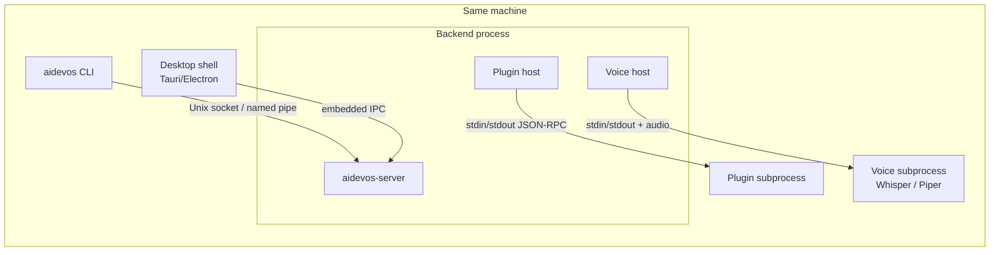

# IPC — Inter-Process Communication

> The local communication layer between the CLI, desktop shell, plugin subprocesses, and the Backend server — enabling zero-copy signalling, streaming events, and capability delegation within the local machine. This document is normative — implementations MUST satisfy every MUST clause below.

## Overview

IPC is the local-only, low-latency communication layer that connects the processes of AI Dev OS on a single machine:

- **CLI → Backend**: the `aidevos` CLI sends commands to the running `aidevos-server` without going through the public HTTP API.
- **Desktop shell ↔ Backend**: the Tauri/Electron wrapper communicates with the embedded Backend server.
- **Backend → Plugin subprocesses**: the [Plugin SDK](./PLUGIN_SDK.md) subprocess model uses JSON-RPC over stdio between the Backend and plugin processes.
- **Backend → Voice subprocess**: the [Voice System](./VOICE_SYSTEM.md) runs STT/TTS as a subprocess; IPC carries audio control signals and transcript data.

IPC is not the same as the [Shared Context Engine](./SHARED_CONTEXT_ENGINE.md) (which is a durable event log for coordination) or the public HTTP/WebSocket API (which is for external clients). IPC is a ephemeral, in-process or same-machine communication channel.

## Goals

- Sub-millisecond round-trip for simple command/response exchanges on the local machine.
- Streaming: IPC MUST support streaming responses (events, audio chunks, token streams) without framing overhead.
- Capability delegation: plugin subprocesses receive only the capabilities the Plugin SDK grants them — IPC enforces this boundary.
- Single transport abstraction: the same API works over Unix domain sockets, Windows named pipes, and stdio (for plugins).

## Non-Goals

- Remote communication — use the HTTP/WebSocket API (see [API Spec](./API_SPEC.md)).
- Persistent messaging — use the [Shared Context Engine](./SHARED_CONTEXT_ENGINE.md).
- Implementation code — this repository is documentation-only (see [AI Coding Rules](./AI_CODING_RULES.md)).

## Architecture



## Transport Layers

### Unix Domain Socket / Named Pipe (CLI ↔ Backend)

The CLI connects to a Unix domain socket at `~/.aidevos/run/aidevos.sock` (Linux/macOS) or a Windows Named Pipe at `\\.\pipe\aidevos` (Windows). The server creates the socket on startup and removes it on clean shutdown.

Protocol: **JSON-Lines** (newline-delimited JSON) with an optional binary header for streaming:

```
# Simple command/response:
→ { "id": "req-1", "method": "runs.status", "params": { "run_id": "01ABCDEF..." } }
← { "id": "req-1", "result": { "state": "executing", ... } }

# Streaming response (run events):
→ { "id": "req-2", "method": "runs.stream", "params": { "run_id": "01ABCDEF..." } }
← { "id": "req-2", "event": "worker.token", "data": { "text": "Hello" } }
← { "id": "req-2", "event": "worker.token", "data": { "text": " world" } }
← { "id": "req-2", "event": "run.completed", "data": { ... } }
← { "id": "req-2", "done": true }
```

The socket is authenticated: the server checks that the connecting process has the same UID (Unix) or is in the same process group (Windows). No token needed for local same-user IPC.

### Embedded IPC (Desktop Shell ↔ Backend)

When the desktop app embeds the Backend server in the same process (Tauri `sidecar` pattern), IPC uses direct in-process function calls or a shared message channel. The API is identical to the Unix socket API; the transport is abstracted behind an `IpcTransport` interface.

```typescript
interface IpcTransport {
  call(method: string, params: object): Promise<object>
  stream(method: string, params: object): AsyncIterator<IpcEvent>
  close(): void
}
```

### JSON-RPC over stdio (Plugin Subprocesses)

Plugin subprocesses communicate with the Backend via JSON-RPC 2.0 over stdin/stdout. See [Plugin SDK](./PLUGIN_SDK.md) for the full protocol. The IPC layer handles:
- Framing: length-prefixed JSON lines.
- Capability gate: every `tool.call` method is intercepted and checked against the plugin's granted capabilities before dispatch.
- Timeout enforcement: each call has a deadline; the host sends a `cancel` notification if the deadline is exceeded.

### Audio IPC (Voice Subprocess)

The Voice host communicates with STT/TTS subprocesses via a hybrid protocol:
- **Control channel**: JSON-Lines over stdin/stdout (start, stop, configure).
- **Audio channel**: raw PCM frames over a separate pipe or memory-mapped buffer.

```
# Control (JSON-Lines):
→ { "cmd": "start_stt", "config": { "model": "whisper-base.en", "language": "en" } }
← { "event": "ready" }
→ { "cmd": "stop_stt" }

# Audio pipe: raw PCM frames (16-bit, 16 kHz, mono) written continuously
```

## IPC Method Registry

The Backend exposes the following IPC methods (a strict subset of the HTTP API optimised for CLI use):

```
# Kernel
runs.submit(goal, opts?)         → { run_id }
runs.status(run_id)              → RunStatus
runs.stream(run_id)              → AsyncIterator<SCEEvent>
runs.cancel(run_id, reason?)     → Ack
runs.replay(run_id, from?)       → { run_id }

# Models / Router
models.list(filter?)             → Model[]
models.refresh(provider?)        → DiscoveryReport
router.roles()                   → RoleAssignment[]
router.assign(role, model_id)    → Ack

# Memory
memory.query(q, opts?)           → MemoryRecord[]
memory.write(item)               → MemoryRecord

# SCE
context.topics()                 → string[]
context.tail(topic, from?)       → AsyncIterator<SCEEvent>
context.snapshot(topic)          → { offset, state }

# Server management
server.status()                  → ServerStatus
server.reload_config()           → Ack
server.reload_rules()            → { count, errors }

# Plugins
plugins.list()                   → Plugin[]
plugins.call(plugin_id, tool, args)  → ToolResult   # debugging only
```

## Data Model

```
IpcRequest {
  id:      string          # client-generated, echoed in response
  method:  string          # "subsystem.action"
  params:  object
}

IpcResponse {
  id:      string
  result?: object
  error?:  { code: number, message: string, data?: object }
}

IpcEvent {
  id:      string          # parent request id
  event:   string          # event type
  data:    object
  done?:   boolean         # true on last event of a stream
}
```

Error codes mirror JSON-RPC 2.0 standard codes plus AI Dev OS specific codes in the `-32100` to `-32199` range (see [API Spec](./API_SPEC.md)).

## Requirements

- **MUST** create the Unix socket / Named Pipe on server startup and remove it on clean shutdown.
- **MUST** authenticate CLI connections by UID match (Unix) or process group (Windows).
- **MUST** enforce capability gates on every plugin subprocess `tool.call` IPC call.
- **MUST** enforce per-call timeouts (configurable; default 30 s for tools, 5 min for streaming runs).
- **MUST** support streaming responses (`AsyncIterator<IpcEvent>`) for `runs.stream` and `context.tail`.
- **MUST** handle socket file cleanup on unexpected server crash (stale socket detection on CLI connect).
- **SHOULD** use length-prefixed framing rather than newline-delimited JSON for binary safety.
- **SHOULD** log every IPC call at `debug` level with method name and duration.
- **MAY** support a `--ipc-socket <path>` flag to override the default socket path for multi-instance scenarios.

## Failure Modes

| Mode | Detection | Response |
|------|-----------|----------|
| Socket not found | `ENOENT` on connect | Print "Backend not running — start with `aidevos-server`"; exit 5 |
| Stale socket (server crashed) | `ECONNREFUSED` on connect | Delete stale socket; print "Backend crashed — restart with `aidevos-server`"; exit 5 |
| Plugin subprocess crash | Subprocess exits unexpectedly | AGS heartbeat miss triggers reassignment; Plugin host marks plugin `crashed` |
| Call timeout | Deadline exceeded | Send `cancel` notification; return `IPC_TIMEOUT` error; do not block the connection |
| Audio pipe full | Write blocks | Drop oldest audio frames; emit `voice.audio_overflow` event |
| Serialisation error | JSON parse failure | Return `IPC_PARSE_ERROR`; close the connection if repeated |

## Security Considerations

- The Unix socket has `chmod 600` permissions; only the owning user can connect.
- Plugin subprocess IPC channels are created per-plugin-spawn; they are ephemeral and destroyed when the plugin deactivates.
- All IPC calls are logged in the [Audit Log](./AUDIT_LOG.md) at `debug` level; full payloads are logged only in `debug_mode`.
- The IPC layer MUST NOT be exposed over the network; it is strictly local.
- See [Security Model](./SECURITY_MODEL.md).

## Observability

| Metric | Description |
|--------|-------------|
| `ipc_call_total{method, ok}` | IPC calls by method and outcome |
| `ipc_call_seconds{method}` | IPC call latency histogram |
| `ipc_stream_events_total{method}` | Events emitted in streaming calls |
| `ipc_active_connections` | Current connected IPC clients |
| `ipc_timeout_total{method}` | Timed-out calls |

Traces: one span per IPC call; parent span for streaming calls covering the full stream lifetime. See [Tracing](./TRACING.md).

## Acceptance Criteria

- `aidevos runs list` completes in < 50 ms on a machine with the server running and 1000 run records.
- Streaming `aidevos runs stream <id>` delivers every SCE event within 10 ms of the Backend publishing it.
- A plugin subprocess that takes > 30 s to respond to a `tool.call` receives a `cancel` notification and the host returns `IPC_TIMEOUT` to the worker.
- Killing the server process cleans up the Unix socket file, allowing a fresh server to start on the same path.
- CLI connects and completes `server.status()` in < 5 ms on a local machine.

## Open Questions

- Whether to use `MessagePack` instead of JSON for high-throughput audio control channels — tracked in [templates/ADR](../templates/ADR.md).
- Whether to expose the IPC socket path via `~/.aidevos/run/aidevos.pid` + socket symlink or keep a fixed path.

## Related Documents

- [Backend](./BACKEND.md)
- [CLI](./CLI.md)
- [Plugin SDK](./PLUGIN_SDK.md)
- [Voice System](./VOICE_SYSTEM.md)
- [API Spec](./API_SPEC.md)
- [Security Model](./SECURITY_MODEL.md)
- [System Overview](./SYSTEM_OVERVIEW.md)
- [Main AI Kernel](./MAIN_AI_KERNEL.md)
