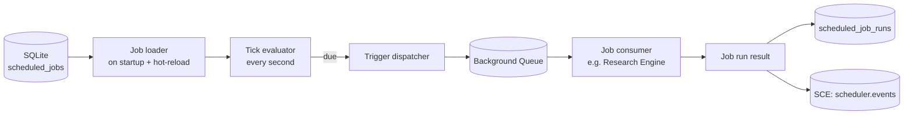

# Job Scheduler

> Cron-style recurring job execution with missed-run recovery, overlap prevention, and observable job history. This document is normative — implementations MUST satisfy every MUST clause below.

## Overview

The Job Scheduler is the timer-driven execution subsystem that runs recurring work on a schedule: [Model Discovery](./MODEL_DISCOVERY.md) refreshes, [Research Engine](./RESEARCH_ENGINE.md) crawls, [Persistent Memory](./PERSISTENT_MEMORY.md) retention runs, vector index compaction, and any operator-defined scheduled tasks.

The Scheduler is not a replacement for the [Queueing](./QUEUEING.md) subsystem. It is a trigger that enqueues a background job into the queue at the scheduled time. The queue then delivers the job to the appropriate consumer. The Scheduler itself does not execute any job logic.

## Goals

- Cron-style scheduling with second-level granularity (standard 5-field cron; optional 6-field with seconds).
- Missed-run recovery: if the server was down when a job was supposed to run, execute it once on the next startup (within `catch_up_window`).
- Overlap prevention: a job MUST NOT start a new run while the previous run is still in progress (configurable per job).
- Observable: every job execution is a record in the `scheduled_job_runs` table and an SCE event.
- Local-first: runs in-process with no external cron daemon.

## Non-Goals

- Distributed locking across multiple server instances (single-node in v1.0; cluster coordination is post-v1.0).
- Real-time sub-second scheduling — for that, use the IPC stream directly.
- Implementation code — this repository is documentation-only (see [AI Coding Rules](./AI_CODING_RULES.md)).

## Architecture



## Scheduled Job Schema

```
ScheduledJob {
  id:              ulid
  name:            string           # human display name
  description:     string?
  cron:            string           # standard 5-field cron: "*/10 * * * *"
                                    # OR 6-field with seconds: "0 */10 * * * *"
  timezone:        string           # IANA timezone; default "UTC"
  queue:           "background"     # always background queue
  payload_template: object          # template merged with runtime context at dispatch
  state:           "active" | "paused" | "deleted"
  overlap_policy:  "skip"           # skip new run if previous is still running (default)
                 | "cancel_previous" # cancel previous run and start new
                 | "allow"          # allow concurrent runs (use carefully)
  catch_up:        boolean          # run once for missed runs on startup (default true)
  catch_up_window: string           # max age of missed run to catch up; default "1h"
  max_retries:     number           # passed to queue item
  timeout_ms:      number?          # max job duration; null = no limit
  tags:            string[]
  created_at:      rfc3339
  updated_at:      rfc3339
  next_run:        rfc3339?         # computed; null if paused
  last_run:        rfc3339?
  last_run_state:  "completed" | "failed" | "skipped" | "timeout"?
}
```

## Built-in Jobs

The following jobs are registered automatically on first startup. Operators may modify their cron expression or pause them via `aidevos config` or the Settings UI.

| Job ID | Name | Default cron | Consumer |
|--------|------|-------------|----------|
| `model-discovery-all` | Model Discovery — All Providers | `*/10 * * * *` | Nine Router |
| `research-crawl` | Research Engine — Scheduled Crawls | `0 * * * *` | Research Engine |
| `memory-retention` | Persistent Memory — Retention Purge | `0 3 * * *` | Persistent Memory |
| `vector-compaction` | Vector Index — Compaction | `0 2 * * 0` | Vector Store |
| `graph-rebuild` | Obsidian Graph — Full Rebuild | `0 4 * * *` | Obsidian Graph Engine |
| `audit-archive` | Audit Log — Archive Old Events | `0 5 * * *` | Audit Log |
| `db-optimize` | Database — PRAGMA optimize | `0 1 * * *` | Database |

## Job Run Record

```
ScheduledJobRun {
  id:         ulid
  job_id:     ulid
  state:      "running" | "completed" | "failed" | "skipped" | "timeout"
  triggered_at: rfc3339    # when the scheduler fired the trigger
  started_at:   rfc3339?   # when the queue consumer picked it up
  completed_at: rfc3339?
  duration_ms:  number?
  queue_item_id: ulid?
  error:        string?
  result:       object?     # consumer-defined summary
  skipped_reason: string?   # e.g. "previous run still active"
}
```

## Interfaces

```
# Job management
scheduler.register(job: ScheduledJobInput) → ScheduledJob
scheduler.update(job_id, patch) → ScheduledJob
scheduler.pause(job_id) → Ack
scheduler.resume(job_id) → Ack
scheduler.delete(job_id) → Ack

# Manual trigger
scheduler.trigger(job_id, opts?) → ScheduledJobRun    # fire immediately

# Introspection
scheduler.list(filter?) → ScheduledJob[]
scheduler.get(job_id) → ScheduledJob
scheduler.history(job_id, limit?) → ScheduledJobRun[]
scheduler.next_runs(n?) → { job_id, name, next_run }[]

# Subscribe
scheduler.subscribe() → AsyncIterator<SchedulerEvent>
```

## Tick Evaluation

The Scheduler evaluates due jobs once per second:

```
every second:
  now = utc_now()
  due_jobs = [j for j in active_jobs if cron_next(j.cron, j.last_run ?? epoch) <= now]
  for job in due_jobs:
    if job.overlap_policy == "skip" AND has_active_run(job.id):
      record_run(job.id, state="skipped", reason="previous run still active")
      continue
    elif job.overlap_policy == "cancel_previous" AND has_active_run(job.id):
      cancel_active_run(job.id)
    queue.enqueue("background", { job_id: job.id, payload: job.payload_template })
    update_job(job.id, last_run=now, next_run=compute_next(job.cron, now))
```

## Missed-Run Recovery

On server startup, the Scheduler checks for jobs that should have run while the server was down:

```
for each active job:
  missed_run_ts = last time job should have run before now
  if missed_run_ts > (last_run ?? epoch) AND (now - missed_run_ts) < catch_up_window:
    if job.catch_up:
      trigger job once immediately (not in backfill loop — one run per missed window)
      emit scheduler.catch_up event
```

This ensures that a nightly job that missed its window because the server was restarted at 3 AM will run once when the server comes back up at 4 AM, not N times for every second it was down.

## Requirements

- **MUST** evaluate due jobs every second; maximum dispatch jitter is 2 s.
- **MUST** apply `overlap_policy: "skip"` by default: a running job prevents a new trigger.
- **MUST** record every job run (including skips) in `scheduled_job_runs`.
- **MUST** perform missed-run recovery on startup for jobs with `catch_up: true` and missed runs within `catch_up_window`.
- **MUST** publish `scheduler.triggered`, `scheduler.skipped`, `scheduler.completed`, and `scheduler.failed` events on the SCE.
- **MUST** persist job definitions in the database; a server restart MUST restore all registered jobs.
- **MUST** support pausing and resuming individual jobs without losing their cron expression or run history.
- **SHOULD** support manual trigger: `scheduler.trigger(job_id)` fires the job immediately regardless of schedule.
- **SHOULD** surface `next_run` timestamps in the Settings UI and `aidevos context tail scheduler.events`.
- **MAY** support timezone-aware cron expressions (IANA timezone names).
- **MAY** support 6-field cron with seconds for sub-minute scheduling.

## Failure Modes

| Mode | Detection | Response |
|------|-----------|----------|
| Tick evaluation missed | System clock skew / server load | Compensating run on next tick; `scheduler.tick_miss` metric |
| Queue full (background queue at hard cap) | `QUEUE_FULL` from `queue.enqueue` | Skip trigger; record run as `skipped` with reason; emit alert |
| Job definition invalid | cron parse error | Refuse to register; surface error; keep existing jobs running |
| Consumer crash mid-job | Queue visibility timeout | Queue re-enqueues (up to `max_retries`); Scheduler records updated run state |
| Catch-up flood | Many missed jobs on startup | Apply `catch_up_window` gate; only one catch-up per job |

Every failure emits a structured event on the SCE and is recorded in the [Audit Log](./AUDIT_LOG.md).

## Observability

| Metric | Labels | Description |
|--------|--------|-------------|
| `scheduler_trigger_total` | `job_id`, `result=triggered\|skipped` | Trigger outcomes |
| `scheduler_run_duration_seconds` | `job_id` | Job duration histogram |
| `scheduler_active_jobs` | — | Currently registered active job count |
| `scheduler_missed_total` | `job_id` | Missed-run events detected on startup |
| `scheduler_catchup_total` | `job_id` | Catch-up runs triggered |
| `scheduler_tick_miss_total` | — | Tick evaluation misses |

## Acceptance Criteria

- A job with `cron: "*/1 * * * *"` fires within 2 s of each clock minute boundary.
- A job that is still running when its next trigger fires is skipped (overlap_policy: skip) and the skip is recorded in `scheduled_job_runs`.
- Stopping the server for 30 min and restarting causes a job with `catch_up: true` and `catch_up_window: "1h"` to fire once on startup.
- Pausing a job prevents it from triggering; resuming it restores normal scheduling on the next tick.
- `scheduler.next_runs(5)` returns the next 5 scheduled trigger times across all active jobs in correct chronological order.

## Open Questions

- Whether to support distributed locking (e.g., via a database row lock) for multi-instance deployments in v1.1 — tracked in [templates/ADR](../templates/ADR.md).

## Related Documents

- [Queueing](./QUEUEING.md)
- [Research Engine](./RESEARCH_ENGINE.md)
- [Model Discovery](./MODEL_DISCOVERY.md)
- [Persistent Memory](./PERSISTENT_MEMORY.md)
- [Database](./DATABASE.md)
- [System Overview](./SYSTEM_OVERVIEW.md)
- [Main AI Kernel](./MAIN_AI_KERNEL.md)
- [Architecture Guardian](./ARCHITECTURE_GUARDIAN.md)
