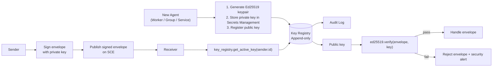

# Key Registry

> The central repository for agent identity public keys used by the Agent Communication envelope signing and verification system. This document is normative — implementations MUST satisfy every MUST clause below.

## Overview

The Key Registry is the authority for "who owns which Ed25519 public key" in the AI Dev OS agent communication system. Every agent, group, and subsystem that participates in signed envelope communication publishes its public key to the Registry on registration. Other agents use the Registry to look up the signing key of any sender before verifying an envelope's Ed25519 signature.

The Registry is **append-only**: keys are never removed, only rotated (a new entry supersedes the old one with a newer `registered_at` timestamp). This ensures that historical envelope verification remains possible even after key rotation.

## Goals

- One Registry per workspace — all keys are discoverable from a single source.
- Ed25519 only — the Registry does not support other key types (RSA, ECDSA, etc.).
- Append-only with rotation: old keys are preserved but marked superseded.
- Keys are bound to `agent_id` strings; each agent has exactly one active key at a time.
- Lookups are fast: p99 < 5 ms for `get_active_key(agent_id)`.
- Every mutation is audited in the [Audit Log](./AUDIT_LOG.md).

## Non-Goals

- Private key storage — private keys are stored in [Secrets Management](./SECRETS_MANAGEMENT.md), never in the Registry.
- Certificate authorities or X.509 — the Registry is a simple key-value store, not a PKI.
- Key revocation — keys are rotated, not revoked; old keys are preserved as inactive.
- Implementation code — this repository is documentation-only (see [AI Coding Rules](./AI_CODING_RULES.md)).

## Architecture



## Key Record Schema

```typescript
interface KeyRecord {
  id:          ulid;             // unique record identifier
  agent_id:    string;           // sender.id from Envelope
  public_key:  string;           // base64-encoded Ed25519 public key
  algorithm:   "ed25519";        // only Ed25519 is supported
  status:      "active" | "superseded" | "expired";
  registered_at: rfc3339;        // when this key was registered
  expires_at:  rfc3339 | null;   // optional TTL for temporary agents
  superseded_by: ulid | null;    // points to the newer KeyRecord.id if rotated
  metadata: {
    agent_kind: "kernel" | "worker" | "group" | "service";
    registered_by: string;       // agent_id or "system" that performed registration
  };
}
```

## Interfaces

```typescript
interface KeyRegistry {
  // Register a new public key for an agent. If the agent already has an active key,
  // the existing key is marked "superseded" and the new key becomes "active".
  register(agent_id: string, public_key: string, opts?: RegisterOpts): Promise<KeyRecord>;

  // Get the currently active public key for an agent. Returns null if no key is registered.
  getActiveKey(agent_id: string): Promise<KeyRecord | null>;

  // Get all keys (active and superseded) for an agent, ordered by registered_at desc.
  getKeyHistory(agent_id: string): Promise<KeyRecord[]>;

  // Verify that a given public key was active at a given timestamp.
  // Used for verifying historical envelopes.
  wasActiveAt(agent_id: string, public_key: string, timestamp: rfc3339): Promise<boolean>;

  // List all agents currently registered (with active keys).
  listActiveAgents(): Promise<{ agent_id: string; registered_at: rfc3339 }[]>;
}
```

## Key Rotation

```typescript
// Rotation flow:
// 1. Agent generates a new Ed25519 keypair
// 2. Agent stores new private key in Secrets Management
// 3. Agent calls keyRegistry.register("agent-123", newPublicKey)
// 4. Registry marks existing active key as "superseded", sets superseded_by
// 5. Registry inserts new KeyRecord with status "active"
// 6. Registry writes audit event "key.rotated" with old and new key IDs
```

## Requirements

- **MUST** support only the Ed25519 algorithm for public keys.
- **MUST** be append-only: old key records are preserved when superseded.
- **MUST** enforce that at most one public key per `agent_id` is `"active"` at any time.
- **MUST** return p99 < 5 ms for `getActiveKey(agent_id)` lookups.
- **MUST** record every `register` call in the [Audit Log](./AUDIT_LOG.md).
- **MUST** publish `key.registered` and `key.rotated` events on the SCE topic `security.keys`.
- **SHOULD** validate that the registering agent has permission to register for the given `agent_id` (see [AuthZ/RBAC](./AUTHZ_RBAC.md)).
- **MAY** expire temporary keys (for short-lived workers) via `expires_at`, auto-transitioning status to `"expired"`.
- **MAY** support external KMS integration for hardware-backed key generation.

## Failure Modes

| Mode | Detection | Response |
|------|-----------|----------|
| Duplicate registration | `agent_id` already has active key | Mark existing as superseded; accept new key (rotation) |
| Key not found | `getActiveKey(id)` returns null | Return null; caller handles as unverifiable envelope |
| Invalid key format | Public key is not valid Ed25519 | Reject registration; return `INVALID_KEY_FORMAT` error |
| Registry unavailable | Connection timeout | Caller reverts to cache; emit `key_registry.unavailable` |
| Expired key used | `getActiveKey` returns expired record | Return null; caller treats as unverifiable |

## Observability

| Metric | Labels | Description |
|--------|--------|-------------|
| `key_registry_keys_total` | `status` | Total key records by status (active/superseded/expired) |
| `key_registry_lookup_seconds` | — | Lookup latency for `getActiveKey` |
| `key_registry_register_total` | — | Registration and rotation count |
| `key_registry_lookup_miss_total` | — | `getActiveKey` returning null |

## Acceptance Criteria

- Registering agent "worker-1" with a valid Ed25519 public key returns a KeyRecord with status "active".
- Registering agent "worker-1" a second time marks the first key as "superseded" and returns a new KeyRecord with status "active".
- `getActiveKey("worker-1")` returns the most recently registered active key.
- `getKeyHistory("worker-1")` returns both key records with the active one first, the superseded one second.
- Calling `register` with an invalid public key returns `INVALID_KEY_FORMAT` and no record is created.
- After every `register` call, a `key.registered` or `key.rotated` event appears on SCE topic `security.keys`.

## Related Documents

- [Agent Communication](./AGENT_COMMUNICATION.md) — envelope signing and verification protocol
- [Secrets Management](./SECRETS_MANAGEMENT.md) — private key storage
- [AuthZ/RBAC](./AUTHZ_RBAC.md) — registration permission enforcement
- [Security Model](./SECURITY_MODEL.md) — trust architecture
- [Audit Log](./AUDIT_LOG.md) — audit trail for all key operations
- [Shared Context Engine](./SHARED_CONTEXT_ENGINE.md) — event publishing
- [System Overview](./SYSTEM_OVERVIEW.md)
