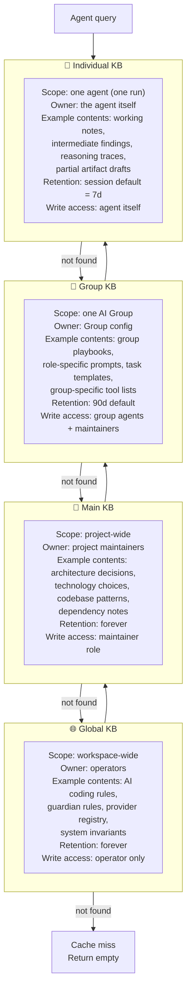

# Knowledge System

> The four-tier knowledge architecture — Global, Main, Group, and Individual KB — that gives every agent access to the right information at the right scope, with layered query escalation and multi-source ingestion. This document is normative — implementations MUST satisfy every MUST clause below.

## Overview

The Knowledge System is the persistent, queryable memory of the entire AI Dev OS workspace. It provides a structured answer to the question "what does this agent know, and from where?". It sits above [Persistent Memory](./PERSISTENT_MEMORY.md) (the physical storage) and below [Dynamic Workers](./DYNAMIC_WORKERS.md) (the consumers). Its key contribution is the **four-tier scope model** that ensures agents query the narrowest relevant KB first and escalate to broader tiers only when needed — maximising relevance while keeping agent prompts small.

Every piece of knowledge in the system has a **provenance** (where it came from), a **scope** (which tier and entity it belongs to), a **kind** (what type of record it is), and a **retention** (how long it lives). The [Research Engine](./RESEARCH_ENGINE.md) continuously populates the KB from external sources; the [Persistent Memory](./PERSISTENT_MEMORY.md) service stores and indexes it; the [RAG Pipeline](./RAG_PIPELINE.md) retrieves it into agent context windows.

## Goals

- Four-tier scope hierarchy (Global → Main → Group → Individual) with automatic escalation.
- Every knowledge record has provenance, scope, kind, and retention.
- KB queries are hybrid (BM25 full-text + ANN semantic) and scope-aware.
- All KB mutations are published to the SCE and audited.
- The Research Engine continuously populates the KB from external sources.
- Agents can write to their Individual KB without elevated privileges; writing to Main or Global requires explicit permission.

## Non-Goals

- Filesystem / object storage — large blobs are referenced by pointer; see [Object Store](./OBJECT_STORE.md).
- Implementation code — this repository is documentation-only (see [AI Coding Rules](./AI_CODING_RULES.md)).
- Raw vector index operations — see [Vector Store](./VECTOR_STORE.md).

## Four-Tier Architecture



## Knowledge Record Schema

Full schema defined in [Persistent Memory](./PERSISTENT_MEMORY.md). Key fields:

```
MemoryRecord {
  id:          ulid
  workspace:   string                         # required: workspace ID
  project:     string?                        # set for Main KB records
  group_id:    string?                        # set for Group KB records
  agent:       string?                        # set for Individual KB records

  kind:        "summary" | "research_result" | "decision"
             | "codebase_pattern" | "playbook" | "tool_note"
             | "conversation" | "artifact" | "kb_entry"

  key:         string?                        # stable key for upsert; null for append-only records
  text:        string                         # human-readable content (Markdown preferred)
  tags:        string[]                       # e.g. ["research_source:URL", "phase:phase1"]
  refs:        { kind, id }[]                 # pointers to related records or artifacts
  source_type: "research" | "agent" | "human" | "system"
  source_id:   string?                        # run_id, job_id, or user ID

  retention:   "session" | "7d" | "30d" | "90d" | "forever"
  created_at:  rfc3339
  updated_at:  rfc3339
  expires_at:  rfc3339?                       # derived from retention + created_at
}
```

## Knowledge Record Kinds

| Kind | Tier(s) | Written by | Consumed by |
|------|---------|-----------|-------------|
| `kb_entry` | Any | Operators, humans, research | All agents |
| `decision` | Main, Global | Maintainers, ADR process | All agents (architectural decisions) |
| `codebase_pattern` | Main | Research Engine, Builders | Builder workers |
| `research_result` | Main, Group | Research Engine | All agents |
| `playbook` | Group | Group config, maintainers | Workers in that Group |
| `tool_note` | Group, Individual | Workers | Workers |
| `summary` | Any | Workers (critique phase) | All agents |
| `artifact` | Individual | Workers | Critic, Merge Manager |
| `conversation` | Individual | Workers | Same-session continuation |

## Interfaces

```
# Query (read path — scope-aware, escalating)
knowledge.query(q: string, opts?) → MemoryRecord[]
# opts: { scope, k, min_score, kinds[], tags[], project?, group?, agent? }
# scope: "individual" | "group" | "main" | "global" | "all" (default: escalating)

# Single-record access
knowledge.get(id: string) → MemoryRecord
knowledge.get_by_key(workspace, key, scope?) → MemoryRecord

# Write path
knowledge.write(item: MemoryInput) → MemoryRecord    # create
knowledge.upsert(item: MemoryInput) → MemoryRecord   # create or update by key
knowledge.delete(id: string) → Ack                   # soft-delete

# Batch
knowledge.write_batch(items: MemoryInput[]) → MemoryRecord[]

# Scope listing
knowledge.list(filter: KBFilter) → MemoryRecord[]   # relational filter
knowledge.count(filter: KBFilter) → number

# Retention management
knowledge.expire_now(id: string) → Ack               # force expiry
knowledge.extend_retention(id, new_retention) → MemoryRecord

# Graph integration
knowledge.graph_node(id: string) → GraphNode         # corresponding OGE node
knowledge.neighbors(id: string, depth?: number) → MemoryRecord[]
```

## Query Mechanics

The `knowledge.query` function executes a **hybrid retrieval** (see [RAG Pipeline](./RAG_PIPELINE.md)):

1. **BM25 full-text search** over `memory_fts` (FTS5 virtual table) — high recall for exact terms.
2. **ANN semantic search** via the vector index — high recall for conceptual similarity.
3. **Scope filter**: apply workspace + project/group/agent filters before ranking.
4. **Rank fusion**: reciprocal rank fusion of BM25 and ANN results.
5. **Escalation**: if `len(results) < k` and scope is not "all", escalate to the next broader tier.

**Escalation order**: Individual → Group → Main → Global.

The escalation stops when `k` records are found or all tiers are exhausted.

## Write Access Control

| Tier | Minimum role required |
|------|-----------------------|
| Global KB | `operator` |
| Main KB | `maintainer` or designated `architect_agent` |
| Group KB | `group_agent` (members of that group) or `maintainer` |
| Individual KB | `agent` (the agent itself) |

Write access is enforced by the [AuthZ/RBAC](./AUTHZ_RBAC.md) layer. An agent attempting to write to a tier above its privilege level receives `PERMISSION_DENIED` and an entry is written to the [Audit Log](./AUDIT_LOG.md).

## Retention Policy

Default retention by tier and kind:

| Tier | Kind | Default retention |
|------|------|------------------|
| Global | Any | `forever` |
| Main | `decision`, `codebase_pattern` | `forever` |
| Main | `research_result` | `90d` |
| Group | `playbook` | `90d` |
| Group | `research_result`, `tool_note` | `30d` |
| Individual | `conversation`, `artifact` | `7d` (session) |
| Individual | `summary` | `30d` |

Records with `expires_at < now()` are soft-deleted by the daily `memory-retention` scheduled job.

## Requirements

- **MUST** implement escalating query: if a query returns < k results at the requested scope, automatically escalate to the next broader tier.
- **MUST** enforce write access control by tier (Global > Main > Group > Individual).
- **MUST** publish all KB writes and deletes on SCE topics `memory.writes` and `memory.deletes`.
- **MUST** record every write and delete in the [Audit Log](./AUDIT_LOG.md).
- **MUST** apply retention: automatically expire records when `expires_at` is reached.
- **SHOULD** support hybrid retrieval (BM25 + ANN) for all `knowledge.query` calls.
- **SHOULD** expose `knowledge.graph_node` and `knowledge.neighbors` for graph-augmented retrieval.
- **MAY** support `knowledge.write_batch` for bulk ingestion from the Research Engine.

## Failure Modes

| Mode | Detection | Response |
|------|-----------|----------|
| Vector index unavailable | usearch connection error | Fall back to BM25-only; emit `knowledge.vector_degraded` |
| FTS index corrupted | FTS5 query error | Rebuild FTS index; fall back to relational LIKE query |
| Escalation returns no results | Empty results after all tiers | Return empty array; agent handles cache miss |
| Write permission denied | Role check failure | Return `PERMISSION_DENIED`; audit log entry |
| Retention job failure | Job scheduler miss | Alert; records not yet expired remain accessible |

## Observability

| Metric | Labels | Description |
|--------|--------|-------------|
| `knowledge_query_total` | `scope`, `escalated` | Query count; escalated=true when tier escalation was needed |
| `knowledge_query_seconds` | `scope` | Query latency |
| `knowledge_write_total` | `kind`, `tier` | Write count by kind and tier |
| `knowledge_record_count` | `tier`, `kind` | Total records per tier/kind |
| `knowledge_retention_expired_total` | `tier` | Records expired by retention job |

## Acceptance Criteria

- `knowledge.query("how does the Nine Router assign fallbacks", { k: 5, scope: "main" })` returns ≥ 1 result with relevance score > 0.7 after the research engine has indexed the docs.
- An agent attempting `knowledge.write({ ...item, workspace, project })` with group_id set to another group's ID receives `PERMISSION_DENIED`.
- After the `memory-retention` job runs, records with `expires_at` in the past are soft-deleted and no longer returned by `knowledge.query`.
- Escalating query: querying at `scope: "individual"` with no individual-tier results returns results from `scope: "group"` transparently.
- All KB writes appear in the SCE `memory.writes` topic within 500 ms of the write.

## Open Questions

- Whether to support cross-workspace KB federation (Global KB shared across multiple projects) — tracked in [templates/ADR](../templates/ADR.md).
- Whether `kind: "conversation"` records should be excluded from semantic search by default (to avoid polluting results with ephemeral agent chatter).

## Related Documents

- [Persistent Memory](./PERSISTENT_MEMORY.md) — physical storage
- [RAG Pipeline](./RAG_PIPELINE.md) — retrieval
- [Vector Store](./VECTOR_STORE.md)
- [Obsidian Graph Engine](./OBSIDIAN_GRAPH_ENGINE.md)
- [Research Engine](./RESEARCH_ENGINE.md) — primary ingestion source
- [AuthZ/RBAC](./AUTHZ_RBAC.md) — write access control
- [Data Retention](./DATA_RETENTION.md)
- [docs/knowledge-bases/GLOBAL_KB.md](./knowledge-bases/GLOBAL_KB.md)
- [docs/knowledge-bases/MAIN_KB.md](./knowledge-bases/MAIN_KB.md)
- [docs/knowledge-bases/GROUP_KB.md](./knowledge-bases/GROUP_KB.md)
- [docs/knowledge-bases/INDIVIDUAL_KB.md](./knowledge-bases/INDIVIDUAL_KB.md)
- [System Overview](./SYSTEM_OVERVIEW.md)
- [Main AI Kernel](./MAIN_AI_KERNEL.md)
