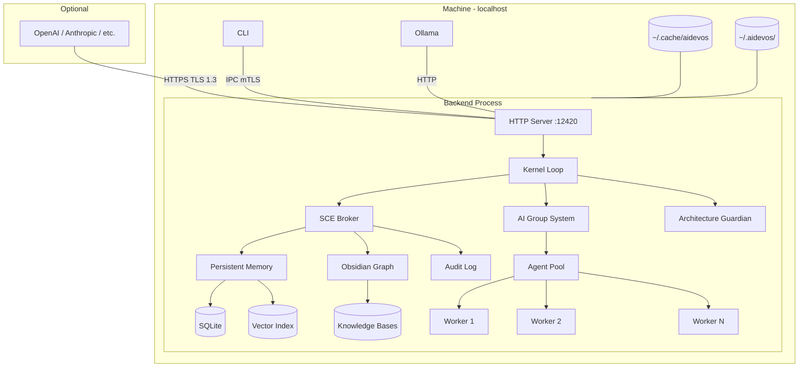
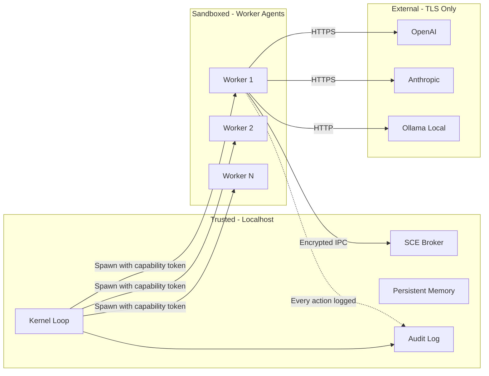

# Localhost Architecture

> **Domain:** Local-First Deployment Topology
> **Applies to:** CLI, Backend Process, All Subsystems
> **Last updated:** 2026-07-22

## Overview

AI Dev OS is designed to run entirely on **localhost** with no external dependencies. All components — the Kernel, SCE event bus, memory stores, vector index, graph engine, and model provider proxies — run in a single backend process on the user's machine. The CLI communicates with the backend over a local IPC channel.

```
┌─────────────────────────────────────────────────────────────┐
│  User Machine                                                │
│                                                              │
│  ┌──────────┐              ┌──────────────────────────────┐  │
│  │   CLI    │  IPC (mTLS)  │      Backend Process          │  │
│  │          │◄────────────►│                              │  │
│  │ agent    │              │  ┌────────┐ ┌──────────────┐ │  │
│  │ chat     │              │  │ HTTP   │ │ Kernel Loop  │ │  │
│  │ project  │              │  │ Server │ │ (event      │ │  │
│  │ config   │              │  │ :PORT  │ │  driven)    │ │  │
│  └──────────┘              │  └────────┘ └──────┬───────┘ │  │
│                            │                     │         │  │
│                            │  ┌──────────────────┼───────┐ │  │
│                            │  │    AI Group      │       │ │  │
│                            │  │    System        │       │ │  │
│                            │  │  ┌───────────────┴────┐  │ │  │
│                            │  │  │  Agent Pool        │  │ │  │
│                            │  │  │  (Worker Processes)│  │ │  │
│                            │  │  └────────────────────┘  │ │  │
│                            │  └──────────────────────────┘ │  │
│                            │                              │  │
│                            │  ┌────────┐ ┌──────────────┐ │  │
│                            │  │  SCE   │ │ Persistent   │ │  │
│                            │  │ Broker │ │ Memory       │ │  │
│                            │  └────────┘ └──────────────┘ │  │
│                            │                              │  │
│                            │  ┌────────┐ ┌──────────────┐ │  │
│                            │  │Obsidian│ │ Model        │ │  │
│                            │  │ Graph  │ │ Provider     │ │  │
│                            │  │ Engine │ │ Proxies      │ │  │
│                            │  └────────┘ └──────────────┘ │  │
│                            └──────────────────────────────┘  │
│                                                              │
│  ~/.aidevos/                              Remote (optional)  │
│  ├── data/              ┌──────────────────────────────┐    │
│  ├── config.toml        │  Model Providers              │    │
│  ├── logs/              │  OpenAI / Anthropic / etc.   │    │
│  └── cache/             │  HTTPS only, TLS 1.3         │    │
│                          └──────────────────────────────┘    │
└─────────────────────────────────────────────────────────────┘
```

## Process Architecture

The backend process is a single OS process with multiple subsystems running as async tasks or threads:

| Component | Role | Thread Model |
|-----------|------|-------------|
| **HTTP Server** | Exposes REST + WebSocket API for CLI communication. | Async (tokio). One listener thread. |
| **Kernel Loop** | Event-driven main loop. Dispatches agent requests, manages lifecycle. | Single-threaded async. |
| **AI Group System** | Spawns and supervises agent worker processes. | Per-group supervisor thread. |
| **Agent Pool** | Child processes (one per agent) running the model inference loop. | Separate OS processes. |
| **SCE Broker** | In-memory event bus. Topics for audit, coordination, shared memory. | In-process async channel. |
| **Persistent Memory** | Encrypted SQLite + usearch vector index. | Single writer thread, async readers. |
| **Obsidian Graph Engine** | Caching graph database over the Knowledge System. | Async, shared threadpool. |
| **Model Provider Proxies** | HTTP clients to OpenAI, Anthropic, Ollama, etc. | Async HTTP pool. |

## IPC Between CLI and Backend

| Platform | Transport | Authentication |
|----------|-----------|---------------|
| **Linux / macOS** | Unix domain socket (`~/.aidevos/run/aidevos.sock`) | SO_PEERCRED (peer PID/UID verification) + mTLS |
| **Windows** | Named pipe (`\\.\pipe\aidevos-<workspace_id>`) | Named pipe impersonation level + mTLS |

All IPC traffic is encrypted with mTLS using a self-signed CA generated at first startup. The CLI verifies the backend's certificate fingerprint against `~/.aidevos/config.toml`.

## Port Allocation

The HTTP server binds to `localhost:<PORT>`:

1. Default port: **12420** (chosen to avoid conflicts with common daemons).
2. On conflict: auto-increment until a free port is found (max 5 attempts).
3. The chosen port is written to `~/.aidevos/run/port` so the CLI can discover it.

All ports bind to **127.0.0.1 only** — no external network exposure.

## Filesystem Layout

```
~/.aidevos/
├── config.toml              # Global configuration (keys, defaults, providers)
├── run/
│   ├── aidevos.sock         # Unix domain socket (Linux/macOS)
│   ├── aidevos.pipe         # Named pipe (Windows)
│   └── port                 # Port file (discovery)
├── data/
│   ├── <workspace_id>/
│   │   ├── config.toml      # Workspace-specific config
│   │   ├── main.kb/         # Main Knowledge Base (SQLite)
│   │   ├── global.kb/       # Global Knowledge Base (SQLite)
│   │   ├── persistent_memory/  # Encrypted memory store
│   │   ├── vector_index.usearch # HNSW vector index
│   │   └── vectors.db       # Vector relational store
│   └── ...
├── logs/
│   ├── aidevos.log          # Main application log
│   ├── audit.log            # Security audit log (append-only)
│   └── crash/               # Crash reports
└── cache/
    ├── embeddings/           # Embedding cache
    └── models/              # Downloaded model files (Ollama)
```

## Startup Sequence

1. **Load config** — Read `~/.aidevos/config.toml`. Create default if absent.
2. **Generate identity** — If no Ed25519 key exists, generate one. Store in OS keychain.
3. **Allocate port** — Bind HTTP server to `localhost:PORT`. Write port file.
4. **Open IPC** — Create Unix socket / named pipe. Set permissions to 0700.
5. **Initialize stores** — Open Persistent Memory, vector index, Knowledge Bases.
6. **Load workspace** — Find default workspace or prompt user to create one.
7. **Start SCE** — Initialize in-memory event broker.
8. **Warm caches** — Preload embedding cache, graph engine cache.
9. **Signal ready** — Write PID file to `~/.aidevos/run/aidevos.pid`. CLI can now connect.

Total time: **< 500ms** on modern hardware (SSD, 16 GB RAM).

## Shutdown Sequence

1. **Signal workers** — Send graceful shutdown to all agent processes (SIGTERM, then SIGKILL after 5s).
2. **Flush stores** — Sync Persistent Memory, vector index, Knowledge Bases to disk.
3. **Close IPC** — Remove Unix socket / named pipe.
4. **Stop HTTP** — Graceful HTTP shutdown (drain in-flight requests, max 10s).
5. **Seal vault** — Encrypt and seal the Secrets Vault.
6. **Remove PID file** — Clean up `~/.aidevos/run/aidevos.pid`.

## Resource Limits

| Resource | Default | Configuration |
|----------|---------|---------------|
| **Memory** | 4 GB (soft), 8 GB (hard) | `[resources].memory_soft` / `memory_hard` |
| **CPU** | 4 cores (soft), 8 cores (hard) | `[resources].cpu_soft` / `cpu_hard` |
| **Disk** | 10 GB (per workspace) | `[resources].disk_max_gb` |
| **File descriptors** | 4096 | `[resources].fd_limit` |
| **Agent processes** | 8 | `[resources].max_agents` |

## Optional Remote Provider Access

- Model providers (OpenAI, Anthropic, etc.) are called over **HTTPS (TLS 1.3)** only.
- No inbound network access. AI Dev OS never listens on a non-loopback interface.
- API keys are stored in the encrypted Secrets Vault and never logged.

## Offline Guarantees

| Capability | Offline? | Notes |
|------------|----------|-------|
| Local models (Ollama) | ✅ Full | All core functionality works. |
| Persistent Memory | ✅ Full | Encrypted SQLite + local vector index. |
| Knowledge System | ✅ Full | Local FTS5 + Obsidian graph. |
| Agent execution | ✅ Full | Uses local models. |
| Remote models | ❌ | Requires network. Falls back to local models. |
| Cross-workspace bridge | ⚠️ | Works within same machine; network bridge requires network. |

## Mermaid Localhost Topology



## IPC Transport Details

| Aspect | Unix Domain Socket (Linux/macOS) | Named Pipe (Windows) |
|--------|--------------------------------|---------------------|
| Path | `~/.aidevos/run/aidevos.sock` | `\\.\pipe\aidevos-<workspace_id>` |
| Permissions | `0700` (owner only) | Pipe ACL (owner only) |
| Auth | `SO_PEERCRED` (PID/UID) + mTLS | Named pipe impersonation + mTLS |
| Buffer | 64 KB default | 64 KB default |
| Max message | 1 MB | 1 MB |
| Protocol | HTTP/2 over Unix socket | HTTP/2 over named pipe |

All IPC messages are framed as HTTP/2 requests. The CLI sends requests to the backend; the backend responds with JSON bodies. Streaming responses (e.g., `runs stream`) use HTTP/2 server-sent events.

## Process Model

| Process Type | Count | Isolation | Restart Policy |
|-------------|-------|-----------|----------------|
| Backend (main) | 1 | OS process | Automatic (systemd/launchd) |
| Worker agents | 0-N (configurable) | Child OS process | Per-worker: restart on crash (max 3) |
| Plugin (WASM) | 0-N | WASM sandbox | Per-plugin: restart on crash (max 5) |
| Plugin (subprocess) | 0-N | Child OS process | Per-plugin: restart on crash (max 3) |

## Startup Sequence (Detailed)

```
T+0 ms    Load config from ~/.aidevos/config.toml (or fail with clear error)
T+10 ms   Generate Ed25519 identity if first run; store in OS keychain
T+20 ms   Bind HTTP server to localhost; scan ports from 12420 upward
T+50 ms   Create IPC socket/pipe with 0700 permissions
T+80 ms   Initialize Persistent Memory (SQLite + vector index)
T+120 ms  Load workspace configuration
T+150 ms  Start SCE broker (in-memory event bus)
T+200 ms  Warm caches (embeddings, graph engine)
T+250 ms  Write PID file to ~/.aidevos/run/aidevos.pid
T+300 ms  Signal readiness; CLI can now connect
```

Total target: **< 500 ms** on modern hardware with SSD.

## Security Boundaries



## Failure Modes

| Mode | Detection | Response |
|------|-----------|----------|
| Port conflict | Bind fails on first 5 attempts | Log error; suggest manual port config |
| IPC socket creation failure | Permission denied | Log error; check filesystem permissions |
| Worker process crash | Heartbeat miss > 10s | Restart worker; reassign tasks |
| Backend OOM | OS kills process | systemd/launchd auto-restart; analyze crash dump |
| Disk full | Write failure on data directory | Enter read-only mode; alert operator |
| Config load failure | Parse error on startup | Fall back to defaults; log error |
| Keychain unavailable | Identity generation fails | Fall back to file-based key storage |

## Acceptance Criteria

- The backend process starts and binds to `localhost:12420` within 500 ms on modern hardware.
- CLI connects to the backend via IPC and executes `aidevos models list` successfully.
- A worker crash causes automatic restart and task reassignment within 10 seconds.
- All IPC traffic is encrypted with mTLS; non-loopback connections are rejected.
- Port conflicts are resolved by auto-incrementing (max 5 attempts).
- The startup sequence produces no network egress when using local models.

## Related Documents

| Document | Description |
|----------|-------------|
| [Backend](BACKEND.md) | Backend process architecture and lifecycle |
| [Deployment](DEPLOYMENT.md) | Production deployment guide |
| [CLI](CLI.md) | Command-line interface reference |
| [Folder Structures](FOLDER_STRUCTURES.md) | Complete filesystem layout |
| [Local Dev](LOCAL_DEV.md) | Development environment setup |
