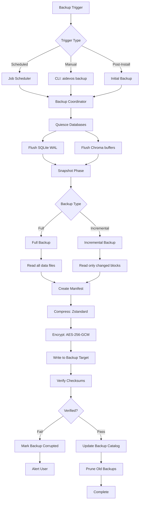

# Local Backup Strategy

> Operational pillar: all backups are local-only, no cloud dependencies. Every data store in the AI Development Operating System has a defined backup target, schedule, and recovery procedure.

## Overview

The AI Development Operating System stores all user data locally under `~/.aidevos/` and `~/.config/aidevos/`. This document defines the complete local backup strategy covering every data category: SQLite databases, Chroma vector stores, configuration files, model caches, plugin directories, and audit logs. All backup operations run entirely on the local machine with no cloud upload. Backup artifacts are stored on local storage (internal drive, external USB, or network-attached local volume).

The backup system is implemented as an `aidevos backup` CLI command and a scheduled background service. Encryption, compression, incremental algorithms, and verification steps ensure data integrity without requiring remote infrastructure.

## Goals

- Every data store in the system MUST have a defined backup target and procedure
- Backups MUST complete without any network dependency or cloud service
- Automated backups MUST run on a user-configurable schedule via the local job scheduler
- Incremental backups MUST reuse full backup snapshots to minimize storage waste
- Backup archives MUST be compressed (Zstandard, default) and encrypted (AES-256-GCM)
- Restore procedures MUST be documented and verifiable for each data category
- Backup verification MUST run automatically after every backup cycle
- Integration with Disaster Recovery MUST provide clear recovery point objectives (RPO) and recovery time objectives (RTO) for each store
- The user MUST be able to trigger ad-hoc backups via CLI at any time
- Backup metadata (timestamps, checksums, manifest) MUST be stored alongside the archive for verification

## Non-Goals

- Cloud backup, remote replication, or off-site storage — this is strictly local
- Real-time or continuous data replication — backups are point-in-time snapshots
- Backing up running database files without quiescence — databases are flushed before snapshot
- Backup over network to non-local targets (NFS/SMB is allowed only for local NAS on the same machine)

## Architecture

### Backup Pipeline



### Backup Targets

| Data Store | Location | Backup Type | RPO | RTO |
|-----------|----------|-------------|-----|-----|
| Agent Memory (SQLite) | `~/.aidevos/stores/memory.db` | Full + Incremental | 15 min | 5 min |
| Knowledge Base (SQLite) | `~/.aidevos/stores/knowledge/` | Full + Incremental | 15 min | 5 min |
| Audit Log (SQLite) | `~/.aidevos/logs/audit.db` | Full + Incremental | 1 hour | 10 min |
| Telemetry (SQLite) | `~/.aidevos/logs/telemetry.db` | Full + Incremental | 1 hour | 10 min |
| Vector Index (Chroma) | `~/.aidevos/stores/vectors/` | Full | 1 hour | 15 min |
| Configuration (TOML) | `~/.config/aidevos/` | Full | 24 hours | 2 min |
| Secrets (encrypted JSON) | `~/.config/aidevos/secrets.json` | Full | 24 hours | 2 min |
| Model Cache | `~/.cache/aidevos/models/` | Full + Incremental | 7 days | 30 min |
| Plugins | `~/.config/aidevos/plugins/` | Full | 7 days | 5 min |
| Cache (SQLite) | `~/.aidevos/cache/` | None (ephemeral) | N/A | N/A |

### Full vs Incremental Backups

The system uses a tiered backup strategy:

**Full backups** capture the complete state of every data store. They run daily by default or on the first backup after a 7-day gap. Full backups are self-contained and do not require any prior backup for restoration.

**Incremental backups** capture only data blocks changed since the last full or incremental backup. They run at the configured interval (default 15 minutes for critical stores). Incremental backups are combined with their parent full backup during restore to reconstruct the full state.

The backup coordinator tracks the chain in a local SQLite catalog at `~/.aidevos/backups/catalog.db`:

| Column | Description |
|--------|-------------|
| backup_id | UUID of the backup |
| timestamp | ISO 8601 timestamp |
| type | full or incremental |
| parent_id | UUID of parent backup (null for full) |
| store | Target data store name |
| size_bytes | Uncompressed size |
| compressed_bytes | Compressed size |
| checksum | SHA-256 of the archive |
| status | completed, failed, verifying |
| manifest_path | Path to the manifest JSON |

### Compression

All backup archives use Zstandard compression (zstd) with a configurable level:

| Level | Speed | Ratio | Use Case |
|-------|-------|-------|----------|
| 1 (fast) | 500 MB/s | 2.0x | Incremental, frequent backups |
| 3 (default) | 300 MB/s | 2.8x | Standard full backups |
| 10 (max) | 50 MB/s | 3.5x | Weekly archival backups |

SQLite databases compress particularly well (3–5x ratio) due to repetitive page structures. Chroma vector stores compress at 1.5–2x due to the dense float data. Configuration files compress at 8–12x but are negligible in size.

### Encryption

Every backup archive is encrypted before writing to disk using AES-256-GCM:

```toml
[backup.encryption]
enabled = true
algorithm = "AES-256-GCM"
key_source = "os_keyring"
key_label = "aidevos-backup-key"
cipher_config = { tag_length = 16, nonce_length = 12 }
```

The encryption key is stored in the OS keyring (Windows Credential Manager, macOS Keychain, Linux libsecret). Each archive uses a unique random nonce stored in the archive header alongside the encrypted payload. The key can be rotated via `aidevos backup rotate-key`, which re-encrypts all archive headers without rewriting payloads.

## Configuration

```toml
# ~/.config/aidevos/backup.toml

[backup]
enabled = true
target_dir = "~/.aidevos/backups/"
compression = "zstd"
compression_level = 3
encryption = true

[backup.schedule]
enabled = true
cron = "*/15 * * * *"   # every 15 minutes
full_backup_cron = "0 2 * * *"  # daily at 2 AM
max_backups = 50
max_age_days = 30

[backup.stores]
"stores/memory.db" = { type = "sqlite", priority = "critical", incremental = true }
"stores/knowledge/" = { type = "sqlite_dir", priority = "critical", incremental = true }
"stores/vectors/" = { type = "chroma", priority = "high", incremental = false }
"logs/audit.db" = { type = "sqlite", priority = "normal", incremental = true }
"logs/telemetry.db" = { type = "sqlite", priority = "normal", incremental = true }
"../.config/aidevos/" = { type = "config_dir", priority = "critical", incremental = false }
"../.cache/aidevos/models/" = { type = "model_cache", priority = "low", incremental = true }

[backup.restore]
verify_after_restore = true
backup_before_restore = true
dry_run_default = false
```

## Interfaces

### CLI Command: `aidevos backup`

```
SYNOPSIS:
    aidevos backup [--full] [--store <name>] [--dry-run] [--encrypt | --no-encrypt]
    aidevos backup list [--store <name>] [--limit <n>]
    aidevos backup show <backup-id>
    aidevos backup verify <backup-id>
    aidevos backup prune [--dry-run] [--keep <n>] [--age <days>]
    aidevos backup rotate-key
    aidevos backup schedule [--enable | --disable]

EXAMPLES:
    aidevos backup                          # Run scheduled backup (incremental)
    aidevos backup --full                   # Force full backup
    aidevos backup --store memory.db        # Backup only agent memory
    aidevos backup list --limit 10          # List last 10 backups
    aidevos backup verify abc-123           # Verify backup integrity
    aidevos backup prune --keep 20          # Keep only 20 most recent
    aidevos backup rotate-key              # Rotate encryption key
```

### Programmatic Interface

```python
from aidevos.backup import BackupManager

manager = BackupManager(config_path="~/.config/aidevos/backup.toml")

# Run a full backup
result = manager.run_full_backup(stores=["memory.db", "knowledge/"])

# Run incremental backup
result = manager.run_incremental_backup()

# List backups
backups = manager.list_backups(store="memory.db", limit=10)

# Restore from backup
manager.restore(backup_id="abc-123", target_dir="~/.aidevos/stores/")

# Verify backup integrity
checksum = manager.verify(backup_id="abc-123")
```

### Events

The backup system emits events on the local event bus:

| Event | Payload | Description |
|-------|---------|-------------|
| `backup.started` | `{ backup_id, type, stores[] }` | Backup cycle began |
| `backup.completed` | `{ backup_id, size, duration_ms }` | Backup cycle finished |
| `backup.failed` | `{ backup_id, error }` | Backup cycle failed |
| `backup.verify.passed` | `{ backup_id }` | Verification succeeded |
| `backup.verify.failed` | `{ backup_id, errors[] }` | Verification found corruption |
| `backup.pruned` | `{ removed_count, freed_bytes }` | Old backups cleaned |

## Failure Modes

| Failure Mode | Detection | Recovery |
|-------------|-----------|----------|
| Target disk full | Backup fails with ENOSPC | Prune old backups, alert user, switch to secondary target if configured |
| Database locked | SQLITE_BUSY during quiesce | Retry with backoff (3 attempts, 1s/5s/15s); skip and log if persistent |
| Encryption key missing | Keyring returns empty | Fall back to unencrypted with warning; log entry in audit |
| Compression failure | zstd returns error code | Retry with level 1 (fast) as fallback; mark backup degraded |
| Backup catalog corrupt | SQLite integrity check fails | Rebuild catalog from filesystem scan of backup directory |
| Partial backup | Incomplete manifest | Mark backup as "partial" during restore; merge with previous full backup |
| Concurrent backup | PID file collision | Queue second backup; reject and log "backup already running" |
| Checksum mismatch | Verification fails | Discard corrupted archive; retry backup from scratch |
| Target path missing | Directory does not exist | Create directory with user confirmation; fail if parent missing |
| Power loss mid-backup | Abrupt process termination | On restart, scan for incomplete archives (.tmp suffix) and remove them |

## Security

- Backup archives are encrypted with AES-256-GCM before touching disk
- Encryption keys reside in the OS keyring, never in configuration files or environment variables
- Backup manifest files contain only metadata (paths, sizes, checksums) — no content or secrets
- Temporary backup files (.tmp extension) are created with restrictive permissions (0600)
- The backup directory inherits the parent directory's permission model
- Restore operations respect file ownership and permission bits
- Secrets file (`secrets.json`) is backed up in encrypted form only; plaintext is never written to the backup target
- Key rotation is supported without rewriting existing archives — new key encrypts only new archives
- Backup verification uses constant-time comparison for checksums to prevent timing attacks
- The backup catalog is itself a SQLite database protected by OS file permissions
- In-flight data during quiescence is captured entirely in memory, never spilled to unencrypted temp files

## Restore Procedures

### Full Restore

```bash
# List available backups
aidevos backup list --store memory.db

# Restore a specific backup to its original location
aidevos backup restore abc-123

# Restore to an alternative location (safety first)
aidevos backup restore abc-123 --target /tmp/restore-test/

# Verify restored data integrity
aidevos backup verify abc-123
```

### Selective Restore

```bash
# Restore only the configuration files from a backup
aidevos backup restore abc-123 --include "config/*"

# Restore everything except model cache
aidevos backup restore abc-123 --exclude "cache/models/"
```

### Restore Chain (Incremental)

```bash
# Restore from incremental backup (automatically resolves parent chain)
aidevos backup restore inc-456 --resolve-chain

# The system automatically:
# 1. Locates parent full backup (abc-123)
# 2. Applies all incremental backups in order (inc-456, inc-789)
# 3. Returns the fully reconstructed state
```

### Verifying Restore Readiness

```bash
# Dry-run restore to verify all prerequisites
aidevos backup restore abc-123 --dry-run

# Output:
# ✓ Backup abc-123 found (full, 2025-01-15T02:00:00Z)
# ✓ Encryption key available in OS keyring
# ✓ Target directory writable
# ✓ Disk space: 2.3 GB required, 45 GB available
# ✓ All dependent stores accounted for
# ✗ Chroma service is running — stop before restore
```

## Verification

Every backup is verified immediately after creation:

```python
verification_steps = [
    "checksum: SHA-256 manifest of archive matches header",
    "decrypt: AES-256-GCM decrypt with stored nonce succeeds",
    "decompress: zstd decompression produces valid data stream",
    "integrity: SQLite stores pass PRAGMA integrity_check",
    "count: File count matches manifest entries",
    "size: Restored file sizes match originals",
]
```

Verification results are stored in the backup catalog. A failed verification triggers an automatic retry (one full backup attempt). If the retry also fails, the system marks the store as ERR and alerts via the dashboard.

## Integration with Disaster Recovery

The backup system is the data source for all disaster recovery scenarios defined in [LOCAL_RECOVERY.md](./LOCAL_RECOVERY.md). The specific mappings:

| Recovery Scenario | Backup Source | RTO |
|------------------|---------------|-----|
| Corrupted SQLite DB | Latest full + incrementals | 5 min |
| Lost config directory | Latest full backup of config | 2 min |
| Chroma vector corruption | Latest full backup of vectors | 15 min |
| Full machine reinstall | Full backup of all stores | 30 min |
| Accidental data deletion | Point-in-time restore from 15-min increments | 15 min |

## Related Documents

- [Local Recovery](./LOCAL_RECOVERY.md)
- [Local-First Architecture](./LOCAL_FIRST_ARCHITECTURE.md)
- [Disaster Recovery](./DISASTER_RECOVERY.md)
- [Database](./DATABASE.md)
- [Vector Store](./VECTOR_STORE.md)
- [Configuration](./CONFIGURATION.md)
- [Secrets Management](./SECRETS_MANAGEMENT.md)
- [Cache Strategy](./CACHING_STRATEGY.md)
- [Job Scheduler](./JOB_SCHEDULER.md)
- [Data Retention](./DATA_RETENTION.md)
- [Encryption](./ENCRYPTION.md)
- [Audit Log](./AUDIT_LOG.md)
