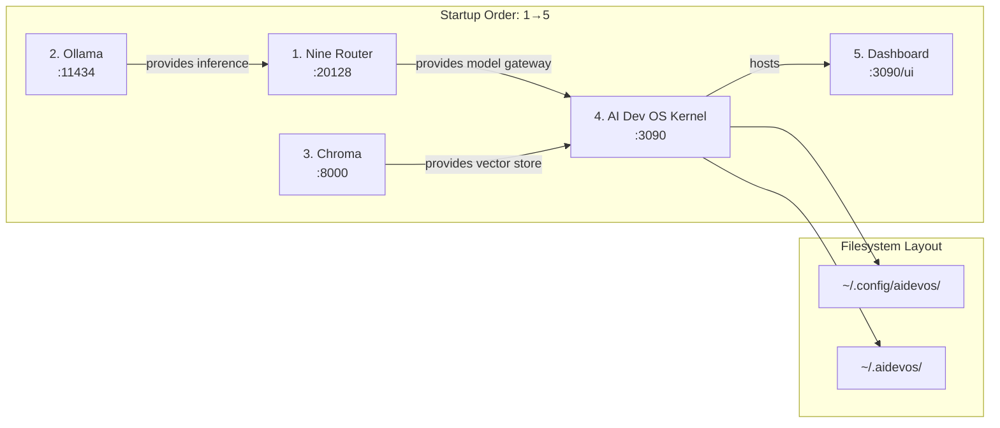

# Local Deployment

> Topology reference: complete local deployment architecture for the AI Development Operating System on a single machine.

## Overview

Local deployment is the default topology for AI Dev OS. All services run on a single machine — no load balancers, no container orchestrators, no cloud networking. This document provides the complete deployment blueprint: port allocation, startup ordering, configuration file paths, environment variables, service management, and troubleshooting for the local topology.

The system consists of five core services plus optional storage and provider processes. Every service communicates over localhost TCP or Unix sockets. The startup order is critical because later services depend on Nine Router being available for model lookups.

## Goals

- Define the canonical single-machine deployment topology
- Specify exact port allocations with no conflicts
- Document startup ordering and inter-service dependencies
- Provide systemd service files for Linux and launchd plists for macOS
- Cover all configuration file paths and environment variable overrides
- Include troubleshooting procedures for every common failure

## Non-Goals

- Multi-machine or cluster deployment — that is a separate topology
- Kubernetes manifests — the system avoids container orchestration dependencies
- Cloud provisioning scripts — deployment is local-first by definition
- Load balancing or HA configuration — not applicable to single-machine topology

## Architecture



### Process Tree

```text
PID 1: systemd / launchd
 ├── PID 1001: nine-router (node nine-router.js)
 ├── PID 1002: ollama (ollama serve)
 ├── PID 1003: chroma (chroma run)
 ├── PID 1004: aidevos-kernel (node kernel.js)
 │    └── PID 1005: dashboard (http server)
 └── PID 1006: aidevos-watch (file watcher)
```

## Configuration

### File Paths

| Path | Purpose | Created By |
|------|---------|------------|
| `~/.config/aidevos/config.toml` | Primary configuration | `aidevos init` |
| `~/.config/aidevos/secrets.json` | Encrypted secrets | `aidevos init` |
| `~/.config/aidevos/nine_router.toml` | Nine Router config | `aidevos init` |
| `~/.config/aidevos/providers.toml` | Provider definitions | `aidevos init` |
| `~/.aidevos/` | Data root directory | First start |
| `~/.aidevos/stores/` | SQLite DBs, vector stores | First start |
| `~/.aidevos/stores/memory.db` | Agent memory store | Kernel start |
| `~/.aidevos/stores/knowledge/` | Knowledge base | Kernel start |
| `~/.aidevos/stores/vectors/` | Chroma persistence | Chroma start |
| `~/.aidevos/logs/` | All log output | First start |
| `~/.aidevos/logs/kernel.log` | Kernel logs | Kernel start |
| `~/.aidevos/logs/nine_router.log` | Router logs | Nine Router start |
| `~/.aidevos/backups/` | Automatic backups | Cron / scheduler |

### Environment Variables

```bash
# Core paths
AIDEVOS_DATA_DIR="$HOME/.aidevos"
AIDEVOS_CONFIG_DIR="$HOME/.config/aidevos"
AIDEVOS_LOG_DIR="$HOME/.aidevos/logs"
AIDEVOS_BACKUP_DIR="$HOME/.aidevos/backups"

# Port overrides
AIDEVOS_NINE_ROUTER_PORT=20128
AIDEVOS_KERNEL_PORT=3090
AIDEVOS_DASHBOARD_PORT=3090
AIDEVOS_CHROMA_PORT=8000

# Service management
AIDEVOS_START_TIMEOUT_MS=30000
AIDEVOS_HEALTH_CHECK_INTERVAL_MS=5000
AIDEVOS_LOG_LEVEL=info

# Provider defaults
AIDEVOS_DEFAULT_PROVIDER=ollama
AIDEVOS_OLLAMA_ENDPOINT=http://localhost:11434
AIDEVOS_LM_STUDIO_ENDPOINT=http://localhost:1234
AIDEVOS_VLLM_ENDPOINT=http://localhost:8000
AIDEVOS_LLAMACPP_ENDPOINT=http://localhost:8080
```

### Port Allocation Table

| Port | Service | Required | Configurable |
|------|---------|----------|--------------|
| 20128 | Nine Router | Yes | `AIDEVOS_NINE_ROUTER_PORT` |
| 3090 | Kernel / Dashboard | Yes | `AIDEVOS_KERNEL_PORT` |
| 11434 | Ollama | Recommended | N/A (Ollama config) |
| 8000 | Chroma | Optional | `AIDEVOS_CHROMA_PORT` |
| 1234 | LM Studio | Optional | N/A (LM Studio config) |
| 8080 | llama.cpp | Optional | N/A (llama.cpp config) |

All ports bind to `127.0.0.1` only. No port is externally reachable unless the user explicitly configures a reverse proxy.

### Systemd Service (Linux)

```ini
# /etc/systemd/system/aidevos.target
[Unit]
Description=AI Dev OS Services
After=network.target

# /etc/systemd/system/aidevos-nine-router.service
[Unit]
Description=AI Dev OS - Nine Router
PartOf=aidevos.target
After=network.target

[Service]
Type=simple
User=aidevos
ExecStart=/usr/bin/node /opt/aidevos/nine-router.js
Environment=AIDEVOS_CONFIG_DIR=/etc/aidevos
Environment=AIDEVOS_LOG_LEVEL=info
Restart=on-failure
RestartSec=5

[Install]
WantedBy=aidevos.target

# /etc/systemd/system/aidevos-kernel.service
[Unit]
Description=AI Dev OS - Kernel
PartOf=aidevos.target
After=aidevos-nine-router.service ollama.service

[Service]
Type=simple
User=aidevos
ExecStart=/usr/bin/node /opt/aidevos/kernel.js
Environment=AIDEVOS_CONFIG_DIR=/etc/aidevos
Restart=on-failure
RestartSec=10

[Install]
WantedBy=aidevos.target
```

### Launchd Service (macOS)

```xml
<!-- ~/Library/LaunchAgents/com.aidevos.plist -->
<?xml version="1.0" encoding="UTF-8"?>
<!DOCTYPE plist PUBLIC "-//Apple//DTD PLIST 1.0//EN"
 "http://www.apple.com/DTDs/PropertyList-1.0.dtd">
<plist version="1.0">
<dict>
    <key>Label</key>
    <string>com.aidevos.kernel</string>
    <key>ProgramArguments</key>
    <array>
        <string>/usr/local/bin/node</string>
        <string>/opt/aidevos/kernel.js</string>
    </array>
    <key>EnvironmentVariables</key>
    <dict>
        <key>AIDEVOS_CONFIG_DIR</key>
        <string>/etc/aidevos</string>
    </dict>
    <key>KeepAlive</key>
    <true/>
    <key>RunAtLoad</key>
    <true/>
    <key>StandardOutPath</key>
    <string>/opt/aidevos/logs/kernel.log</string>
    <key>StandardErrorPath</key>
    <string>/opt/aidevos/logs/kernel.err</string>
</dict>
</plist>
```

### Startup Order and Wait Conditions

The `aidevos start` command enforces this sequence with health-check polling between each step:

1. **Nine Router** — start and wait for `GET /health` returning 200
2. **Ollama** — start and wait for `GET /api/tags` returning non-empty
3. **Chroma** (if enabled) — start and wait for `GET /api/v1/health`
4. **Kernel** — start, passes `--nine-router-url` derived from config
5. **Dashboard** — starts as a child process of Kernel; wait for `GET /health`

Each wait step has a configurable timeout (default 30 seconds, `AIDEVOS_START_TIMEOUT_MS`). If a non-critical service (Chroma, Ollama) fails to start, the system logs a warning and continues.

## Interfaces

### Start API

```
aidevos start [--no-ollama] [--no-chroma] [--daemon]
```

### Start Order Diagram (CLI Output)

```
$ aidevos start --verbose

  Starting AI Dev OS...
  ✔ Nine Router (:20128)          → 2.3ms
  ✔ Ollama (:11434)               → 843ms
  ✔ Chroma (:8000)                → 1201ms
  ✔ Kernel (:3090)                → 345ms
  ✔ Dashboard (:3090/ui)          → 12ms

  All services healthy. Dashboard at http://localhost:3090
```

### Stop API

```
aidevos stop [--force] [--timeout 10000]
```

Graceful shutdown reverses the startup order: Dashboard → Kernel → Chroma → Ollama → Nine Router. Each service receives SIGTERM followed by SIGKILL after the timeout.

## Failure Modes

| Failure | Cause | Diagnostic | Resolution |
|---------|-------|------------|------------|
| Nine Router won't start | Port 20128 in use | `netstat -ano` on port | Change port or kill `:20128` |
| Ollama not on PATH | Not installed | `which ollama` returns empty | Install Ollama |
| Kernel fails after Nine Router | Config mismatch | Check `nine_router.toml` endpoint | Regenerate: `aidevos init --force` |
| Dashboard 502 | Kernel not ready | `curl localhost:3090/health` | Wait; check `AIDEVOS_START_TIMEOUT_MS` |
| SQLite locked | Concurrent write | Kernel logs show `SQLITE_BUSY` | Wait; retry; single process only |
| Chroma DB corruption | Disk full or crash | Logs show vector search errors | Delete `~/.aidevos/stores/vectors/` and rebuild |
| `aidevos start` hangs | Subprocess timeout | Increase `AIDEVOS_START_TIMEOUT_MS` | Or use `--daemon` and check later |
| systemd service won't start | Permission on config dir | `journalctl -u aidevos-nine-router` | Fix ownership: `chown -R aidevos /etc/aidevos` |
| launchd plist not loaded | Syntax error in plist | `launchctl list \| grep aidevos` | Run `plutil -lint ~/Library/LaunchAgents/com.aidevos.plist` |
| High memory usage | Large model loaded | `top -o MEM` | Reduce model size or context window |

### Startup Order Troubleshooting

```
$ aidevos doctor

AIDEVOS Doctor v0.12.4
─────────────────────
✔ Node.js 20.11.0
✔ npm 10.2.4
✔ ~/.config/aidevos exists
✔ ~/.aidevos exists (2.3 GB free)
✔ Config TOML is valid
✔ Nine Router :20128 — REACHABLE
✘ Ollama   :11434 — NOT REACHABLE
  ⚠ Install Ollama: https://ollama.ai
✔ Chroma   :8000  — REACHABLE
✔ Kernel   :3090  — REACHABLE
✔ Dashboard :3090/ui — REACHABLE
✔ SQLite integrity — PASS
```

## Security

- All services bind to `127.0.0.1` — no external network access
- Unix domain sockets used where available (SQLite, IPC)
- Nine Router generates a random API key on first start
- Config files are readable only by the owner (`chmod 600`)
- Secrets file is encrypted with AES-256-GCM; key held by OS keyring
- No service listens on `0.0.0.0` unless explicitly overridden
- systemd service files run as unprivileged `aidevos` user
- launchd plists inherit the user's security context

## Related Documents

- [Self-Hosting](./SELF_HOSTING.md)
- [Local Model Providers](./LOCAL_MODEL_PROVIDERS.md)
- [Local-First Architecture](./LOCAL_FIRST_ARCHITECTURE.md)
- [Local Storage](./LOCAL_STORAGE.md)
- [Local Security](./LOCAL_SECURITY.md)
- [Nine Router Integration](./NINE_ROUTER_INTEGRATION.md)
- [Installation](./INSTALLATION.md)
