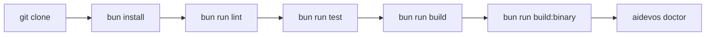

# Local Dev

> Guide for contributing to the AI Dev OS codebase — from cloning to shipping.

## Overview

AI Dev OS is written in TypeScript and compiled to a native binary via Bun. The repository is a monorepo containing the CLI, Kernel, Router, plugin system, and documentation. This guide covers the development workflow, tooling, and conventions.

## Prerequisites

| Tool | Version | Purpose |
|------|---------|---------|
| **Bun** | 1.2+ | Runtime, package manager, bundler |
| **Node.js** | 20+ | Some tooling scripts |
| **TypeScript** | 5.5+ | Language (handled by Bun) |
| **Git** | 2.40+ | Version control |

Install Bun: `curl -fsSL https://bun.sh/install | bash`

## Repository Setup

```bash
git clone https://github.com/aidevos/aidevos.git
cd aidevos
bun install
bun run build
```

The monorepo structure: `src/` (cli, kernel, router, providers, shared), `tests/`, `docs/`, `scripts/`, and a root `package.json`.

## Development Workflow

The standard loop: **code → lint → test → build**

### 1. Code

Make changes in `src/`. TypeScript strict mode is enforced. Run the dev watcher for fast iteration:

```bash
bun run dev
```

### 2. Lint

```bash
bun run lint          # Check for issues
bun run lint:fix      # Auto-fix
```

Linting covers TypeScript strict checks, import ordering, and formatting via Biome.

### 3. Test

```bash
bun run test                # All tests
bun run test:unit           # Unit tests only
bun run test:integration    # Integration tests (requires Ollama)
bun run test:coverage       # With coverage report
```

Tests use Bun's built-in test runner. Integration tests require an active Ollama instance. Test files use the `.test.ts` convention in `tests/`.

### 4. Build

```bash
bun run build          # TypeScript compilation
bun run build:binary   # Native binary via Bun.compile
bun run build:all      # Both
```

The compiled binary is at `dist/aidevos`.

Run `bun run test` for the full suite. Single file: `bun test tests/kernel/planner.test.ts`. Watch mode: `bun run test:watch`.

Build the binary with `bun run build:binary` — output at `dist/aidevos` with no runtime dependencies. Cross-compile targets via `./scripts/cross-build.sh --target linux-arm64`.

Preview docs locally with `bun run docs:serve` (docsify, opens at `http://localhost:3000`).

## Debugging Tips

| Situation | Approach |
|-----------|----------|
| **Verbose logging** | `AIDEVOS_LOG_LEVEL=debug` or `--verbose` |
| **Kernel traces** | Enable `[tracing]` in config, view at `http://localhost:4318` |
| **Binary crashes** | Run with `bun run dev` for full stack traces |
| **Provider issues** | `aidevos doctor --verbose` |
| **Config not loading** | `aidevos doctor --show-config` |
| **Memory inspector** | `aidevos memory query` |

## Commit Conventions

AI Dev OS follows [Conventional Commits](https://www.conventionalcommits.org/):

```
<type>(<scope>): <description>
```

| Type | Usage |
|------|-------|
| `feat` | New feature |
| `fix` | Bug fix |
| `docs` | Documentation only |
| `refactor` | Code change, no behavior change |
| `test` | Adding/fixing tests |
| `chore` | Build, CI, tooling |

Scopes include: `cli`, `kernel`, `router`, `memory`, `providers`, `config`, `docs`.

```
feat(kernel): add timeout to planner phase
fix(router): handle empty fallback list
docs(cli): document --json flag
```

## CI/CD Overview

| Pipeline | Trigger | What it does |
|----------|---------|--------------|
| **PR checks** | Every PR | `lint → test:unit → test:integration → build:binary` |
| **Main branch** | Push to `main` | All PR checks + publish `:latest` Docker image |
| **Release** | Tag `v*` | Build all platform binaries, publish GitHub release, npm + Homebrew + Docker |

CI is defined in `.github/workflows/`. All PR checks must pass before merge.

## Dev Environment Flow



## IDE Configuration

### VS Code / Cursor

Recommended extensions and settings:

| Extension | Purpose |
|-----------|---------|
| `biome.biome` | Linting and formatting |
| `mermaid-support` | Mermaid diagram preview |
| `tamasfe.even-better-toml` | TOML configuration support |
| `bradlc.vscode-tailwindcss` | Tailwind CSS (for UI/KB dashboard) |

Workspace settings (`.vscode/settings.json`):

```json
{
  "typescript.tsdk": "node_modules/typescript/lib",
  "editor.formatOnSave": true,
  "editor.defaultFormatter": "biome.biome",
  "typescript.preferences.preferTypeOnlyAutoImports": true
}
```

### Neovim / Helix

TypeScript LSP via `typescript-language-server`, formatter via `biome`. Configuration examples in [`docs/guides/editor-setup.md`](./guides/editor-setup.md).

## Expanded Debug Configuration

| Situation | Approach |
|-----------|----------|
| **Verbose logging** | `AIDEVOS_LOG_LEVEL=debug` or `--verbose` |
| **Kernel traces** | Enable `[tracing]` in config, view at `http://localhost:4318` |
| **Binary crashes** | Run with `bun run dev` for full stack traces |
| **Provider issues** | `aidevos doctor --verbose` |
| **Config not loading** | `aidevos doctor --show-config` |
| **Memory inspector** | `aidevos memory query` |
| **Breakpoint debugging** | `bun --inspect` and attach Chrome DevTools at `chrome://inspect` |
| **Test debugging** | `bun test --inspect tests/path/to/file.test.ts` |
| **Performance profiling** | `bun run build:profile` and open flamegraph in `perfetto.dev` |
| **Network inspection** | Set `AIDEVOS_HTTP_PROXY=http://localhost:8888` and route through mitmproxy |

## Test Runner Setup

Tests use Bun's built-in test runner with the following configuration in `package.json`:

```json
{
  "scripts": {
    "test": "bun test",
    "test:unit": "bun test --filter 'unit'",
    "test:integration": "bun test --filter 'integration'",
    "test:coverage": "bun test --coverage",
    "test:watch": "bun test --watch"
  }
}
```

Test files follow the convention `*.test.ts` and are placed in `tests/` mirroring the `src/` structure. Mock providers are defined in `tests/mocks/`.

## Build Pipeline (Local)

```bash
# Full local build
bun run build:all

# TypeScript compilation only
bun run build

# Native binary (self-contained, no runtime deps)
bun run build:binary

# Cross-compile for another platform
./scripts/cross-build.sh --target linux-arm64

# Build with profiling symbols
bun run build:profile
```

The build output goes to `dist/`. The binary at `dist/aidevos` has no runtime dependencies.

## Containerized Dev Environment

A Docker Compose configuration is provided for a reproducible dev environment:

```yaml
version: "3.9"
services:
  dev:
    build: .
    volumes:
      - .:/workspace
      - aidevos-data:/root/.aidevos
    ports:
      - "11434:11434"  # Ollama
      - "4318:4318"    # Tracing
    environment:
      - AIDEVOS_LOG_LEVEL=debug
    command: ["bun", "run", "dev"]

  ollama:
    image: ollama/ollama:latest
    volumes:
      - ollama-models:/root/.ollama
    ports:
      - "11435:11434"
    deploy:
      resources:
        reservations:
          devices:
            - driver: nvidia
              count: all
              capabilities: [gpu]
```

Run: `docker compose up -d` — mounts the workspace, starts Ollama with GPU support, and launches the dev server.

## Failure Modes

| Mode | Detection | Response |
|------|-----------|----------|
| Bun version mismatch | `bun --version` < 1.2 | `curl -fsSL https://bun.sh/install | bash` to upgrade |
| Node.js missing | `node --version` fails | Install Node.js 20+ via nvm or package manager |
| Port conflict | Address already in use | Kill the conflicting process or change port in config |
| Ollama not running | Health check fails | `ollama serve` or `docker compose up -d ollama` |
| Native binary fails on platform | `aidevos doctor` crashes | Collect stack trace; report issue; fall back to `bun run dev` |
| GPU not detected for Ollama | `nvidia-smi` succeeds but Ollama uses CPU | Verify CUDA toolkit; check `ollama serve --help` for GPU flags |
| Test flakiness | Test passes locally, fails in CI | Check environment variable differences; pin `AIDEVOS_HOME` |

## Observability

| Metric | Description |
|--------|-------------|
| `dev_build_seconds` | Time to complete a full build |
| `dev_test_seconds` | Time to complete the test suite |
| `dev_binary_size_bytes` | Size of the compiled binary |
| `dev_lint_errors` | Number of lint errors per run |

## Acceptance Criteria

- A fresh clone followed by `bun install && bun run build` produces a working `dist/aidevos` binary.
- `bun run test` completes with zero failures on a fresh clone.
- `bun run lint` produces zero errors on the unmodified codebase.
- `docker compose up -d` starts all services and `aidevos doctor` reports all subsystems green.
- Running `aidevos ci all` from the local repo produces the same results as the GitHub Actions CI pipeline.

## Related Documents

- [Contributing](./CONTRIBUTING.md) — code of conduct and PR process
- [Testing Strategy](./TESTING_STRATEGY.md) — test architecture and coverage
- [Code of Conduct](./CODE_OF_CONDUCT.md) — community standards
- [CLI Reference](./CLI.md) — testing the built binary
- [Installation](./INSTALLATION.md) — installing from source
