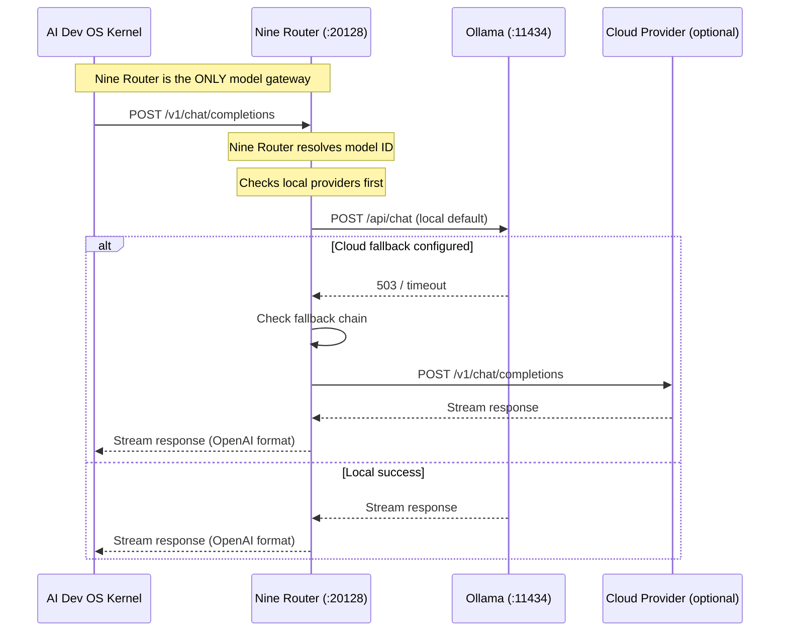

# Local-First Architecture

> Architectural pillar: the AI Development Operating System runs completely on localhost by default. Cloud services are optional, opt-in integrations.

## Overview

Local-First is the foundational architectural principle of the AI Development Operating System. Every subsystem, data store, model access path, and integration point MUST function without any network dependency. The system MUST be fully operational on a single machine with no cloud account, no API keys, and no internet connection.

This document establishes the architectural constraints, default configurations, and verified local-only topologies that all subsystem implementations MUST respect.

## Local-First Hierarchy

```
                    ┌─────────────────────────┐
                    │   AI Dev OS Kernel       │
                    │  (localhost:3090)        │
                    └────────┬────────────────┘
                             │
                    ┌────────▼────────────────┐
                    │   Nine Router           │
                    │  (localhost:20128)      │
                    │  Mandatory model gateway │
                    └────────┬────────────────┘
                             │
               ┌─────────────┼─────────────┐
               ▼             ▼             ▼
        ┌──────────┐  ┌──────────┐  ┌──────────┐
        │  Ollama  │  │ LM Studio│  │ llama.cpp│
        │ :11434   │  │ :1234    │  │ :8080    │
        └──────────┘  └──────────┘  └──────────┘
               │
        ┌──────▼──────┐
        │  Cloud Prov.│  (optional, via Nine Router)
        │  OpenAI etc.│
        └─────────────┘
```

### Default Layer

| Layer | Default | Alternative |
|-------|---------|-------------|
| Model Gateway | Nine Router (localhost:20128) | None (mandatory) |
| Inference engine | Ollama (localhost:11434) | LM Studio, vLLM, llama.cpp |
| Vector store | Chroma (localhost:8000) | LanceDB, SQLite FTS5 |
| Document store | SQLite | Local filesystem |
| Key-value store | SQLite | Local filesystem |
| Message queue | In-process IPC | — |
| Scheduler | In-process | Local cron |
| Secrets | OS keyring / env vars | Local encrypted file |
| Cache | Local filesystem (SQLite) | — |

## Goals

- Every subsystem MUST function with zero network dependencies
- Default configurations MUST use local-only components
- Cloud services MUST be opt-in, clearly documented as "Optional Integration"
- Local providers (Ollama, LM Studio, vLLM, llama.cpp) MUST be the documented default
- Nine Router MUST be the only model gateway; no subsystem talks to providers directly
- The system MUST be installable and runnable on a developer laptop with `npm install -g aidevos`
- All data MUST remain on the user's machine unless explicitly configured otherwise

## Non-Goals

- Preventing users from configuring cloud services — cloud is optional, not forbidden
- Replacing cloud infrastructure for production deployments — hybrid topologies are valid
- Guaranteeing identical performance between local and cloud inference

## Architectural Invariants

### Invariant 1: Nine Router is the Single Model Gateway

```
VALID:   Kernel → Nine Router (:20128) → Provider
INVALID: Kernel → Provider directly
INVALID: Kernel → OpenAI API directly
INVALID: Kernel → Anthropic API directly
```

Every inference request, model list query, streaming request, and embedding call MUST pass through Nine Router's OpenAI-compatible API at `http://localhost:20128/v1`.

### Invariant 2: Local-Only Operability

The system MUST pass a "flight-mode test": disable all network interfaces, and the system MUST still:
- Start and serve the dashboard
- Query models from local providers
- Execute tasks against assigned local models
- Store and retrieve memory
- Search the knowledge base
- Generate code and file edits
- Process voice commands (local STT/TTS)

### Invariant 3: Data Sovereignty

All user data MUST be stored in writable paths under the user's control:
- `~/.aidevos/` — configuration, databases, caches
- `~/.aidevos/stores/` — vector stores, document stores
- `~/.aidevos/logs/` — audit logs, telemetry
- `~/.aidevos/models/` — model downloads (symlinks/copies)
- `~/.config/aidevos/` — config files
- User-configured paths via `DATA_DIR` and `CONFIG_DIR`

### Invariant 4: Provider Agnosticism

The Core AI OS (Kernel, Planner, Critic, etc.) MUST NOT reference specific model providers. The Kernel knows only:
1. Nine Router's API surface (`http://localhost:20128/v1`)
2. The Nine canonical roles
3. `ModelBinding` objects returned by Nine Router

Provider names (OpenAI, Anthropic, Mistral, etc.) MUST NOT appear in subsystem specifications, prompts, or routing logic.

### Invariant 5: Offline Resilience

If a configured cloud provider is unreachable, the system MUST:
- Gracefully fall back to the next model in the chain
- Never block local model execution
- Never hang or crash
- Log the failure and surface it in the dashboard

## Local Storage Topology

| Store | Local Default | Location | Cloud Alternative |
|-------|--------------|----------|-------------------|
| Configuration | TOML file | `~/.config/aidevos/config.toml` | None |
| Secrets | OS keyring / env | `~/.config/aidevos/secrets.json` (encrypted) | None |
| Agent memory | SQLite | `~/.aidevos/stores/memory.db` | None |
| Knowledge base | SQLite FTS5 + Chroma | `~/.aidevos/stores/knowledge/` | None |
| Vector index | Chroma (local) | `~/.aidevos/stores/vectors/` | Qdrant cloud (opt-in) |
| Audit log | SQLite | `~/.aidevos/logs/audit.db` | None |
| Telemetry | SQLite | `~/.aidevos/logs/telemetry.db` | None |
| Cache | SQLite | `~/.aidevos/cache/` | None |
| Model cache | Filesystem | `~/.cache/aidevos/models/` | None |
| Plugins | Filesystem | `~/.config/aidevos/plugins/` | None |

## Model Access Flow



## Configuration Defaults

```toml
# ~/.config/aidevos/config.toml

[nine_router]
endpoint = "http://localhost:20128/v1"
# No API key required for local-only usage

[providers.local]
default = "ollama"
ollama.endpoint = "http://localhost:11434"
lm_studio.endpoint = "http://localhost:1234"
llama_cpp.endpoint = "http://localhost:8080"
vllm.endpoint = "http://localhost:8000"

[providers.cloud]
# All cloud providers are OPTIONAL
# openai.api_key = ""
# anthropic.api_key = ""
# google.api_key = ""
```

## Verified Local-Only Topology

A minimal viable system consists of:
1. AI Dev OS Kernel
2. Nine Router (localhost:20128)
3. One local model provider (Ollama recommended)
4. SQLite-based storage
5. No network access required

This topology supports:
- Full Kernel loop (Plan → Build → Review → Route → Critic)
- Code generation and file editing
- Knowledge base querying
- Voice command processing
- All nine router roles (Kernel, Planner, Router, Researcher, Builder, Critic, Merger, Guardian, Voice)

## Migration from Cloud-Assumed Architectures

| Pattern | Cloud-Assumed | Local-First |
|---------|--------------|-------------|
| Model access | `openai.chat.completions.create(...)` | Nine Router `POST /v1/chat/completions` |
| Embeddings | `openai.embeddings.create(...)` | Nine Router `POST /v1/embeddings` |
| Model discovery | Direct provider API calls | Nine Router `GET /v1/models` |
| Storage | S3, Cloud DB, Hosted Vector DB | SQLite, Chroma, Local Filesystem |
| Auth | Cloud IAM, OIDC provider | Local keyring, env vars |
| Secrets | Vault, AWS Secrets Manager | OS keyring, encrypted file |
| Auth | Cloud OAuth | Local keyring + API keys via Nine Router |
| Telemetry | Cloud metrics platform | Local SQLite + optional export |

## Security Considerations

- Local-first means credentials never leave the machine unless explicitly configured
- API keys for cloud providers are stored in the local OS keyring
- Nine Router handles all provider credential management; the Kernel never sees raw keys
- SQLite stores are encrypted at rest via system keyring binding
- Audit logs are append-only local files

## Acceptance Criteria

1. Fresh install with no network access starts and serves a dashboard
2. `aidevos init --local-only` completes without any API key prompt
3. Nine Router returns a non-empty model list from `GET /v1/models` with only local providers running
4. Kernel executes a full Plan→Build→Review cycle using only local models
5. Enabling a cloud provider in config does not affect local-only operations
6. `aidevos doctor` reports "Local-first: PASS" when all invariants are met

## Related Documents

- [Offline Mode](./OFFLINE_MODE.md)
- [Self Hosting](./SELF_HOSTING.md)
- [Nine Router Integration](./NINE_ROUTER_INTEGRATION.md)
- [Local Model Providers](./LOCAL_MODEL_PROVIDERS.md)
- [Project Vision](./PROJECT_VISION.md)
- [Installation](./INSTALLATION.md)

