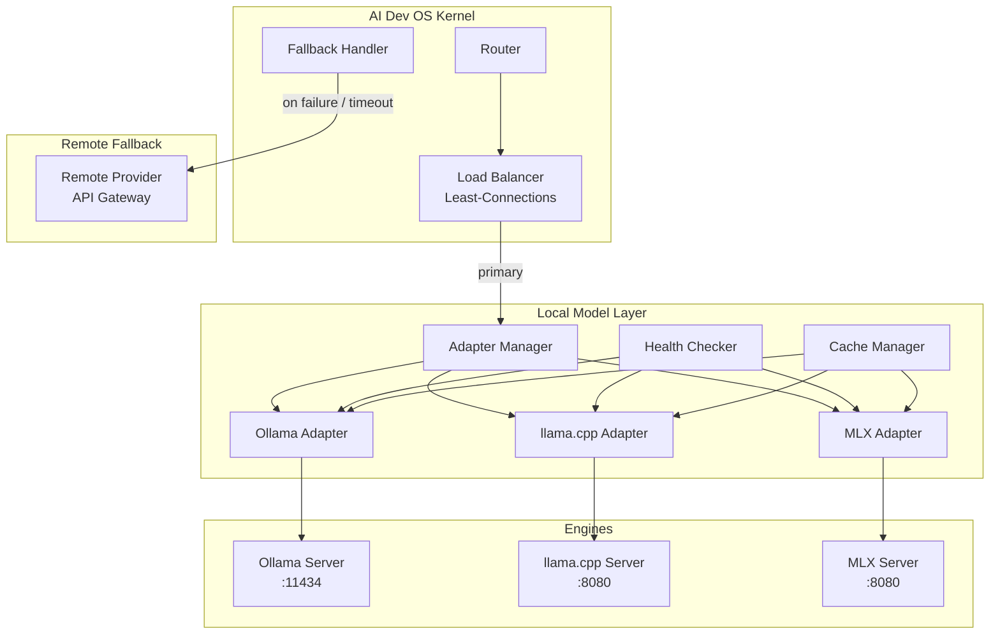
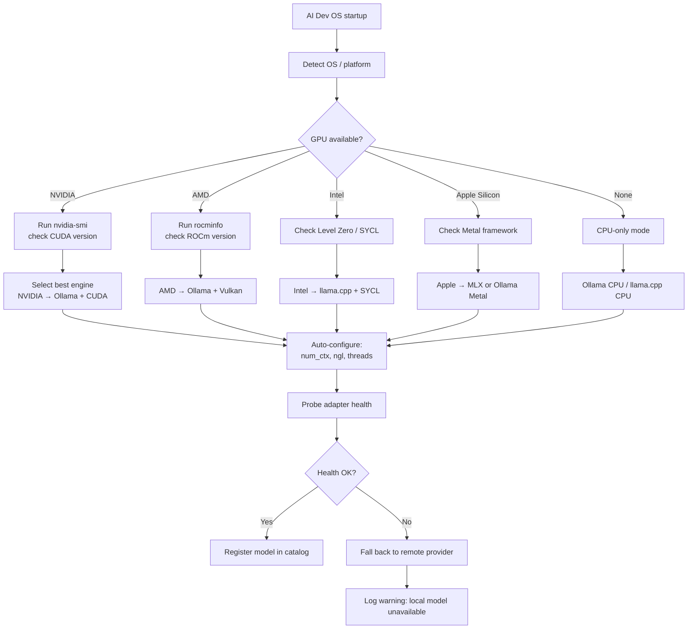
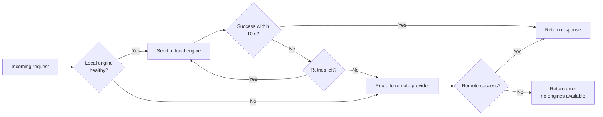

# Local Models

> Guide to setting up, configuring, and managing local model inference for AI Dev OS. Covers supported engines, model downloading, performance tuning, and troubleshooting.

## Overview

Local models provide zero-cost inference with no external API dependencies, full data privacy, and offline capability. AI Dev OS supports three local engines:

| Engine | Platform | Format | GPU Support |
|--------|----------|--------|-------------|
| **Ollama** | Linux, macOS, Windows | GGUF | CUDA, Vulkan, Metal |
| **llama.cpp** | Linux, macOS, Windows | GGUF | CUDA, Vulkan, Metal, SYCL |
| **MLX** | macOS (Apple Silicon) | safetensors | Metal (M1–M4) |

Ollama is the recommended default. llama.cpp is for advanced GPU tuning. MLX is for Apple Silicon only.

### Architecture Diagram



## Hardware Compatibility Matrix

| Hardware | Ollama | llama.cpp | MLX | Notes |
|---|---|---|---|---|
| **NVIDIA CUDA** (Compute 7.0+) | ✅ CUDA 12.x | ✅ CUDA 12.x, cuBLAS | ❌ | All NVIDIA GPUs with 8 GB+ VRAM |
| NVIDIA Tesla T4 (16 GB) | ✅ | ✅ | ❌ | Q4_K_M 7B recommended |
| NVIDIA A100 (40/80 GB) | ✅ | ✅ | ❌ | FP16/Q8_0 for 7B–13B |
| NVIDIA RTX 4090 (24 GB) | ✅ | ✅ | ❌ | Q8_0 for 7B, Q4_K_M for 13B |
| **AMD ROCm** (MI200/MI300) | ✅ ROCm 5.7+ | ✅ ROCm 5.7+ | ❌ | Linux only; `HSA_OVERRIDE_GFX_VERSION` may be needed |
| AMD RX 7900 XTX (24 GB) | ⚠️ Vulkan | ✅ ROCm | ❌ | Vulkan slower than CUDA by 15–30% |
| **Intel** Arc A770 (16 GB) | ✅ Vulkan | ✅ SYCL | ❌ | SYCL requires oneAPI 2024+ |
| Intel Xe Max | ✅ Vulkan | ✅ SYCL | ❌ | Limited VRAM, Q4_K_M for small models |
| **Apple Silicon** M1 (8 GB) | ✅ Metal | ✅ Metal | ✅ Metal | 3B max with adequate context |
| Apple Silicon M2 (16 GB) | ✅ Metal | ✅ Metal | ✅ Metal | 7B Q4_K_M feasible |
| Apple Silicon M3/M4 (24–48 GB) | ✅ Metal | ✅ Metal | ✅ Metal | 7B Q8_0 or 13B Q4_K_M |
| **CPU-only** (no GPU) | ✅ (slow) | ✅ (slow) | ❌ | 1–5 tok/s depending on model |

Key: ✅ Fully supported | ⚠️ Partial / experimental | ❌ Not supported

## Auto-Detection and Configuration Flow



## Setup

### Ollama
```
curl -fsSL https://ollama.com/install.sh | sh    # Linux/macOS
# Windows: download from https://ollama.com/download/windows
ollama --version
```
```yaml
providers:
  ollama:
    base_url: http://127.0.0.1:11434
    default_keep_alive: 5m
    auto_pull: false
    num_parallel: 1            # max concurrent requests per engine
    timeout: 120s
```

### llama.cpp
```
git clone https://github.com/ggml-org/llama.cpp && cd llama.cpp
cmake -B build -DGGML_CUDA=ON && cmake --build build --config Release -j
./build/bin/llama-server -m model.gguf --host 127.0.0.1 --port 8080
```
```yaml
providers:
  llamacpp:
    base_url: http://127.0.0.1:8080
    ngl: 99                   # layers to offload to GPU
    ctx_size: 4096
    threads: 8
```

### MLX
```
pip install mlx-lm && mlx_lm.server --model mlx-community/Qwen2.5-7B-4bit --port 8080
```
```yaml
providers:
  mlx:
    base_url: http://127.0.0.1:8080
    max_tokens: 4096
    cache_model: true         # keep model in memory between requests
```

## Model Downloading and Caching Strategy

| Engine | Pull Command | Cache Location | Auto-Pull Support |
|---|---|---|---|
| Ollama | `ollama pull <name>` | `~/.ollama/models/` | ✅ `auto_pull: true` |
| llama.cpp | Manual download from Hugging Face | `~/.aidevos/models/gguf/` | ❌ Manual |
| MLX | `mlx_lm.fetch --hf-path <repo>` | `~/.cache/huggingface/` | ⚠️ Via `auto_pull` wrapper |

### Caching Configuration

```yaml
model_cache:
  strategy: lru               # lru | fifo | none
  max_gb: 20                  # max disk space for cached models
  ttl: 7d                     # time-to-live before eviction
  ignore_patterns:            # skip large files matching these patterns
    - "*.pt"                  # raw PyTorch checkpoints
    - "optimizer.*"
  verify_integrity: true      # sha256 check on pull
```

When `auto_pull: true` is set and a model is requested but not found, the adapter automatically downloads it. Download progress is published to the SCE as `model.download.started`, `model.download.progress`, and `model.download.completed` events.

## Configuration

| Engine | Context param | GPU param | Thread param |
|---|---|---|---|
| Ollama | `num_ctx` (default 2048) | `OLLAMA_NUM_PARALLEL` | `num_thread` (auto) |
| llama.cpp | `ctx_size` (default 512) | `-ngl N` | `-t N` |
| MLX | `max_tokens` (default 2048) | Automatic (always Metal) | N/A |

Recommended `num_ctx`: 4096–8192. For llama.cpp, `-ngl 99` offloads all layers to GPU.

### Context Window Management Per Hardware Profile

| Hardware Profile | Recommended Context | Model Size Limit | Notes |
|---|---|---|---|
| 8 GB GPU (M1, RTX 3050) | 4096 | ≤ 3B (Q4_K_M) | Context beyond 4K causes OOM |
| 12 GB GPU (RTX 3060, M2) | 8192 | ≤ 7B (Q4_K_M) | Default safe limit |
| 16 GB GPU (RTX 4060 Ti, Arc A770) | 8192 | ≤ 13B (Q4_K_M) | Can push to 16K context |
| 24 GB GPU (RTX 4090, M3 Max) | 16384 | ≤ 13B (Q8_0) or 30B (Q4_K_M) | Run with `--gpu-layers all` |
| 48+ GB GPU (A100, M4 Ultra) | 32768 | ≤ 70B (Q4_K_M) | Multi-GPU recommended above 30B |
| CPU-only (all) | 2048 | ≤ 7B (Q4_K_M) | Context > 2K degrades TTFT significantly |

Context window size is set per-model in the provider config. If a request exceeds the configured context, it is truncated with a `model.context_truncated` SCE warning event.

## Performance Tuning

| Quant | Size vs FP16 | Quality vs FP16 | When to use | VRAM (7B) | VRAM (13B) | VRAM (70B) |
|---|---|---|---|---|---|---|
| FP16 | 1× | Baseline (0% loss) | 24 GB+ VRAM | 14 GB | 26 GB | 140 GB |
| Q8_0 | 0.5× | < 1% loss | Best for 7B on 12 GB | 7 GB | 13 GB | 70 GB |
| Q6_K | 0.42× | ~1% loss | Balanced quality/size | 5.9 GB | 10.9 GB | 59 GB |
| Q5_K_M | 0.34× | ~2% loss | Good quality, smaller | 4.8 GB | 8.8 GB | 48 GB |
| Q4_K_M | 0.27× | ~5% loss | Default recommendation | 3.8 GB | 7.0 GB | 38 GB |
| Q3_K_M | 0.20× | ~12% loss | Large models on limited VRAM | 2.8 GB | 5.2 GB | 28 GB |
| Q2_K | 0.15× | ~20% loss | Last resort | 2.1 GB | 3.9 GB | 21 GB |

Choose the highest quantization fitting entirely in VRAM. 8 GB → Q4_K_M for 7B. 24 GB → Q8_0 for 7B.

### Quantization Benchmark Results

Benchmarks measured on NVIDIA RTX 4090 with 7B model, batch=1, context=4096:

| Quant | tok/s (encode) | tok/s (decode) | TTFT (ms) | Memory (GB) | Perplexity (Wikitext2) |
|---|---|---|---|---|---|
| FP16 | 2450 | 98 | 42 | 13.8 | 5.42 |
| Q8_0 | 2650 | 105 | 38 | 7.2 | 5.43 |
| Q4_K_M | 2800 | 112 | 35 | 3.9 | 5.68 |
| Q3_K_M | 2950 | 118 | 32 | 2.9 | 6.07 |
| Q2_K | 3100 | 122 | 30 | 2.2 | 6.51 |

TTFT = Time To First Token. Lower perplexity = better quality.

## Concurrent Request Handling

Each engine adapter maintains a request queue. The load balancer distributes requests based on engine capacity:

```yaml
local_models:
  concurrency:
    default_max_requests: 4         # max concurrent requests per engine
    queue_timeout: 30s              # max wait time in queue
    request_ordering: fifo          # fifo | priority (priority requires metadata)
    backpressure_strategy: queue    # queue | reject | fallback
```

When `max_requests` is reached:
1. New requests are queued (up to `queue_timeout`).
2. If queue is full or timeout expires, the request is either rejected (if `backpressure_strategy: reject`) or forwarded to the fallback (if `backpressure_strategy: fallback`).

## Fallback Chain Configuration

When a local model is unavailable, slow, or errors out, the fallback chain is evaluated in order:

```yaml
model_fallback:
  chain:
    - local     # try local engine first
    - remote    # fall back to remote provider
  conditions:
    timeout: 10s                  # local request timeout before fallback
    error_retry: 2               # number of local retries before fallback
    health_check: true           # skip dead engines in chain
```



## Health Checks

| Engine | Endpoint | Success Response | Timeout | Retry |
|---|---|---|---|---|
| Ollama | `GET /api/version` | `{ "version": "0.5.x" }` | 5 s | 3 |
| llama.cpp | `GET /v1/models` | `{ "object": "list" }` | 5 s | 3 |
| MLX | `GET /v1/models` | `{ "object": "list" }` | 5 s | 3 |

### Adapter Health Check Protocol

Each engine adapter implements the following health check lifecycle:

```typescript
interface HealthCheckConfig {
  interval: number               // polling interval in seconds (default 30)
  timeout: number                // per-check timeout in seconds (default 5)
  retry: number                  // consecutive failures before marking unhealthy (default 3)
  recoveryRetry: number          // consecutive successes before marking healthy (default 2)
  unhealthyAction: 'warn' | 'fallback' | 'shutdown'
}

enum HealthState {
  Healthy = 'healthy',
  Degraded = 'degraded',        // latency > 2× baseline
  Unhealthy = 'unhealthy',       // endpoint unreachable
  Unknown = 'unknown'            // initial state before first check
}

interface HealthCheckResult {
  engine: string
  state: HealthState
  latencyMs: number
  lastChecked: number            // unix millis
  consecutiveFailures: number
  consecutiveSuccesses: number
  modelAvailability: string[]    // list of models engine reports as loaded
}
```

Adapters poll every 30 s and publish state transitions to the SCE:

```typescript
interface SCEHealthEvent {
  type: 'model.health.state_changed'
  payload: {
    engine: string
    from: HealthState
    to: HealthState
    reason: string               // e.g. "timeout", "response_parse_error"
  }
}
```

## SCE Events for Model Lifecycle

| Event | Trigger | Payload |
|---|---|---|
| `model.download.started` | Model pull initiated | `{ engine, model, size_bytes, source }` |
| `model.download.progress` | Download progress update | `{ engine, model, bytes_downloaded, total_bytes, percent }` |
| `model.download.completed` | Model download finished | `{ engine, model, duration_ms, sha256 }` |
| `model.loaded` | Model loaded into memory | `{ engine, model, vram_mb, context_size }` |
| `model.unloaded` | Model evicted from memory | `{ engine, model, reason: 'lru'/'manual'/'oom' }` |
| `model.health.state_changed` | Health state transition | `{ engine, from, to, reason }` |
| `model.error` | Non-recoverable error | `{ engine, model, error_code, error_message }` |
| `model.context_truncated` | Request exceeded context window | `{ engine, model, requested_tokens, max_context, truncated_to }` |
| `model.fallback.triggered` | Fallback to remote provider | `{ engine, model, fallback_reason, fallback_provider }` |

## CLI Commands

| Command | Description | Example |
|---|---|---|
| `aidevos models list` | List all configured models (local + remote) | `aidevos models list` |
| `aidevos models pull <name>` | Download a model | `aidevos models pull llama3.2:3b` |
| `aidevos models remove <name>` | Remove a downloaded model | `aidevos models remove llama3.2:3b` |
| `aidevos models inspect <name>` | Show model metadata, quantization, size | `aidevos models inspect llama3.2:3b` |
| `aidevos models switch <engine>` | Switch active local engine | `aidevos models switch llamacpp` |
| `aidevos models health` | Run health check on all local engines | `aidevos models health --verbose` |
| `aidevos models benchmark` | Run inference benchmark on current engine | `aidevos models benchmark --model llama3.2:3b` |
| `aidevos models cache` | Show cache statistics and eviction status | `aidevos models cache --clear` |
| `aidevos models auto-detect` | Re-run auto-detection and update config | `aidevos models auto-detect --apply` |

## Troubleshooting

| Symptom | Cause | Solution |
|---|---|---|
| OOM | Model too large for VRAM | Lower quantization or smaller model |
| < 5 tok/s | Too few GPU layers | Increase `-ngl` |
| Repetitive output | Temperature too low | Increase to 0.7–0.9 |
| Incoherent output | Excessive quantization | Use Q4_K_M or higher |
| Model reloading per request | No keep-alive | Set `keep_alive: 5m` (Ollama) |
| Engine not detected | Missing GPU drivers | Run `aidevos models auto-detect` |
| Model pull fails with checksum | Corrupted download | Clear cache, re-pull with `--verify` |
| Request hangs indefinitely | Engine deadlocked | Set `timeout` in provider config, enable health checks |

## Failure Modes

| Failure Mode | Symptoms | Detection | Recovery |
|---|---|---|---|
| OOM (GPU) | CUDA error: out of memory | `gpu.memory.used_ratio` > 0.95 | Lower quantization, reduce context, offload layers |
| GPU lost | Engine returns 500 / connection refused | Health check fails 3× consecutively | Restart engine, fall back to remote |
| Model corruption | Model loads but produces garbage output | Perplexity > 2× baseline on benchmark | Re-pull model, verify sha256 |
| Context overflow | `model.context_truncated` events in logs | SCE event emission | Reduce `num_ctx`, increase model size |
| Engine crash | Engine process exits unexpectedly | Health check fails, process PID gone | Auto-restart via adapter, fallback during downtime |
| Disk space full | Model pull fails with no space | `disk.free_bytes` < 1 GB | Clear model cache with `aidevos models cache --clear` |
| Driver incompatibility | Engine fails to initialize GPU backend | Check engine logs, run auto-detect | Update GPU drivers or switch to CPU mode |

## Observability / Metrics

| Metric Name | Type | Labels | Description |
|---|---|---|---|
| `local_model.request.duration_ms` | Histogram | `engine`, `model`, `quant` | Request latency per engine and model |
| `local_model.request.ttft_ms` | Histogram | `engine`, `model` | Time to first token |
| `local_model.tokens_per_second` | Gauge | `engine`, `model` | Decode token throughput |
| `local_model.requests_total` | Counter | `engine`, `status` | Request count by status (success/error) |
| `local_model.queue_depth` | Gauge | `engine` | Current request queue depth |
| `local_model.queue_wait_ms` | Histogram | `engine` | Time requests spent in queue |
| `local_model.health_state` | Gauge | `engine` | 2=healthy, 1=degraded, 0=unhealthy |
| `local_model.vram_used_mb` | Gauge | `engine`, `model` | GPU memory used by model |
| `local_model.vram_free_mb` | Gauge | `engine` | Free GPU memory |
| `local_model.cache_hit_ratio` | Gauge | `engine` | Model cache hit rate |
| `local_model.fallback_total` | Counter | `from_engine`, `reason` | Fallback events by reason |
| `local_model.download_duration_ms` | Histogram | `model` | Model download time |
| `local_model.download_size_bytes` | Histogram | `model` | Model download size |

All metrics are available via `aidevos metrics` and exported to the OpenTelemetry collector.

## Security Considerations

| Concern | Risk | Mitigation |
|---|---|---|
| Model file integrity | Malicious model could execute arbitrary code | Verify sha256 checksum on every pull; reject mismatches |
| Model data exfiltration | Model could exfiltrate local data via outputs | Sandbox engine process; restrict outbound network to `base_url` only |
| Engine process privilege escalation | Engine vulnerability could lead to host compromise | Run engines as unprivileged user; containerize where possible |
| Cache poisoning | Attacker replaces cached model file | File integrity verification on load; cache directory permission 0700 |
| Log injection | Malicious model output in log files | Sanitize model outputs before logging; structured logging only |
| Denial of service (OOM) | Request with max context exhausts VRAM | Enforce `max_context` per model; reject over-limit requests |
| Side-channel via timing | Inference timing leaks input information | Not applicable for local inference (same host) |

## Acceptance Criteria

| ID | Criterion | Verification Method |
|---|---|---|
| LM-AC-1 | All three engines can be installed and configured from zero state | Follow install guide on clean OS, verify with `aidevos doctor` |
| LM-AC-2 | Auto-detection correctly identifies GPU/CPU hardware on all platforms | Run `aidevos models auto-detect` on each platform variant |
| LM-AC-3 | Model download with integrity verification rejects corrupted files | Inject corrupted file, verify `aidevos models pull` fails |
| LM-AC-4 | Fallback chain triggers within 10 s when local engine is killed | Kill engine process, send request, verify remote fallback |
| LM-AC-5 | Health check detects unhealthy engine within 3 polling cycles | Stop engine, verify state → Unhealthy within 3 × interval |
| LM-AC-6 | Concurrent requests respect `max_requests` limit | Send N+1 parallel requests, verify one is queued/rejected |
| LM-AC-7 | Context truncation emits SCE warning event without crashing | Send request with context > configured `num_ctx` |
| LM-AC-8 | Model cache eviction reclaims space when `max_gb` is exceeded | Fill cache with models totaling > `max_gb`, verify eviction |
| LM-AC-9 | All SCE lifecycle events are emitted for download→load→unload cycle | Pull model, use it, remove it; verify event sequence |
| LM-AC-10 | Perplexity on Q4_K_M stays within 10% of FP16 baseline | Run benchmark on same model at both quantizations |

## Data Model / Interfaces

```typescript
interface LocalEngineConfig {
  engine: 'ollama' | 'llamacpp' | 'mlx'
  baseUrl: string
  enabled: boolean
  healthCheck: HealthCheckConfig
  concurrency: {
    maxRequests: number
    queueTimeout: number           // seconds
    requestOrdering: 'fifo' | 'priority'
    backpressureStrategy: 'queue' | 'reject' | 'fallback'
  }
  models: ModelConfig[]
}

interface ModelConfig {
  name: string                     // model identifier
  quantization: string             // e.g. "Q4_K_M"
  contextSize: number              // max context window
  gpuLayers: number                // layers to offload (-1 = all)
  keepAlive: number                // seconds to keep model in memory (0 = per-request)
  autoPull: boolean
  timeout: number                  // request timeout in seconds
}

interface ModelManifest {
  name: string
  engine: string
  path: string                     // local filesystem path
  sizeBytes: number
  sha256: string
  quantization: string
  architecture: string
  parameterCount: string           // e.g. "7B"
  contextLength: number
  metadata: Record<string, string>
}

interface FallbackChain {
  chain: string[]                  // ordered list of providers
  conditions: {
    timeout: number                // seconds
    errorRetry: number
    healthCheck: boolean
  }
}
```

## Related Documents
- [Model Providers](./MODEL_PROVIDERS.md)
- [Ollama Integration](./OLLAMA_INTEGRATION.md)
- [Performance](./PERFORMANCE.md)
- [Installation](./INSTALLATION.md)
- [Model Discovery](./MODEL_DISCOVERY.md)
- [Cost Management](./COST_MANAGEMENT.md)

