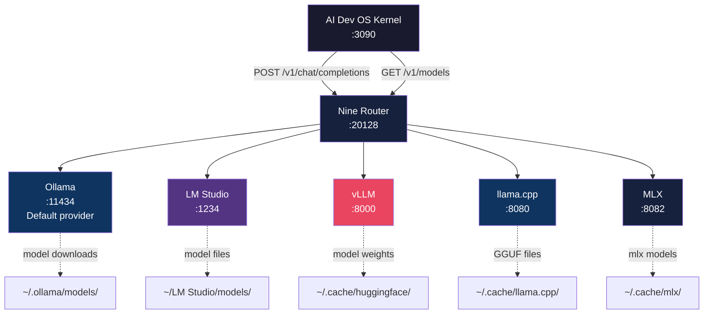

# Local Model Providers

> Provider reference: configuration and integration guide for all supported local inference engines that connect to AI Dev OS exclusively through Nine Router.

## Overview

AI Dev OS does not talk to model providers directly. Every inference request, embedding call, model list query, and streaming completion passes through Nine Router at `http://localhost:20128/v1`. Nine Router maintains the routing table, handles failover, manages provider credentials, and exposes a single OpenAI-compatible API to the Kernel.

This document covers all five supported local providers: Ollama (default, port 11434), LM Studio (port 1234), vLLM (port 8000), llama.cpp (port 8080), and MLX (port 8082). Each provider section details installation, configuration, model download, and the Nine Router URL that registers the provider.

No provider has a cloud dependency. All five run entirely on the local machine.

## Goals

- Document the complete setup and integration for each local provider
- Provide the exact Nine Router configuration snippet for every provider
- Specify default ports, health check endpoints, and model discovery URLs
- Cover model download procedures for each provider
- Document provider-specific performance characteristics and hardware requirements
- Include troubleshooting for the most common provider failures

## Non-Goals

- Recommending one provider over another — choice depends on hardware and use case
- Covering cloud provider integrations — those are in the optional cloud integration docs
- Documenting every vLLM or llama.cpp CLI flag — only the subset relevant to AI Dev OS
- Providing model training or fine-tuning guidance

## Architecture



### Provider Routing Flow

```text
Kernel → Nine Router → Provider Selection → Provider-specific API → Response via Nine Router

Nine Router resolves model names to provider endpoints:
- "llama3.2:3b"      → Ollama http://localhost:11434/api/chat
- "lm-studio/model"  → LM Studio  http://localhost:1234/v1/chat/completions
- "vllm/Meta-Llama"  → vLLM      http://localhost:8000/v1/chat/completions
- "llamacpp/model"   → llama.cpp http://localhost:8080/completion
- "mlx-model"        → MLX       http://localhost:8082/v1/chat/completions
```

## Configuration

### Nine Router Provider Registration

All providers are registered in Nine Router's configuration file. The Kernel never sees provider URLs.

```toml
# ~/.config/aidevos/nine_router.toml

[providers]
default = "ollama"

[providers.ollama]
enabled = true
endpoint = "http://localhost:11434"
health_endpoint = "/api/tags"
model_discovery = "/api/tags"
api_format = "ollama"
priority = 100

[providers.lm_studio]
enabled = false
endpoint = "http://localhost:1234"
health_endpoint = "/v1/models"
model_discovery = "/v1/models"
api_format = "openai"
priority = 80

[providers.vllm]
enabled = false
endpoint = "http://localhost:8000"
health_endpoint = "/health"
model_discovery = "/v1/models"
api_format = "openai"
priority = 60

[providers.llama_cpp]
enabled = false
endpoint = "http://localhost:8080"
health_endpoint = "/health"
model_discovery = "/v1/models"
api_format = "llama_cpp"
priority = 40

[providers.mlx]
enabled = false
endpoint = "http://localhost:8082"
health_endpoint = "/health"
model_discovery = "/v1/models"
api_format = "openai"
priority = 20
```

### Environment Variables

```bash
# Override provider endpoints without editing config
AIDEVOS_OLLAMA_ENDPOINT=http://localhost:11434
AIDEVOS_LM_STUDIO_ENDPOINT=http://localhost:1234
AIDEVOS_VLLM_ENDPOINT=http://localhost:8000
AIDEVOS_LLAMACPP_ENDPOINT=http://localhost:8080
AIDEVOS_MLX_ENDPOINT=http://localhost:8082

# Default model selection
AIDEVOS_DEFAULT_MODEL=llama3.2:3b
AIDEVOS_FALLBACK_MODEL=gemma2:2b

# Concurrent model loading
AIDEVOS_MAX_LOADED_MODELS=3
```

## Interfaces

### Nine Router Provider API

Kernel interacts only with Nine Router. Provider-specific details are internal to Nine Router.

| Kernel Action | Nine Router Endpoint | Provider Mapping |
|---------------|---------------------|------------------|
| List models | `GET /v1/models` | Aggregates from all enabled providers |
| Chat completion | `POST /v1/chat/completions` | Routes to matched provider |
| Streaming | `POST /v1/chat/completions?stream=true` | Streams via SSE from provider |
| Embeddings | `POST /v1/embeddings` | Routes to configured embedding provider |
| Model info | `GET /v1/models/{id}` | Proxied from owning provider |
| Health | `GET /v1/health` | Proxied aggregate health |

### Provider Health Check Integration

Each provider exposes a health endpoint that Nine Router polls every 30 seconds:

```json
// GET http://localhost:20128/v1/providers/health
{
  "ollama": { "reachable": true, "models": 4, "latency_ms": 12 },
  "vllm": { "reachable": false, "error": "connection refused" }
}
```

## Provider Sections

### Ollama (Default, :11434)

**Installation:**
```bash
# macOS
brew install ollama

# Linux
curl -fsSL https://ollama.ai/install.sh | sh

# Windows
# Download from https://ollama.ai/download

# Verify
ollama serve  # starts background process
ollama list   # should return "No models installed"
```

**Model Download:**
```bash
ollama pull llama3.2:3b        # 2.0 GB — recommended default
ollama pull llama3.2:1b        # 0.7 GB — low-resource
ollama pull gemma2:2b          # 1.6 GB — fast fallback
ollama pull nomic-embed-text   # 274 MB — embeddings
```

**Nine Router URL:** `http://localhost:11434`

**Configuration:** Enabled by default. No additional setup required.

**Performance:**
- LLM inference: 20-60 tok/s on Apple M-series, 40-100 tok/s on NVIDIA RTX 4090
- Embedding: ~2000 tokens/s for nomic-embed-text
- Concurrent requests: single-model queue by default

### LM Studio (:1234)

**Installation:**
```bash
# Download from https://lmstudio.ai
# Launch application, start local inference server on :1234
```

**Model Download:** Via LM Studio GUI. Search and download from Hugging Face integration.

**Nine Router URL:** `http://localhost:1234`

**Configuration:**
```toml
[providers.lm_studio]
enabled = true
endpoint = "http://localhost:1234"
```

**Notes:**
- LM Studio exposes an OpenAI-compatible API by default
- Supports GPU acceleration on NVIDIA and Apple Silicon
- Best for interactive model experimentation alongside AI Dev OS

### vLLM (:8000)

**Installation:**
```bash
pip install vllm

# Start with a model
vllm serve mistralai/Mistral-7B-Instruct-v0.3 \
  --port 8000 \
  --host 127.0.0.1 \
  --max-model-len 4096
```

**Model Download:** Automatic via Hugging Face. Models cached in `~/.cache/huggingface/`.

**Nine Router URL:** `http://localhost:8000`

**Configuration:**
```toml
[providers.vllm]
enabled = true
endpoint = "http://localhost:8000"
```

**Performance:**
- Highest throughput of all local providers
- PagedAttention for efficient KV cache
- Recommended for batch processing and high-throughput scenarios
- Requires NVIDIA GPU with CUDA or AMD ROCm

### llama.cpp (:8080)

**Installation:**
```bash
# macOS
brew install llama.cpp

# Linux / Windows
# Download from https://github.com/ggerganov/llama.cpp/releases

# Start server
llama-server \
  -m ~/models/llama-3.2-3b-instruct.Q4_K_M.gguf \
  --host 127.0.0.1 \
  --port 8080 \
  --ctx-size 4096
```

**Model Download:** Download GGUF files from Hugging Face. Place in `~/.cache/llama.cpp/`.

**Nine Router URL:** `http://localhost:8080`

**Configuration:**
```toml
[providers.llama_cpp]
enabled = true
endpoint = "http://localhost:8080"
```

**Performance:**
- Best CPU inference performance
- Supports GPU offloading via CUDA, Metal, and Vulkan
- Widest model format support (GGUF)

### MLX (:8082)

**Installation:**
```bash
pip install mlx-lm

# Start server
mlx_lm.server \
  --model mlx-community/Llama-3.2-3B-Instruct-4bit \
  --port 8082 \
  --host 127.0.0.1
```

**Model Download:** Automatic via Hugging Face. Models cached in `~/.cache/mlx/`.

**Nine Router URL:** `http://localhost:8082`

**Configuration:**
```toml
[providers.mlx]
enabled = true
endpoint = "http://localhost:8082"
```

**Performance:**
- Optimized for Apple Silicon (M1/M2/M3/M4)
- Uses Metal GPU acceleration natively
- Competitive with Ollama on Apple hardware
- 4-bit quantized models for reduced memory usage

## Failure Modes

| Failure | Symptom | Resolution |
|---------|---------|------------|
| Provider unreachable | Nine Router 502 on model request | Check provider process; `curl {provider_endpoint}` |
| Model not found | Nine Router 404 — "model not registered" | Pull model; run `ollama pull <name>` |
 | Provider crashed | Nine Router health shows unhealthy | Check provider logs; restart the provider |
| Wrong port | Nine Router cannot connect | Verify provider port; update Nine Router config |
| GPU OOM | Provider crashes on model load | Use a smaller model or quantized variant |
| Model not compatible | Provider returns 400 on request | Check model format; use correct provider |
| Provider responds slowly | Nine Router times out upstream | Increase `AIDEVOS_START_TIMEOUT_MS` or `provider_timeout` in config |
| Multiple providers with same model name | Nine Router routes to wrong one | Set explicit model prefix or reorder provider priorities |

```json
// Nine Router error response format
{
  "error": {
    "message": "Provider 'ollama' is not reachable at http://localhost:11434",
    "type": "provider_unreachable",
    "provider": "ollama",
    "code": 502
  }
}
```

## Security

- All providers bind to `127.0.0.1` by default
- Nine Router enforces that no subsystem calls providers directly
- Provider API keys (if any) are stored in Nine Router's encrypted config
- Provider tokens never reach the Kernel or any plugin
- Model files are stored in user-owned directories with restricted permissions
- Provider processes inherit the security context of the launching user
- No provider exposes unauthenticated endpoints on the network

## Related Documents

- [Self-Hosting](./SELF_HOSTING.md)
- [Local Deployment](./LOCAL_DEPLOYMENT.md)
- [Local-First Architecture](./LOCAL_FIRST_ARCHITECTURE.md)
- [Nine Router Integration](./NINE_ROUTER_INTEGRATION.md)
- [Installation](./INSTALLATION.md)
