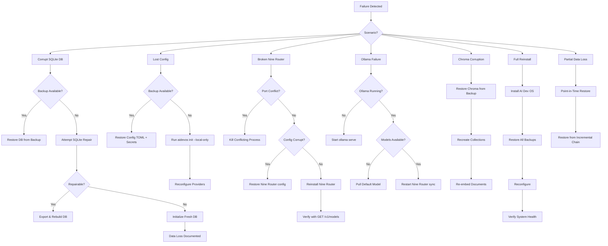

# Local Disaster Recovery

> Operational pillar: complete recovery procedures for local-only AI Development Operating System failures. Every recovery path is executable on a single machine with no cloud dependency.

## Overview

The AI Development Operating System is a local-first system. When failures occur — corrupt databases, lost configurations, broken service dependencies, or full machine reinstallation — recovery must be possible using only local backups, local tooling, and documented procedures. This document covers every failure scenario the system can encounter, with step-by-step recovery instructions.

All recovery paths assume no internet connectivity, no cloud accounts, and no external support. Recovery artifacts (backups, installers, model files) are stored locally. The recovery coordinator is a subcommand (`aidevos recover`) that guides the user through each scenario.

## Goals

- Every documented failure scenario MUST have a complete, tested recovery procedure
- Recovery MUST complete without any network dependency or cloud service
- RTO targets MUST be met for each scenario without requiring external support
- Minimal Viable Recovery MUST be achievable in under 5 minutes with only local tools
- Recovery procedures MUST be verifiable via automated testing (recovery drills)
- Data loss MUST be bounded by documented RPO for each data store
- The recovery coordinator MUST guide the user step-by-step with progress feedback
- Recovered systems MUST pass the same health checks as a fresh installation
- Partial recovery (degraded but functional) MUST be supported when full recovery is impossible
- Recovery MUST produce audit trail entries documenting what was restored and from which backup

## Non-Goals

- Cloud-based disaster recovery, cross-region failover, or remote replication
- Repairing physical hardware failures (disk, RAM, motherboard) — these require hardware replacement
- Recovering data beyond the most recent backup (RPO is defined per store)
- Guaranteeing recovery of model cache — models can be re-downloaded or reselected from local providers
- Recovery from malicious data corruption where the backup itself is compromised

## Architecture

### Recovery Decision Tree



### Recovery Scenarios Detail

#### Scenario 1: Corrupt SQLite Database

**Symptoms:** Kernel fails to start, query returns SQLITE_CORRUPT, error logs show "database disk image is malformed"

**RTO:** 5 minutes with backup, 15 minutes with repair

```bash
# Step 1: Identify the corrupted database
aidevos doctor
# → "stores/memory.db: FAIL - database corruption detected"

# Step 2: Stop the Kernel to prevent further writes
aidevos stop

# Step 3: Restore from latest backup
aidevos backup restore --store stores/memory.db

# Step 4: Verify restoration
aidevos doctor --store memory
# → "stores/memory.db: PASS"

# Step 5: Start the Kernel
aidevos start
```

**If no backup exists:**

```bash
# Step 1: Attempt SQLite built-in repair
sqlite3 ~/.aidevos/stores/memory.db ".recover" > /tmp/recovered.sql
sqlite3 ~/.aidevos/stores/memory.db ".dump" > /tmp/dump.sql

# Step 2: Create fresh database from recovered data
mv ~/.aidevos/stores/memory.db ~/.aidevos/stores/memory.corrupt
sqlite3 ~/.aidevos/stores/memory.db < /tmp/recovered.sql

# Step 3: Run integrity check
sqlite3 ~/.aidevos/stores/memory.db "PRAGMA integrity_check;"
# → "ok"

# Step 4: If repair fails, initialize empty database
aidevos init --fresh --store memory
# → WARNING: All agent memory data lost
```

#### Scenario 2: Lost Configuration

**Symptoms:** Kernel fails to parse config, custom provider mappings missing, Nine Router endpoint wrong

**RTO:** 2 minutes with backup, 5 minutes with reinit

```bash
# With backup:
aidevos backup restore --store ../.config/aidevos/

# Without backup:
aidevos init --local-only
# → Generates fresh ~/.config/aidevos/config.toml with defaults
# → Prompts to reconfigure custom provider endpoints
```

#### Scenario 3: Broken Nine Router

**Symptoms:** `curl localhost:20128/v1/models` returns connection refused, Kernel logs "cannot reach model gateway"

**RTO:** 5 minutes

```bash
# Step 1: Check if process is running
Get-Process -Name "nine-router" -ErrorAction SilentlyContinue
# or: pgrep nine-router

# Step 2: Check port conflict
netstat -ano | findstr :20128

# Step 3: Kill conflicting process if needed
# (manual: kill PID from step 2)

# Step 4: Retrieve Nine Router binary from local cache
# ~/.cache/aidevos/tools/nine-router.exe (or appropriate binary)

# Step 5: Start Nine Router
nine-router --config ~/.config/aidevos/nine-router.toml

# Step 6: Verify
curl http://localhost:20128/v1/models
# → Returns model list

# Step 7: If binary missing, reinstall from local package
npm install -g nine-router
# or: scoop install nine-router
```

#### Scenario 4: Ollama Failure

**Symptoms:** Nine Router returns 502 for ollama models, Ollama process not running, model list empty for ollama provider

**RTO:** 3 minutes

```bash
# Step 1: Check if Ollama is installed
ollama --version

# Step 2: Start Ollama server
ollama serve &
# or: Start-Process ollama -ArgumentList "serve"

# Step 3: Verify
curl http://localhost:11434/api/tags
# → Returns model list

# Step 4: If model missing, pull default
ollama pull llama3.1

# Step 5: Verify Nine Router can see it
curl http://localhost:20128/v1/models
# → Should show ollama/llama3.1

# Step 6: If Nine Router still returns 502, force sync
curl -X POST http://localhost:20128/admin/providers/ollama/sync
```

#### Scenario 5: Chroma Vector Store Corruption

**Symptoms:** Embedding queries return empty, search fails, Chroma server errors

**RTO:** 15 minutes

```bash
# Step 1: Stop Chroma
# (kill the Chroma process)

# Step 2: Verify backup availability
aidevos backup list --store stores/vectors/

# Step 3: Restore vector store from backup
aidevos backup restore --store stores/vectors/

# Step 4: Re-create collections from manifest
chroma-collection --path ~/.aidevos/stores/vectors/ --restore manifest.json

# Step 5: Start Chroma
chroma run --path ~/.aidevos/stores/vectors/

# Step 6: Verify with sampling query
aidevos doctor --store vectors
```

### Minimal Viable Recovery

In a worst-case scenario (total data loss, no backups), the system can reach a minimal viable state in under 5 minutes:

```bash
# Step 1: Initialize fresh system
aidevos init --local-only
# → Creates default config, fresh databases, default Nine Router config

# Step 2: Verify Nine Router is running
curl http://localhost:20128/v1/models

# Step 3: Verify local provider (Ollama)
ollama serve
ollama pull llama3.1  # smallest usable model

# Step 4: Verify system health
aidevos doctor
# → All services: RUNNING
# → Local-first: PASS
# → Data stores: INITIALIZED (empty)

# Step 5: Start working
aidevos start
```

Minimal viable recovery delivers:
- AI Dev OS Kernel running
- Nine Router gateway operational with at least one model
- Empty but functional databases (memory, knowledge, audit)
- Default configuration
- No custom providers, no plugins, no model cache

## Configuration

```toml
# ~/.config/aidevos/recovery.toml

[recovery]
auto_backup_before_restore = true
dry_run_default = true
max_repair_attempts = 3
repair_timeout_seconds = 60

[recovery.scenarios]
corrupt_db = { priority = "critical", rto_seconds = 300 }
lost_config = { priority = "critical", rto_seconds = 120 }
broken_nine_router = { priority = "critical", rto_seconds = 300 }
ollama_failure = { priority = "high", rto_seconds = 180 }
chroma_corruption = { priority = "high", rto_seconds = 900 }
full_reinstall = { priority = "critical", rto_seconds = 1800 }
partial_data_loss = { priority = "normal", rto_seconds = 600 }

[recovery.notifications]
enabled = true
method = "dashboard"
dashboard_alert = true
log_to_audit = true
```

## Interfaces

### CLI Command: `aidevos recover`

```
SYNOPSIS:
    aidevos recover                       # Interactive recovery menu
    aidevos recover list                  # List recoverable backups
    aidevos recover <scenario> [options]  # Run specific recovery
    aidevos recover dry-run <scenario>    # Simulate recovery
    aidevos recover status                # Show recovery readiness

SCENARIOS:
    corrupt-db                            # Corrupt SQLite database
    lost-config                           # Lost configuration files
    broken-router                         # Nine Router failure
    ollama                                # Ollama provider failure
    chroma                                # Chroma vector corruption
    reinstall                             # Full machine reinstall
    partial                               # Partial data loss

EXAMPLES:
    aidevos recover corrupt-db
    aidevos recover dry-run reinstall
    aidevos recover lost-config --backup abc-123
    aidevos recover status
```

### Programmatic Interface

```python
from aidevos.recovery import RecoveryCoordinator

rc = RecoveryCoordinator(config_path="~/.config/aidevos/recovery.toml")

# Run a specific recovery scenario
result = rc.run_scenario("corrupt-db", dry_run=False)

# Check recovery readiness
status = rc.check_readiness()
# Returns dict: { scenario: { backup_available, tools_available, rto_met } }

# Register a post-recovery hook
rc.on_recovery_complete(lambda result: print(f"Recovery: {result.status}"))
```

### Events

| Event | Payload | Description |
|-------|---------|-------------|
| `recovery.started` | `{ scenario, backup_id }` | Recovery began |
| `recovery.completed` | `{ scenario, duration_ms, data_loss }` | Recovery finished |
| `recovery.failed` | `{ scenario, error, fallback }` | Recovery failed, fallback used |
| `recovery.drill_completed` | `{ scenario, passed, duration_ms }` | Recovery drill finished |
| `recovery.readiness_changed` | `{ scenario, status }` | Recovery readiness changed |

## Failure Modes

| Failure Mode | Detection | Recovery |
|-------------|-----------|----------|
| Backup archive corrupt during restore | Checksum mismatch during decryption | Attempt next oldest backup; if none, fall back to repair |
| Restore target path missing | Directory does not exist | Create target directory from backup metadata |
| Disk full during restore | ENOSPC error | Prompt user to free space; offer to restore to alternate path |
| Encryption key missing during restore | Keyring lookup fails | Prompt user for passphrase emergency override; log to audit |
| Nine Router binary not found | Dependency check fails | Instruct user to reinstall from local package cache |
| Ollama not installed | which/where returns empty | Offer to download from local cache or instruct manual install |
| Partial backup chain | Incremental without full parent | Offer to restore to latest complete point or start fresh |
| Recovery timeout | Scenario exceeds RTO | Log warning, continue with degraded operation |
| Concurrent recovery | PID file exists | Block second recovery, log "recovery already in progress" |
| Recovery tool missing | sqlite3, zstd not in PATH | Fall back to built-in Rust-based tool implementations |

## Security

- Restore operations never overwrite secrets files unless explicitly confirmed with `--force`
- Decrypted backup data is streamed directly to target path, never written to temp files
- Encryption keys remain in OS keyring during recovery; passphrase override is a one-time session-only prompt
- Recovery audit trail records: timestamp, scenario, backup_id, operator (if manual), files restored
- The recovery coordinator checks file permissions after restore and corrects overly permissive modes
- Dry-run recovery uses mock data paths; no real data is touched
- Recovery from unknown backup sources is blocked; only catalog-listed backups are considered valid
- The `--force` flag requires explicit user confirmation unless `AIDEVOS_RECOVERY_FORCE=1` is set

## Recovery Testing (Drills)

Automated recovery drills verify that recovery procedures work:

```bash
# Run a recovery drill
aidevos recover drill corrupt-db
# → Creates a simulated corrupt database
# → Runs the full recovery procedure
# → Verifies the system returns to healthy state
# → Reports: PASS or FAIL with details

# Run all critical drills
aidevos recover drill --all-critical

# Schedule weekly drills
aidevos recover drill --schedule --cron "0 3 * * 0"
```

Drill results are stored in the audit log:

| Drill Scenario | Frequency | Success Criteria |
|---------------|-----------|-----------------|
| corrupt-db | Weekly | DB restored, integrity check passes |
| lost-config | Weekly | Config restored, service starts |
| broken-router | Monthly | Nine Router responds to /v1/models |
| ollama | Monthly | Ollama models visible in Nine Router |
| chroma | Monthly | Vector queries return results |
| reinstall | Quarterly | Full system operational from zero |

## Related Documents

- [Local Backup Strategy](./LOCAL_BACKUP.md)
- [Local-First Architecture](./LOCAL_FIRST_ARCHITECTURE.md)
- [Disaster Recovery](./DISASTER_RECOVERY.md)
- [Nine Router Integration](./NINE_ROUTER_INTEGRATION.md)
- [Database](./DATABASE.md)
- [Vector Store](./VECTOR_STORE.md)
- [Configuration](./CONFIGURATION.md)
- [Secrets Management](./SECRETS_MANAGEMENT.md)
- [Local Model Providers](./LOCAL_MODEL_PROVIDERS.md)
- [Local Security](./LOCAL_SECURITY.md)
- [Audit Log](./AUDIT_LOG.md)
- [Data Retention](./DATA_RETENTION.md)
- [Installation](./INSTALLATION.md)
- [Troubleshooting](./TROUBLESHOOTING.md)
