# Local Security

> Security architecture: AI Dev OS security is grounded in local-first principles. There is no cloud IAM, no OIDC provider, no network-perimeter model. Trust is rooted in the local machine, the OS keyring, and file permissions.

## Overview

Local security means the attack surface is physical access to the user's machine. There are no network-exposed secrets, no cloud API keys transmitted across the internet (unless the user explicitly configures cloud providers), and no telemetry sinks that exfiltrate data. The security model assumes the OS user account is the security boundary.

The system implements four layers of defense: OS keyring integration for credential storage, encrypted config files and databases, file permissions that restrict access to the owner, and a Secrets Management subsystem that ensures secrets are never written to disk in plaintext.

This document covers the security architecture of the local deployment. It does not cover optional cloud provider security — those are documented in the cloud integration guides.

## Goals

- All secrets are stored in the OS keyring or an encrypted file — never in plaintext
- SQLite databases are encrypted at rest using AES-256
- API keys for Nine Router are auto-generated and stored locally
- No secret is written to logs, error messages, or debug output
- Audit logging captures all security-relevant events with tamper-evident entries
- File permissions restrict access to the owning user
- The system has no network-exposed management ports or unauthenticated endpoints
- Secrets at rest are encrypted with a key bound to the user's OS login

## Non-Goals

- Cloud IAM integration — that is an opt-in feature for hybrid deployments
- Multi-user access control — AI Dev OS is single-user by design
- Network-level security (firewalls, VPNs, WAF) — relies on loopback interface
- Certificate-based authentication for local services — not needed on localhost
- HSMs or TPM integration — future enhancement, not in scope

## Architecture

```mermaid
graph TB
    subgraph "OS Keyring"
        KR_KEY["Master Encryption Key"]
        KR_CREDS["Provider Credentials"]
    end

    subgraph "Filesystem (~/.config/aidevos/)"
        SECRETS["secrets.json<br/>AES-256-GCM encrypted"]
        CONFIG["config.toml<br/>plaintext (no secrets)"]
    end

    subgraph "Filesystem (~/.aidevos/stores/)"
        MEM_DB["memory.db<br/>SEE encrypted"]
        AUDIT_DB["audit.db<br/>SEE encrypted"]
        TELE_DB["telemetry.db<br/>SEE encrypted"]
    end

    subgraph "Runtime"
        NR["Nine Router<br/>:20128"]
        KERNEL["Kernel<br/>:3090"]
        AUDIT["Audit Logger"]
    end

    KERNEL -->|read/write encrypted| MEM_DB
    KERNEL -->|append| AUDIT_DB
    KERNEL -->|read credentials| SECRETS
    SECRETS -.->|decrypt with| KR_KEY
    NR -->|API key auth| KERNEL

    KR_KEY -->|unlocks| SECRETS
    KR_KEY -->|unlocks| MEM_DB
    KR_KEY -->|unlocks| AUDIT_DB
    KR_KEY -->|unlocks| TELE_DB

    AUDIT --> AUDIT_DB
    KERNEL --> AUDIT
    NR --> AUDIT
```



### Trust Model

```text
Trust Anchor:        OS user account (login password / biometric)
├─ OS Keyring        (macOS Keychain, Linux Secret Service, Windows Credential Manager)
├─ File Permissions  (owner-only read/write on config and data dirs)
├─ Loopback Only     (all services bind to 127.0.0.1)
└─ Encrypted Stores  (AES-256 at rest for all databases)
```

## Configuration

### Secrets Management Configuration

```toml
# ~/.config/aidevos/config.toml — security section
[security]
secrets_backend = "keyring"   # "keyring" | "env" | "file"
keyring_service = "ai-dev-os"  # Name registered in OS keyring
encryption_algorithm = "aes-256-gcm"
audit_enabled = true
audit_log_retention_days = 90
mask_secrets_in_logs = true
require_api_key = true        # Nine Router requires API key from Kernel

[security.api_keys]
nine_router_auto_generate = true     # Generate random key on first start
nine_router_key_length = 32          # Bytes (256 bits)
provider_api_keys_encrypted = true   # Encrypt cloud provider keys in config
```

### Keyring Backend Selection

```bash
# macOS: uses Keychain (com.apple.keychain)
# Linux: uses Secret Service (dbus) or gnome-keyring / kwallet
# Windows: uses Credential Manager (wincred)

# Override backend for testing
export AIDEVOS_KEYRING_BACKEND=file
export AIDEVOS_KEYRING_FILE_PATH=~/.config/aidevos/keyring.json
```

### File Permissions

```bash
# Expected permissions after `aidevos init`
~/.config/aidevos/          drwx------ (0700)
~/.config/aidevos/config.toml  -rw------- (0600)
~/.config/aidevos/secrets.json -rw------- (0600)
~/.aidevos/                 drwx------ (0700)
~/.aidevos/stores/          drwx------ (0700)
~/.aidevos/stores/*.db      -rw------- (0600)
~/.aidevos/logs/            drwx------ (0700)
~/.aidevos/logs/*.log       -rw------- (0600)
~/.aidevos/backups/         drwx------ (0700)
```

## Interfaces

### Secrets Management API

```typescript
interface SecretsManager {
  // Key management
  initMasterKey(): Promise<void>;           // Create or retrieve master key from keyring
  rotateMasterKey(): Promise<void>;         // Re-encrypt all secrets with new key

  // Secret storage
  getSecret(key: string): Promise<string | null>;
  setSecret(key: string, value: string): Promise<void>;
  deleteSecret(key: string): Promise<void>;
  listSecrets(): Promise<string[]>;

  // Bulk operations
  exportEncrypted(): Promise<Buffer>;       // Export all secrets (encrypted)
  importEncrypted(data: Buffer): Promise<void>;  // Import secrets (decrypts with master key)

  // Health
  status(): Promise<{
    backend: string;
    master_key_present: boolean;
    encrypted_secrets_count: number;
    keyring_reachable: boolean;
  }>;
}
```

### Audit Logging API

```typescript
interface AuditLogger {
  // Write entry
  log(event: AuditEvent): Promise<void>;

  // Query
  query(options: AuditQuery): Promise<AuditEvent[]>;
  exportRange(start: Date, end: Date): Promise<string>;  // Export to JSONL

  // Tamper detection
  verifyIntegrity(): Promise<{ valid: boolean; entries_checked: number; first_invalid: number | null }>;
}

interface AuditEvent {
  timestamp: string;           // ISO 8601 with microsecond precision
  sequence: number;           // Monotonic counter (tamper detection)
  event_type: string;         // "kernel.start", "model.request", "config.change", etc.
  actor: string;              // "kernel", "nine_router", "cli", "system"
  resource: string;           // The affected resource (e.g., "memory.db", "config.toml")
  action: string;             // "read", "write", "create", "delete", "start", "stop"
  metadata: Record<string, unknown>;  // Event-specific data (no secrets)
  hash: string;               // SHA-256 of previous entry + this entry fields
  previous_hash: string;      // SHA-256 of previous entry
}
```

### Security-Related CLI Commands

```
aidevos security status          # Keyring, encryption, file permissions
aidevos security audit           # Recent audit log entries
aidevos security audit --export  # Export audit log as JSONL
aidevos security verify          # Verify audit log integrity
aidevos security rotate-key      # Rotate master encryption key
aidevos security doctor          # Security posture scan
```

## Failure Modes

| Failure | Symptom | Resolution |
|---------|---------|------------|
| Keyring unreachable | `secrets.json` decrypt fails | Ensure keyring daemon is running; `eval $(dbus-launch)` on Linux |
| Master key lost | Cannot decrypt any store | Seed from `AIDEVOS_MASTER_KEY` env var; or restore from backup |
| Keyring on headless Linux | `secret service not available` | Install `gnome-keyring` or switch to `env` backend |
| Corrupt secrets.json | Parse error on read | Restore from backup; or delete and regenerate (loses cloud config) |
| Permission too permissive | `aidevos doctor` warns on file mode | Run `chmod 600 ~/.config/aidevos/secrets.json` |
| Audit DB corrupt | Integrity check fails | Restore from backup; investigate root cause |
| API key leak | Logs contain key material | Verify `mask_secrets_in_logs = true`; rotate key |
| Key rotation interrupted | Some stores use old key | Run `aidevos security rotate-key` again to complete |
| Windows Credential Manager locked | `aidevos start` fails on key read | Unlock Credential Manager; or run in user session |
| macOS Keychain prompt spam | Frequent keychain dialogs | Add `ai-dev-os` to Keychain access control list |
| File descriptor leak on keyring | Keyring operations slow | Restart Kernel; limit concurrent keyring operations |

### Security Doctor Output

```
$ aidevos security doctor

AIDEVOS Security Scan v0.12.4
─────────────────────────────
✔ Keyring backend: macOS Keychain (reachable)
✔ Master key: present in keychain "ai-dev-os"
✔ secrets.json: encrypted (AES-256-GCM), integrity OK
✔ File permissions:
  ✔ ~/.config/aidevos/              0700
  ✔ ~/.config/aidevos/secrets.json  0600
  ✔ ~/.aidevos/stores/memory.db     0600
  ✔ ~/.aidevos/logs/                0700
✘ ~/.config/aidevos/config.toml    0644 (should be 0600)
  → Fix: chmod 0600 ~/.config/aidevos/config.toml
✔ Audit log: 1234 entries, integrity chain VALID
✔ SQLite encryption: 4 databases encrypted (AES-256)
✔ Nine Router API key: present, last rotated 30 days ago
✔ No secrets found in log files (checked last 1000 lines)
✔ All services bound to 127.0.0.1

Security posture: GOOD (1 warning)
```

### Encryption Details

| Algorithm | Mode | Key Size | Purpose |
|-----------|------|----------|---------|
| AES | GCM | 256 bits | Secrets file encryption |
| AES | CBC | 256 bits | SQLite database encryption |
| SHA | 256 | — | Audit log chain hashing |
| HKDF | — | — | Key derivation from master key |

The master key is 256 bits, generated by a CSPRNG (`crypto.randomBytes(32)`). It is stored in the OS keyring under the service name `ai-dev-os`. The master key never appears in any file, log, or environment variable unless explicitly set via `AIDEVOS_MASTER_KEY` for recovery purposes.

### Secrets Storage

What is stored in the encrypted secrets file:

```
nine_router.api_key           ← Auto-generated 256-bit random key
providers.openai.api_key      ← User-configured (optional)
providers.anthropic.api_key   ← User-configured (optional)
providers.google.api_key      ← User-configured (optional)
backup.encryption_key         ← Auto-generated, separate from master key
```

What is NEVER stored in secrets:

```
✘ Model input prompts
✘ Model output completions
✘ File contents being processed
✘ User credentials (keyring handles those)
✘ Network tokens or session cookies
```

### Audit Log Chain

Each entry in the audit log is cryptographically linked to the previous entry:

```
Entry 1:  { ... "previous_hash": "0000000000000000...", "hash": "a1b2c3..." }
Entry 2:  { ... "previous_hash": "a1b2c3...",             "hash": "d4e5f6..." }
Entry 3:  { ... "previous_hash": "d4e5f6...",             "hash": "g7h8i9..." }
```

This hash chain makes the audit log tamper-evident. Any modification to an entry breaks the chain for all subsequent entries. The `verifyIntegrity()` method walks the entire chain and reports the first corrupted entry index.

## Security

- All services bind exclusively to `127.0.0.1` — no network-exposed attack surface
- Nine Router requires an API key from the Kernel for all requests
- The OS keyring is the root of trust; if the keyring is locked, no secrets can be decrypted
- Secrets are never written to log files; the audit logger strips all key material
- File permissions are enforced at startup and checked by `aidevos doctor`
- The master key can be rotated without data loss by re-encrypting all stores
- Encryption uses standard AES-256 with authenticated modes (GCM) to prevent tampering
- The audit log's hash chain detects tampering retroactively
- No cloud dependency for any security operation — key management is entirely local

## Related Documents

- [Self-Hosting](./SELF_HOSTING.md)
- [Local Deployment](./LOCAL_DEPLOYMENT.md)
- [Local-First Architecture](./LOCAL_FIRST_ARCHITECTURE.md)
- [Local Storage](./LOCAL_STORAGE.md)
- [Local Model Providers](./LOCAL_MODEL_PROVIDERS.md)
- [Installation](./INSTALLATION.md)
