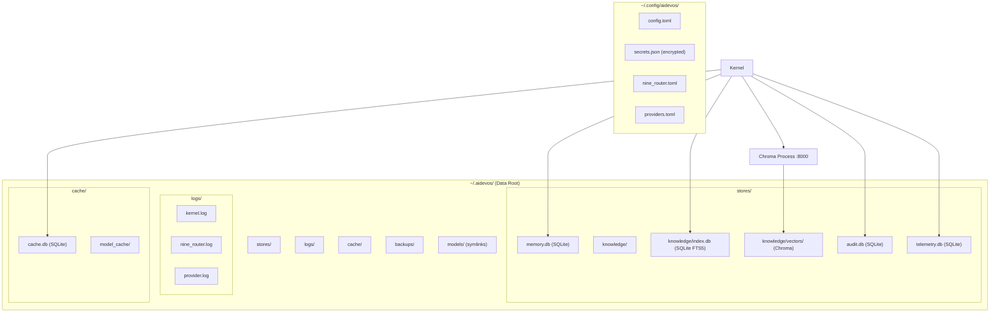

# Local Storage

> Storage architecture: all data in AI Dev OS lives on the local filesystem. SQLite is the primary store, Chroma provides vector search, and everything is organized under `~/.aidevos/`.

## Overview

Local storage is the persistence layer of AI Dev OS. Every database, cache, vector index, log, configuration file, and model weight resides on the user's machine under a single root directory (`~/.aidevos/` by default). There are no cloud storage dependencies, no S3 buckets, no hosted databases.

The storage architecture uses SQLite as the primary relational store for agent memory, knowledge base, audit logs, and telemetry. Chroma (or optionally LanceDB) provides vector similarity search. Configuration is stored in TOML files under `~/.config/aidevos/`. Secrets live in an encrypted JSON file bound to the OS keyring.

This document covers the complete filesystem layout, each store's schema and purpose, backup and restore procedures, encryption at rest, performance characteristics, and storage limits.

## Goals

- All user data is stored in writable paths under the user's control
- SQLite is the single relational database — no PostgreSQL, no MySQL, no external DBMS
- Chroma is the default vector store with LanceDB as a drop-in alternative
- Backup and restore is a single-file operation for each store
- Encryption at rest via SQLite Encryption Extension (SEE) or OS keyring binding
- Storage is bounded by available disk space — no artificial limits
- All paths are configurable via environment variables and config file

## Non-Goals

- Supporting cloud storage providers as the primary store — cloud is export target only
- Multi-writer replication — SQLite is single-writer; concurrent writes are serialized
- Sharding or partitioning — not needed for single-machine workload sizes
- Object storage abstraction — filesystem paths are the canonical addressing scheme

## Architecture



### Filesystem Layout

```
~/.aidevos/                          # Data root ($AIDEVOS_DATA_DIR)
├── stores/
│   ├── memory.db                    # Agent memory (SQLite)
│   ├── knowledge/
│   │   ├── index.db                 # Knowledge base FTS5 index (SQLite)
│   │   ├── chunks/                  # Raw document chunks (JSONL)
│   │   └── vectors/                 # Chroma vector store data
│   ├── audit.db                     # Append-only audit log (SQLite)
│   ├── telemetry.db                 # Usage telemetry (SQLite, local only)
│   ├── session.db                   # Active session state (SQLite)
│   └── plugins/                     # Plugin data directories
├── logs/
│   ├── kernel.log                   # Kernel process log
│   ├── nine_router.log              # Nine Router access log
│   ├── provider.log                 # Provider proxy log
│   └── crash/                       # Crash dumps
├── cache/
│   ├── cache.db                     # General-purpose cache (SQLite)
│   ├── model_cache/                 # Downloaded model file fragments
│   └── http_cache/                  # HTTP response cache
├── backups/                         # Automatic and manual backups
│   ├── memory.db.20240722T120000Z.sqlite.gz
│   └── full.20240722T120000Z.tar.gz
└── models/                          # Symlinks to provider model directories
    ├── llama3.2-3b → ~/.ollama/models/blobs/...
    └── nomic-embed-text → ~/.ollama/models/blobs/...
```

## Configuration

### Storage Paths

```toml
# ~/.config/aidevos/config.toml — storage section
[storage]
data_dir = "~/.aidevos"
backup_dir = "~/.aidevos/backups"
log_dir = "~/.aidevos/logs"
cache_dir = "~/.aidevos/cache"
max_storage_gb = 0  # 0 = no limit

[storage.sqlite]
journal_mode = "WAL"              # Write-Ahead Logging
synchronous = "NORMAL"            # Balance safety/speed
cache_size_mb = 64                 # SQLite page cache
busy_timeout_ms = 5000
encryption = "keyring"             # "keyring" | "none"

[storage.vectors]
engine = "chroma"                  # "chroma" | "lancedb"
chroma.endpoint = "http://localhost:8000"
chroma.persist_dir = "~/.aidevos/stores/knowledge/vectors"
lancedb.uri = "~/.aidevos/stores/knowledge/lancedb"
lancedb.table_name = "knowledge"

[storage.backup]
enabled = true
interval_hours = 24
retention_count = 7
compress = true
encrypt = true
include_logs = false
```

### Environment Variables

```bash
AIDEVOS_DATA_DIR=~/.aidevos
AIDEVOS_BACKUP_DIR=~/.aidevos/backups
AIDEVOS_LOG_DIR=~/.aidevos/logs
AIDEVOS_CACHE_DIR=~/.aidevos/cache
AIDEVOS_STORAGE_ENGINE=sqlite
AIDEVOS_VECTOR_ENGINE=chroma
AIDEVOS_ENCRYPTION=keyring
AIDEVOS_BACKUP_INTERVAL=24
AIDEVOS_BACKUP_RETENTION=7
AIDEVOS_MAX_STORAGE_GB=0
```

## Interfaces

### Storage API (Internal — Kernel Module)

```typescript
interface LocalStore {
  // Relational stores
  getMemoryStore(): SQLiteStore;        // stores/memory.db
  getAuditStore(): SQLiteStore;         // stores/audit.db
  getTelemetryStore(): SQLiteStore;     // stores/telemetry.db
  getCacheStore(): SQLiteStore;         // cache/cache.db
  getSessionStore(): SQLiteStore;       // stores/session.db

  // Knowledge base
  getKnowledgeBase(): KnowledgeBase;    // stores/knowledge/

  // Vector store
  getVectorStore(): VectorStore;        // Configurable: Chroma | LanceDB

  // Lifecycle
  init(): Promise<void>;                // Create dirs, open DBs, run migrations
  close(): Promise<void>;               // Graceful shutdown
  backup(name?: string): Promise<string>; // Snapshot all stores
  restore(path: string): Promise<void>;   // Restore from snapshot
  integrityCheck(): Promise<StorageReport>;
}

interface StorageReport {
  total_size_bytes: number;
  stores: Record<string, { size_bytes: number; row_count: number; status: string }>;
  vectors: { count: number; dimension: number };
  free_disk_space_bytes: number;
  warnings: string[];
}
```

### CLI Commands

```
aidevos storage status     # Disk usage, DB sizes, integrity
aidevos storage backup     # Manual backup
aidevos storage restore    # Interactive restore
aidevos storage prune      # Remove old logs and cache entries
```

## Failure Modes

| Failure | Symptom | Resolution |
|---------|---------|------------|
| Disk full | SQLITE_FULL or ENOSPC | Free space; prune old backups or logs |
| SQLite corrupt | `database disk image is malformed` | Restore from backup; run `aidevos doctor --repair` |
| Chroma unreachable | Vector queries return 502 | Start Chroma; `chroma run --path ~/.aidevos/stores/knowledge/vectors` |
| WAL file grows unbounded | Disk usage spikes on small writes | Set `journal_mode = WAL` with checkpoint interval |
| Backup disk full | Backup fails mid-write | Check `backup_dir` disk space; reduce retention |
| Encryption key lost | Cannot decrypt secrets.json | Recover from keyring; seed from `AIDEVOS_MASTER_KEY` env var |
| Permission denied | EACCES on store open | Fix ownership: `chown -R $(whoami) ~/.aidevos` |
| Chroma DB version mismatch | Chroma fails to load vectors | Backup vectors; delete and rebuild index |
| File descriptor limit | `too many open files` | Increase ulimit: `ulimit -n 4096` |
| Concurrent SQLite access | SQLITE_BUSY on write | Single-process design prevents this; check for zombie processes |

### Backup and Restore Procedure

```bash
# Manual backup (creates timestamped archives in ~/.aidevos/backups/)
aidevos storage backup

# Output:
# ✔ memory.db                 — 12.4 MB
# ✔ knowledge/index.db        — 8.1 MB
# ✔ audit.db                  — 44.2 MB
# ✔ telemetry.db              — 2.3 MB
# ✔ cache.db                  — 6.7 MB
# ✔ vectors/ (Chroma)         — 156.0 MB
# ─────────────────────────────────
# Created: backups/full.20240722T120000Z.tar.gz (229.7 MB)

# Restore
aidevos storage restore --file backups/full.20240722T120000Z.tar.gz
# ⚠ This will REPLACE all existing data. Continue? [y/N]
```

### Encryption at Rest

| Store | Encryption Method | Key Location |
|-------|------------------|--------------|
| `memory.db` | SQLite Encryption Extension (256-bit AES) | OS keyring |
| `audit.db` | SQLite Encryption Extension | OS keyring |
| `secrets.json` | AES-256-GCM envelope | OS keyring + master key |
| `telemetry.db` | SQLite Encryption Extension | OS keyring |
| Chroma vectors | Filesystem-level encryption (optional) | OS keyring |
| Logs | Plaintext (no secrets written to logs) | N/A |

### Compression

- Backup archives use gzip compression (level 6)
- Chroma vectors are stored as compressed numpy arrays
- Log rotation compresses rotated files with gzip
- SQLite WAL files are not compressed (reduces write amplification)

### Storage Limits

| Store | Expected Size (Typical) | Growth Rate | Notes |
|-------|------------------------|-------------|-------|
| `memory.db` | 10-100 MB | ~1 MB / 1000 sessions | Ephemeral states expire |
| `audit.db` | 50-500 MB | ~5 MB / day | Highly compressible |
| `telemetry.db` | 10-100 MB | ~1 MB / day | Rotated weekly |
| `cache.db` | 50-200 MB | Bounded by LRU eviction | Max 1 GB default |
| Chroma vectors | 100 MB - 5 GB | ~100 MB / 10k documents | Depends on dimension |
| Logs | 100 MB - 1 GB | Configurable rotation | 7-day default retention |
| Model cache | 1-50 GB | Depends on models | User-managed |

### Performance Characteristics

| Operation | SQLite (memory.db) | SQLite (knowledge FTS5) | Chroma (cosine, 10k docs) |
|-----------|-------------------|------------------------|---------------------------|
| Read (by key) | < 1ms | < 2ms | N/A |
| Write (single row) | < 1ms | < 1ms | N/A |
| Full-text search | N/A | < 10ms (10k docs) | N/A |
| Vector search (top-5) | N/A | N/A | < 20ms |
| Vector insert | N/A | N/A | < 5ms |
| Backup | 2s / 100 MB | 3s / 100 MB | 10s / 1 GB |

## Security

- SQLite stores are encrypted at rest using AES-256 via the OS keyring binding
- The encryption key is derived from the OS keyring and never written to disk
- Secrets file uses envelope encryption: data key encrypted by a master key stored in the keyring
- WAL and SHM files inherit the same encryption as the main database file
- Log files never contain secrets, API keys, or model outputs
- File permissions: `~/.aidevos/` is `chmod 700`, individual DB files are `chmod 600`
- Backup archives are encrypted with the same keyring-derived key when `encrypt = true`
- Chroma data directory is only readable by the owner
- Temp files created during backup are wiped after archive creation

## Related Documents

- [Self-Hosting](./SELF_HOSTING.md)
- [Local Deployment](./LOCAL_DEPLOYMENT.md)
- [Local-First Architecture](./LOCAL_FIRST_ARCHITECTURE.md)
- [Local Security](./LOCAL_SECURITY.md)
- [Installation](./INSTALLATION.md)
