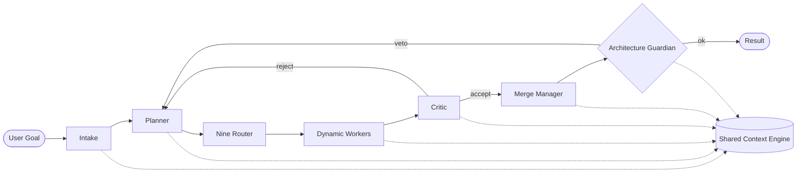

# Main AI Kernel

> The **OS Kernel** of the AI Development Operating System. Owns policy, context, routing, and lifecycle for every agent, tool, and model. Every request enters here; every result exits here.

## Overview

The Main AI Kernel is the top-level orchestrator of AI Dev OS. It plays the same role in this OS that a POSIX kernel plays for processes: it schedules work, enforces isolation, mediates I/O, and is the only component permitted to grant privileges. No agent, tool, or plugin runs outside the Kernel's supervision.

The Kernel exposes a small, stable syscall-like surface. Every higher-level surface (CLI, MCP, HTTP API, Voice) is a thin adapter over that surface. Downstream subsystems — [Nine Router](./NINE_ROUTER.md), [AI Groups](./AI_GROUP_SYSTEM.md), [Dynamic Workers](./DYNAMIC_WORKERS.md), [Merge Manager](./MERGE_MANAGER.md), [Architecture Guardian](./ARCHITECTURE_GUARDIAN.md) — are called by the Kernel, never by user code directly.

## Goals

- Single authoritative loop: **intake → plan → route → execute → critique → merge → guard → deliver**.
- Deterministic replay: given the same run inputs and a captured context snapshot, replaying yields the same task graph and the same terminal state (modulo model non-determinism, which is recorded).
- Never bypass the [Architecture Guardian](./ARCHITECTURE_GUARDIAN.md); veto is final.
- All state flows through the [Shared Context Engine](./SHARED_CONTEXT_ENGINE.md); the Kernel holds no hidden state.
- Fair scheduling across concurrent runs with hard budget caps (tokens, wall-clock, cost).
- Local-first: the Kernel MUST run offline against local models with no cloud dependency.

## Non-Goals

- Implementation code — this repository is documentation-only ([AI Coding Rules](./AI_CODING_RULES.md)).
- Provider-specific tuning — belongs in [Model Providers](./MODEL_PROVIDERS.md).
- UI concerns — belong in [UI/UX](./UI_UX.md) and [Frontend](./FRONTEND.md).

## The Kernel Loop



Each stage publishes a structured event to the [Shared Context Engine](./SHARED_CONTEXT_ENGINE.md) tagged with the run's `correlation_id`. A run is nothing more than the ordered projection of its events.

### Stage contracts

| Stage    | Input              | Output             | Owner                                                     |
| -------- | ------------------ | ------------------ | --------------------------------------------------------- |
| Intake   | `Goal`             | `RunSpec`          | Kernel                                                    |
| Plan     | `RunSpec`          | `TaskGraph`        | [Planning Engine](./PLANNING_ENGINE.md)                   |
| Route    | `Task`             | `ModelBinding`     | [Nine Router](./NINE_ROUTER.md)                           |
| Execute  | `Task + Binding`   | `Artifact[]`       | [Dynamic Workers](./DYNAMIC_WORKERS.md)                   |
| Critique | `Artifact`         | `Verdict`          | Critic role (see [Nine Router](./NINE_ROUTER.md))         |
| Merge    | `Verdict[]`        | `MergedArtifact`   | [Merge Manager](./MERGE_MANAGER.md)                       |
| Guard    | `MergedArtifact`   | `ok` \| `veto`     | [Architecture Guardian](./ARCHITECTURE_GUARDIAN.md)       |
| Deliver  | `Artifact`         | `Response`         | Kernel                                                    |

## Requirements

- **MUST** be the only component that spawns agents, allocates budgets, or opens tool handles.
- **MUST** carry a `correlation_id` end-to-end and propagate it into every provider call.
- **MUST** enforce per-run and per-tenant quotas defined in [Cost Management](./COST_MANAGEMENT.md) and [Rate Limiting](./RATE_LIMITING.md).
- **MUST** persist every accepted plan and verdict to [Persistent Memory](./PERSISTENT_MEMORY.md) before delivery.
- **MUST** treat any Guardian veto as terminal for the current path and reroute through Planning.
- **MUST** support graceful cancellation: `kernel.cancel(run_id)` reaches every in-flight worker within one scheduler tick.
- **SHOULD** degrade to a smaller model fallback chain before failing a task.
- **MAY** parallelize sibling tasks in the plan graph when the [Task Graph](./TASK_GRAPH.md) marks them independent.

## Interfaces

Syscall-shaped surface. Every call is idempotent by `run_id` and returns immediately with a handle; results are streamed as events on the Shared Context Engine.

```
kernel.submit(goal: Goal, ctx?: ContextRef) → run_id
kernel.status(run_id) → RunStatus
kernel.stream(run_id) → AsyncIterator<Event>
kernel.cancel(run_id, reason?) → Ack
kernel.replay(run_id, from?: event_id) → run_id'
kernel.snapshot(run_id) → SnapshotRef
```

Envelope, error format, and correlation rules are defined in [Agent Communication](./AGENT_COMMUNICATION.md) and [API Spec](./API_SPEC.md).

## Data Model

```
Run {
  id: ulid
  goal: Goal
  plan: TaskGraph
  tasks: Task[]
  verdicts: Verdict[]
  artifacts: Artifact[]
  budget: { tokens_max, wall_ms_max, usd_max }
  spent:  { tokens, wall_ms, usd }
  state:  intake|planning|routing|executing|critiquing|merging|guarding|delivered|failed|cancelled
  ts:     { created, updated, terminated? }
  correlation_id: uuid
}
```

Runs are append-only. Mutations are represented as new events on the run's topic. See [Persistent Memory](./PERSISTENT_MEMORY.md) for retention.

## Scheduling

- Preemptive across runs, cooperative within a run.
- Priority is derived from `goal.priority`, tenant class, and remaining SLO budget.
- Long-running tasks MUST checkpoint via [Agent Lifecycle](./AGENT_LIFECYCLE.md); checkpoints are the only preemption points.
- Backpressure signals come from the [Queueing](./QUEUEING.md) and [Job Scheduler](./JOB_SCHEDULER.md) subsystems.

## Failure Modes

| Mode                       | Detection                          | Response                                                                 |
| -------------------------- | ---------------------------------- | ------------------------------------------------------------------------ |
| Planner loop               | replan_count > `MAX_REPLANS` (5)   | escalate to human, mark run `failed`                                     |
| Guardian veto storm        | ≥ 3 vetoes within 10s              | freeze non-critical routes, page on-call, keep read paths live           |
| Provider outage            | model call error rate > 20% / 60s  | slide down fallback chain, publish `provider.degraded` event             |
| Budget exhaustion          | spent ≥ budget                     | cancel remaining tasks, deliver best-effort partial result with warning  |
| Context store unavailable  | write NAK from Context Engine      | buffer to local WAL, retry with backoff, refuse new runs after threshold |
| Worker crash               | heartbeat miss                     | reassign task, mark previous attempt `orphaned`                          |

All failures are recorded in the [Audit Log](./AUDIT_LOG.md) and follow [Error Handling](./ERROR_HANDLING.md).

## Security Considerations

- The Kernel is the trust root; only Kernel-signed envelopes are honored by downstream subsystems (see [Security Model](./SECURITY_MODEL.md)).
- Secrets are fetched from [Secrets Management](./SECRETS_MANAGEMENT.md) at task-start and scoped to the worker's lifetime.
- No agent may call a provider directly; all provider I/O is proxied by the Kernel through [Model Providers](./MODEL_PROVIDERS.md) to guarantee auditability.
- Plugin code loaded via the [Plugin SDK](./PLUGIN_SDK.md) runs in a capability-restricted sandbox; the Kernel is the capability broker.

## Observability

- Emits the standard metric set from [Metrics](./METRICS.md): `run_started_total`, `run_stage_seconds`, `run_terminated_total{state}`, `veto_total{reason}`, `budget_saturation_ratio`.
- Traces every stage as a span; span links carry `correlation_id`. See [Tracing](./TRACING.md).
- Full reasoning traces are optional and follow [Reasoning Traces](./REASONING_TRACES.md).

## Acceptance Criteria

- End-to-end run of the "hello agent" goal succeeds against a local model with zero network egress.
- A synthetic Guardian veto forces a replan and produces a distinct plan on the second attempt.
- Cancellation propagates to a worker holding a long-running tool call within 1 scheduler tick.
- Replay of a stored run produces an identical task graph and identical verdicts.

## Open Questions

- Cooperative vs. preemptive scheduling within a single run — tracked in [templates/ADR](../templates/ADR.md).
- Whether the Kernel should own budget forecasting or delegate to [Cost Management](./COST_MANAGEMENT.md).

## Related Documents

- [System Overview](./SYSTEM_OVERVIEW.md) · [Planning Engine](./PLANNING_ENGINE.md) · [Task Graph](./TASK_GRAPH.md) · [Nine Router](./NINE_ROUTER.md) · [Dynamic Workers](./DYNAMIC_WORKERS.md) · [Merge Manager](./MERGE_MANAGER.md) · [Architecture Guardian](./ARCHITECTURE_GUARDIAN.md) · [Shared Context Engine](./SHARED_CONTEXT_ENGINE.md) · [Agent Lifecycle](./AGENT_LIFECYCLE.md) · [Multi-Agent Orchestration](./MULTI_AGENT_ORCHESTRATION.md) · [diagrams/AI_KERNEL](../diagrams/AI_KERNEL.md)
