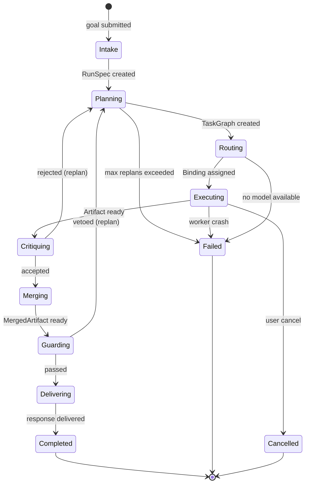
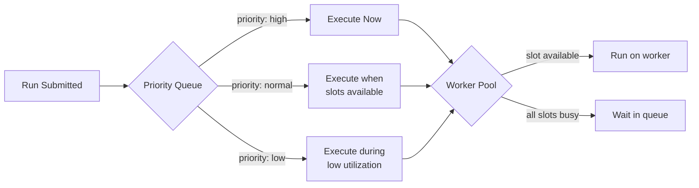

# Main AI Kernel

> The **OS Kernel** of the AI Development Operating System. Owns policy, context, routing, and lifecycle for every agent, tool, and model. Every request enters here; every result exits here.

## Overview

The Main AI Kernel is the top-level orchestrator of AI Dev OS. It plays the same role in this OS that a POSIX kernel plays for processes: it schedules work, enforces isolation, mediates I/O, and is the only component permitted to grant privileges. No agent, tool, or plugin runs outside the Kernel's supervision.

The Kernel exposes a small, stable syscall-like surface. Every higher-level surface (CLI, MCP, HTTP API, Voice) is a thin adapter over that surface. Downstream subsystems — [Nine Router](./NINE_ROUTER.md), [AI Groups](./AI_GROUP_SYSTEM.md), [Dynamic Workers](./DYNAMIC_WORKERS.md), [Merge Manager](./MERGE_MANAGER.md), [Architecture Guardian](./ARCHITECTURE_GUARDIAN.md) — are called by the Kernel, never by user code directly.

## Goals

- Single authoritative loop: **intake → plan → route → execute → critique → merge → guard → deliver**.
- Deterministic replay: given the same run inputs and a captured context snapshot, replaying yields the same task graph and the same terminal state (modulo model non-determinism, which is recorded).
- Never bypass the [Architecture Guardian](./ARCHITECTURE_GUARDIAN.md); veto is final.
- All state flows through the [Shared Context Engine](./SHARED_CONTEXT_ENGINE.md); the Kernel holds no hidden state.
- Fair scheduling across concurrent runs with hard budget caps (tokens, wall-clock, cost).
- Local-first: the Kernel MUST run offline against local models with no cloud dependency.

## Non-Goals

- Implementation code — this repository is documentation-only ([AI Coding Rules](./AI_CODING_RULES.md)).
- Provider-specific tuning — belongs in [Model Providers](./MODEL_PROVIDERS.md).
- UI concerns — belong in [UI/UX](./UI_UX.md) and [Frontend](./FRONTEND.md).

## The Kernel Loop


Each stage publishes a structured event to the [Shared Context Engine](./SHARED_CONTEXT_ENGINE.md) tagged with the run's `correlation_id`. A run is nothing more than the ordered projection of its events.

### Stage contracts

| Stage    | Input              | Output             | Owner                                                     |
| -------- | ------------------ | ------------------ | --------------------------------------------------------- |
| Intake   | `Goal`             | `RunSpec`          | Kernel                                                    |
| Plan     | `RunSpec`          | `TaskGraph`        | [Planning Engine](./PLANNING_ENGINE.md)                   |
| Route    | `Task`             | `ModelBinding`     | [Nine Router](./NINE_ROUTER.md)                           |
| Execute  | `Task + Binding`   | `Artifact[]`       | [Dynamic Workers](./DYNAMIC_WORKERS.md)                   |
| Critique | `Artifact`         | `Verdict`          | Critic role (see [Nine Router](./NINE_ROUTER.md))         |
| Merge    | `Verdict[]`        | `MergedArtifact`   | [Merge Manager](./MERGE_MANAGER.md)                       |
| Guard    | `MergedArtifact`   | `ok` \| `veto`     | [Architecture Guardian](./ARCHITECTURE_GUARDIAN.md)       |
| Deliver  | `Artifact`         | `Response`         | Kernel                                                    |

## Requirements

- **MUST** be the only component that spawns agents, allocates budgets, or opens tool handles.
- **MUST** carry a `correlation_id` end-to-end and propagate it into every provider call.
- **MUST** enforce per-run and per-tenant quotas defined in [Cost Management](./COST_MANAGEMENT.md) and [Rate Limiting](./RATE_LIMITING.md).
- **MUST** persist every accepted plan and verdict to [Persistent Memory](./PERSISTENT_MEMORY.md) before delivery.
- **MUST** treat any Guardian veto as terminal for the current path and reroute through Planning.
- **MUST** support graceful cancellation: `kernel.cancel(run_id)` reaches every in-flight worker within one scheduler tick.
- **SHOULD** degrade to a smaller model fallback chain before failing a task.
- **MAY** parallelize sibling tasks in the plan graph when the [Task Graph](./TASK_GRAPH.md) marks them independent.

## Interfaces

Syscall-shaped surface. Every call is idempotent by `run_id` and returns immediately with a handle; results are streamed as events on the Shared Context Engine.

```
kernel.submit(goal: Goal, ctx?: ContextRef) → run_id
kernel.status(run_id) → RunStatus
kernel.stream(run_id) → AsyncIterator<Event>
kernel.cancel(run_id, reason?) → Ack
kernel.replay(run_id, from?: event_id) → run_id'
kernel.snapshot(run_id) → SnapshotRef
```

Envelope, error format, and correlation rules are defined in [Agent Communication](./AGENT_COMMUNICATION.md) and [API Spec](./API_SPEC.md).

## Data Model

```
Run {
  id: ulid
  goal: Goal
  plan: TaskGraph
  tasks: Task[]
  verdicts: Verdict[]
  artifacts: Artifact[]
  budget: { tokens_max, wall_ms_max, usd_max }
  spent:  { tokens, wall_ms, usd }
  state:  intake|planning|routing|executing|critiquing|merging|guarding|delivered|failed|cancelled
  ts:     { created, updated, terminated? }
  correlation_id: uuid
}
```

Runs are append-only. Mutations are represented as new events on the run's topic. See [Persistent Memory](./PERSISTENT_MEMORY.md) for retention.

## Scheduling

- Preemptive across runs, cooperative within a run.
- Priority is derived from `goal.priority`, tenant class, and remaining SLO budget.
- Long-running tasks MUST checkpoint via [Agent Lifecycle](./AGENT_LIFECYCLE.md); checkpoints are the only preemption points.
- Backpressure signals come from the [Queueing](./QUEUEING.md) and [Job Scheduler](./JOB_SCHEDULER.md) subsystems.

## Failure Modes

| Mode                       | Detection                          | Response                                                                 |
| -------------------------- | ---------------------------------- | ------------------------------------------------------------------------ |
| Planner loop               | replan_count > `MAX_REPLANS` (5)   | escalate to human, mark run `failed`                                     |
| Guardian veto storm        | ≥ 3 vetoes within 10s              | freeze non-critical routes, page on-call, keep read paths live           |
| Provider outage            | model call error rate > 20% / 60s  | slide down fallback chain, publish `provider.degraded` event             |
| Budget exhaustion          | spent ≥ budget                     | cancel remaining tasks, deliver best-effort partial result with warning  |
| Context store unavailable  | write NAK from Context Engine      | buffer to local WAL, retry with backoff, refuse new runs after threshold |
| Worker crash               | heartbeat miss                     | reassign task, mark previous attempt `orphaned`                          |

All failures are recorded in the [Audit Log](./AUDIT_LOG.md) and follow [Error Handling](./ERROR_HANDLING.md).

## Security Considerations

- The Kernel is the trust root; only Kernel-signed envelopes are honored by downstream subsystems (see [Security Model](./SECURITY_MODEL.md)).
- Secrets are fetched from [Secrets Management](./SECRETS_MANAGEMENT.md) at task-start and scoped to the worker's lifetime.
- No agent may call a provider directly; all provider I/O is proxied by the Kernel through [Model Providers](./MODEL_PROVIDERS.md) to guarantee auditability.
- Plugin code loaded via the [Plugin SDK](./PLUGIN_SDK.md) runs in a capability-restricted sandbox; the Kernel is the capability broker.

## Observability

- Emits the standard metric set from [Metrics](./METRICS.md): `run_started_total`, `run_stage_seconds`, `run_terminated_total{state}`, `veto_total{reason}`, `budget_saturation_ratio`.
- Traces every stage as a span; span links carry `correlation_id`. See [Tracing](./TRACING.md).
- Full reasoning traces are optional and follow [Reasoning Traces](./REASONING_TRACES.md).

## Acceptance Criteria

- End-to-end run of the "hello agent" goal succeeds against a local model with zero network egress.
- A synthetic Guardian veto forces a replan and produces a distinct plan on the second attempt.
- Cancellation propagates to a worker holding a long-running tool call within 1 scheduler tick.
- Replay of a stored run produces an identical task graph and identical verdicts.

## Open Questions

- Cooperative vs. preemptive scheduling within a single run — tracked in [templates/ADR](../templates/ADR.md).
- Whether the Kernel should own budget forecasting or delegate to [Cost Management](./COST_MANAGEMENT.md).

## Stage Contract Tables (Detailed)

Each stage in the Kernel loop has a well-defined contract specifying input, output, emitted events, and preconditions:

### 1. Intake

| Aspect | Detail |
|--------|--------|
| **Input** | `Goal { text: string, context?: ContextRef, priority?: enum }` |
| **Output** | `RunSpec { run_id: ulid, plan_id: ulid, budget: Budget, correlation_id: uuid }` |
| **SCE Events** | `run.intake.started`, `run.intake.completed`, `run.intake.failed` |
| **Preconditions** | Budget not exhausted; provider available for at least one model |
| **Postconditions** | Run is registered in SCE; correlation_id is generated |
| **Owner** | Kernel |

### 2. Plan

| Aspect | Detail |
|--------|--------|
| **Input** | `RunSpec` |
| **Output** | `TaskGraph { tasks: Task[], dependencies: Edge[] }` |
| **SCE Events** | `run.plan.started`, `run.plan.completed`, `run.plan.replanned` |
| **Preconditions** | Planner agent is loaded and healthy |
| **Postconditions** | Task graph is persisted; each task has a unique id |
| **Owner** | Planning Engine |

### 3. Route

| Aspect | Detail |
|--------|--------|
| **Input** | `Task { id: ulid, type: string, input: RunSpec }` |
| **Output** | `ModelBinding { task_id: ulid, role: string, model: ModelRef, provider: ProviderRef }` |
| **SCE Events** | `run.route.assigned`, `run.route.fallback`, `run.route.failed` |
| **Preconditions** | Model registry has at least one candidate per role |
| **Postconditions** | Binding is logged; model is confirmed available |
| **Owner** | Nine Router |

### 4. Execute

| Aspect | Detail |
|--------|--------|
| **Input** | `Task + ModelBinding` |
| **Output** | `Artifact[] { id: ulid, content: string, type: string, metadata: object }` |
| **SCE Events** | `run.execute.started`, `run.execute.tool_call`, `run.execute.completed` |
| **Preconditions** | Worker process is spawned and configured |
| **Postconditions** | Artifacts are stored; tool calls are audited |
| **Owner** | Dynamic Workers |

### 5. Critique

| Aspect | Detail |
|--------|--------|
| **Input** | `Artifact[]` |
| **Output** | `Verdict { task_id: ulid, accepted: bool, score: float, feedback: string }` |
| **SCE Events** | `run.critique.started`, `run.critique.completed`, `run.critique.rejected` |
| **Preconditions** | Critic role is assigned to a model |
| **Postconditions** | Accepted artifacts proceed; rejected artifacts trigger replan |
| **Owner** | Critic role (Nine Router) |

### 6. Merge

| Aspect | Detail |
|--------|--------|
| **Input** | `Verdict[]` for all accepted artifacts |
| **Output** | `MergedArtifact { content: string, sources: ArtifactRef[], conflicts?: Conflict[] }` |
| **SCE Events** | `run.merge.started`, `run.merge.completed`, `run.merge.conflict` |
| **Preconditions** | At least one accepted artifact exists |
| **Postconditions** | Merged artifact is consistent; conflicts are flagged |
| **Owner** | Merge Manager |

### 7. Guard

| Aspect | Detail |
|--------|--------|
| **Input** | `MergedArtifact` |
| **Output** | `ok` or `veto { reason: string, rule_ids: string[] }` |
| **SCE Events** | `run.guard.started`, `run.guard.passed`, `run.guard.vetoed` |
| **Preconditions** | All Guardian rules are loaded |
| **Postconditions** | Veto causes replan; ok proceeds to delivery |
| **Owner** | Architecture Guardian |

### 8. Deliver

| Aspect | Detail |
|--------|--------|
| **Input** | `Artifact` (guarded) |
| **Output** | `Response { run_id: ulid, content: string, metadata: object }` |
| **SCE Events** | `run.deliver.started`, `run.deliver.completed` |
| **Preconditions** | Artifact passed Guardian check |
| **Postconditions** | Run is marked `terminated`; response is committed to SCE |
| **Owner** | Kernel |

## Run Lifecycle State Machine



## SCE Event Catalog Per Stage

| Stage | Event(s) Published | Topic Pattern |
|-------|-------------------|---------------|
| Intake | `run.intake.started`, `run.intake.completed`, `run.intake.failed` | `run.<run_id>` |
| Plan | `run.plan.started`, `run.plan.completed`, `run.plan.replanned` | `run.<run_id>` |
| Route | `run.route.assigned`, `run.route.fallback`, `run.route.failed` | `run.<run_id>` |
| Execute | `run.execute.started`, `run.execute.tool_call`, `run.execute.completed` | `run.<run_id>` |
| Critique | `run.critique.started`, `run.critique.completed`, `run.critique.rejected` | `run.<run_id>` |
| Merge | `run.merge.started`, `run.merge.completed`, `run.merge.conflict` | `run.<run_id>` |
| Guard | `run.guard.started`, `run.guard.passed`, `run.guard.vetoed` | `run.<run_id>` |
| Deliver | `run.deliver.started`, `run.deliver.completed` | `run.<run_id>` |
| Any | `run.cancelled`, `run.failed`, `run.budget_exhausted` | `run.<run_id>` |

## Budget Enforcement Algorithm

```
function enforceBudget(run):
    if run.spent.tokens >= run.budget.tokens_max:
        haltRun(run, "token budget exhausted")
        emit("run.budget_exhausted", { type: "tokens" })
        return DELIVER_PARTIAL

    if run.spent.wall_ms >= run.budget.wall_ms_max:
        haltRun(run, "wall-clock budget exhausted")
        emit("run.budget_exhausted", { type: "wall_ms" })
        return DELIVER_PARTIAL

    if run.spent.usd >= run.budget.usd_max:
        haltRun(run, "cost budget exhausted")
        emit("run.budget_exhausted", { type: "usd" })
        return DELIVER_PARTIAL

    return CONTINUE

function haltRun(run, reason):
    run.state = "failed"
    run.terminated_at = now()
    cancelAllInFlightWorkers(run.id)
    recordToAuditLog(run.id, "budget_exhausted", reason)
```

Budget is checked at every stage boundary. If any budget cap is exceeded, the run is halted immediately and a best-effort partial result is delivered.

## Concurrent Run Scheduling



Scheduling policy:
- **Preemptive across runs**: A high-priority run can preempt a low-priority run at stage boundaries.
- **Cooperative within a run**: Tasks within a run yield at checkpoint boundaries.
- **Max concurrent runs**: Limited by `AIDEVOS_MAX_WORKERS` (default 10).
- **Starvation prevention**: A low-priority run is promoted to normal after 5 minutes in queue.

## Replay Protocol

```
kernel.replay(run_id, from?: event_id):
    1. Load run snapshot from SCE (or rebuild from event log)
    2. If from is specified, seek to that event
    3. Replay events in order, skipping model calls (use cached responses)
    4. For model non-determinism, re-run with same provider + seed
    5. Verify task graph matches original
    6. Emit events on new correlation_id (marked as replay)
    7. Return new run_id' for the replay

Replay correlation_id propagation:
    original:  corr_abc123
    replay:    corr_abc123_replay_<timestamp>
```

## Kernel API Surface

```
kernel.submit(goal, ctx?)           → run_id       # Submit a new goal
kernel.status(run_id)               → RunStatus    # Get run state
kernel.stream(run_id)               → AsyncIter    # Stream events
kernel.cancel(run_id, reason?)      → Ack          # Cancel a run
kernel.replay(run_id, from?)        → run_id       # Replay a run
kernel.snapshot(run_id)             → SnapshotRef  # Take run snapshot
kernel.list(filter?)                → RunSummary[] # List runs
kernel.pause(run_id)                → Ack          # Pause a run
kernel.resume(run_id)               → Ack          # Resume paused run
kernel.budget(run_id)               → Budget       # Get budget status
```

All calls are idempotent by `run_id` and return immediately. Results are streamed as SCE events.

## Extension Points

| Extension | Mechanism | Example |
|-----------|-----------|---------|
| Custom planner | Plugin implementing `Planner` interface | Domain-specific task decomposition |
| Custom critic | Plugin implementing `Critic` interface | Domain-specific quality checks |
| Custom guardian rules | Rule files in `~/.aidevos/rules/` | Enforce coding standards |
| Custom tool | Tool definition in `~/.aidevos/tools/` | Database query tool |
| Custom model provider | Provider adapter implementing `ModelProvider` | Custom proprietary API |
| Custom agent role | Role definition in `agents.yaml` | Domain expert agent |
| Custom event handler | SCE subscriber plugin | Real-time dashboard updates |

## Failure Modes (Expanded)

| Mode | Detection | Response |
|------|-----------|----------|
| Planner loop | replan_count > `MAX_REPLANS` (5) | Escalate to human; mark run `failed` |
| Guardian veto storm | >= 3 vetoes within 10s | Freeze non-critical routes; page on-call; keep read paths live |
| Provider outage | model call error rate > 20% / 60s | Slide down fallback chain; publish `provider.degraded` event |
| Budget exhaustion | spent >= budget | Cancel remaining tasks; deliver best-effort partial result with warning |
| Context store unavailable | write NAK from SCE | Buffer to local WAL; retry with backoff; refuse new runs after threshold |
| Worker crash | heartbeat miss > 10s | Reassign task; mark previous attempt `orphaned` |
| Stale correlation_id | Unknown corr_id in event | Reject event; log error; request re-publish with valid corr_id |
| Concurrency deadlock | Circular dependency in task graph | Detect cycle; break by serializing dependent tasks |
| Replay failure | Snapshot not found | Rebuild from SCE event log; mark replay as `provisional` |

## Observability / Metrics (Expanded)

| Metric | Type | Labels | Description |
|--------|------|--------|-------------|
| `run_started_total` | Counter | priority | Runs submitted |
| `run_stage_seconds` | Histogram | stage (intake/plan/route/execute/critique/merge/guard/deliver) | Stage duration |
| `run_terminated_total` | Counter | state (completed/failed/cancelled) | Run termination |
| `veto_total` | Counter | reason | Guardian veto count |
| `budget_saturation_ratio` | Gauge | run_id, budget_type | Budget usage percentage |
| `replan_count` | Counter | run_id | Number of replans per run |
| `worker_crashes_total` | Counter | worker_id | Worker crash count |
| `concurrent_runs` | Gauge | — | Currently active runs |
| `queue_depth` | Gauge | priority | Queue depth |
| `replay_total` | Counter | status (complete/partial/failed) | Replay attempts |

## Acceptance Criteria (Expanded)

- End-to-end run of the "hello agent" goal succeeds against a local model with zero network egress.
- A synthetic Guardian veto forces a replan and produces a distinct plan on the second attempt.
- Cancellation propagates to a worker holding a long-running tool call within 1 scheduler tick.
- Replay of a stored run produces an identical task graph and identical verdicts.
- Budget enforcement halts a run when token limit is reached and delivers a partial result.
- A high-priority run is scheduled before a low-priority run submitted earlier.
- The Kernel loop completes the "hello agent" goal against a local model in under 5 seconds.
- All 8 stages emit the correct SCE events in the correct order.

## Related Documents

- [System Overview](./SYSTEM_OVERVIEW.md) · [Planning Engine](./PLANNING_ENGINE.md) · [Task Graph](./TASK_GRAPH.md) · [Nine Router](./NINE_ROUTER.md) · [Dynamic Workers](./DYNAMIC_WORKERS.md) · [Merge Manager](./MERGE_MANAGER.md) · [Architecture Guardian](./ARCHITECTURE_GUARDIAN.md) · [Shared Context Engine](./SHARED_CONTEXT_ENGINE.md) · [Agent Lifecycle](./AGENT_LIFECYCLE.md) · [Multi-Agent Orchestration](./MULTI_AGENT_ORCHESTRATION.md) · [diagrams/AI_KERNEL](../diagrams/AI_KERNEL.md)
