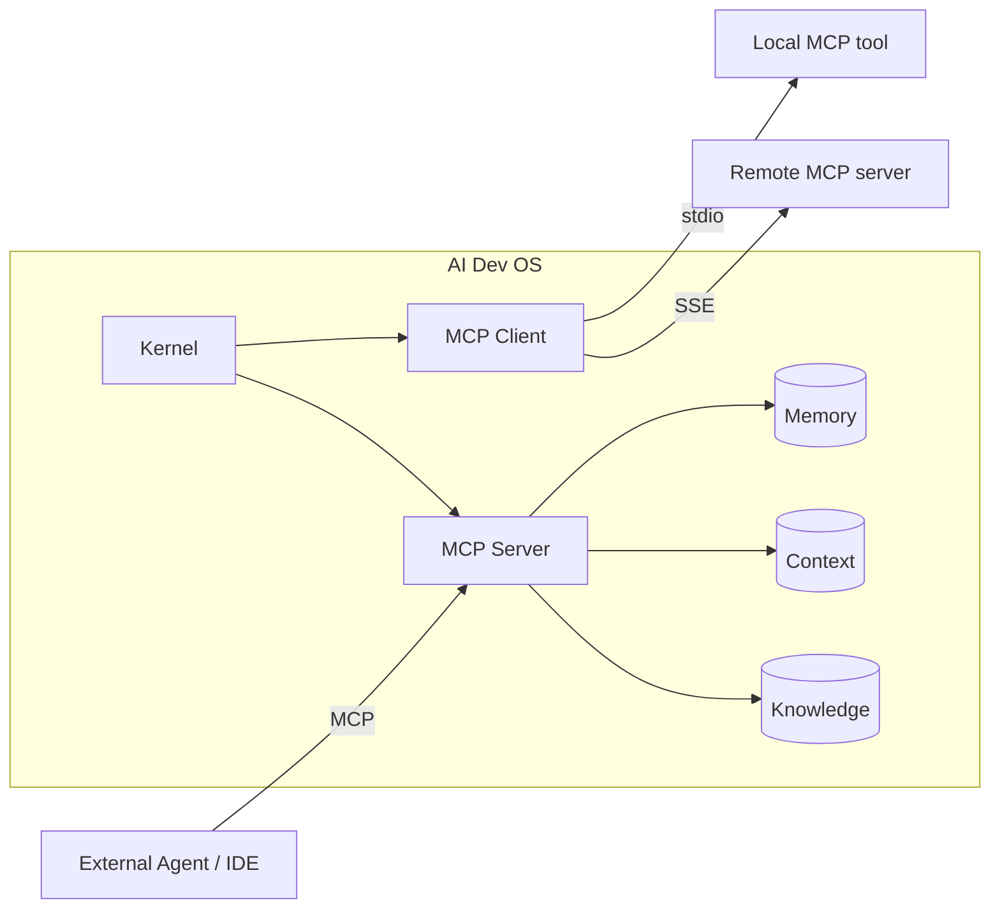

# MCP — Model Context Protocol Integration

> AI Dev OS speaks **MCP** as both **client** and **server** so external tools, resources, and prompt libraries plug into the Kernel with zero bespoke glue.

## Overview

MCP (Model Context Protocol) is the interop layer that lets AI Dev OS expose its own capabilities (memory, context, knowledge, tools) to external agents and consume capabilities from external MCP servers (GitHub, filesystem, Obsidian vaults, IDE bridges, custom tools). Every MCP call goes through the [Main AI Kernel](./MAIN_AI_KERNEL.md) so it is authenticated, budgeted, and audited.

## Goals

- First-class MCP client and MCP server, both over stdio and HTTP/SSE transports.
- Tool and resource discovery uses the same UX as the [Nine Router](./NINE_ROUTER.md): search, filter, refresh, assign.
- Every MCP call is audited with request/response envelopes.
- Zero-config for local MCP servers on the machine; explicit consent required for remote servers.

## Non-Goals

- Reimplementing the MCP spec — we conform to the upstream spec version pinned in [Versioning](./VERSIONING.md).
- Ad-hoc RPC — non-MCP tool integrations use the [Plugin SDK](./PLUGIN_SDK.md).

## Requirements

- **MUST** support MCP transports: `stdio`, `sse`, `streamable-http`.
- **MUST** expose the following as MCP resources on the server side:
  - `memory://…` — read-only projection of [Persistent Memory](./PERSISTENT_MEMORY.md).
  - `context://<topic>` — snapshot + tail of a [Shared Context Engine](./SHARED_CONTEXT_ENGINE.md) topic.
  - `knowledge://<kb>/…` — layered knowledge base access (Global, Main, Group, Individual).
  - `graph://…` — Obsidian graph queries via [Obsidian Graph Engine](./OBSIDIAN_GRAPH_ENGINE.md).
- **MUST** expose the following as MCP tools:
  - `plan.submit(goal)` → run_id
  - `router.assign(role, model_id)`
  - `memory.query(q)` / `memory.write(entry)` (write requires elevated capability)
  - `research.search(q)` (via [Research Engine](./RESEARCH_ENGINE.md))
- **MUST** require explicit user consent for each remote MCP server on first use; consent is persisted.
- **MUST** run every MCP tool call under a capability token issued by the Kernel.
- **SHOULD** discover local MCP servers via a `~/.aidevos/mcp.d/` config directory.
- **MAY** proxy MCP servers behind a single aggregated endpoint for downstream agents.

## Architecture



## Client interface

```
mcp.connect(server: McpServerRef) → session
mcp.list_tools(session) → Tool[]
mcp.list_resources(session) → Resource[]
mcp.call(session, tool, args) → ToolResult
mcp.read(session, uri) → ResourceContent
```

## Server interface (what we expose)

```
tools/list           → the Tools table above
tools/call           → dispatched through Kernel with capability check
resources/list       → memory://, context://, knowledge://, graph://
resources/read       → snapshot + optional watch
prompts/list         → canonical prompts from ../prompts/
prompts/get          → hydrated with session variables
```

## Data Model

Standard MCP envelopes; no custom extensions unless namespaced under `x-aidevos-*`. Consent records:

```
McpConsent {
  server: { name, transport, endpoint }
  granted_at: rfc3339
  granted_by: user_id
  scopes: string[]
  expires_at?: rfc3339
}
```

## Failure Modes

| Mode                    | Response                                                                 |
| ----------------------- | ------------------------------------------------------------------------ |
| Peer unreachable        | Mark server `degraded`, keep other servers live, retry with backoff       |
| Schema mismatch         | Reject call with typed error, alert operator, keep server enabled        |
| Consent revoked         | Terminate session cleanly, invalidate cached capabilities                |
| Tool timeout            | Cancel underlying call, return `MCP_TIMEOUT`, do not retry writes        |

## Security

- Every remote MCP server is treated as **untrusted** input; results MUST pass through the [Architecture Guardian](./ARCHITECTURE_GUARDIAN.md) before they can influence a plan.
- Capabilities are least-privilege: a tool that only needs `memory.query` never sees `memory.write`.
- All MCP I/O is recorded in the [Audit Log](./AUDIT_LOG.md).
- Secrets required by an MCP server are injected via [Secrets Management](./SECRETS_MANAGEMENT.md); never handed to the peer.

## Observability

Metrics: `mcp_call_total{server,tool,ok}`, `mcp_call_seconds{server,tool}`, `mcp_active_sessions{server}`. See [Observability](./OBSERVABILITY.md).

## Acceptance Criteria

- Connecting the official filesystem MCP server, listing its tools, and calling `read_file` succeeds end-to-end.
- Revoking consent immediately terminates the session and rejects the next tool call.
- Exposing `memory://recent` and reading it from a third-party MCP client returns a valid resource.

## Related Documents

- [Tool Calling](./TOOL_CALLING.md) · [Plugin SDK](./PLUGIN_SDK.md) · [Agent Communication](./AGENT_COMMUNICATION.md) · [Shared Context Engine](./SHARED_CONTEXT_ENGINE.md) · [Persistent Memory](./PERSISTENT_MEMORY.md) · [Main AI Kernel](./MAIN_AI_KERNEL.md) · [Architecture Guardian](./ARCHITECTURE_GUARDIAN.md)
