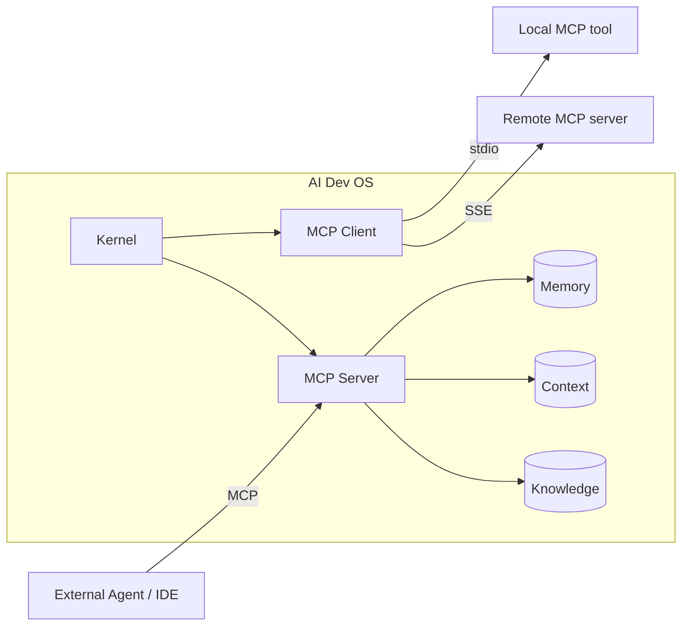
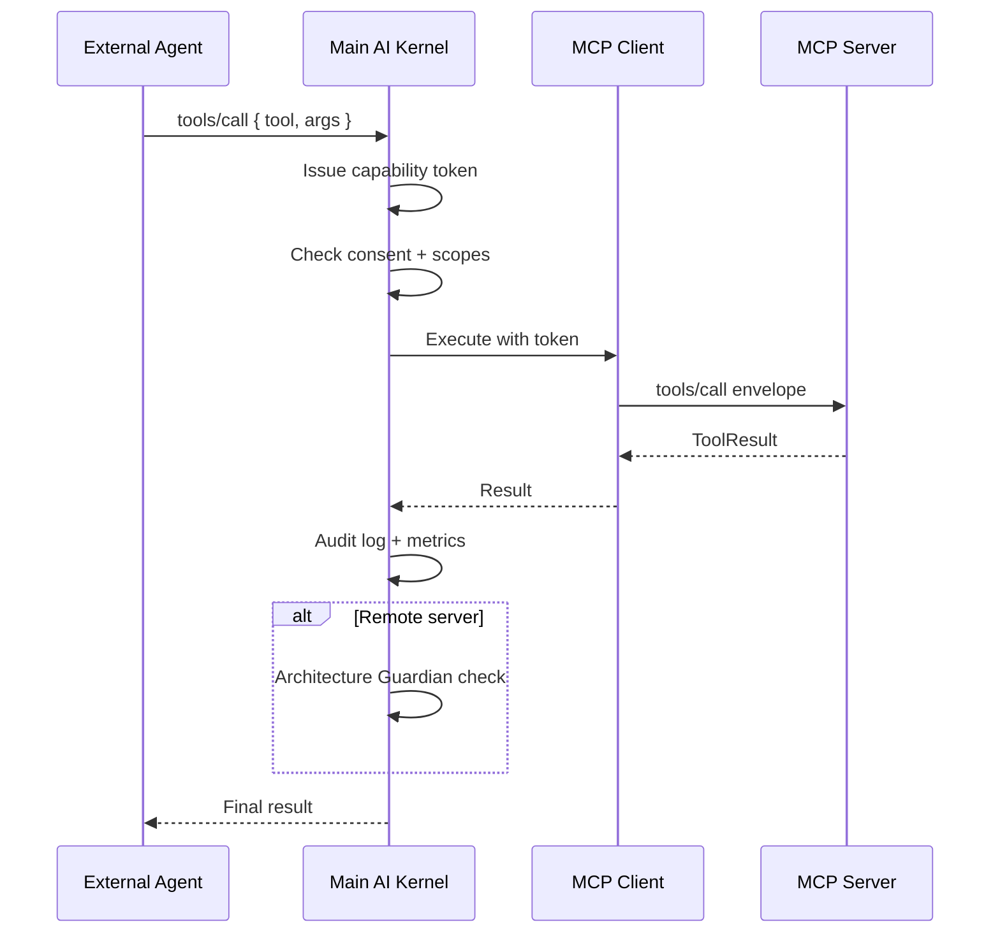

# MCP — Model Context Protocol Integration

> AI Dev OS speaks **MCP** as both **client** and **server** so external tools, resources, and prompt libraries plug into the Kernel with zero bespoke glue.

## Overview

MCP (Model Context Protocol) is the interop layer that lets AI Dev OS expose its own capabilities (memory, context, knowledge, tools) to external agents and consume capabilities from external MCP servers (GitHub, filesystem, Obsidian vaults, IDE bridges, custom tools). Every MCP call goes through the [Main AI Kernel](./MAIN_AI_KERNEL.md) so it is authenticated, budgeted, and audited.

## Goals

- First-class MCP client and MCP server, both over stdio and HTTP/SSE transports.
- Tool and resource discovery uses the same UX as the [Nine Router](./NINE_ROUTER.md): search, filter, refresh, assign.
- Every MCP call is audited with request/response envelopes.
- Zero-config for local MCP servers on the machine; explicit consent required for remote servers.

## Non-Goals

- Reimplementing the MCP spec — we conform to the upstream spec version pinned in [Versioning](./VERSIONING.md).
- Ad-hoc RPC — non-MCP tool integrations use the [Plugin SDK](./PLUGIN_SDK.md).

## Requirements

- **MUST** support MCP transports: `stdio`, `sse`, `streamable-http`.
- **MUST** expose the following as MCP resources on the server side:
  - `memory://…` — read-only projection of [Persistent Memory](./PERSISTENT_MEMORY.md).
  - `context://<topic>` — snapshot + tail of a [Shared Context Engine](./SHARED_CONTEXT_ENGINE.md) topic.
  - `knowledge://<kb>/…` — layered knowledge base access (Global, Main, Group, Individual).
  - `graph://…` — Obsidian graph queries via [Obsidian Graph Engine](./OBSIDIAN_GRAPH_ENGINE.md).
- **MUST** expose the following as MCP tools:
  - `plan.submit(goal)` → run_id
  - `router.assign(role, model_id)`
  - `memory.query(q)` / `memory.write(entry)` (write requires elevated capability)
  - `research.search(q)` (via [Research Engine](./RESEARCH_ENGINE.md))
- **MUST** require explicit user consent for each remote MCP server on first use; consent is persisted.
- **MUST** run every MCP tool call under a capability token issued by the Kernel.
- **SHOULD** discover local MCP servers via a `~/.aidevos/mcp.d/` config directory.
- **MAY** proxy MCP servers behind a single aggregated endpoint for downstream agents.

## Architecture



## Client interface

```
mcp.connect(server: McpServerRef) → session
mcp.list_tools(session) → Tool[]
mcp.list_resources(session) → Resource[]
mcp.call(session, tool, args) → ToolResult
mcp.read(session, uri) → ResourceContent
```

## Server interface (what we expose)

```
tools/list           → the Tools table above
tools/call           → dispatched through Kernel with capability check
resources/list       → memory://, context://, knowledge://, graph://
resources/read       → snapshot + optional watch
prompts/list         → canonical prompts from ../prompts/
prompts/get          → hydrated with session variables
```

## Data Model

Standard MCP envelopes; no custom extensions unless namespaced under `x-aidevos-*`. Consent records:

```
McpConsent {
  server: { name, transport, endpoint }
  granted_at: rfc3339
  granted_by: user_id
  scopes: string[]
  expires_at?: rfc3339
}
```

## Failure Modes

| Mode                    | Response                                                                 |
| ----------------------- | ------------------------------------------------------------------------ |
| Peer unreachable        | Mark server `degraded`, keep other servers live, retry with backoff       |
| Schema mismatch         | Reject call with typed error, alert operator, keep server enabled        |
| Consent revoked         | Terminate session cleanly, invalidate cached capabilities                |
| Tool timeout            | Cancel underlying call, return `MCP_TIMEOUT`, do not retry writes        |

## Security

- Every remote MCP server is treated as **untrusted** input; results MUST pass through the [Architecture Guardian](./ARCHITECTURE_GUARDIAN.md) before they can influence a plan.
- Capabilities are least-privilege: a tool that only needs `memory.query` never sees `memory.write`.
- All MCP I/O is recorded in the [Audit Log](./AUDIT_LOG.md).
- Secrets required by an MCP server are injected via [Secrets Management](./SECRETS_MANAGEMENT.md); never handed to the peer.

## Observability

Metrics: `mcp_call_total{server,tool,ok}`, `mcp_call_seconds{server,tool}`, `mcp_active_sessions{server}`. See [Observability](./OBSERVABILITY.md).

## Acceptance Criteria

- Connecting the official filesystem MCP server, listing its tools, and calling `read_file` succeeds end-to-end.
- Revoking consent immediately terminates the session and rejects the next tool call.
- Exposing `memory://recent` and reading it from a third-party MCP client returns a valid resource.

## MCP Tool Call Lifecycle

Every MCP tool call passes through a defined lifecycle:

1. **Discover** — Client calls `tools/list` on the server; response is cached for 60 s.
2. **Authenticate** — Kernel issues a capability token scoped to the specific tool and server.
3. **Authorize** — Kernel checks consent record and capability scopes against the requested tool.
4. **Execute** — Client sends `tools/call` with the args envelope; server processes and returns result.
5. **Audit** — Request and response envelopes are written to the Audit Log.
6. **Post-process** — Result passes through Architecture Guardian for untrusted remote servers.

## Interaction Sequence



## Transport Protocol Details

### stdio Transport

The client spawns the server as a subprocess and communicates over stdin/stdout:

```
Protocol:
  Client → Server:  JSON-RPC request line (terminated by \n)
  Server → Client:  JSON-RPC response line (terminated by \n)
  Content-Length:   header preceding each JSON message
  Encoding:         UTF-8
  Lifecycle:        Client spawns process → sends initialize → receives initialized
                    → capability negotiation → tool calls → shutdown → close stdin
```

Error handling: stderr from the server process is captured and logged. If the process exits unexpectedly, the client marks the server `degraded` and attempts restart up to 3 times with exponential backoff.

### SSE Transport

The client connects to a remote HTTP endpoint that serves Server-Sent Events:

```
Protocol:
  Endpoint:   GET {base_url}/sse
  Headers:    Accept: text/event-stream
              Authorization: Bearer <token> (optional)
  Events:     endpoint (server sends the message endpoint URL)
              message  (server sends tool results and notifications)
  Client:     POST {message_endpoint} for outgoing requests
```

Error handling: SSE connection drops are detected via the `EventSource.onerror` handler. The client reconnects with exponential backoff (1 s, 2 s, 4 s, max 30 s). In-flight requests are retried on reconnect.

### Streamable HTTP Transport

A hybrid transport that uses HTTP for both directions without persistent connections:

```
Protocol:
  Request:    POST {server_url} with JSON-RPC body
  Response:   Content-Type: application/json (single response)
              or Content-Type: text/event-stream (streaming)
  Streaming:  Server may switch to SSE for long-running operations
  Polling:    Client may poll a status URL for completion
```

Error handling: Standard HTTP status codes. 5xx responses trigger retry. 4xx responses surface the error to the caller.

## MCP Server Discovery Algorithm

```
function discoverMCPServers():
    servers = []
    // 1. Scan local config directory
    for file in ~/.aidevos/mcp.d/*.json:
        servers.append(parseConfig(file))
    // 2. Scan environment variables
    for var in MCP_SERVER_*:
        servers.append(parseEnv(var))
    // 3. Check system PATH for known MCP server binaries
    for binary in known_mcp_servers:
        if which(binary): servers.append(autoDetect(binary))
    // 4. Query integration registry for registered remotes
    for entry in IntegrationRegistry.list():
        if entry.pattern == "mcp":
            servers.append(entry.toMcpRef())
    // 5. Deduplicate by name + transport
    return deduplicate(servers)
```

## Consent Management Flow

```
1. First contact with a remote MCP server
2. Client calls tools/list to enumerate capabilities
3. Kernel presents consent dialog to user:
   - Server name and endpoint
   - Requested scopes (tools, resources, prompts)
   - Duration (session / persistent)
4. User grants or denies consent
5. If granted: McpConsent record is persisted
6. If denied: server is blocked; all future calls are rejected
```

Consent can be revoked at any time via `mcp.revoke_consent(server)`. Revocation takes effect immediately and invalidates all cached capability tokens.

## Capability Token Scoping

Capability tokens are JWTs issued by the Kernel with the following claims:

```
{
  "sub": "mcp:session:{session_id}",
  "aud": "mcp:server:{server_name}",
  "scopes": ["tools:call:read_file", "tools:call:write_file"],
  "exp": 1640995200,
  "iat": 1640991600,
  "jti": "unique-token-id"
}
```

Scopes are derived from the consent record and are least-privilege. A token for `memory.query` never allows `memory.write`.

## Request/Response Envelope Schema

Every MCP call is wrapped in an envelope for auditing:

```
McpEnvelope {
  id:         string          // unique call ID (UUIDv7)
  server:     McpServerRef    // target server identity
  method:     string          // tools/call, resources/read, etc.
  params:     any             // call parameters
  token_jti:  string          // capability token JWT ID
  issued_at:  rfc3339
  response: {
    result:   any | null
    error:    { code: int, message: string, data?: any } | null
    received_at: rfc3339
  }
}
```

## Tool Registration Process

When a tool is registered on the MCP server side:

```
1. Tool definition is declared with name, description, and JSON Schema parameters
2. Tool is registered in the MCP server's tool registry
3. Server returns it in tools/list responses
4. On tools/call, the server dispatches to the registered handler
5. Handler is wrapped with Kernel capability check
6. Result is returned through the envelope
```

On the client side, discovered tools are cached in the Integration Registry with metadata:
- Server origin
- Tool schema (name, description, parameters)
- Capability requirements
- Last-seen timestamp

## Error Handling Per Transport

| Transport | Error Scenario | Client Behavior |
|-----------|---------------|-----------------|
| stdio | Process crash | Restart up to 3× with backoff; mark `degraded` |
| stdio | Invalid JSON on stdout | Log warning; skip line; continue |
| stdio | Stderr output | Capture and log; no interruption |
| SSE | Connection lost | Reconnect with backoff; retry in-flight reads |
| SSE | Invalid event format | Log error; skip event |
| SSE | HTTP 401/403 | Mark `auth_error`; trigger consent re-verification |
| Streamable HTTP | HTTP 5xx | Retry × 3 with backoff |
| Streamable HTTP | HTTP 429 | Respect Retry-After; backoff |
| All | Timeout | Cancel call; return MCP_TIMEOUT |

## MCP Server Health Checks

The client performs periodic health checks on connected servers:

```
Health check procedure:
  1. Every 30 s, send ping (or tools/list as a lightweight probe)
  2. If no response within 5 s, mark server as "probing"
  3. Retry after 5 s; if 3 consecutive probes fail, mark "degraded"
  4. For degraded servers, continue probing every 60 s
  5. After 5 successful probes, restore to "active"
```

## Expanded Failure Modes

| Mode | Detection | Response |
|------|-----------|----------|
| Connection lost | Socket close / HTTP timeout | Retry with backoff; mark `degraded`; keep other servers live |
| Schema migration | Server returns MCP protocol version mismatch | Reject call with `MCP_SCHEMA_MISMATCH`; alert operator; re-discover capabilities |
| Tool timeout | No response within configured deadline | Cancel underlying call; return `MCP_TIMEOUT`; do not retry mutating operations |
| Auth failure | HTTP 401/403 from remote server | Mark `auth_error`; trigger consent re-verification; notify operator |
| Capability revocation | Server no longer advertises previously used tool | Refresh capability cache; reject stale calls; warn operator |
| Server overload | HTTP 503 or slow responses (p95 > 10 s) | Circuit-break for 30 s; probe after cooldown; alert if persistent |
| Protocol negotiation failure | `initialize` response does not match expected version | Log mismatch; attempt downgrade; fail if incompatible |

## Expanded Observability Metrics

| Metric | Type | Labels | Description |
|--------|------|--------|-------------|
| `mcp_call_total` | Counter | `{server, tool, ok}` | Total MCP tool calls |
| `mcp_call_seconds` | Histogram | `{server, tool}` | Call duration |
| `mcp_active_sessions` | Gauge | `{server}` | Currently active sessions |
| `mcp_consent_revocations_total` | Counter | `{server}` | Consent revocations |
| `mcp_server_health_status` | Gauge | `{server}` | 1 = active, 0 = degraded, -1 = down |
| `mcp_transport_errors_total` | Counter | `{server, transport}` | Transport-level errors |
| `mcp_restart_attempts_total` | Counter | `{server}` | stdio server restart attempts |
| `mcp_cache_hit_ratio` | Gauge | `{server}` | tools/list cache effectiveness |

## Expanded Security Considerations

- Every remote MCP server is treated as **untrusted** input; results MUST pass through the [Architecture Guardian](./ARCHITECTURE_GUARDIAN.md) before they can influence a plan.
- Capabilities are least-privilege: a tool that only needs `memory.query` never sees `memory.write`.
- All MCP I/O is recorded in the [Audit Log](./AUDIT_LOG.md).
- Secrets required by an MCP server are injected via [Secrets Management](./SECRETS_MANAGEMENT.md); never handed to the peer.
- stdio servers inherit the parent process's permissions — only launch servers from trusted paths.
- SSE and Streamable HTTP transports MUST use TLS in production.
- Capability tokens are short-lived (max 15 min) and single-use.
- Remote server URLs are validated against an allowlist before connection.
- All tool call parameters are sanitized to prevent injection attacks.
- Consent records are immutable after creation; revocation creates a new tombstone entry.

## Expanded Acceptance Criteria

- Connecting the official filesystem MCP server, listing its tools, and calling `read_file` succeeds end-to-end.
- Revoking consent immediately terminates the session and rejects the next tool call.
- Exposing `memory://recent` and reading it from a third-party MCP client returns a valid resource.
- A stdio server crash triggers automatic restart (up to 3 attempts) with backoff.
- An SSE server disconnection triggers reconnection with exponential backoff.
- A Streamable HTTP 5xx response triggers retry with backoff.
- A capability token with insufficient scope is rejected before the tool call is dispatched.
- The health check probe correctly transitions a server from `active` to `degraded` after 3 failures.
- Two MCP servers with the same name but different transports are both discoverable.

## Related Documents

- [Tool Calling](./TOOL_CALLING.md) · [Plugin SDK](./PLUGIN_SDK.md) · [Agent Communication](./AGENT_COMMUNICATION.md) · [Shared Context Engine](./SHARED_CONTEXT_ENGINE.md) · [Persistent Memory](./PERSISTENT_MEMORY.md) · [Main AI Kernel](./MAIN_AI_KERNEL.md) · [Architecture Guardian](./ARCHITECTURE_GUARDIAN.md)
