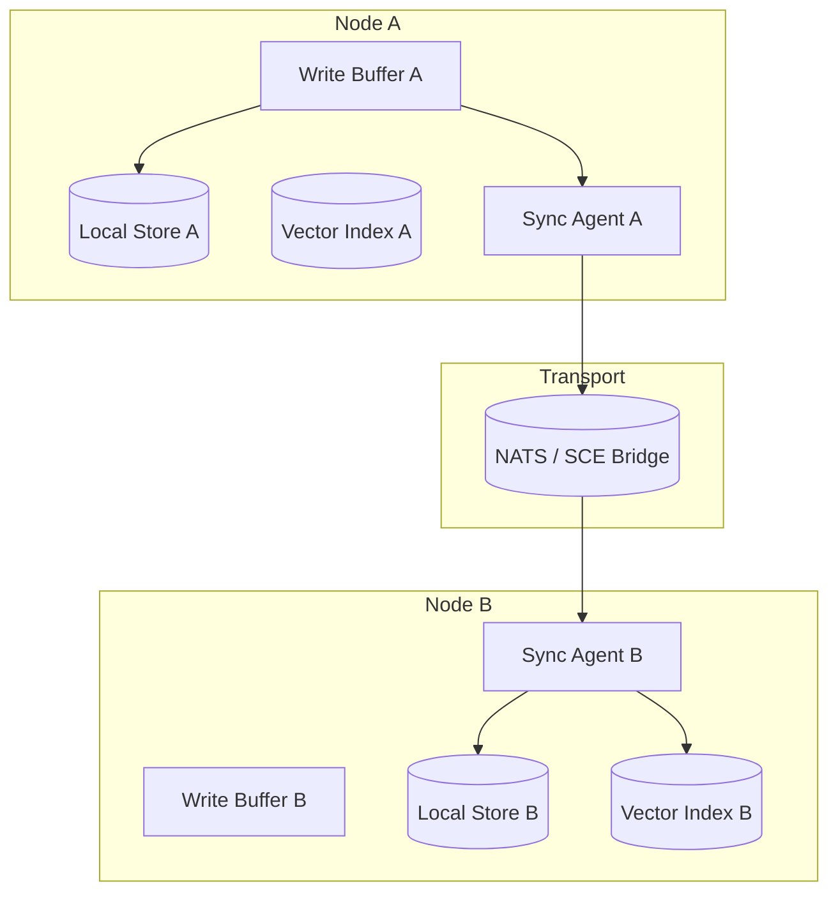

# Memory Synchronization

> Protocol for synchronising Persistent Memory state across processes, workspaces, and deployment topologies — ensuring eventual consistency with conflict resolution for concurrent memory writes. This document is normative — implementations MUST satisfy every MUST clause below.

## Overview

Memory Synchronisation handles the propagation of [Persistent Memory](./PERSISTENT_MEMORY.md) records between:
- **In-process**: between the write buffer and the durable store (SQLite / vector index).
- **Cross-process**: between the Kernel process and plugin subprocesses (via [IPC](./IPC.md)).
- **Cross-node**: between AI Dev OS instances running on different machines in a cluster ([Deployment](./DEPLOYMENT.md) topology 3+).
- **Cross-workspace**: between [Global KB](./knowledge-bases/GLOBAL_KB.md) and workspace-scoped KBs (via sync jobs).

The sync model is **eventual consistency** with **last-writer-wins** for conflicting record updates, except for audit log entries which are append-only and never reconciled.

## Goals

- Memory writes made on any node are visible on all other nodes within `sync_interval_ms` (default 5 s).
- Concurrent writes to the same record use last-writer-wins with timestamp tiebreaking.
- Audit log records are never modified, reconciled, or deleted by sync.
- Sync is transparent to agents: agents always read from their local store (which may lag behind remote writes by up to `sync_interval_ms`).

## Non-Goals

- Strong consistency — memory is eventually consistent by design. Runs pin state at start time via SCE snapshots.
- Cross-cluster sync (multi-region) — out of scope for v1.0.
- Real-time collaborative editing — use [Merge Manager](./MERGE_MANAGER.md) for that.
- Implementation code — this repo is documentation-only ([AI Coding Rules](./AI_CODING_RULES.md)).

## Sync Architecture



## Sync Protocol

### Record Format

Every memory record carries sync metadata:

```json
MemoryRecord {
  id:           ulid
  workspace:    string
  project:      string | null
  group:        string | null
  agent:        string | null
  key:          string
  value:        object
  kind:         string
  retention:    string
  version:      int           # monotonic version counter
  ts:           rfc3339       # last write timestamp
  origin_node:  string        # node ID that wrote this record
  checksum:     sha256        # of serialised record (for corruption detection)
}
```

### Write Path

```python
def write(record: MemoryRecord):
    record.version = current_version + 1
    record.ts = now()
    record.origin_node = NODE_ID
    record.checksum = sha256(serialize(record))

    # 1. Local write
    local_store.upsert(record)
    local_vector_index.upsert(record)

    # 2. Publish to sync bus
    sync_bus.publish("memory.writes", record)

    # 3. Acknowledge
    return record.id
```

### Read Path

```python
def query(text: str, scope: Scope, k: int):
    # Always read from local store
    return local_store.query(text, scope, k)
    # Local store may lag behind remote by up to `sync_interval_ms`
    # Agents deal with this through snapshot semantics at run start
```

### Conflict Resolution

For concurrent writes to the same `(workspace, key)` pair:

1. Compare `version`. Higher version wins.
2. If versions are equal (rare — requires simultaneous writes from two nodes to the same key): compare `ts`. Later timestamp wins.
3. If timestamps are equal (very rare): compare `origin_node` alphabetically.
4. The losing write is **not discarded** — it is recorded as a `sync.conflict` event with its full content, and a periodic reconciliation job can merge or escalate if needed.

### Periodic Reconciliation

A background job runs every `sync_reconciliation_interval` (default 1 hour):

1. For each key with sync conflicts, compare the current state across all known nodes.
2. If all nodes agree → mark conflict resolved.
3. If nodes disagree → apply tiebreaking rules (version → ts → origin_node).
4. Reconciliations are recorded in the [Audit Log](./AUDIT_LOG.md).

## Sync Topologies

| Deployment | Sync Mechanism | Latency | Complexity |
|------------|---------------|---------|------------|
| Single-process (default) | No sync needed | 0 | Minimal |
| Multi-process (IPC) | Direct IPC channel (shared memory or pipe) | < 1 ms | Low |
| Cluster (NATS) | NATS JetStream publish/subscribe | < 10 ms | Medium |
| Cross-workspace (HTTP) | HTTP POST to sync endpoint | < 1 s | Medium |
| Cross-instance (file transfer) | S3 / SFTP export + import | < 1 min | High |

## Configuration

```toml
[AIDEVOS_MEMORY_SYNC]
enabled = false                              # single-process: no sync needed
sync_interval_ms = 5000                      # how often to push/pull
mode = "nats"                               # "nats" | "ipc" | "http" | "file"
nats_url = "nats://localhost:4222"
http_sync_url = "https://remote.aidevos.dev/api/v1/sync"
sync_reconciliation_interval_sec = 3600      # 1 hour
conflict_log_path = "~/.aidevos/sync-conflicts/"
```

## Failure Modes

| Mode | Detection | Response |
|------|-----------|----------|
| Sync bus unavailable | NATS connection refused | Buffer writes locally; retry every `sync_interval_ms`; log WARN |
| Network partition | TCP timeout | Continue operating with local data; queue sync events; reconcile on reconnection |
| Version conflict | Two nodes wrote same key at same version | Apply LWW tiebreak; log conflict; record both versions |
| Checksum mismatch | Record on Node A != record on Node B | Log CRITICAL; overwrite with the record that has higher version; initiate incident |
| Sync storm | > 1000 records changed in one interval | Throttle: batch into 100-record chunks; spread over `sync_interval_ms * 2` |
| Vector index divergence | ANN results differ between nodes | Rebuild index from records on next reconciliation; log WARN |
| Conflict resolution failure | LWW tiebreak produces no clear winner | Escalate to human; preserve both records in conflict log |
| Replication lag exceeds threshold | Last sync timestamp older than 2× `sync_interval_ms` | Log WARN; trigger immediate reconciliation; page if lag > 30 s |
| Network partition (extended) | No sync success for > 5 minutes | Enter degraded mode; queue all writes; alert operator on reconnection |
| Sync message deserialization error | Invalid or corrupted payload on sync bus | Discard message; log ERROR with payload hash; request retransmit from origin |
| Clock skew detected | Node clock differs from cluster average by > 1 s | Log WARN; use version counter as primary tiebreak (not timestamp) |
| Write buffer overflow | Local buffer exceeds configured max (default 10k records) | Flush oldest 10% of buffer; increment overflow counter; log ERROR |

## Performance Budget

| Operation | p99 Target | Notes |
|-----------|------------|-------|
| Local write + sync publish | < 10 ms | Includes local store write |
| Sync receive + apply (1 record) | < 5 ms | Excludes network |
| Sync receive + apply (1000 records) | < 500 ms | Batch applies |
| Reconciliation (10k records, no conflicts) | < 30 s | Background job |
| Cross-node vector rebuild (10k vectors) | < 5 s | Local operation |

## Acceptance Criteria

- Writing a memory record on Node A makes it queryable on Node B within 5 seconds (sync_interval_ms).
- Two nodes writing to the same key simultaneously converge on the same record after reconciliation (LWW resolves).
- An audit log entry written on Node A is never modified by sync on Node B — it is append-only.
- Taking Node B offline for 30 seconds while writes happen on Node A → Node B receives the backlog on reconnection and becomes consistent within `sync_interval_ms`.
- A sync conflict event is generated with `{key, node_a_version, node_b_version, resolved_version}` when concurrent writes clash.

## Related Documents

- [Persistent Memory](./PERSISTENT_MEMORY.md) — the memory store being synchronised
- [Data Retention](./DATA_RETENTION.md) — retention policies applied before sync
- [Deployment](./DEPLOYMENT.md) — cluster topology drives sync configuration
- [IPC](./IPC.md) — in-process sync mechanism for multi-process mode
- [Queueing](./QUEUEING.md) — sync event queue
- [System Overview](./SYSTEM_OVERVIEW.md)
