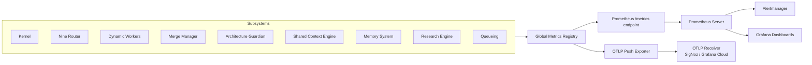

# Metrics

> Production-grade metrics pipeline — Prometheus-format counters, histograms, and gauges emitted by every subsystem, collected in-process, and scraped or pushed at configurable intervals. This document is normative — implementations MUST satisfy every MUST clause below.

## Overview

The Metrics subsystem collects, aggregates, and exports numerical measurements from every component of AI Dev OS. It exposes a Prometheus-format `/metrics` HTTP endpoint for pull-based collection and supports push-based export via OpenTelemetry (OTLP) for environments where Prometheus is not available.

Metrics are categorised into three instrument types: **counters** (monotonically increasing totals), **histograms** (latency distributions), and **gauges** (point-in-time values). Every metric carries labels that identify the subsystem, operation, and outcome so that operators can slice, aggregate, and alert without modifying instrumentation.

## Goals

- Every subsystem exposes at least one counter, one histogram, and one gauge that reflect its health and throughput.
- All metrics use a consistent naming convention: `aidevos_<subsystem>_<name>_<unit?>`.
- Labels are bounded (low-cardinality, < 50 unique values per label) to prevent metric explosion.
- The `/metrics` endpoint responds in < 10 ms (p99) for a registry with up to 5000 time series.
- Push-based export (OTLP) retries with backoff and does not block the caller.

## Non-Goals

- Structured event logs — use [Logging](./LOGGING.md).
- Request-level tracing — use [Tracing](./TRACING.md).
- Application Performance Monitoring dashboards — those are built on top of this subsystem.
- Implementation code — this repo is documentation-only ([AI Coding Rules](./AI_CODING_RULES.md)).

## Metric Naming Convention

```
aidevos_<subsystem>_<name>_<unit>
aidevos_kernel_run_started_total        # counter
aidevos_nine_router_discovery_seconds   # histogram
aidevos_memory_query_duration_ms        # histogram
aidevos_queue_depth                     # gauge
```

Rules:
- Subsystem: one or two words, snake_case (`nine_router`, `memory`, `kernel`, `merge_manager`).
- Name: describes what is measured, snake_case (`run_started`, `discovery`).
- Unit suffix: `_total` for counters, `_seconds` or `_ms` for histograms, no suffix for gauges.
- Prefix: always `aidevos_` to namespace in mixed environments.

## Label Conventions

Labels are **opt-in** — every metric declares its label set at registration. Multi-valued labels (e.g. `{provider, ok}`) MUST have bounded cardinality.

| Label | Values | Used by | Max cardinality |
|-------|--------|---------|-----------------|
| `subsystem` | Subsystem name | all metrics | 30 |
| `ok` | `true`, `false` | operation counters | 2 |
| `provider` | Provider name | nine-router, cost | 20 |
| `role` | Nine role name | nine-router, kernel | 9 |
| `level` | Log level string | logging | 6 |
| `stage` | Kernel loop stage | kernel | 8 |
| `severity` | `critical`, `high`, `warning` | guardian | 3 |
| `kind` | Event kind | SCE, memory | 10 |
| `state` | Run or worker state | kernel, lifecycle | 10 |
| `reason` | Failure reason | all | 20 |

## Registry and Endpoint

Every subsystem registers its metrics on a shared global registry at init time:

```
MetricsRegistry {
  counters:   Map<string, Counter>
  histograms: Map<string, Histogram>
  gauges:     Map<string, Gauge>
}
```

The registry is exposed via:

```
GET /metrics       → text/plain; version=0.0.4 (Prometheus exposition format)
GET /metrics/json  → application/json (for tooling)
```

The Prometheus endpoint is served by the [API Spec](./API_SPEC.md) HTTP server on a configurable port (default `9090` on `localhost` only). In production, a Prometheus instance scrapes this endpoint at the configured interval (default 15s).

## Subsystem Metric Tables

Every subsystem spec in this repo that has a "Metrics" or "Observability" section MUST declare its metrics in the table format below. Here are the tables for all major subsystems:

### Main AI Kernel

| Metric | Type | Labels | Description |
|--------|------|--------|-------------|
| `aidevos_kernel_run_started_total` | counter | — | Total runs submitted |
| `aidevos_kernel_run_stage_seconds` | histogram | `stage` | Duration per kernel stage |
| `aidevos_kernel_run_terminated_total` | counter | `state` | Runs by terminal state |
| `aidevos_kernel_veto_total` | counter | `reason` | Guardian vetoes received |
| `aidevos_kernel_budget_saturation_ratio` | gauge | `budget_type` | Current saturation (0–1) |
| `aidevos_kernel_concurrent_runs` | gauge | — | Active runs at any point |

### Nine Router

| Metric | Type | Labels | Description |
|--------|------|--------|-------------|
| `aidevos_router_discovery_run_total` | counter | `provider`, `ok` | Discovery attempts |
| `aidevos_router_discovery_seconds` | histogram | `provider` | Discovery latency |
| `aidevos_router_models_total` | gauge | `provider`, `status` | Models in cache |
| `aidevos_router_assignment_change_total` | counter | `role`, `scope` | Role reassignments |
| `aidevos_router_fallback_total` | counter | `role`, `reason` | Fallback events |
| `aidevos_router_fallback_exhausted_total` | counter | `role` | Exhausted fallbacks |

### Dynamic Workers

| Metric | Type | Labels | Description |
|--------|------|--------|-------------|
| `aidevos_worker_spawned_total` | counter | `group`, `role` | Workers created |
| `aidevos_worker_crashed_total` | counter | `group`, `reason` | Unexpected worker exits |
| `aidevos_worker_task_duration_seconds` | histogram | `role`, `ok` | Task execution time |
| `aidevos_worker_heartbeat_lag_ms` | gauge | `group` | Milliseconds since last heartbeat |
| `aidevos_worker_pool_size` | gauge | `group`, `state` | Workers per state (active/idle/retired) |

### Architecture Guardian

| Metric | Type | Labels | Description |
|--------|------|--------|-------------|
| `aidevos_guardian_check_total` | counter | `ok` | Verdicts issued |
| `aidevos_guardian_check_seconds` | histogram | — | Evaluation latency |
| `aidevos_guardian_violation_total` | counter | `rule_id`, `severity` | Violations per rule |
| `aidevos_guardian_veto_total` | counter | `reason` | Veto count |
| `aidevos_guardian_rule_count` | gauge | `severity` | Active rule count |
| `aidevos_guardian_auto_fix_total` | counter | `rule_id`, `applied` | Auto-fix attempts |

### SCE / Event Bus

| Metric | Type | Labels | Description |
|--------|------|--------|-------------|
| `aidevos_sce_publish_total` | counter | `topic`, `ok` | Events published |
| `aidevos_sce_publish_seconds` | histogram | `topic` | Publish latency |
| `aidevos_sce_subscriber_count` | gauge | `topic` | Active subscribers |
| `aidevos_sce_topic_depth` | gauge | `topic` | Unconsumed events |
| `aidevos_sce_snapshot_seconds` | histogram | — | Snapshot creation latency |

### Memory / Knowledge System

| Metric | Type | Labels | Description |
|--------|------|--------|-------------|
| `aidevos_memory_write_total` | counter | `tier`, `ok` | Memory records written |
| `aidevos_memory_query_seconds` | histogram | `tier`, `kind` | Query latency |
| `aidevos_memory_records_total` | gauge | `tier` | Stored record count |
| `aidevos_memory_retention_deleted_total` | counter | `tier` | Expired records purged |
| `aidevos_memory_vector_index_size` | gauge | — | ANN index size in vectors |

### Research Engine

| Metric | Type | Labels | Description |
|--------|------|--------|-------------|
| `aidevos_research_job_total` | counter | `source`, `ok` | Research jobs completed |
| `aidevos_research_job_duration_seconds` | histogram | `source` | Job execution time |
| `aidevos_research_sources_crawled` | gauge | `source` | Monitored sources |
| `aidevos_research_freshness_ratio` | gauge | `source` | Age of last crawl / freshness SLA |

### Queueing

| Metric | Type | Labels | Description |
|--------|------|--------|-------------|
| `aidevos_queue_enqueue_total` | counter | `tier`, `ok` | Items enqueued |
| `aidevos_queue_dequeue_total` | counter | `tier`, `ok` | Items consumed |
| `aidevos_queue_depth` | gauge | `tier` | Current queue depth |
| `aidevos_queue_latency_seconds` | histogram | `tier` | Item wait time in queue |
| `aidevos_queue_dead_letter_total` | counter | `tier` | Items sent to DLQ |

### Merge Manager

| Metric | Type | Labels | Description |
|--------|------|--------|-------------|
| `aidevos_merge_total` | counter | `ok` | Merge attempts |
| `aidevos_merge_conflict_total` | counter | `file_type` | Conflicts detected |
| `aidevos_merge_seconds` | histogram | `ok` | Merge duration |
| `aidevos_merge_conflict_unresolved_total` | gauge | — | Escalated to human |

### Auth / Security

| Metric | Type | Labels | Description |
|--------|------|--------|-------------|
| `aidevos_auth_login_total` | counter | `method`, `ok` | Login attempts |
| `aidevos_auth_token_issued_total` | counter | `token_type` | Tokens minted |
| `aidevos_authz_check_total` | counter | `ok` | Authorization checks |
| `aidevos_audit_write_total` | counter | `category` | Audit log entries |
| `aidevos_audit_log_size` | gauge | — | Audit log bytes |

## Architecture



## Alerting Rules (Recommended)

The following alerting rules SHOULD be configured in Prometheus/Alertmanager:

| Alert | Expression | Severity | Description |
|-------|-----------|----------|-------------|
| `KernelRunFailed` | `rate(aidevos_kernel_run_terminated_total{state="failed"}[5m]) > 0.1` | critical | >10% of runs failing |
| `GuardianVetoStorm` | `rate(aidevos_guardian_veto_total[1m]) > 3` | critical | Veto storm in progress |
| `QueueBacklog` | `aidevos_queue_depth{tier="priority"} > 100` | warning | Priority queue growing |
| `WorkerCrashRate` | `rate(aidevos_worker_crashed_total[5m]) > 0.05` | critical | Workers crashing |
| `HighBudgetSaturation` | `aidevos_kernel_budget_saturation_ratio > 0.9` | warning | Near budget limit |
| `DiscoveryFailure` | `rate(aidevos_router_discovery_run_total{ok="false"}[15m]) > 2` | warning | Model discovery failing |
| `MemoryQuerySlow` | `histogram_quantile(0.99, rate(aidevos_memory_query_seconds[5m])) > 1` | warning | P99 query > 1s |
| `SCEPublishSlow` | `histogram_quantile(0.99, rate(aidevos_sce_publish_seconds[5m])) > 0.1` | warning | P99 publish > 100ms |

## Implementation Notes

- Use the `prometheus-client` library for Python, `micrometer` for Java, or the official Prometheus client libraries.
- All metric instruments are registered once at process start. Deregistration is not supported.
- Labels are set at observation time, not registration time.
- Histogram buckets SHOULD use the default Prometheus buckets (`{0.005, 0.01, 0.025, 0.05, 0.1, 0.25, 0.5, 1, 2.5, 5, 10}`) unless subsystem-specific buckets are documented.
- The `/metrics` endpoint MUST NOT require authentication in local mode. In multi-user deployments, it MAY be restricted by the Auth system.

## Failure Modes

| Mode | Detection | Response |
|------|-----------|----------|
| Registry exhaustion | >5000 time series | Log WARN at registration time; continue with best effort |
| OTLP push failure | Connection error | Log once at WARN; retry with exponential backoff (1s, 2s, 4s, 8s, max 60s) |
| `/metrics` scrape timeout | Latency > 10s | Return partial results with `# HELP` comment indicating truncation |
| High-cardinality label injection | Label values > 50 unique | Drop metric observation; log ERROR once per unique label set |
| Disk-backed metrics | N/A | Not supported — metrics are in-memory only. Use [Logging](./LOGGING.md) for durable events |

## Performance Budget

| Operation | p99 Target | Notes |
|-----------|------------|-------|
| Counter increment (no labels) | < 100 ns | lock-free atomic |
| Histogram observe (3 labels) | < 500 ns | pre-allocated bucket slice |
| `/metrics` serialisation (1000 series) | < 2 ms | synchronous, single-shot |
| `/metrics` serialisation (5000 series) | < 10 ms | synchronous, single-shot |

## Security Considerations

- Metrics can reveal system topology, model names, and operational patterns. In multi-tenant deployments, the `/metrics` endpoint SHOULD be restricted to operators.
- Label values are never redacted — do not include secrets or PII in metric labels (enforced by Architecture Guardian rule).
- The OTLP exporter SHOULD use TLS when forwarding to a remote endpoint.
- Metric names and labels are considered public metadata.

## Acceptance Criteria

- Browsing to `http://localhost:9090/metrics` returns valid Prometheus exposition format with at least 50 distinct metric families after a single `aidevos run "hello"`.
- The output format passes `promtool check metrics` without errors.
- A Prometheus server configured to scrape the endpoint shows increasing `aidevos_kernel_run_started_total` after each run.
- Setting a label value to a high-cardinality value (e.g. UUID) results in that observation being silently dropped.
- Stopping the OTLP exporter target does not affect the `/metrics` endpoint or the producer subsystems.

## Related Documents

- [Logging](./LOGGING.md) — structured event logs
- [Tracing](./TRACING.md) — request-scoped spans
- [Observability](./OBSERVABILITY.md) — overall architecture
- [API Spec](./API_SPEC.md) — `/metrics` endpoint specification
- [Deployment](./DEPLOYMENT.md) — Prometheus scrape configuration
- [System Overview](./SYSTEM_OVERVIEW.md)
- [Main AI Kernel](./MAIN_AI_KERNEL.md)
