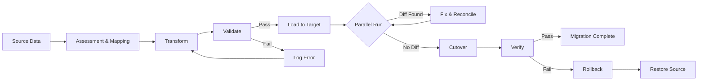

# Migration Guide

> Upgrade paths between AI Dev OS versions — steps for data, prompt, and config migrations.

## Overview

This guide covers migrating between major and minor versions. Breaking changes are documented with migration steps, rationale, and rollback procedures.

## Version Compatibility Policy

AI Dev OS maintains **N-2 backward compatibility**:

- **v1.x** releases are backward-compatible with v1.0 data and config formats.
- **v2.0** supports migration from v1.x (N-1) and v1.0 (N-2).
- Patch releases never introduce breaking changes.
- Minor releases maintain backward compatibility within the same major version.

Always upgrade through intermediate versions if skipping more than two major versions.

## Checking Current Version

```bash
aidevos --version
# v1.0.0 (commit abc1234, built 2025-11-15)

aidevos doctor --verbose | grep "Schema version"
# Schema version: 3
```

## Migration Steps

### From Pre-v1 Snapshots to v1.0

v1.0 introduces SQLite-backed data, structured prompt versioning, and TOML config format.

**Before migrating:**

1. Back up `~/.aidevos/`: `cp -r ~/.aidevos ~/.aidevos.backup.$(date +%Y%m%d)`
2. Note your current version: `aidevos --version`
3. Review the changelog.

**Migration command:**

```bash
aidevos migrate --from=snapshot --to=v1
aidevos doctor
```

### Data Migration (SQLite Schema)

The database at `~/.aidevos/data/aidevos.db` uses versioned schemas. Migrations run automatically on `aidevos init` or `aidevos server start`.

| Schema Version | Changes | Auto-migrate |
|----------------|---------|--------------|
| 1 (pre-v1) | Flat file storage | Manual (`aidevos migrate`) |
| 2 (v1.0.0) | Initial SQLite schema | — |
| 3 (v1.1.0) | Added `vector_store` table | Automatic |

Check schema version: `sqlite3 ~/.aidevos/data/aidevos.db "PRAGMA user_version;"`

### Prompt Migration

```bash
aidevos migrate --check-prompts   # Check versions
aidevos migrate --prompts         # Upgrade to latest format
aidevos migrate --prompts --reset # Re-install defaults (overwrites customizations)
```

Custom prompts are preserved during upgrade unless `--reset` is passed.

### Config Migration

```bash
aidevos migrate --config --dry-run    # Preview changes
aidevos migrate --config              # Apply migration
```

Key field changes in v1.0 from pre-v1:

| Pre-v1 field | v1.0 field | Notes |
|--------------|------------|-------|
| `ollama.endpoint` | `providers.ollama.endpoint` | Moved under provider namespace |
| `default_model` | `router.default_model` | Moved to router section |
| `log_level` | `logging.level` | Moved to logging section |
| `jwt_secret` | `auth.jwt_secret` | Moved to auth section |

## Rollback Procedure

1. **Stop the server**: `aidevos server stop`
2. **Restore the backup**:
   ```bash
   rm -rf ~/.aidevos
   cp -r ~/.aidevos.backup.20251115 ~/.aidevos
   ```
3. **Install the previous binary** (see [Installation](./INSTALLATION.md)).
4. **Verify rollback**: `aidevos doctor`
5. **Downgrade schema** (if needed): `aidevos migrate --rollback --to=<previous_version>`

Rollbacks are supported within N-2 compatibility range. Restore from backup for further rollbacks.

## Migration Workflow Diagram



## Migration Assessment Checklist

- [ ] Source data schema fully documented
- [ ] Target schema defined and reviewed
- [ ] Data mapping specification approved
- [ ] All edge cases identified (nulls, defaults, type coercion)
- [ ] Volume estimate: row count, size, growth rate
- [ ] Migration window agreed with stakeholders
- [ ] Rollback procedure tested in staging
- [ ] Acceptance criteria defined
- [ ] Performance baseline captured
- [ ] Monitoring dashboards prepared

## Data Mapping Specification Template

```yaml
mapping:
  source:
    system: "AI Dev OS pre-v1"
    schema_version: 1
    dialect: "flat-file"
  target:
    system: "AI Dev OS v1.0"
    schema_version: 2
    dialect: "SQLite"
  field_mappings:
    - from: "config.toml/[agent]"
      to: "config.toml/[runtime]"
      transform: "rename"
    - from: "aidevos.db/logs.*"
      to: "aidevos.db/log_entries"
      transform: "INSERT SELECT"
      validation: "row_count_match"
    - from: "prompts/*.prompt"
      to: "prompts/*.prompt"
      transform: "s/\\{\\{/\\{/g"
      validation: "syntax_parse"
```

## Schema Evolution Strategies

| Strategy | Use Case | Impact |
|---|---|---|
| **Additive** | New tables/columns only | Zero downtime; backward-compatible |
| **Migration view** | Rename/restructure without moving data | Read-only backward compat |
| **Copy + swap** | Full table rebuild | Downtime window required |
| **Dual-write** | Active-active during transition | Complex rollback, no downtime |
| **Backfill** | Populate new column from old data | Eventual consistency |

## Parallel Run Methodology

1. **Mirror writes:** Configure target system as a shadow consumer of the same event stream.
2. **Compare output:** Run reconciliation queries every N minutes.
3. **Tolerance threshold:** ≤ 0.01% divergence for P99 reads; zero divergence for writes.
4. **Duration:** Minimum 72 hours of parallel run before cutover.
5. **Exit criteria:** All divergence below threshold for 24 consecutive hours.

```bash
aidevos migrate --parallel-run --duration=72h    # start parallel run
aidevos migrate --compare --since=24h            # check divergence
```

## Cutover Procedure

1. **Announce** maintenance window: `aidevos server notify "Migration cutover starting"`
2. **Drain** active agents: `aidevos agent drain --timeout=5m`
3. **Stop** backend: `aidevos server stop`
4. **Final sync:** Run last incremental migration batch
5. **Verify checksums:** `aidevos migrate --verify --quick`
6. **Swap** connections: Update DNS/config to point to new data store
7. **Start** backend: `aidevos server start`
8. **Smoke test:** `aidevos doctor && echo "hello" | aidevos run --stdin`
9. **Monitor:** Watch dashboards for 15 minutes
10. **Announce** completion

## Rollback Procedure

1. **Stop the server**: `aidevos server stop`
2. **Restore the backup**:
   ```bash
   rm -rf ~/.aidevos
   cp -r ~/.aidevos.backup.20251115 ~/.aidevos
   ```
3. **Install the previous binary** (see [Installation](./INSTALLATION.md)).
4. **Verify rollback**: `aidevos doctor`
5. **Downgrade schema** (if needed): `aidevos migrate --rollback --to=<previous_version>`
6. **Reconcile data lost** during rollback window and manually re-apply if critical.

Rollbacks are supported within N-2 compatibility range. Restore from backup for further rollbacks.

## Performance During Migration

| Phase | CPU | Memory | Disk I/O | Network | Impact |
|---|---|---|---|---|---|
| Assessment | Low | Low | Low | None | None |
| Transform | High | Medium | High | Low | Agent latency may increase |
| Validate | Medium | High | Medium | Low | Query performance degraded |
| Load | Medium | High | Very High | Low | DB writes contend with reads |
| Parallel run | Low | Medium | Low | Medium | Negligible |
| Cutover | Low | Low | Low | Low | Brief downtime |

## Migration Testing Approach

| Test Type | Scope | Cadence | Pass Criteria |
|---|---|---|---|
| **Dry run** | Validate mapping + transform; no writes | Every schema change | Zero mapping errors |
| **Test migration** | Full migration on staging dataset | Per release | All checksums match |
| **Full migration** | Production migration with business sign-off | Per production upgrade | All acceptance criteria met |

```bash
aidevos migrate --dry-run              # preview without writes
aidevos migrate --test --dataset=5pct  # test on 5% sample
aidevos migrate --full                 # production migration
```

## Common Migration Patterns

| Pattern | Description | When to Use |
|---|---|---|
| **Bulk load** | Export → transform → import in batches | Large datasets (> 1 GB) |
| **Streaming** | Read source row-by-row, transform, write | Continuous sync, low latency |
| **Snapshot** | Point-in-time copy of entire dataset | Schema overhaul |
| **Change Data Capture** | Subscribe to source change log, replay to target | Zero-downtime, incremental |
| **Hybrid** | Bulk initial load + CDC for delta | Large dataset + zero downtime |

## Failure Modes

| Failure Mode | Description | Indicators | Mitigation | Recovery |
|---|---|---|---|---|
| **Source data corruption** | Source has inconsistent data discovered mid-migration | Validation fails; row count mismatch | Pre-migration data quality scan | Abort migration; restore source from backup |
| **Transform memory exhaustion** | Transform step runs out of memory for large records | OOM kill; swap usage spike | Stream results; chunk large records | Increase memory limit; re-run with smaller batch |
| **Target schema drift** | Target changed between test and production runs | Constraint violations on INSERT | Lock schema during migration window | Re-run mapping generation; re-test |
| **Network partition** | Connection lost mid-migration | Timeout errors; incomplete batch | Retry logic with exponential backoff | Resume from last checkpoint |
| **Rollback data loss** | Data written to target cannot be recovered on rollback | Rollback leaves orphan records | Write rollback manifest before any write | Manual reconciliation from audit log |
| **Time budget exceeded** | Migration exceeds maintenance window | Progress stalled; time limit approaching | Split into smaller batches | Rollback; re-schedule with larger window |

## Migration Observability Metrics

| Metric | Source | Alert Threshold | Description |
|---|---|---|---|
| `migrate.rows.processed` | Migration script | Rate drops > 50% | Rows/sec processed |
| `migrate.errors.count` | Error log | > 0 errors | Total migration errors |
| `migrate.validation.diff_pct` | Verify step | > 0.01% | Data divergence between source and target |
| `migrate.duration_seconds` | Timer | > 1.5x estimate | Total migration duration |
| `migrate.rollback.triggered` | Rollback hook | > 0 | Rollback was initiated |
| `migrate.batch.retries` | Retry counter | > 3 per batch | Batch-level retries |

## Migration Acceptance Criteria

- [ ] Dry run completed with zero errors
- [ ] Test migration on staging finishes within estimated time
- [ ] Source and target checksums match for 100% of records
- [ ] All field mappings verified by spot-check (100 random records)
- [ ] Rollback tested and verified in staging
- [ ] Performance regression < 5% on critical paths
- [ ] Parallel run shows zero divergence for 24+ hours
- [ ] Stakeholder sign-off obtained on cutover plan
- [ ] Monitoring dashboards show all systems green
- [ ] Post-migration `aidevos doctor` passes

---

## Related Documents

- [Versioning](./VERSIONING.md) — versioning scheme and semantics
- [Release Process](./RELEASE_PROCESS.md) — how releases are cut and published
- [Upgrade Notes](./UPGRADE_NOTES.md) — per-version upgrade notes
- [Changelog](./CHANGELOG.md) — full release history
- [Database](./DATABASE.md) — SQLite schema reference
- [Configuration](./CONFIGURATION.md) — config file format reference
