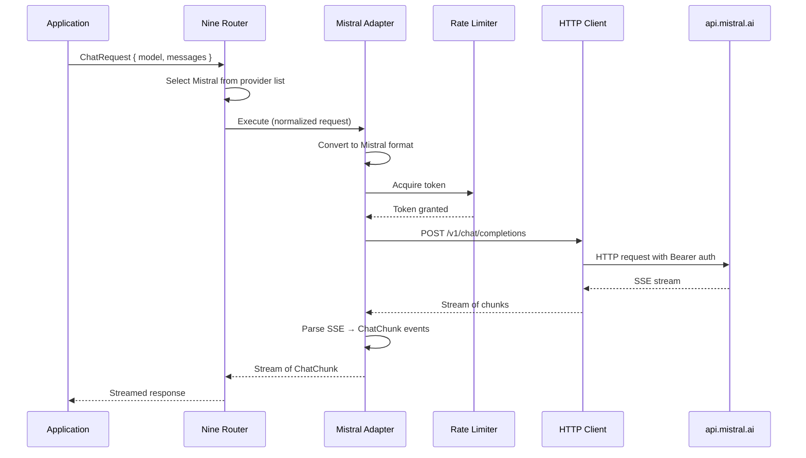

# Mistral Integration

> Mistral provider configuration for Nine Router. All model access flows through Nine Router at `http://localhost:20128/v1`. See [Nine Router Integration](./NINE_ROUTER_INTEGRATION.md).

## Overview

This document describes how to register and configure Mistral AI as a provider within the [Nine Router](./NINE_ROUTER.md) provider registry. Once configured, AI Dev OS accesses Mistral models through Nine Router — never directly.

The Mistral adapter inside Nine Router connects to Mistral's OpenAI-compatible API. Mistral uses the same `/v1/chat/completions` endpoint and SSE streaming as OpenAI. The adapter supports chat completions, embeddings, function calling, and JSON mode.

## Endpoint Configuration

```
base_url: https://api.mistral.ai/v1
auth:     Authorization: Bearer ${MISTRAL_API_KEY}   # Managed in Nine Router Secrets
```

```yaml
providers:
  mistral:
    api_key: ${MISTRAL_API_KEY}     # resolved via Secrets Management
    base_url: https://api.mistral.ai/v1
```

API keys are provisioned from the [Mistral AI Platform](https://console.mistral.ai/).

## Models

| Model ID | Context | Max output | Pricing (input / output per MTok) | Capabilities |
|----------|---------|-----------|-----------------------------------|--------------|
| `mistral-large-2503` | 128K | 4,096 | $2.00 / $6.00 | Text, function calling, JSON mode |
| `mistral-small-2503` | 32K | 4,096 | $0.10 / $0.30 | Text, function calling, JSON mode |
| `codestral-2505` | 256K | 8,192 | $0.30 / $0.90 | Code gen, FIM, function calling |
| `ministral-3b-2503` | 32K | 4,096 | $0.04 / $0.04 | Lightweight edge inference |

Free-tier models (`open-mistral-7b`, `open-mixtral-8x7b`) are available for experimentation.

## Chat Completions

Request format follows OpenAI's schema:

```
POST /v1/chat/completions
{ "model": "mistral-large-2503", "messages": [...], "stream": true }
```

SSE events follow OpenAI conventions:

```
data: {"choices":[{"index":0,"delta":{"content":"Here"},"finish_reason":null}]}
data: {"choices":[{"index":0,"delta":{"content":" is"},"finish_reason":null}]}
data: [DONE]
```

The adapter **MUST** parse `data:` lines, extract `choices[0].delta.content`, and emit `ChatChunk { type: "token", delta }` per content chunk. On `finish_reason`, emit `ChatChunk { type: "finish" }`. Mistral does not include usage in streamed chunks — estimate via token counting.

## Embeddings API

```
POST /v1/embeddings
{ "model": "mistral-embed", "input": ["Text to embed"] }
```

Response: `{ data: [{ index, embedding: float[] }] }`. Supports batched input (up to 32). Produces 1024-dimensional embeddings.

## Function Calling

Mistral supports the OpenAI function calling schema:

```json
{
  "tools": [{
    "type": "function",
    "function": { "name": "get_weather", "parameters": { ... } }
  }],
  "tool_choice": "auto"
}
```

Tool calls appear in `choices[0].delta.tool_calls`. The adapter **MUST** accumulate by `index` and emit complete `ChatChunk { type: "tool_call" }` only on `finish_reason: "tool_calls"`.

## JSON Mode

Set `response_format: { type: "json_object" }` to constrain output to valid JSON. The adapter **MUST** validate JSON parseability after `[DONE]`.

## Rate Limits

| Tier | Requests/min | Tokens/min |
|------|-------------|------------|
| Free | 30 | 500,000 |
| Pro | 500 | 2,000,000 |
| Business | 2,000 | 10,000,000 |

Parse `x-ratelimit-remaining-*` headers. Mistral returns `Retry-After` in seconds on 429.

## Error Codes

| HTTP | Code | Adapter action |
|------|------|----------------|
| 400 | `bad_request` | Surface validation error |
| 401 | `unauthorized` | Mark `auth_error` |
| 403 | `forbidden` | Mark `auth_error` |
| 404 | `not_found` | Trigger re-discovery |
| 429 | `too_many_requests` | Backoff; mark `rate_limited` |
| 429 | `quota_exceeded` | Mark `quota_exceeded`; billing alert |
| 5xx | Server error | Retry × 3; mark `degraded` |

## Adapter Flow



## Streaming Handling Pseudocode

```
async function streamChat(request):
    response = await httpClient.post(
        "${base_url}/v1/chat/completions",
        headers = { "Authorization": "Bearer ${api_key}" },
        body = { **request, stream: true }
    )
    buffer = ""
    for await chunk in response.body:
        buffer += chunk.toString()
        lines = buffer.split("\n")
        buffer = lines.pop()  // keep incomplete line
        for line in lines:
            if line.startsWith("data: "):
                data = line.slice(6).trim()
                if data == "[DONE]":
                    emit({ type: "finish" })
                else:
                    json = JSON.parse(data)
                    delta = json.choices[0].delta
                    if delta.content:
                        emit({ type: "token", delta: delta.content })
                    if delta.tool_calls:
                        toolAccumulator.add(delta.tool_calls)
                    if json.usage:
                        emit({ type: "usage", usage: json.usage })
    // flush remaining tool calls
    if toolAccumulator.hasPending():
        emit({ type: "tool_call", calls: toolAccumulator.finalize() })
```

## Function Calling Accumulation Algorithm

Mistral streams tool calls incrementally across multiple SSE chunks. The adapter MUST accumulate by `tool_call_index`:

```
accumulator = Map<index, ToolCallAccumulator>()

onDelta(delta):
    for tc in delta.tool_calls:
        index = tc.index
        if index not in accumulator:
            accumulator[index] = {
                id: tc.id,
                type: tc.type,
                function: { name: "", arguments: "" }
            }
        if tc.function.name:
            accumulator[index].function.name += tc.function.name
        if tc.function.arguments:
            accumulator[index].function.arguments += tc.function.arguments

onFinish():
    result = []
    for acc in accumulator.values():
        acc.function.arguments = JSON.parse(acc.function.arguments)
        result.push(acc)
    emit({ type: "tool_call", calls: result })
```

## Embeddings Batch Handling

```
async function embed(inputs):
    batches = chunk(inputs, 32)  // Mistral max batch = 32
    results = []
    for batch in batches:
        response = await httpClient.post(
            "${base_url}/v1/embeddings",
            body = { model: "mistral-embed", input: batch }
        )
        for item in response.data:
            results[item.index] = item.embedding
    return results
```

Error handling per batch: if a single batch fails, retry that batch (max 2 retries). If all retries fail, the entire embedding request fails with partial results discarded.

## Error Classification with Recovery Actions

| Category | HTTP/Error Code | Detection | Recovery Action |
|----------|----------------|-----------|-----------------|
| Validation | 400 / `bad_request` | Response body | Surface error to caller; do not retry |
| Auth failure | 401 / `unauthorized` | Response status | Mark `auth_error`; trigger Secrets re-resolution |
| Auth failure | 403 / `forbidden` | Response status | Mark `auth_error`; check key scope; alert operator |
| Model gone | 404 / `not_found` | Response status | Trigger Model Discovery re-scan; route to fallback |
| Rate limited | 429 / `too_many_requests` | Response status + headers | Backoff (see algorithm below); degrade gracefully |
| Quota exceeded | 429 / `quota_exceeded` | Response body | Mark `quota_exceeded`; route to fallback; billing alert |
| Server error | 5xx | Response status | Retry × 3 with backoff; mark `degraded` |
| Network error | — | Connection timeout/DNS failure | Retry × 2; mark `unreachable`; fallback |
| Stream error | — | SSE parse failure | Restart stream from last known offset; max 2 restarts |

## Rate Limit Handling with Backoff Algorithm

```
async function rateLimitedCall(request):
    retries = 0
    maxRetries = 3
    baseDelay = 1  // seconds
    while retries <= maxRetries:
        response = await httpClient.call(request)
        if response.status != 429:
            return response
        retryAfter = parseRetryAfter(response.headers)
        delay = retryAfter ?? min(baseDelay * (2 ** retries), 30)
        await sleep(delay * 1000)
        retries++
    escalate("Rate limit exceeded after ${maxRetries} retries")
```

Track `x-ratelimit-remaining-*` headers to preemptively slow down before hitting the limit. When remaining requests drop below 10 % of the limit, increase the minimum delay between calls.

## Connection Pooling

The HTTP client maintains a connection pool per Mistral endpoint:

```
mistral_pool = {
    max_connections: 16,
    max_pending: 64,
    idle_timeout: 30_000,     // ms
    connection_ttl: 300_000,  // ms
    retry_on_status: [429, 502, 503, 504]
}
```

Pool health is monitored: if > 50 % of connections in the pool are in error state, the adapter triggers a full pool drain and re-creation.

## SDK vs REST Comparison

| Aspect | Mistral SDK (`mistralai`) | REST API (this adapter) |
|--------|--------------------------|------------------------|
| Streaming | Native async generator | SSE parsing required |
| Auth | Auto from env var | Manual Bearer header |
| Retry | Built-in | Custom implementation |
| Rate limiting | Not built-in | Custom implementation |
| Embeddings | Native batch | Manual batching |
| Function calling | Auto-accumulates | Manual accumulation |
| JSON mode | Helper method | response_format parameter |
| Error types | Typed exceptions | HTTP status + body parsing |
| Dependencies | External package | None (stdlib HTTP) |

**Decision**: The REST API is preferred because it avoids external SDK dependencies, gives full control over the middleware stack, and integrates seamlessly with the existing HTTP client infrastructure.

## Failure Modes

| Mode | Detection | Response |
|------|-----------|----------|
| Model unavailable | HTTP 404 / `not_found` | Trigger re-discovery; route to fallback provider |
| Embedding timeout | No response within 30 s | Retry batch once; if fails, return partial results |
| Auth key rotation | HTTP 401 after previously working | Alert operator; trigger Secrets re-resolution |
| Rate limit spike | Multiple 429 in quick succession | Circuit-break for 60 s; alert if > 50 % requests rate-limited |
| Stream mid-cut | SSE connection drops mid-response | Resume from last buffered chunk; fail if cannot resume |
| JSON parse failure | `[DONE]` followed by invalid JSON | Surface partial content; log error |
| Batch partial failure | 2 of 32 embeddings fail | Retry failed indices; return combined result |

## Observability Metrics

| Metric | Type | Labels | Description |
|--------|------|--------|-------------|
| `mistral_call_total` | Counter | `{endpoint, model, ok}` | Total API calls |
| `mistral_call_seconds` | Histogram | `{endpoint, model}` | Request duration |
| `mistral_stream_duration_seconds` | Histogram | `{model}` | End-to-end stream duration |
| `mistral_embedding_tokens_total` | Counter | `{model}` | Tokens processed via embeddings |
| `mistral_rate_limit_remaining` | Gauge | `{tier}` | Remaining requests in window |
| `mistral_errors_total` | Counter | `{category}` | Errors by category |
| `mistral_retry_attempts_total` | Counter | `{endpoint}` | Retry attempts |
| `mistral_pool_connections_active` | Gauge | — | Active connections in pool |
| `mistral_cost_usd_total` | Counter | `{model}` | Accumulated cost |

## Acceptance Criteria

- A chat completion request returns a stream of `ChatChunk` tokens ending with a `finish` chunk.
- A streaming request interrupted mid-stream resumes from the last buffered token.
- Function calling accumulates correctly across multiple SSE chunks and emits complete tool calls.
- An embeddings request with 50 inputs is batched into two calls and returns 50 embeddings.
- A 429 response with `Retry-After` delays the retry by the specified duration.
- A 404 response triggers model re-discovery and routes to a fallback provider.
- All calls produce metrics counters and histogram observations.
- A 401 response immediately marks the auth as failed without retry.

## Related Documents

- [Model Providers](./MODEL_PROVIDERS.md)
- [Nine Router](./NINE_ROUTER.md)
- [Cost Management](./COST_MANAGEMENT.md)
- [Model Discovery](./MODEL_DISCOVERY.md)
- [Secrets Management](./SECRETS_MANAGEMENT.md)
- [Streaming Responses](./STREAMING_RESPONSES.md)
- [Tool Calling](./TOOL_CALLING.md)
- [Local Models](./LOCAL_MODELS.md)
