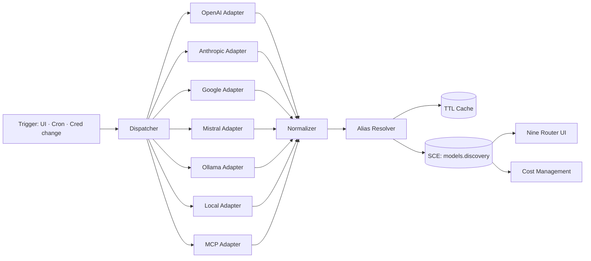

# Model Discovery

> Model discovery through the Nine Router API. AI Dev OS calls `GET /v1/models` on Nine Router (`http://localhost:20128/v1/models`). Nine Router handles provider-specific discovery internally.

## Overview

Model Discovery is how the AI Dev OS learns what models are available. The AI Dev OS Kernel calls `GET http://localhost:20128/v1/models` on [Nine Router](./NINE_ROUTER.md). Nine Router returns an OpenAI-compatible model list with provider-prefixed model IDs (e.g. `ollama/llama3.1:8b`, `kr/claude-sonnet-4.5`, `openai/gpt-4o`).

Users never hand-type model IDs; they see a live, filterable, provider-grouped catalog in the Nine Router dashboard at `http://localhost:20128/dashboard`. Discovery runs automatically and on demand.

## Goals

- Provide a single `GET /v1/models` endpoint that returns all models across all configured providers.
- Return provider-prefixed model IDs in OpenAI-compatible format for tool compatibility.
- Group results by provider in a stable order: Local → OpenAI → Anthropic → Google → OpenRouter → MCP → User-registered.
- Deduplicate aliases with a canonical id and an `aliases[]` list.
- Degrade per provider: one provider failing MUST NOT block discovery for others.

## Non-Goals

- Provider-specific discovery — handled internally by Nine Router.
- Model performance benchmarking — belongs in [Benchmarks](./BENCHMARKS.md).
- Cost accounting — belongs in [Cost Management](./COST_MANAGEMENT.md).
- Fallback/routing decisions — belong in [Model Routing Policy](./MODEL_ROUTING_POLICY.md).

## Requirements

- **MUST** expose a `GET /v1/models` endpoint that returns an OpenAI-compatible model list.
- **MUST** return provider-prefixed model IDs in the format `{provider_alias}/{model_name}` (e.g. `ollama/llama3.2:3b`, `openai/gpt-4o`, `kr/claude-sonnet-4.5`).
- **MUST** cache the last successful response per provider with a configurable TTL (default `10m`).
- **MUST** normalize every entry into the [canonical schema](#canonical-schema).
- **MUST** publish a `DiscoveryReport` event on `models.discovery` after every run.
- **MUST** never store provider credentials — pull from [Secrets Management](./SECRETS_MANAGEMENT.md) at call time.
- **SHOULD** support pluggable providers via the [Plugin SDK](./PLUGIN_SDK.md).
- **MAY** enrich entries with community metadata (context window, deprecation) when the provider omits it.

## Architecture



## Interfaces

```
discover(provider_id) → Model[]
refresh_all(force?: bool) → DiscoveryReport
list(filter?: ModelFilter) → Model[]        // reads cache; never hits providers
get(model_id) → Model
subscribe() → AsyncIterator<DiscoveryReport>
```

Errors follow [API Spec](./API_SPEC.md).

## Canonical Schema

```
Model {
  id:             string     # canonical: "openai/gpt-4o"
  provider:       "openai"|"anthropic"|"google"|"mistral"|"ollama"|"local"|"mcp"|string
  provider_model_id: string  # raw id returned by the provider
  aliases:        string[]   # e.g. ["gpt-4o-2024-08-06", "gpt-4o-latest"]
  display_name:   string
  family:         string?    # "gpt-4o", "claude-3.5", "gemini-1.5"
  context_window: number?    # tokens
  max_output_tokens: number?
  modalities:     ("text"|"image"|"audio"|"video")[]
  capabilities:   ("tools"|"vision"|"json_mode"|"streaming"|"embeddings"|"fine_tune")[]
  pricing: {                 # per 1M tokens, provider-advertised, USD
    input?: number
    output?: number
    cached_input?: number
  } | null
  deprecated:     boolean
  deprecation_date: rfc3339?
  status:         "available"|"limited"|"preview"|"retired"
  discovered_at:  rfc3339
  source:         "api"|"catalog"|"filesystem"|"mcp"|"user"
}

DiscoveryReport {
  ts:        rfc3339
  providers: { id, ok, duration_ms, count, error? }[]
  added:     Model[]
  removed:   { id, reason }[]
  changed:   { id, before, after }[]
  errors:    { provider, code, message }[]
}
```

### Grouping & sort order in the UI

The Nine Router UI MUST render providers in this order and MUST NOT hide a provider that returned an error — it renders empty with an error badge and a Retry action:

1. **Local** (Ollama, llama.cpp, MLX)  — because AI Dev OS is local-first
2. **OpenAI**
3. **Anthropic**
4. **Google**
5. **Mistral**
6. **MCP-exposed catalogs**
7. **User-registered** providers

Within a provider, sort by `family`, then `deprecated asc`, then `display_name`.

## Failure Modes

| Mode                        | Response                                                                 |
| --------------------------- | ------------------------------------------------------------------------ |
| HTTP 429 / rate limit       | Exponential backoff with full jitter; surface `provider.rate_limited`    |
| HTTP 5xx                    | Retry twice; on final failure keep last-known-good cache; badge Provider as degraded |
| Malformed response          | Skip provider for this cycle; publish `provider.error`; alert            |
| Auth failure                | Do not retry; surface a clear "Reconnect provider" action in UI          |
| Local endpoint unreachable  | Mark local provider "offline"; do not error the whole refresh            |
| Timeout (default 10s)       | Abort adapter; keep others; report timeout in `DiscoveryReport.errors`   |

## Security

- Credentials are read from [Secrets Management](./SECRETS_MANAGEMENT.md) per call; never logged, never persisted with the cache.
- Discovery responses may include experimental/preview model names — treat as public.
- All external calls go through the Kernel-proxied HTTP client so they show up in the [Audit Log](./AUDIT_LOG.md).

## Observability

- Metrics: `discovery_run_total{provider,ok}`, `discovery_duration_seconds{provider}`, `discovery_models_total{provider,status}`, `discovery_delta_total{kind=added|removed|changed}`.
- Traces: one span per adapter call; parent span per `refresh_all`.

## Acceptance Criteria

- Fresh install with only Ollama running yields a non-empty catalog with a single group.
- Revoking the OpenAI key surfaces a clear reconnect action and leaves other providers intact.
- A retired provider model appears in the next `DiscoveryReport.removed` within one refresh cycle.
- Adding a user-registered OpenAI-compatible endpoint (base URL + key) makes its models appear under **User-registered** without a code change.

## Related Documents

- [Nine Router](./NINE_ROUTER.md) · [Model Providers](./MODEL_PROVIDERS.md) · [Model Routing Policy](./MODEL_ROUTING_POLICY.md) · [Cost Management](./COST_MANAGEMENT.md) · [Secrets Management](./SECRETS_MANAGEMENT.md) · [Plugin SDK](./PLUGIN_SDK.md) · [diagrams/NINE_ROUTER_FLOW](../diagrams/NINE_ROUTER_FLOW.md)
