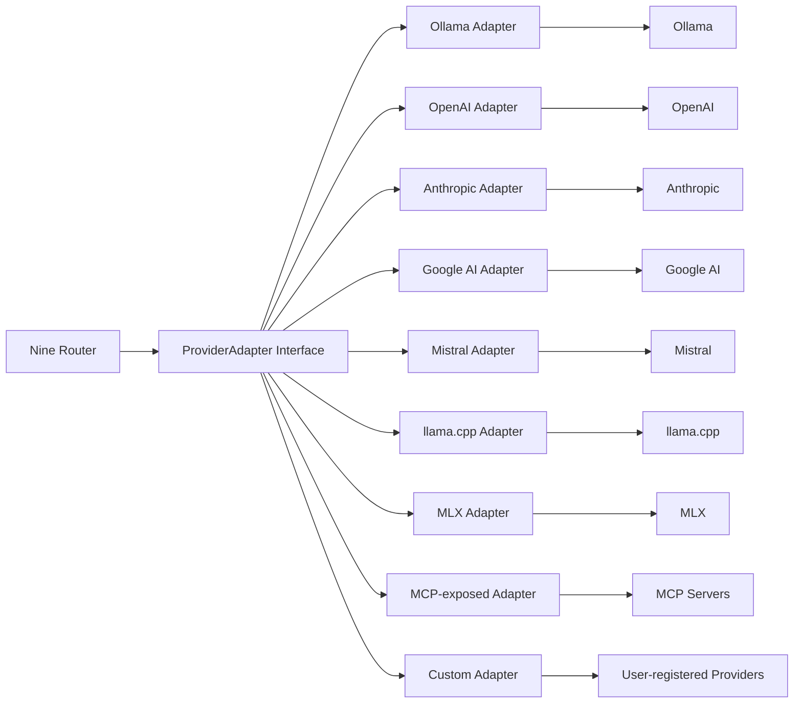

# Model Providers

> Internal Nine Router adapter specification. These adapters live inside Nine Router — the AI Dev OS Kernel never interacts with providers directly. See [Nine Router Integration](./NINE_ROUTER_INTEGRATION.md) for the integration point.

## Overview

Model Providers documents the internal adapter layer of [Nine Router](./NINE_ROUTER.md) — the component that translates Nine Router's unified API calls into provider-specific requests. Every provider — whether local (Ollama, LM Studio, llama.cpp, vLLM, MLX) or cloud (OpenAI, Anthropic, Google, Mistral) — is accessed through a standard `ProviderAdapter` interface. This ensures that Nine Router can add or remove providers without changing the AI Dev OS Kernel.

A provider adapter is responsible for:
1. **Discovery**: calling the provider's models endpoint and returning normalized `Model[]` to Nine Router's cache.
2. **Inference**: streaming chat completions (and optionally embeddings) through a consistent interface.
3. **Health tracking**: detecting rate-limits, auth errors, and transient failures and publishing status to Nine Router's dashboard.

Provider adapters may also be contributed by third-party plugins (see [Plugin SDK](./PLUGIN_SDK.md)). All credential management happens within Nine Router's Secrets Management — the AI Dev OS Kernel never sees or handles provider API keys.

## Architecture



## Goals

- One adapter per provider: no cross-provider logic leakage.
- Uniform `ProviderAdapter` interface regardless of provider's native API shape.
- Config via [Secrets Management](./SECRETS_MANAGEMENT.md) only — never environment variables.
- Graceful degradation: a failed provider is marked degraded; the Nine Router uses fallbacks.

## Non-Goals

- Implementation code — this repository is documentation-only (see [AI Coding Rules](./AI_CODING_RULES.md)).
- Vendor-specific fine-tuning pipelines — see [Local Models](./LOCAL_MODELS.md).
- Provider billing management — see [Cost Management](./COST_MANAGEMENT.md).

## ProviderAdapter Interface

```typescript
interface ProviderAdapter {
  readonly id:   string          // e.g. "openai", "anthropic", "ollama"
  readonly name: string          // display name
  readonly base_url: string

  // Discovery
  models(): Promise<Model[]>

  // Inference
  chat(req: ChatRequest): AsyncIterator<ChatChunk>
  embed?(req: EmbedRequest): Promise<float32[][]>   // optional

  // Health
  health(): Promise<ProviderHealth>
}

interface ChatRequest {
  model:       string         // provider-native model ID
  messages:    Message[]
  tools?:      Tool[]
  tool_choice?: "auto" | "none" | { type: "function", function: { name: string } }
  max_tokens?: number
  temperature?: number
  stream:      true           // always streaming
  correlation_id: string
}

interface ChatChunk {
  type:         "token" | "tool_call" | "tool_result" | "finish" | "error"
  delta?:       string
  tool_call?:   { id, name, arguments: string }
  finish_reason?: "stop" | "tool_calls" | "length" | "content_filter"
  usage?:       { prompt_tokens, completion_tokens, total_tokens }
}
```

## Provider Reference Table

| Provider | Adapter ID | Auth mechanism | Models endpoint | Chat endpoint | Embed endpoint |
|----------|-----------|----------------|----------------|--------------|----------------|
| Ollama | `ollama` | None (local) | `GET /api/tags` | `POST /api/chat` | `POST /api/embeddings` |
| llama.cpp | `llamacpp` | Optional bearer | `GET /v1/models` | `POST /v1/chat/completions` | `POST /v1/embeddings` |
| MLX (Apple Silicon) | `mlx` | None (local) | Filesystem scan | `POST /v1/chat/completions` | N/A |
| OpenAI | `openai` | Bearer `OPENAI_API_KEY` | `GET /v1/models` | `POST /v1/chat/completions` | `POST /v1/embeddings` |
| Anthropic | `anthropic` | `x-api-key: ANTHROPIC_API_KEY` | `GET /v1/models` | `POST /v1/messages` | N/A |
| Google AI | `google` | Bearer `GOOGLE_API_KEY` | `GET /v1beta/models` | `POST /v1beta/models/{model}:streamGenerateContent` | `POST /v1beta/models/{model}:embedContent` |
| Mistral | `mistral` | Bearer `MISTRAL_API_KEY` | `GET /v1/models` | `POST /v1/chat/completions` | `POST /v1/embeddings` |
| MCP-exposed | `mcp` | Per-server auth | `tools/list` (MCP) | `tools/call` (MCP) | N/A |
| User-registered | `custom` | Bearer or API-key | Declared in manifest | Declared in manifest | Optional |

## Ollama Adapter

Local inference with zero API key requirement.

```
base_url: http://127.0.0.1:11434  (configurable)

# Discovery
GET /api/tags → { models: [{ name, model, size, digest, details }] }
Normalize: id = "ollama/<name>", provider = "ollama", family = details.family

# Chat
POST /api/chat {
  model, messages, stream: true,
  tools?,              # supported in Ollama 0.2+
  options: { num_ctx, temperature, seed }
}
← NDJSON stream of { model, message: { role, content }, done }

# Embeddings
POST /api/embeddings { model, prompt }
← { embedding: float[] }
```

### Ollama health check
```
GET /api/version → { version: string }   # 200 = healthy; connection refused = offline
```

## OpenAI Adapter

```
base_url: https://api.openai.com   (configurable for Azure / proxy)
auth: Authorization: Bearer ${OPENAI_API_KEY}   # Managed in Nine Router Secrets

# Discovery
GET /v1/models → { data: [{ id, object, created, owned_by }] }
Filter: id not in deprecated list

# Chat (streaming)
POST /v1/chat/completions {
  model, messages, stream: true, tools?, tool_choice?,
  max_tokens?, temperature?, response_format?
}
← SSE stream of data: { choices: [{ delta, finish_reason }] }

# Embeddings
POST /v1/embeddings { model, input: string | string[] }
← { data: [{ embedding: float[], index }] }
```

### OpenAI error handling

| HTTP | Code | Adapter action |
|------|------|----------------|
| 401 | `invalid_api_key` | Mark `auth_error`; surface as config error; do not retry |
| 429 | `rate_limit_exceeded` | Parse `Retry-After`; backoff; mark `rate_limited` |
| 429 | `insufficient_quota` | Mark `quota_exceeded`; surface as billing alert |
| 5xx | Any | Retry with exponential backoff; mark `degraded` after 3 failures |
| 400 | `context_length_exceeded` | Surface `CONTEXT_TOO_LONG`; Kernel compresses context |

## Anthropic Adapter

```
base_url: https://api.anthropic.com
auth: x-api-key: ${ANTHROPIC_API_KEY}           # Managed in Nine Router Secrets
      anthropic-version: 2023-06-01

# Discovery
GET /v1/models → { data: [{ id, display_name, created_at }] }

# Chat (streaming)
POST /v1/messages {
  model, max_tokens, messages, stream: true, tools?
}
← SSE stream of events:
  message_start, content_block_start, content_block_delta,
  content_block_stop, message_delta, message_stop

# Adapter normalises Anthropic SSE events → standard ChatChunk interface
```

### Anthropic message format adapter

Anthropic uses `{ role, content }` where `content` can be an array of content blocks. The adapter normalises these to the flat `messages: [{ role, content: string }]` format used by the ChatRequest interface.

Tool use: Anthropic uses `tool_use` content blocks; the adapter maps these to `ChatChunk.tool_call`.

## Google AI Adapter

```
base_url: https://generativelanguage.googleapis.com
auth: ?key=${GOOGLE_API_KEY}  OR  Authorization: Bearer ${access_token}   # Managed in Nine Router Secrets

# Discovery
GET /v1beta/models → { models: [{ name, displayName, supportedGenerationMethods }] }
Filter: "generateContent" ∈ supportedGenerationMethods

# Chat (streaming)
POST /v1beta/models/{model}:streamGenerateContent {
  contents: [{ role, parts: [{ text }] }],
  tools?, generationConfig?
}
← NDJSON of { candidates: [{ content, finishReason }] }

# Embeddings
POST /v1beta/models/{model}:embedContent { content: { parts: [{ text }] } }
← { embedding: { values: float[] } }
```

## Requirements

- **MUST** normalize every provider's raw model schema to the canonical `Model` schema defined in [Model Discovery](./MODEL_DISCOVERY.md).
- **MUST** use streaming for all inference calls (`stream: true`); batch-response inference is not supported.
- **MUST** propagate `correlation_id` as a request header (`X-Correlation-Id`) or query parameter where the provider supports it.
- **MUST** handle 401 as a non-retryable auth error and surface a clear configuration message.
- **MUST** respect `Retry-After` headers on 429 responses.
- **MUST** read all credentials from [Secrets Management](./SECRETS_MANAGEMENT.md); never from `process.env` in production.
- **MUST** publish health state transitions (healthy/degraded/auth_error/rate_limited/offline) on the SCE `models.discovery` topic.
- **SHOULD** maintain a per-provider error-rate window of 60 s to trigger `degraded` state.
- **MAY** support an Azure OpenAI endpoint via `openai.base_url` override.
- **MAY** support a custom base URL for any adapter (useful for proxies and private deployments).

## Failure Modes

| Mode | Detection | Response |
|------|-----------|----------|
| No credentials configured | Missing secret key | Mark `offline` on startup; surface config guidance |
| Auth failure | HTTP 401/403 | Mark `auth_error`; do not retry; alert operator |
| Rate limited | HTTP 429 + Retry-After | Backoff; mark `rate_limited`; Nine Router routes to fallback |
| Quota exceeded | HTTP 429 `insufficient_quota` | Mark `quota_exceeded`; Nine Router excludes provider |
| Context too long | HTTP 400 `context_length_exceeded` | Return `CONTEXT_TOO_LONG`; Kernel compresses context window |
| Network error | Connection refused / timeout | Retry × 3; mark `degraded`; route to fallback |
| Provider offline | All requests fail 120 s | Mark `offline`; emit alert |
| Embedding model unavailable | 404 on embed endpoint | Disable embeddings for provider; fallback to local embedding |

## Observability

| Metric | Labels | Description |
|--------|--------|-------------|
| `provider_request_total` | `provider`, `model`, `ok` | All provider requests |
| `provider_request_seconds` | `provider`, `model` | Request latency histogram |
| `provider_tokens_total` | `provider`, `model`, `direction=in\|out` | Token usage |
| `provider_rate_limit_total` | `provider` | 429 events |
| `provider_health_state` | `provider`, `state` | Current health state gauge |
| `provider_cost_usd` | `provider`, `model` | Estimated cost |

## Acceptance Criteria

- `aidevos models refresh --provider openai` returns a non-empty model list within 5 s when `OPENAI_API_KEY` is valid.
- A provider with an invalid API key is marked `auth_error` within one discovery cycle; the Nine Router excludes it from role assignment.
- A 429 response with `Retry-After: 30` causes the adapter to pause requests to that provider for exactly 30 s.
- Streaming a 2000-token response from any adapter returns all tokens in the correct order with no missing chunks.
- Revoking an API key while a run is active causes the run to fall back to the next provider in the fallback chain, not to fail.

## Security Considerations

- Credentials for all provider adapters are managed exclusively through Nine Router Secrets Management; no provider API key ever enters the Kernel or agent context.
- Each adapter operates in an isolated scope — a compromise in one adapter's credential handling cannot affect another adapter's configuration.
- Credential values are never logged, traced, or exposed in error messages. Redacted placeholders (`OPENAI_API_KEY=***`) are used in all diagnostic output.
- Authentication tokens are injected at the adapter level during request construction, not passed through from the caller, preventing accidental credential leakage via tool call parameters.
- Adapter health state transitions that involve auth errors (`auth_error`, `quota_exceeded`) trigger immediate operator alerts via the SCE.

See [Security Overview](./SECURITY.md) and [Secrets Management](./SECRETS_MANAGEMENT.md).

## Open Questions

- Whether to support the OpenAI-compatible `v1/chat/completions` interface as a catch-all adapter for providers that implement it (e.g., Together AI, Groq, Fireworks) — tracked in [templates/ADR](../templates/ADR.md).

## Related Documents

- [Nine Router](./NINE_ROUTER.md)
- [Model Discovery](./MODEL_DISCOVERY.md)
- [Model Routing Policy](./MODEL_ROUTING_POLICY.md)
- [Local Models](./LOCAL_MODELS.md)
- [Cost Management](./COST_MANAGEMENT.md)
- [Secrets Management](./SECRETS_MANAGEMENT.md)
- [Plugin SDK](./PLUGIN_SDK.md) — provider adapter extension point
- [System Overview](./SYSTEM_OVERVIEW.md)
- [Main AI Kernel](./MAIN_AI_KERNEL.md)
